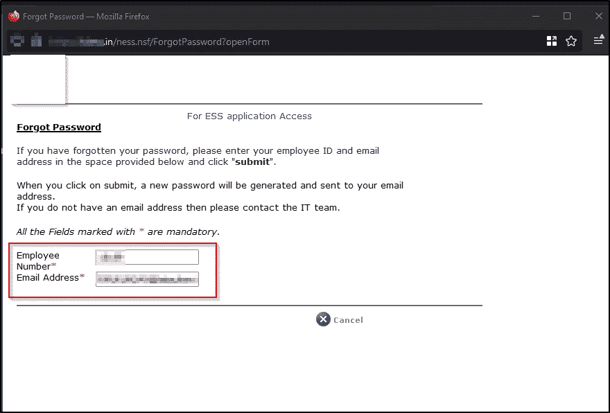
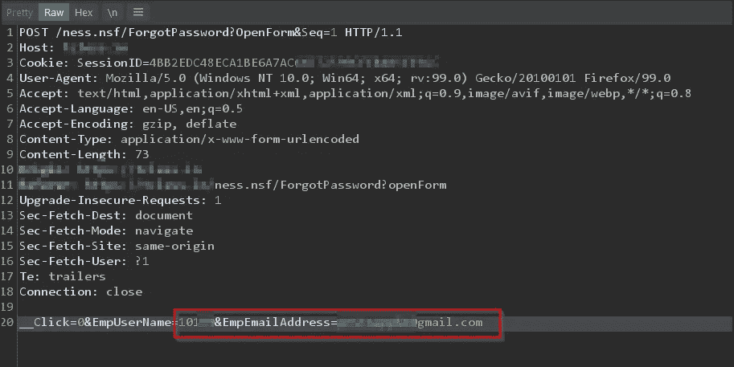
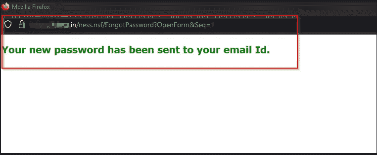
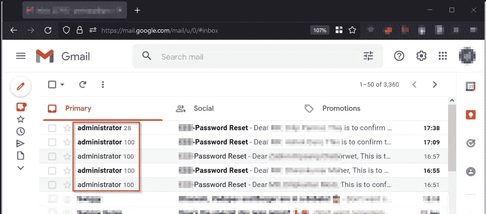

# 在企业应用中寻找 0 天—红队日记

> 原文：<https://infosecwriteups.com/finding-0-days-in-enterprise-application-471a409ade8d?source=collection_archive---------2----------------------->

“全网站账户接管”的故事

在我们开始讨论漏洞的技术部分之前，我希望您简要介绍一下作为目标的应用程序。

它被称为'****'**统一访问门户，供员工通过单一平台访问基于 It 的应用程序。ESS 应用程序由 IBM 销售，也可以与运行 Lotus Domino 服务器的 SAP 集成。**

**在一次持续的红队项目中，我偶然发现了这个 web 应用程序，并希望探索该应用程序的后身份验证功能，因此我开始收集所有可能导致后身份验证功能的相关信息。**

**由于不知道登录字段中要传递的登录详细信息格式，我随机创建了一个所有默认用户名和密码的列表，但未能重用它们。**

**我们后来开始从可用的数据泄露中收集所有电子邮件地址和明文密码的列表，并对其进行暴力破解。幸运的是，一个电子邮件地址和密码的组合成功了。我们后来开始探索所有的后身份验证模块，因为这是一个单点登录应用程序，我们有很多模块要探索。在探索应用程序时，我遇到了多个常见的 web 应用程序漏洞，其中两个被证明有助于连锁攻击:**

1.  **身份验证后:发现了提供电子邮件、员工 ID、员工详细信息等的端点。创建了一个爬虫并收集了相同的。**

****

**2.预认证:发现一个端点来重置员工的密码，其中需要有效的电子邮件地址和员工 id。**

****

**了解了电子邮件和员工 ID 之后，我们决定了解密码重置功能的流程。我输入了有效的员工 id，而不是输入有效的注册公司电子邮件地址，我决定输入我的电子邮件地址并点击 enter。*轰！！！***

********

**该应用程序为我提供了一个新的登录密码。同样，我创建了一个暴力列表，为了测试的目的，我成功地重置了 500 多个帐户的密码。**

****

**全世界至少有 200 多家公司在使用这个应用程序。该漏洞被报告给了我正在执行红队评估的公司，该公司决定关闭该门户，将来他们会将该门户迁移到另一个应用程序。同样的情况也报告给了母公司，即 SAP 及其合作伙伴 IBM。**