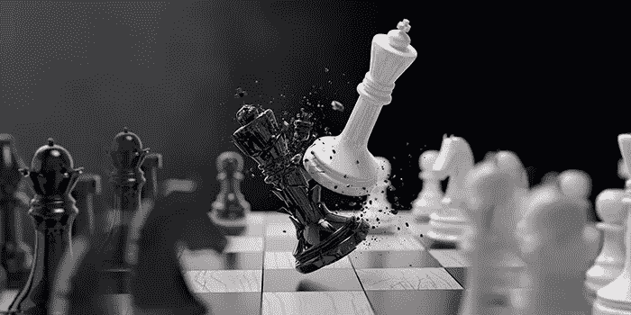
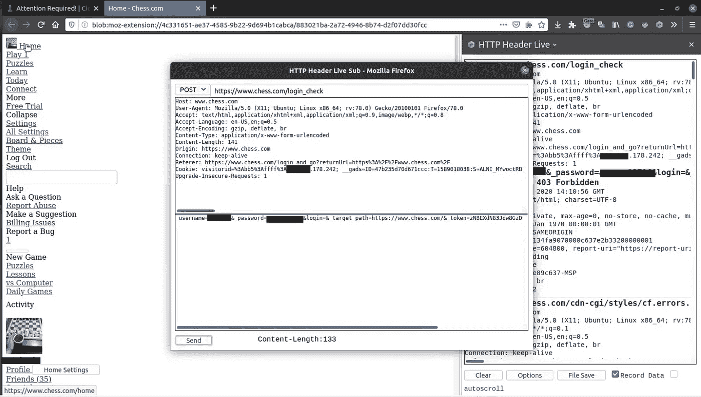
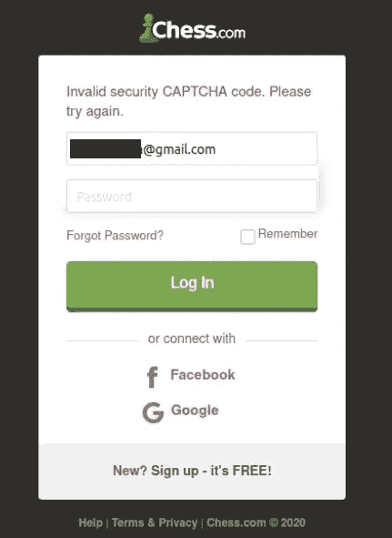
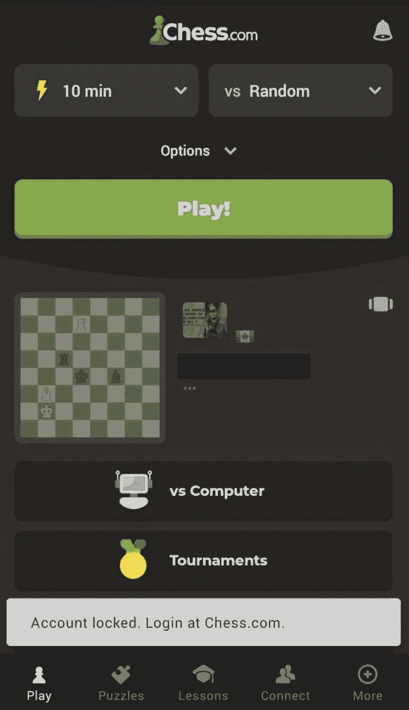
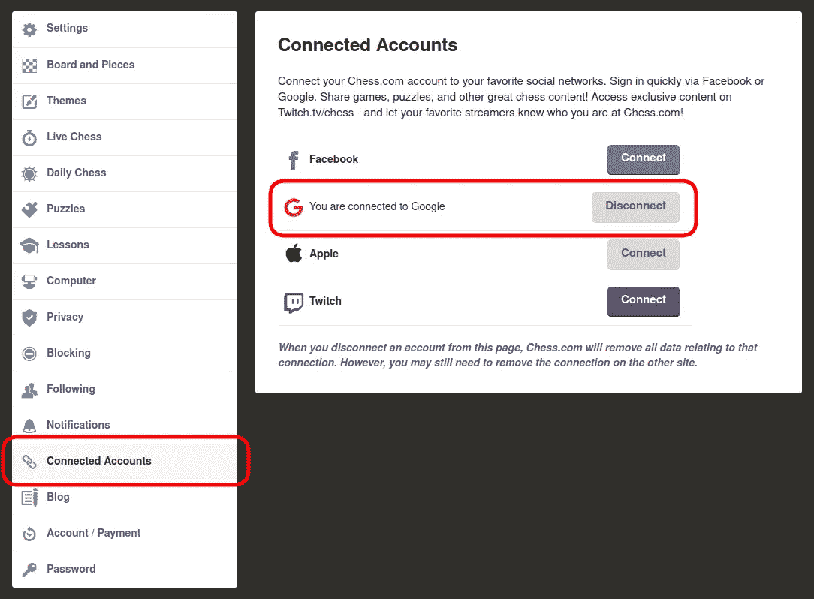
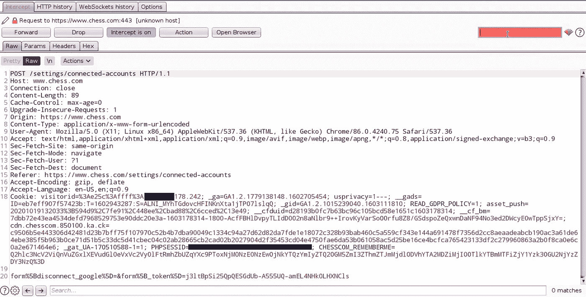
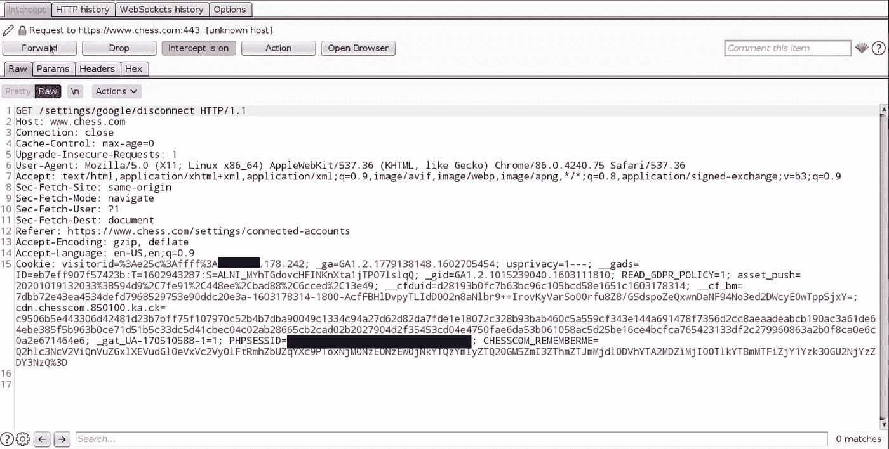

# 在 Chess.com 发现漏洞

> 原文：<https://infosecwriteups.com/finding-bugs-on-chess-com-739a71fbdb31?source=collection_archive---------0----------------------->



寻找 Chess.com 的弱点

嗨猎人和乡亲，我是一个象棋爱好者，几乎每天使用 chess，但我不是专业的😉

chess 是排名第一的在线国际象棋网站，并且有一个 [**内部 bug 赏金程序**](https://www.chess.com/news/view/chess-com-bug-bounty-policy) ，但是我认为他们应该更加明确他们政策中的一些要点，并且每月更新。如果他们使用像 [HackerOne](https://www.hackerone.com/) 这样的 bug bounty 平台就更好了。

他们在交流中真的很友好，但在接受错误和支付赏金方面比 H1·特里格斯更严格。

# 不要依赖一种工具

狩猎的故事开始于登录页面的一天，Chess.com 将我重定向到另一个解决 Cloudflare hCaptcha 的页面。我认为，这是因为通过代理在登录页面上使用我的 VPS IP，而 Cloudflare 已将我的 IP 放在灰名单中。
我有时会使用 [HTTP Header Live](https://addons.mozilla.org/en-US/firefox/addon/http-header-live/) ，在这种情况下也会使用它。登录后，服务器会将用户重定向到以下链接以解决验证码问题:

> [**https://www.chess.com/login_check**](https://www.chess.com/login_check)


[**https://www.chess.com/login_check**](https://www.chess.com/login_check)

HTTP Header Live 拦截像打嗝这样的请求。如果您点击一个请求，屏幕上将出现一个窗口，您可以更改或重新发送请求。

在这种情况下，请求是 POST，我的用户名和密码在正文中。我刚刚重发了一遍，下面的页面已经加载了！



通过 **HTTP Header Live** 发送发布请求

点击**主页**按钮后，hCAPTCHA 会绕过，您可以在不解析验证码的情况下登录，因为 hCAPTCHA 在服务器上配置错误。你不能通过打嗝来重现这些步骤，因为 **HTTP Header Live** 使用 blob URL(请看上图中的地址栏)。
**所以不要依赖一个工具！！！**

# **测试应用程序中的所有功能**

登录 Chess.com 有两种方法。第一种是通过用户名，第二种是通过电子邮件。如果你输入错误的密码超过 10 次，你必须解决验证码。但是有什么问题呢？

事实上，通过电子邮件登录页面上有一个错误配置，在输入 10 次错误的登录尝试后，验证码不会出现，攻击者可以对每个用户进行暴力攻击，导致受害者的帐户锁定。



登录页面

如果用户使用手机 app 会看到以下错误:



用户应该登录 Chess.com 网站，并解决解锁帐户的验证码。

所以作为一个 bug 猎人，你应该测试应用程序的所有功能。

# 深入检查 CSRF 氏症

在 Chess.com 有一个功能，你可以通过谷歌，脸书，…账户登录，但有一个问题。

你可以从设置菜单中断开这些帐户，错误仍然存在。



关联账户

当用户单击 disconnect 按钮时，一个 POST 请求发送到服务器，如下图所示:



发布请求

但是在发送这个 POST 请求后什么也没有发生！

看来一切都是正确的！这类请求应该发送一个带有令牌的 POST 请求。逻辑为真，但答案在下一个请求中。

事实上，POST 请求什么都不做，下一个 GET 请求会断开用户与 Google 帐户的连接。



获取请求

因此，任何攻击者都可以向受害者发送一个链接，然后受害者将断开他们的帐户或使用以下代码来托管 CSRF 文件:

```
<html>
<body><form action="https://www.chess.com/settings/google/disconnect"><input type="submit" value="Submit request" />
</form><script>
document.forms[0].submit();
</script></body>
</html>
```

**所以，跳出框框思考，审视所有的要求。也许会发生一件你意想不到的怪事。**

你可以通过以下链接在 twitter 上找到我:

【https://twitter.com/seqrity9 