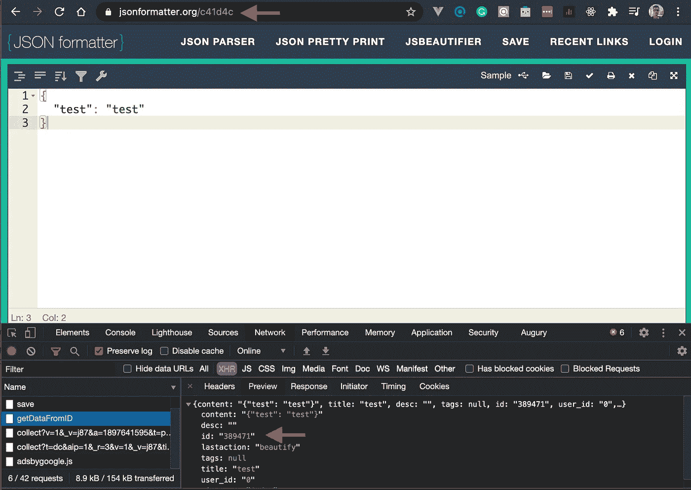
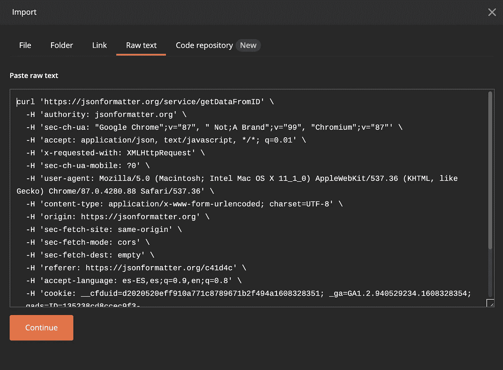
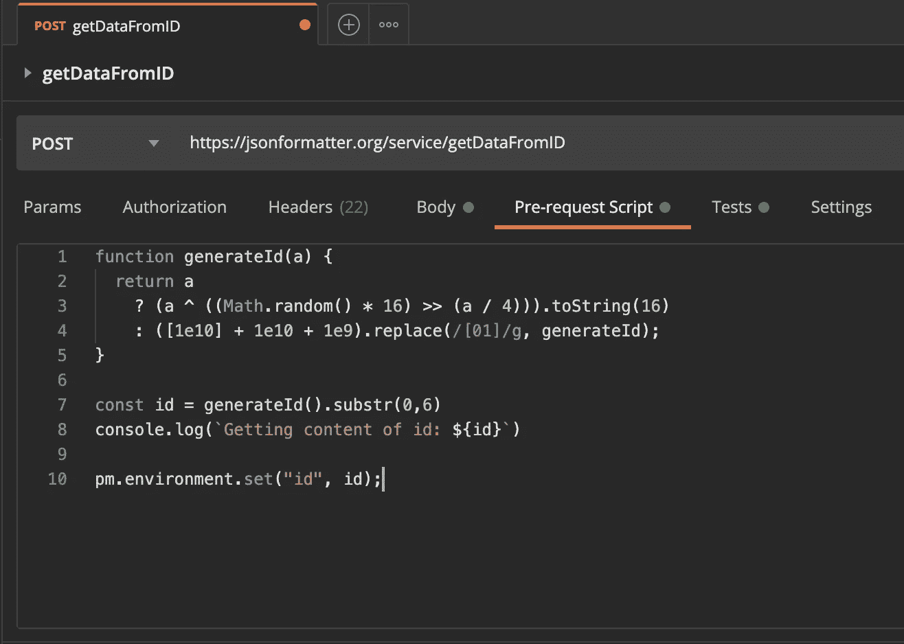
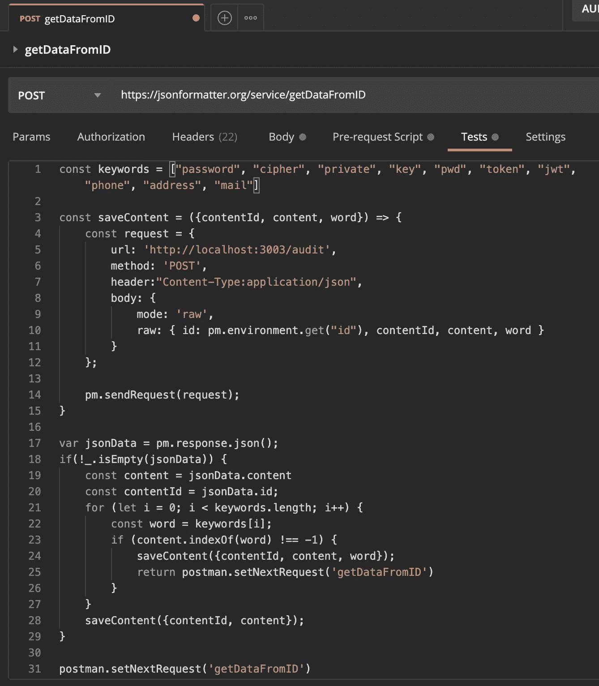
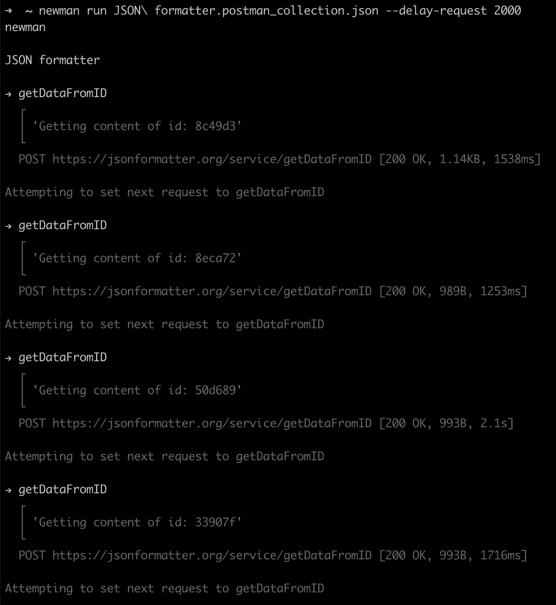
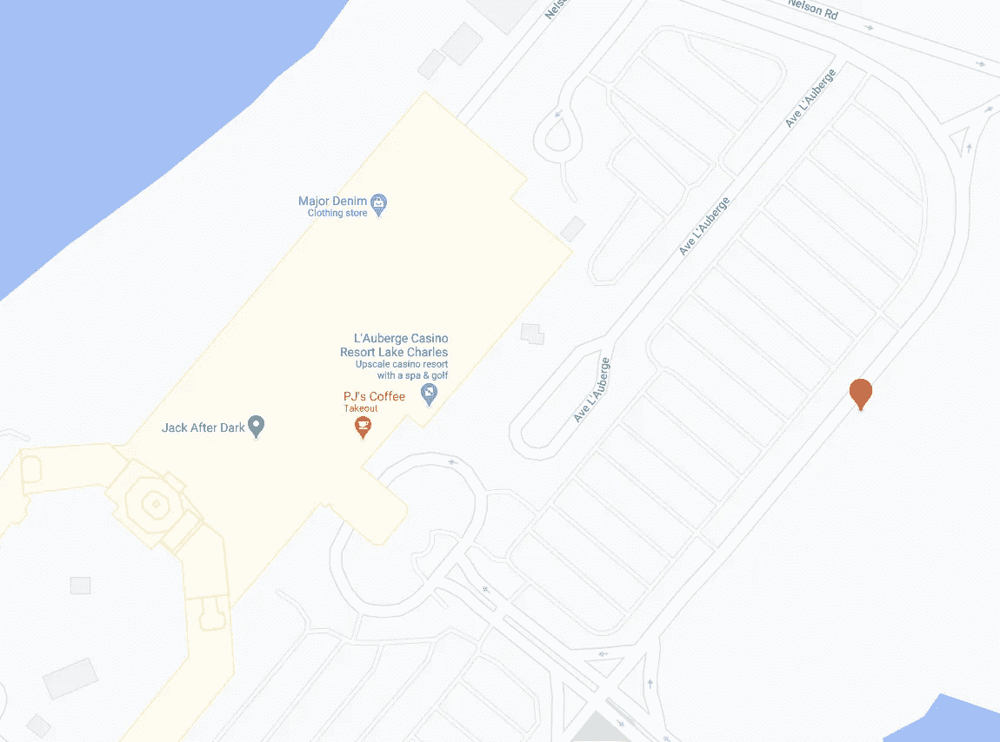
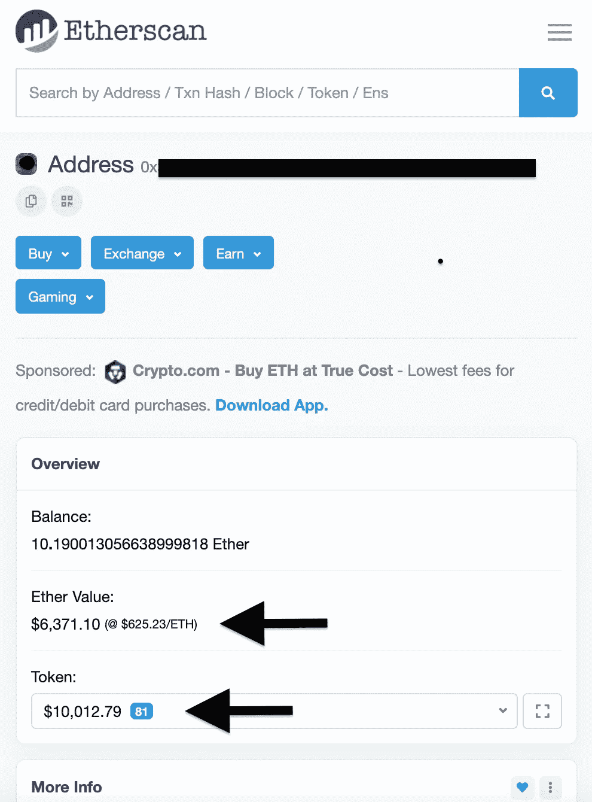

# 在联机格式化程序中查找数据泄漏

> 原文：<https://infosecwriteups.com/finding-data-leaks-in-online-formatters-404503b9fcb0?source=collection_archive---------0----------------------->

## 使用 Postman 和 Newman 查找保存在在线格式化工具中的有用数据

如果您是 web 开发人员，您可能使用过任何在线代码格式化程序。网上有上百种不同用途的代码格式化器，比如格式化 *HTML* 、 *XML* 、 *JSON* 等。


格式良好的代码通过[去毛刺](https://unsplash.com/photos/zE007SNgcdE)来提高代码的可读性

这些格式化程序的一个共同特点是，您可以保存格式化数据的在线版本。**需要注意的是，这使得任何知道生成的 *URL*** 的人都可以公开使用您的代码。

在这个故事中，我将重点介绍 [*JSON 格式化程序*](https://jsonformatter.org) ，这是一个验证和格式化 *JSON* 内容的在线工具。通过进行一个简单的测试，并借助于 *Chrome 开发工具*，我可以很容易地识别出保存和获取已保存的 *JSON* 内容的 *API* 端点，以及生成的 *URL* 的种类。



保存内容的 id 是一个增量数字，而生成的 URL 是一个 6 位十六进制数字

**保存内容的 id****和 *URL*** 中使用的生成 id 没有直接的关联。这是一种增加提取保存数据难度的方法，这对于增量生成的*URL*来说是微不足道的。

提取所有已保存信息的一种方法是用 6 个十六进制字符探索 id 的全部范围，从*‘000000’*到*‘ffffff’*。**这将需要 16^6 尝试** **来检查该范围**中的每个数字，这相当于 16，777，216 个请求。

为了避免产生如此大量的请求，我们可以使用一个随机算法——[*【拉斯维加斯】*](https://en.wikipedia.org/wiki/Las_Vegas_algorithm)*——*，在这个范围内生成一个随机 id。多次运行这种概率算法会降低没有结果的概率。

# 提取保存的数据

为了提取保存在 *JSON 格式化程序*上的数据，我们将使用 [*Postman*](https://www.postman.com) 和 [*Newman*](https://github.com/postmanlabs/newman) ，这是我最喜欢的使用*API*的工具。

*Postman* 的导入特性使得复制请求以获取保存的 *JSON* 的内容变得很简单。只需在 *Chrome 开发者工具*中将请求复制为 *cURL* ，并在 *Postman* 中将其导入为 *Raw text* 。



一旦导入了请求，我们将添加一个*预请求脚本*来生成一个 6 个十六进制数字的随机 id，并将其存储在一个环境变量中。



现在我们可以用生成的 id 替换请求体中的*‘urlid’*参数。


在*测试*部分，我们可以检查是否得到了非空响应，以及内容是否包含任何关键字。在任何情况下，我们都将把响应发送给一个本地的 *ExpressJS API* ，它将把响应存储在一个 *MongoDB* 集合中，供以后分析。



最后，通过将下一个请求设置为这个相同的请求，我们创建了一个无限循环来使用 *Newman* 运行这个集合，延迟两秒钟以避免 *JSON 格式化程序 API* 过载。



而*就这些，乡亲们！*。我们只需要让这个集合运行一段时间来收集一些结果。

# 深入收集的数据集

在收集运行期间，我收集了 515 个结果。这个过程中最无聊的部分就是在检索到的*JSON*列表中搜索有用的数据。虽然我加了一个关键词来减少这个工作，但是还是一个手工的过程。

在查看数据集后，我发现**绝大多数获得的结果都是哑数据或完全无用的数据**。

```
*// Example of dummy data*
{
  "employees": {
    "employee": [
      {
        "id": "1",
        "firstName": "Tom",
        "lastName": "Cruise",
        "photo": "[https://jsonformatter.org/img/tom-cruise.jpg](https://jsonformatter.org/img/tom-cruise.jpg)"
      },
      {
        "id": "2",
        "firstName": "Maria",
        "lastName": "Sharapova",
        "photo": "[https://jsonformatter.org/img/Maria-Sharapova.jpg](https://jsonformatter.org/img/Maria-Sharapova.jpg)"
      },
      {
        "id": "3",
        "firstName": "Robert",
        "lastName": "Downey Jr.",
        "photo": "[https://jsonformatter.org/img/Robert-Downey-Jr.jpg](https://jsonformatter.org/img/Robert-Downey-Jr.jpg)"
      }
    ]
  }
}
```

也有一些奇怪的结果，比如一个小游戏的问题列表，一个聊天机器人的答案，一次南极旅行的促销代码，一些发票，或者一辆卡车在美国的路线。

```
// Example of one of the questions of the *Trivia*
{
  "id": 42592,
  "answer": "Aries",
  "question": "It's the zodiac sign symbolized by a ram",
  "value": 300,
  "airdate": "2001-05-11T12:00:00.000Z",
  "created_at": "2014-02-11T23:11:27.461Z",
  "updated_at": "2014-02-11T23:11:27.461Z",
  "category_id": 139,
  "game_id": null,
  "invalid_count": null,
  "category": {
    "id": 139,
    "title": "5-letter words",
    "created_at": "2014-02-11T22:47:42.519Z",
    "updated_at": "2014-02-11T22:47:42.519Z",
    "clues_count": 110
  }
}
```



路易斯安那州的一个卡车司机停下来休息——夜幕降临后，他可疑地靠近杰克🙄

但是**在检索到的数据**中也有一些 **真的** **有趣的发现。例如，我发现了一个位于科威特的兽医数据库的摘录，其中有私人数据，如姓名、电子邮件和电话号码。**

```
// One of the anonimized clients with her pet
{
  "id": 274,
  "**firstname**": "XXXXXX",
  "**middlename**": "XXXXX",
  "**lastname**": "XXXXX",
  "**email**": "[XXXXXX@gmail.com](mailto:XXXXXX@gmail.com)",
  "gender": "0",
  "**api_token**": "XXXXXXXXXXXX",
  "dob": "10/08/1975",
  "photo": "",
  "**mobile**": "XXXXXXX",
  "**latitude**": "XX.XXXXXXXXX",
  "**longitude**": "XX.XXXXXXXXX",
  "**block**": "XXXXXX",
  "**street**": "XXXXXX",
  "judda": "none",
  "**house**": "XXXXXX",
  "apartment": "none",
  "address": "",
  "**area_id**": "XXXXXX",
  "status": "1",
  "code": "",
  "pet": [
    {
      "id": 148,
      "name": "Moe",
      "dob": "11-05-2011",
      "breed": "1",
      "gender": "0",
      "height": "",
      "photo": "",
      "provider_id": "0",
      "temperament": "",
      "origin": "Persian",
      "size": "1",
      "**chipno**": "XXXXXXXXXXXX",
      "weight": "3.5",
      "grooming": "12 Week",
      "isadopted": "0",
      "likes": "0",
      "cough": "0000-00-00",
      "missyou": "0",
      "status": "1",
      "neutered": "1",
      "spayed": "1",
      "adopt_comments": "",
      "disabled_comments": "",
      "disabled_question": "",
      "last_groom_appointment": "0000-00-00",
      "next_groom_appointment": "0000-00-00",
      "veternary": "",
      "groom": "",
      "breedname": "Cat"
    }
  ]
}
```

我还找到了一些用于在线服务的**私钥、凭证和 API 令牌**。

```
// Anonimized credentials
{
  "id": 2038953,
  "**contact_details**": {
    "company_org": "XXX",
    "email": "[XXXX@XXXXXX.com](mailto:XXXX@XXXXXX.com)"
  },
  "**username**": "[XXXX@XXXXXX.com](mailto:XXXX@XXXXXX.com)",
  "**password**": "XXXXXXXXXXXX",
  "**api_2**": [
    {
      "**api_key**": "XXXXXXXXXXX",
      "**api_key_name**": "N°2"
    }
  ],
  "**api_keys**": {
    "v3": [
      {
        "**key**": "xkeyXXX-XXXXXXX-XXXXXXX",
        "name": "XXXXXX",
        "partner": "ObjectID()"
      }
    ]
  },
  "**db_key**": "XXXXXXXXX",
  "status": "enabled",
  "active": "1",
  "m_sms_disabled": true,
  "t_sms_disabled": true,
  "language": "en",
  "timezone": "Asia/Kolkata",
  "locked": false,
  "archived": false,
  "forms_disabled": false,
  "created_date": "2020-08-11 11:41:16",
  "chargebee": {
    "localization": "german",
    "subscriptions": {},
    "payment_auto_collected": false
  },
  "feature_toggle": {
    "new-frontend-graph-stats": "enabled",
    "new-graph-stats": "new",
    "new-user-history-writings": "new",
    "new-user-history-readings": "enabled",
    "new-pricing": "enabled"
  },
  "onboarded": true,
  "new_forms": "enabled",
  "sso": {},
  "paid_plan": false,
  "dbs_country": "DE",
  "lastseen": "2020-08-11",
  "activated_applications": [
    "email-campaigns",
    "transactional-emails"
  ]
}
```

但是最有趣的发现是一个加密货币钱包的密钥库 T2。对于那些不熟悉加密货币世界的人来说，一个*密钥库*是你需要访问钱包的两个东西之一。如果你有足够的计算能力，可以使用*密钥库*用 [*Hashcat*](https://hashcat.net/hashcat/) 破解密码——你需要的另一个东西。



在写这篇文章的时候，发现的钱包里有超过 16，000 美元🤑🤑🤑

# 结论

如果说我们可以从这里学到一个教训的话，那就是互联网上所有暴露的信息都可能最终落入他人手中，所以我们必须非常小心，不要公布任何私人数据。

正如您所看到的，从这个在线格式化工具中提取保存的数据非常简单，您可以将相同的技术用于其他类似的格式化工具。

如果您不小心发布了任何私有数据，您可以联系 JSON formatter 人员来删除对这些信息的公共访问。无论如何，根据经验，**您应该总是使任何暴露的凭证或令牌无效**。

> 如果你喜欢这个故事，并想阅读更多，请在[媒体](https://medium.com/@h_martos)、[推特](https://twitter.com/h_martos)或 [LinkedIn](https://www.linkedin.com/in/h%C3%A9ctor-martos-g%C3%B3mez-99838776/) 上关注我。
> 
> 感谢阅读！