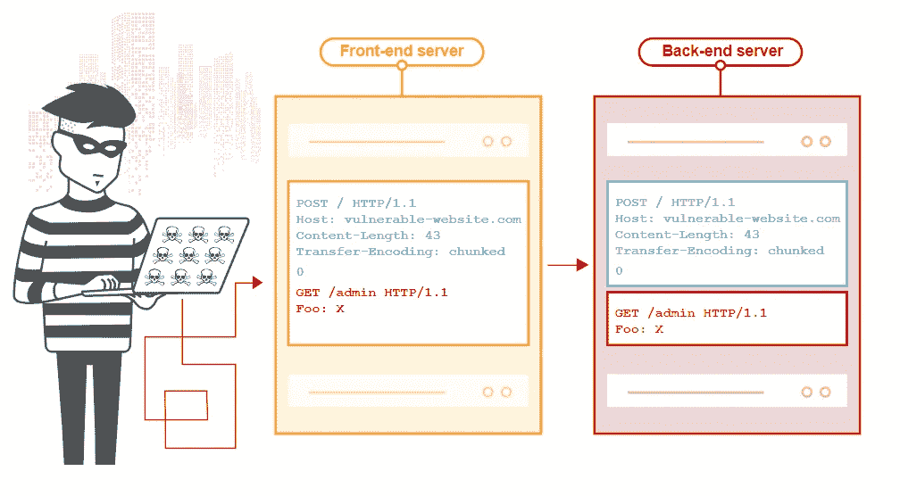

# 找到我的第一个 Bug: HTTP 请求走私

> 原文：<https://infosecwriteups.com/finding-my-first-bug-http-request-smuggling-5fdc89581fe2?source=collection_archive---------0----------------------->

> **这是我第一个 bug 的报告。这个 bug 是 HTTP 请求走私，为此我得到了 200 美元的赏金。**


由[迈克尔·盖格](https://unsplash.com/@jackson_893?utm_source=medium&utm_medium=referral)在 [Unsplash](https://unsplash.com?utm_source=medium&utm_medium=referral) 上拍摄的照片

# 我是怎么找到 Bug 的？

在我的侦察中，当我发现所有可能的子域时，我开始一个接一个地访问它们，易受攻击的子域给出了一个 403 禁止错误以及 web 服务器的版本。

然后我检查了 Burpsuite 的被动扫描器，它获得了版本号，并报告说这个版本可能有漏洞。

# 是什么导致了这个 bug？

该网站使用的是扩展了 Nginx 的 web 服务器上的旧版本，该旧版本的 Web 服务器导致该网站允许这种 desync 攻击。

# 什么是 HTTP 请求走私？

据我所知，HRS 是一个漏洞，攻击者可以发送一个模糊的请求，使服务器失去同步，使后端的套接字中毒，产生有害的响应。然后，这个响应将被提供给下一个访问者。



来源:[https://portswigger.net/web-security/request-smuggling](https://portswigger.net/web-security/request-smuggling)

# 我是如何实施攻击的？

在此域上，当我们发送带有内容长度标头和传输编码标头的请求时，会发生去同步，前端服务器使用内容长度标头，后端服务器使用传输编码标头，这允许我们执行 HTTP 请求走私攻击。

```
POST /i HTTP/1.1 
Host: ...
Connection: keep-alive 
...
Content-Length: 55 
Transfer-Encoding: chunked 0 GET /publicDocs/ HTTP/1.1 
Host: ...
foo: x
```

# 有什么影响？

由于这种技术允许攻击者绕过前端系统中的规则，因此也有可能访问本应保密的内部内容。

所以我找到了一个仅供员工使用的登录页面，以及一些通常会给出 403 errror 的其他文档，但是通过这种技术，我们得到了一个 200 状态代码。

# 最后的想法

这是我在 bug-bounty 平台上的第一份报告，找到一个有效的 bug 并获得奖金是一次很棒的经历。我从《披露报告》和 portswigger 的网站上学到了很多关于如何写好报告的知识。

## 如果你喜欢我的报告，请留下一堆掌声！！

## 我用来了解更多关于这个 bug 的资源

[https://portswigger.net/web-security/request-smuggling](https://portswigger.net/web-security/request-smuggling)