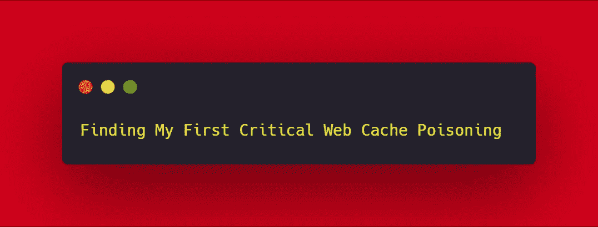
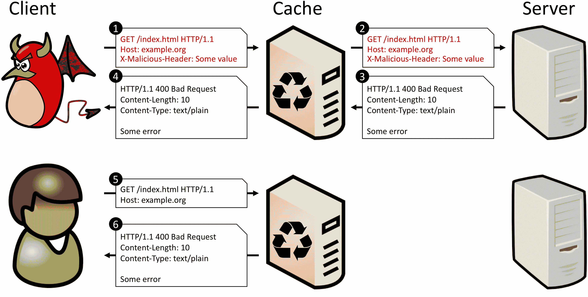
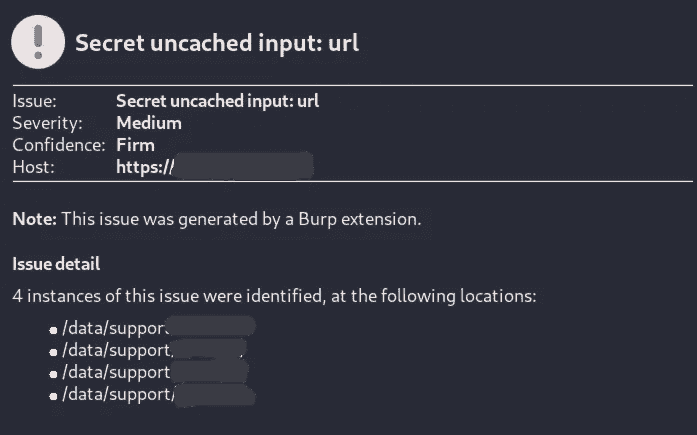

# 找到我的第一个关键的网络缓存中毒

> 原文：<https://infosecwriteups.com/finding-my-first-critical-web-cache-poisoning-6f956799371c?source=collection_archive---------0----------------------->

嘿范姆！希望你和你的家人在这个疫情过得好。这个故事是关于我在一个外部程序中发现我的第一个关键 web 缓存中毒的方法。

让我们开始吧:

目标是一个外部程序。所以，我们姑且称之为**redacted.com**

首先让我们从网页缓存中毒漏洞以及它是如何产生的开始。

# 描述

**Web 缓存中毒**是一种复杂的技术，攻击者想利用 Web 服务器和缓存的动作向其他用户提供恶意的 HTTP 响应。

网络缓存演示

web 缓存中毒有两个步骤。首先，攻击者必须弄清楚如何从后端服务器获得潜在危险的有效负载响应。他们必须缓存他们的响应，并在成功后仅将其提供给预期的受害者。

受感染的 web 缓存有能力成为传播一系列攻击的破坏性手段，包括 **XSS、DOS、JavaScript 注入、开放重定向**等等。

**验证 Web 缓存中毒:**

1.  找到弱服务代码，该代码允许他们将许多头填充到 **HTTP 头**区域。
2.  缓存服务器被迫刷新它的实际缓存信息，我们希望**服务器缓存**。
3.  向服务器发送一个特殊构造的请求，该请求将被**缓存**。
4.  发送下一个请求。对此请求的响应将是先前注入的内容**存储在缓存中**。

**可用于缓存的头:**

> **X 转发主机:**your-hackers-site.com
> 
> 主持人:【your-hackers-site.com 
> 
> **转发-服务器:**your-hackers-site.com

# 现在让我们回到我的重要发现

这里的方法非常简单，我使用了 [**Param Miner**](https://github.com/PortSwigger/param-miner) 来识别隐藏的、未链接的参数。这对于查找 web 缓存中毒漏洞特别有用。

要使用它，右键单击 Burp 中的请求，然后单击“Guess (cookies|headers|params)”。如果您使用的是 Burp Suite Pro，识别的参数将被报告为扫描仪问题。如果没有，您可以在扩展器->扩展->参数挖掘器->输出中找到它们

参数挖掘器生成的问题

因此，在这里我能够识别一个秘密的未缓存输入，稍后我使用它来检查漏洞是否存在。

我必须确认它，是的，漏洞是存在的，接下来，我想建立一个影响，如升级到 XSS，网址重定向，等等。后来我发现中毒发生在配置文件部分，在那里我可以通过使用我的服务器轻松地缓存请求以获得响应，在这里我使用了 **BurpCollaborator** ，或者我们可以使用 [**interactsh**](https://github.com/projectdiscovery/interactsh) 免费开源工具，该工具由 [**项目发现**](https://github.com/projectdiscovery) 团队提供，以获得交互支持。

如果用户浏览了缓存的部分，并且成功了，我就能够获得关键信息，比如他们的**会话、Cookies、PII** 。

# 影响

如果几个用户使用的 web 缓存甚至单个用户的浏览器缓存缓存了特制的响应，则响应的影响可能会增加。除非答案存储在共享站点缓存中，例如位于代理服务器中的缓存，否则该缓存的所有用户都会在缓存条目被清除之前收到恶意内容。我相信有可能升级到存储 XSS 之外。

> 谢谢你看我的帖子；有什么建议请在下面留言:)

谢谢，

亚西尔·汗

这是我的推特账号 [@N3T_hunt3r](https://twitter.com/n3t_hunt3r?lang=en) 随时联系我。

参考:[https://portswigger.net/web-security/web-cache-poisoning](https://portswigger.net/web-security/web-cache-poisoning)