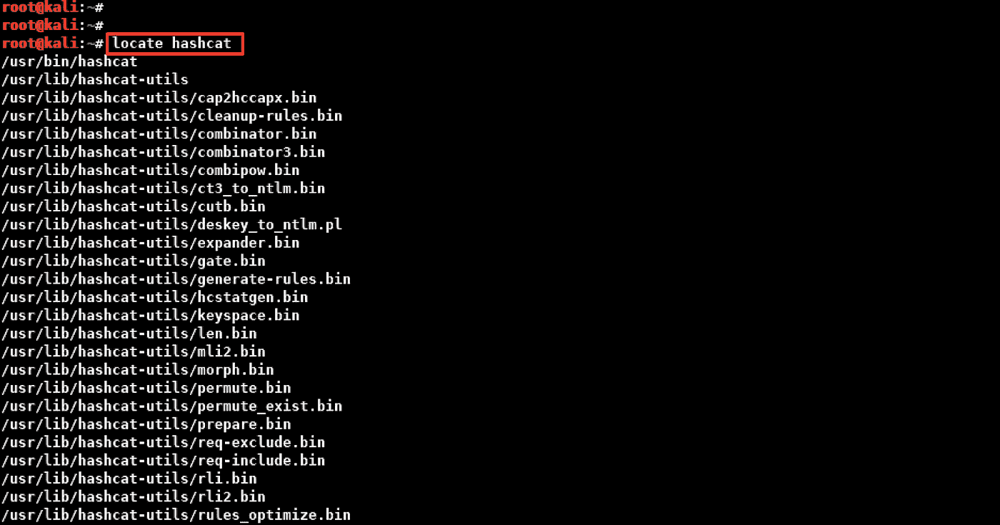
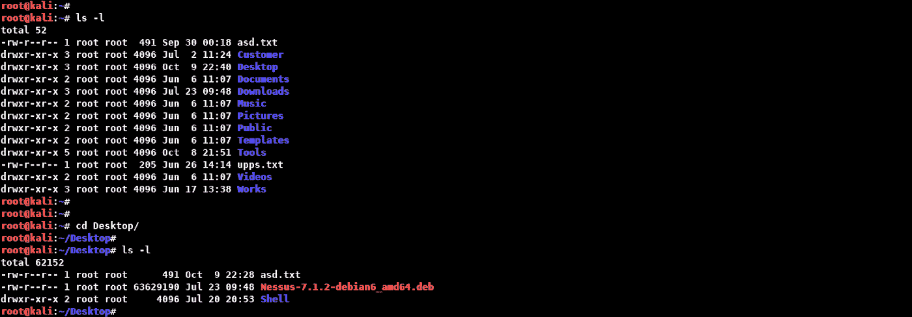
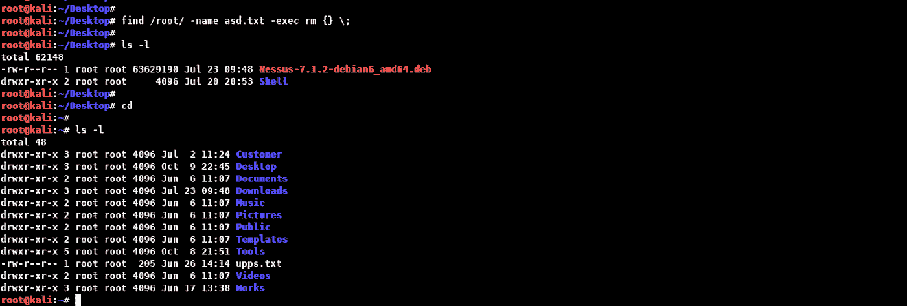

# 在 Linux 中查找目录/路径

> 原文：<https://infosecwriteups.com/finding-of-directory-path-in-linux-820be9ae759b?source=collection_archive---------1----------------------->


嗨，everyone❗️

我准备了这篇短文，它就像一张小抄，适合那些刚刚开始进入网络安全领域并希望提高自己的人。👩🏻‍💻📝Linux 中的寻路命令；渗透测试、CTF 解决方案或 OSCP 解决方案等。对于我们这些 pentesters 来说，在准备认证考试的时候是非常重要的。🎃希望你觉得有用。🌟😌

# 确定…的位置，发现…的位置

*   相关命令从不断更新的数据库中进行搜索。
*   “定位”命令搜索数据库文件“**/var/cache/locate/located b**”。
*   这就是为什么我们应该在使用数据库之前更新它。
*   我们应该使用的更新数据库的命令是“ **updatedb** 命令。
*   “定位”命令在自定义数据库的所有可能位置进行搜索。



# 哪个

*   相关命令指示属于命令或程序的可执行文件位于哪个目录中。
*   它搜索在 **$PATH** 环境变量中为该操作定义的目录，如果找到匹配的，则返回完整路径。


# 发现

*   它根据指定的标准执行文件和目录搜索。
*   它递归地这样做。

```
Syntax:

find <directory> <parameter> <searched file/statement>
```

*   相关命令可以使用的一些参数及其解释如下。

```
Parameter:        Description:

name              name of searched fileiname             name of the searched file - case insensitivetype              Type of searched file 

                  f : regular file
                  d : directory
                  b : block file
                  c : character file
                  l : symbolic linkcnewer            files modified after the given dateamin              files accessed n minutes agocmin              file status changed n minutes agoatime             files accessed "n*24 hours" agomtime             files processed in n daysctime             files modified in n days
```

*   不区分大小写地搜索 **/root** 目录中文件名为“ **asd.txt** 的所有文件:


*   搜索 **/sbin** 目录下所有具有 **777** 权限的文件:


*   找到并删除 **/root** 目录下的“ **asd.txt** ”文件:



*   **{ }** :找到的文件和目录将作为参数放在这些括号中，exec 之后指定的程序将相应运行。



快乐的 hunting❗️🥂

## 来自 Infosec 的报道:Infosec 每天都有很多内容，很难跟上。[加入我们的每周简讯](https://weekly.infosecwriteups.com/)以 5 篇文章、4 个线程、3 个视频、2 个 GitHub Repos 和工具以及 1 个工作提醒的形式免费获取所有最新的 Infosec 趋势！