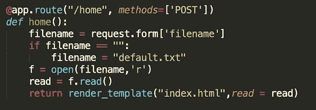
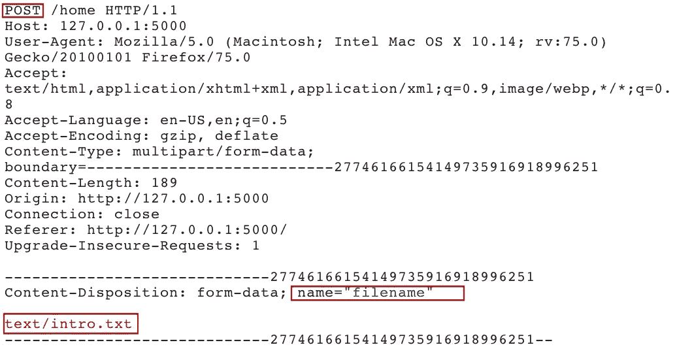
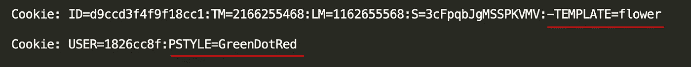
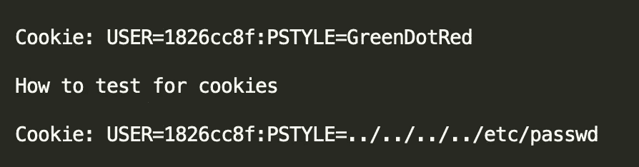
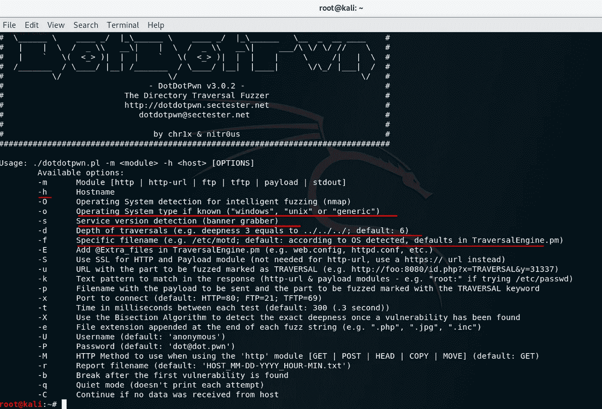
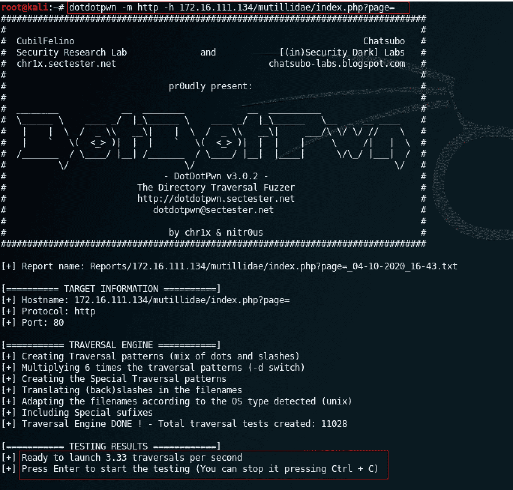
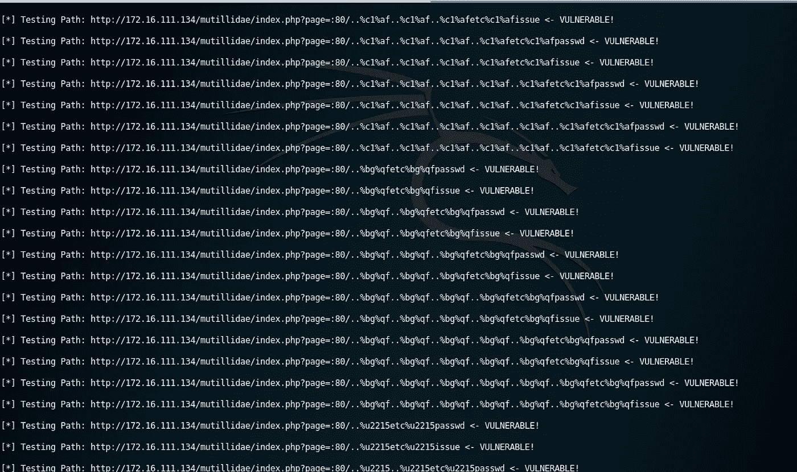

# 查找路径遍历漏洞

> 原文：<https://infosecwriteups.com/finding-path-traversal-vulnerability-e2506d390569?source=collection_archive---------0----------------------->

本地文件包含(LFI)也称为路径遍历，它是一个漏洞，可能允许攻击者查看服务器上的敏感文档或文件。它还可能导致远程代码执行、拒绝服务，但是在开始讨论什么是本地文件包含或 lfi 之前，让我们先了解一下现代 web 应用程序是如何处理应用程序文件的。

# 文件处理或包含功能

Web 应用程序可能使用文件，也可能包含代码或查看同一服务器上存在或托管的文件中的文本。为了做到这一点，web 应用程序可能会使用文件读取机制，为了这个博客，让我们把包含或读取服务器文件的参数称为文件包含函数。

例如

在上面的代码中，“filename”参数的任务是从服务器上的文件中读取内容，这个读取文件的操作可能会受到用户的影响。在编写代码时，开发人员的意图可能只是管理用户选择和输入文件或来自同一服务器上的文件的内容，而开发人员可能没有想到的是，他可能会将控制权交给用户。如果您仔细观察，攻击者可以滥用该功能或特性来请求任何文件或从服务器读取敏感数据。

注意:这是一个示例 python 脚本，可以编写一个类似的服务器端脚本来做同样的事情。

因此，根据不同的 web 应用程序，实现可能会有所不同，它可以是 GET 方法，也可以是 POST 方法。问题是**用户或测试者如何找出这些所谓的包含函数**。在 recon 阶段或通过 web 应用程序进行一般浏览时，很容易找到这样的包含功能。

下面给出的是具有所谓的“包含功能”的 URL，作为 **GET** 方法请求。

【http://www.test.com/user/**页面**= one . PHPhttp://www.test.com/index.php?**文件**=内容
http://www.test.com/main.cgi?**首页**= index . html
http://www.test.com/main/index.html

**注意:**并不总是需要 url 具有包含功能，您只需要假设您可能位于 web 服务器根目录或 web 文档目录中。

并且 **POST** 请求可能看起来像这样

**饼干！！**

因此，cookie 是 web 应用程序不可或缺的一部分，它有助于使 HTTP 协议有状态，如果你想了解 cookie 和会话，还可以做一些其他的工作。请阅读我的前一篇博客。事实证明，cookies 也可以用来动态生成页面或模板。

例子

这意味着 cookies 也在测试路径遍历或文件包含漏洞的范围之内，你是如何做到这一点的，这将在稍后介绍…..

# 为什么会出现这个漏洞？

现在你知道许多应用程序使用这种所谓的包含功能来管理图像、模板、代码、静态文本。当这些输入参数或包含函数被错误地验证时，问题就出现了。攻击者利用这一点，能够传递有效负载(已知的文件路径),这可能导致敏感数据泄漏。由于包含函数能够从服务器读取任何文件，它甚至允许攻击者访问服务器的远程外壳。

# 如何搜索本地文件包含？

查找路径遍历漏洞相当容易，为了找到这样的漏洞，应该能够执行以下任务。

*   枚举包含函数
*   测试枚举的包含函数

那么如何列举包含函数呢？这很简单，你只需要把下面的问题记在心里。

*   URL 或请求正文中包含函数或文件相关参数在哪里？
*   如果您可以在 URL 或请求正文中看到不寻常的文件扩展名？

例子

http://www.test.com/haha?file=index.html

当你能够找到包含函数时，测试它！

例子

【http://www.test.com/haha?file=】**/etc/passwd****(已知文件路径)**

**或者**

**[http://www.test.com/main/../../etc/passwd](http://www.test.com/main/../../etc/passwd)**

**您不必只输入“/etc/passwd”。您可以对目录和文件路径使用所有可能的猜测，也可以使用../”跳回或移动到特定目录。**

**记住一件事很重要，那就是 recon 阶段很重要，例如/etc/passwd 文件路径存在于大多数 Linux 中，当您在 Linux 服务器上运行的应用程序上测试有效负载时，它是有意义的。但是，如果在 IIS 服务器上运行的应用程序上使用“/etc/passwd”有效负载是没有意义的，因为 IIS 服务器中不存在该文件。所以用外行的话来说，你需要足够敏捷地向 inclusion 函数询问在那个环境中可能存在的文件。**

**每个操作系统都有不同的路径分隔符。**

**例子**

****Unix/Linux****

**根目录:"/"**

**目录分隔符:“/”**

****窗户****

**根目录:" <drive letter="">:\ "</drive>**

**目录分隔符:" \ "**

# **让我们看看它的运行情况**

**为了测试或练习，你可以选择任何一个易受攻击的应用，无论是 BWA 还是 DVWA。我选择了 OWASP SKF 和 Mutillidae 和演示。**

## **在 Mutillidae 测试用例 1 GET 方法上测试 LFI**

**在上面的测试案例中，很容易找到文件包含函数并传递文件路径。**

## **在 OWASP SKF 测试案例 2 POST 方法上测试 LFI**

**这个测试用例有一个 POST 请求，执行 lfi 所需要的只是篡改文件的请求体和请求。然而，在所有其他 lfi 狩猎实例中，情况并非如此。**

## **在 OWASP SKF 测试案例 3 POST 方法上测试 LFI(绕过过滤输入)**

**不同测试案例的目标非常简单，那就是本博客的读者能够建立一种搜寻文件包含漏洞的能力。在上面的测试用例中，开发人员实现了一个过滤机制来过滤掉“../"因此，如果我们愚弄逻辑并修改我们的有效载荷，以便在被过滤掉之后它仍然有意义，那么我们将能够获得数据。而不是使用“../../../etc/passwd”，我用了“…/。/…/./…/./etc/passwd so all "../"将被过滤，最终我们将得到数据。**

## **在 OWASP SKF 测试案例 4 POST 方法上测试 LFI**

**在这个测试案例中，web 服务器完全拒绝了有效负载的所有可能组合，最后，有效负载是双 URL 编码的，只有在服务器接受并给我们数据时才这样。这也是一个需要测试的场景，因此您可能需要对有效载荷进行编码或双重编码。**

**专业提示:开发人员并不期望每种形式的编码，所以他们只实现一种基本形式的编码。如果你的有效载荷在第一次尝试中失败了，那就更加努力地尝试，不断地改变你的有效载荷。如果服务器接受 UTF8 序列，也可以使用 Unicode/UTF-8 编码。**

## **在 Cookies 测试用例 5 中测试 LFI**

****

**cookies 上的路径遍历测试与 URL 或 POST 请求中的包含函数测试一样。参考下面给出的图片，了解如何测试。**

# **DotDotPwn**

**实际上很难猜测不同环境下所有可能的有效负载或文件路径。别担心，我抓住你了！！。DotDotPwn 是一个惊人的目录/路径遍历模糊测试器。模糊测试是一种质量保证技术，涉及发送大量随机数据输入并获得意外响应，因此 DotDotpwn 有助于模糊或测试大多数可能的文件路径，它还有一个功能，让 pentester 确定遍历的深度，您还可以根据操作系统环境选择有效负载，它还支持多种协议。**

## ****步骤 1** 打开终端类型:dotdotpwn [space] —帮助**

****

****步骤 2** 选择目标和协议，并在命令中键入相关属性在我的例子中，我在 Mutillidae 上测试了这个工具，并传递了以下命令**

**【172.16.111.134/mutillidae/index.php dotdotpwn-m http-h？page=**

****

****第三步点击**回车启动**

****

**这个工具会做所有的模糊处理。**

# **LFI vs RFI 还是他们一样？**

****

**路径遍历攻击也称为“目录遍历”、“点-点-斜线”、“目录攀爬”、“回溯”和本地文件包含。让我们先弄清楚本地文件包含实际上是什么，然后我们将跳到远程文件包含。**

**这两个漏洞都是文件包含漏洞，只是包含功能被利用了而已。**

**在本地文件包含中，包含功能会泄漏服务器内存在的意外文件或服务器本地的文件。在远程文件包含中，攻击者传递某个远程服务器中存在的恶意文件的 URL 或文件路径，包含功能加载恶意文件并在自己的服务器上运行，这可能导致远程外壳或 XSS 攻击，或者攻击者上传允许他浏览目录等的外壳文件。**