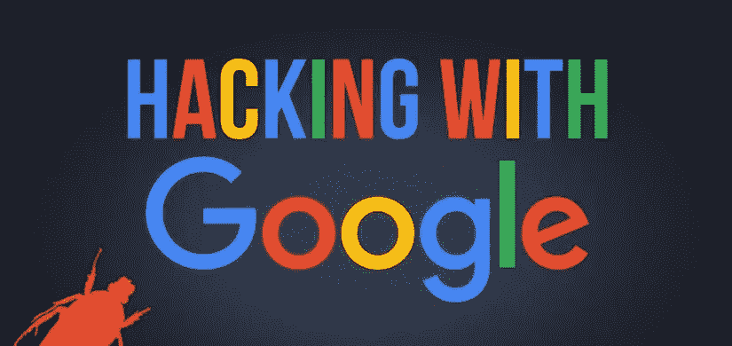
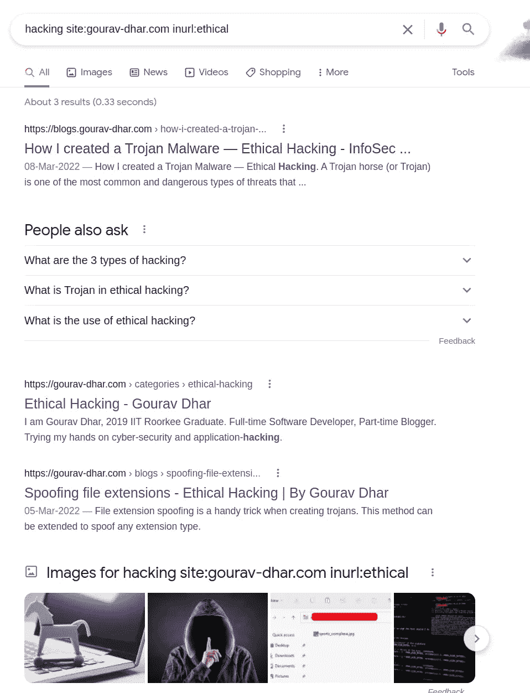
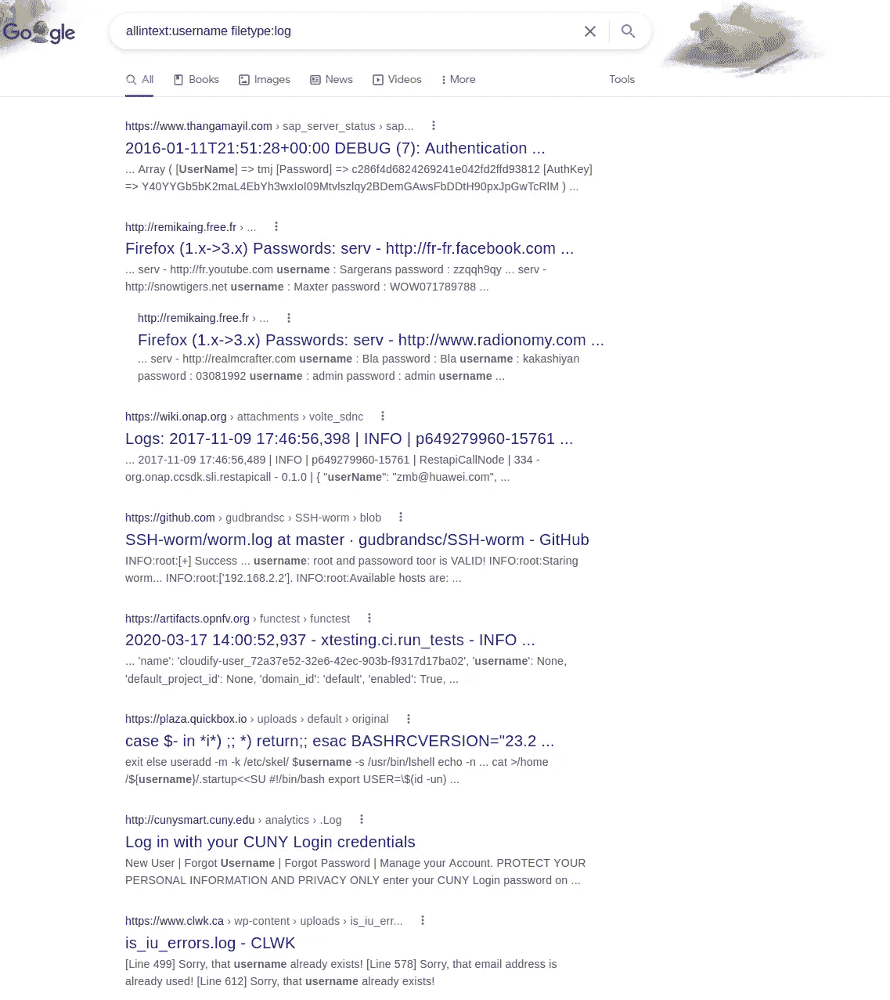
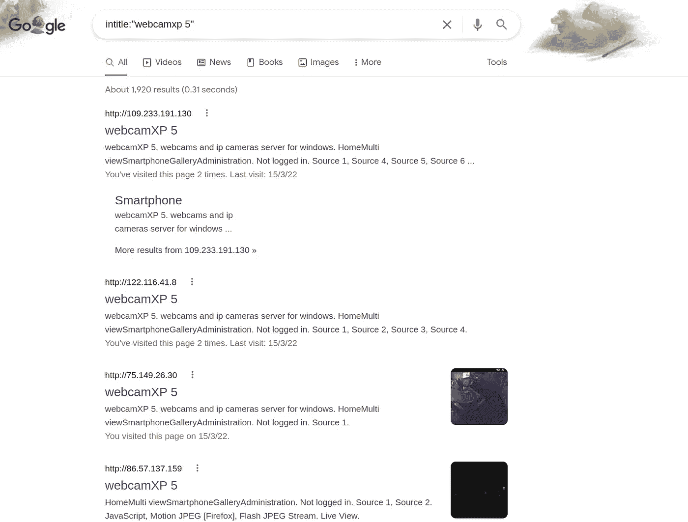
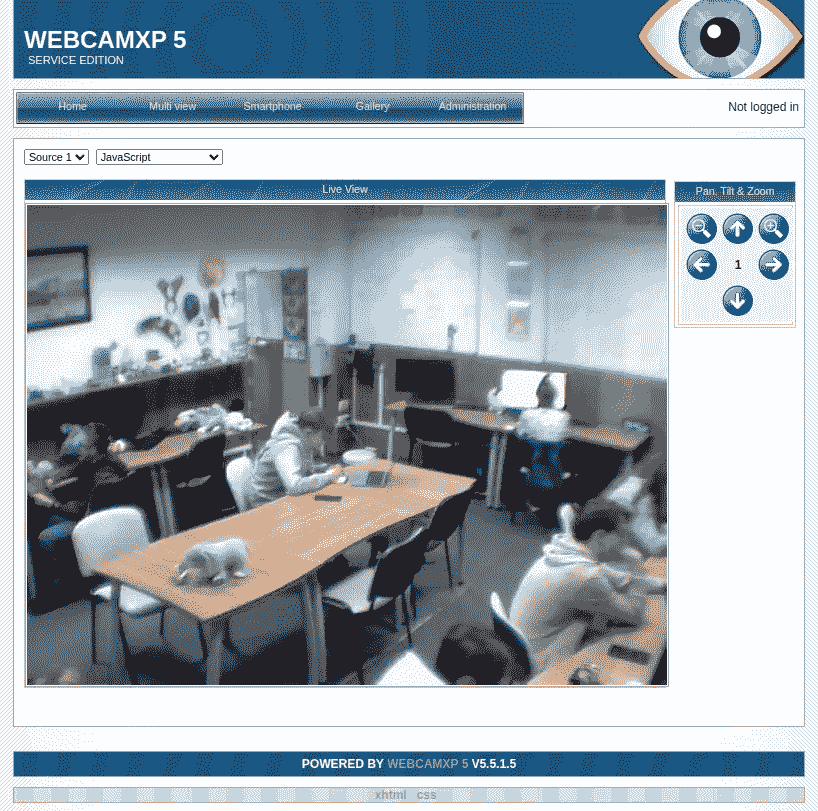
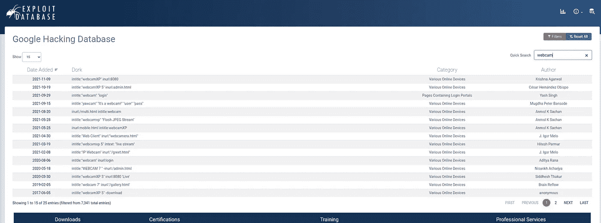

# 使用谷歌呆子寻找易受攻击的信息——道德黑客

> 原文：<https://infosecwriteups.com/finding-vulnerable-info-using-google-dorks-ethical-hacking-23f358117ceb?source=collection_archive---------0----------------------->

> Google Dorking 是黑客用来查找可能意外暴露在互联网上的信息的一种技术。



# 什么是 Google Dorking？

谷歌搜索操作符的高级用法叫做**谷歌多金**。简而言之，它使用**谷歌来运行使用特定关键字或命令的目标搜索查询**。基本上缩小搜索范围，找到我们要找的东西。

Google Dorking 使用 Google 的一些固有功能在互联网上找到我们可以通过特定搜索字符串找到的东西。这些可以是**日志文件**、**错误文件**、**网络摄像头**对互联网开放，甚至是允许我们进入设备的内部页面或 admin。在某些情况下，您还可以在错误日志中找到**密码。有时**甚至**管理配置文件**也会因为服务器设置不正确而暴露在互联网上。


Google Dorking 是由 Google 搜索运营商完成的。其中一些是:

*   **站点:<关键字>** —用于将搜索结果限制在特定的站点。例如，谷歌在我的网站[https://gourav-dhar.com](https://gourav-dhar.com)上攻击相关博客。我会写:

```
hacking site:gourav-dhar.com
```

*   **inurl: <关键字>** —用于指定哪个关键字应该出现在 url 中。对于上面的查询，如果我想添加一个过滤器，说 URL 应该包含字符串`ethical`,我可以把它写成

```
hacking site:gourav-dhar.com inurl:ethical
```

您将获得以下结果:



*   **intext:<keyword>**—该过滤器将检查网站元信息中存在的参数(即您在谷歌搜索的标题和描述上看到的信息)。
*   **intitle: <关键字>** —结果将只返回那些 HTML 标题中带有`keyword`的页面
*   **allintitle** **: <关键字>** —搜索标题中所有指定的术语。
*   **allinurl** **: <关键字>** —搜索 url 中的所有术语。
*   **文件类型:<关键字>** —查找明确的文档类型。文件类型:pdf 将在站点中搜索 pdf 文件
*   **ext: <关键字>** — Like filetype。ext:pdf 查找 pdf 扩展名。
*   **缓存** **: <关键字>** —用于查看谷歌网站的缓存版本

还有一些其他的搜索运营商也可以通过谷歌搜索找到。让我给你展示一些你能用它做的很酷的东西。

让我们来看看我们可以用它做一些很酷的事情。

## 1.检查日志中的凭据

```
allintext:username filetype:log
```



我们将获得包含文本“用户名”的日志文件列表。如果日志错误地包含了用户凭证，这可能是有用的(对于黑客来说)。如果您稍微研究一下结果并应用过滤器，您将能够找到供进一步利用的用户名或密码。

## 2.网络摄像机非常安全，对吧--啊！

谷歌— `intitle:”webcamxp 5"`你会发现一个你可以直接进入的网络摄像头列表。



看这个，好像是某个随机实验室的现场预览。有人知道这是哪里吗😆



一个很好的起点是谷歌黑客数据库。https://www.exploit-db.com/google-hacking-database[](https://www.exploit-db.com/google-hacking-database)**。如果您不确定查询字符串以及如何构造它们。去这个网站搜索一下。一些人以前做过，所以你可以使用他们的搜索查询。谷歌黑客数据库或漏洞数据库看起来像这样，你可以在右上角输入你的查询。**

****

# **总结谷歌呆子**

**做我上面做的任何事情都不违法。我们正在获取已经公开的信息。黑客利用谷歌呆子寻找可能意外公开的信息。然而，利用已经提供的信息去做一些可能会给某人带来麻烦的事情是越线了。**

**[](https://www.buymeacoffee.com/gouravdhar)**

> **如果你喜欢我的博客，你可以点击上面的按钮[或者点击下面的链接](https://www.buymeacoffee.com/gouravdhar)给我买杯咖啡:[https://www.buymeacoffee.com/gouravdhar](https://www.buymeacoffee.com/gouravdhar)**

**要了解更多关于道德黑客的信息收集方式，你可以浏览我的博客“信息收集”**

**[https://www . the geekyminds . com/post/information-gathering-迈向网站黑客的第一步](https://www.thegeekyminds.com/post/information-gathering-first-step-towards-website-hacking)**

> **这是一个探索我们博客平台的邀请 [**极客思维**](https://www.thegeekyminds.com/) 。一个让您了解软件开发和技术领域最新发展的一站式平台。我们在 [**的极客头脑**](https://www.thegeekyminds.com/) 旨在写一些你实际上可以用来提高工作效率和充实你的职业生活的内容。**
> 
> **邀请您在[**【https://thegeekyminds.com】**](https://thegeekyminds.com/)通过我们的站台。并订阅我们的时事通讯，以便在我们每次发布新帖子时收到电子邮件。我们承诺不会向您的收件箱发送垃圾邮件。点击下面的按钮订阅我们的时事通讯**

**[](https://forms.wix.com/4444cf13-7653-460d-9b32-f2e4e65544d1:c2184260-1ab5-4c6a-a37d-53de0778afa0)**