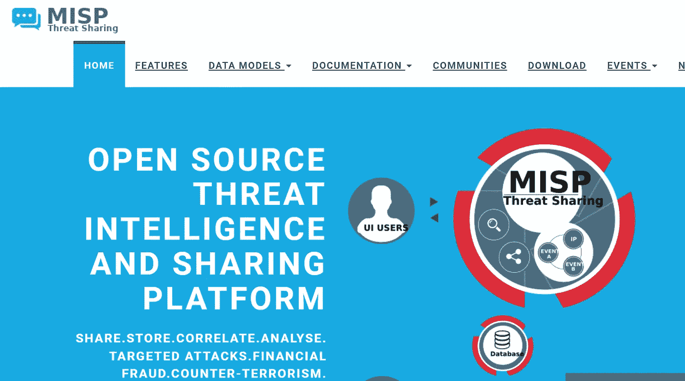
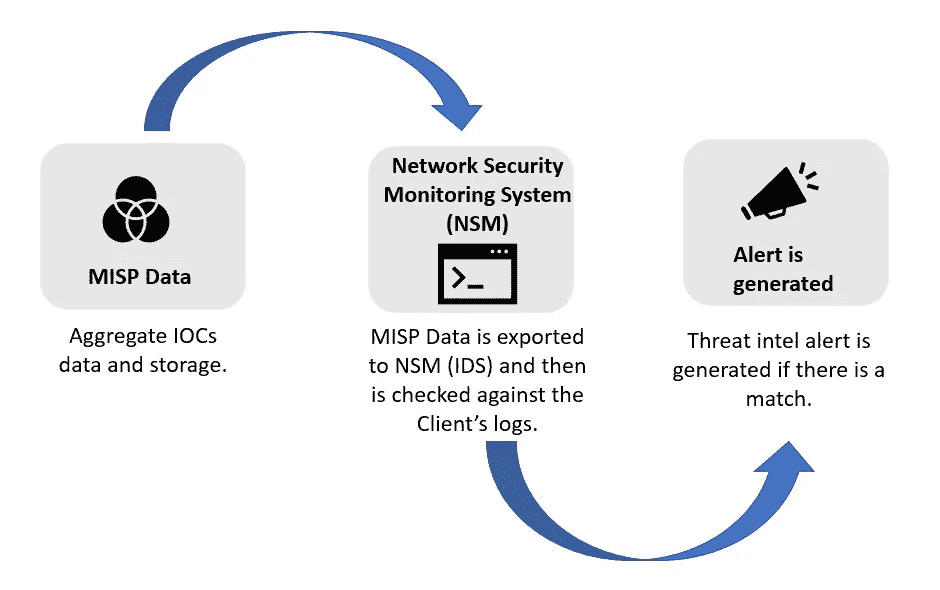
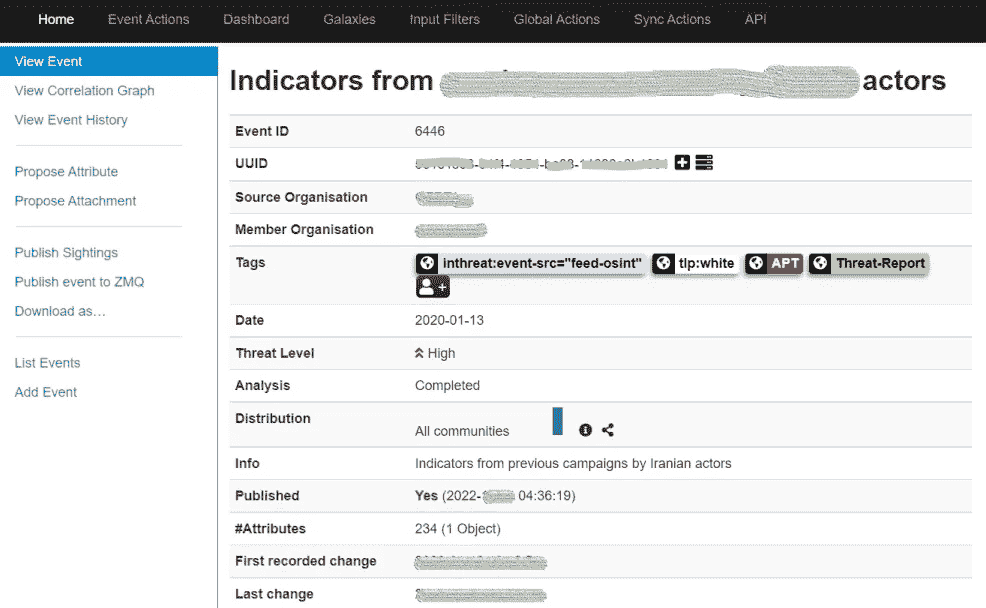
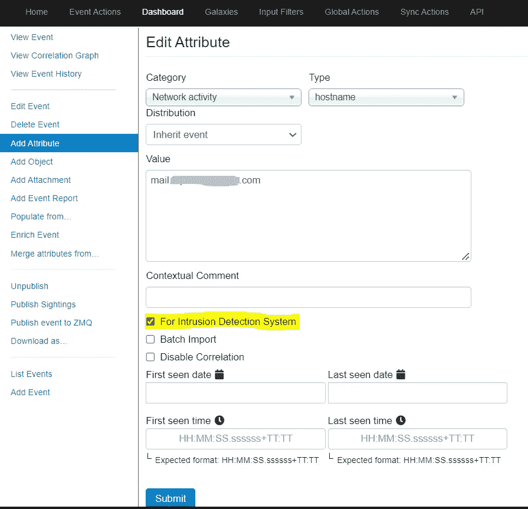
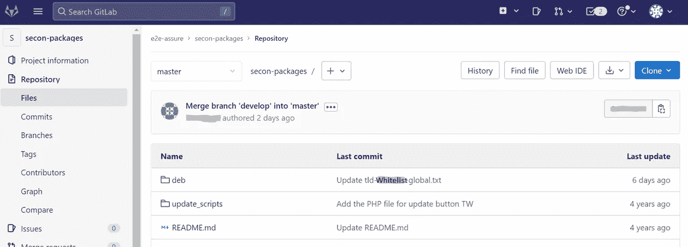

# 微调安全警报和优化

> 原文：<https://infosecwriteups.com/fine-tuning-optimising-security-alerts-5b12a1f6d42f?source=collection_archive---------2----------------------->

## 蓝队足球活动


照片由[丹尼斯·莱昂](https://unsplash.com/@denisseleon?utm_source=medium&utm_medium=referral)在 [Unsplash](https://unsplash.com?utm_source=medium&utm_medium=referral) 上拍摄

# 什么是安全警报调整？

消除和减少误报警报数量以提高准确性的持续过程。它还通过减少进程过载来帮助提高 CPU 的性能。

在调整之前，首先确定合适的调整点，因为有一些不同的方法来调整警报。这些是:

*   收听安全洋葱
*   在 SIEM 中调谐
*   在 MISP 调音
*   在 GITLAB 中调谐

*必须首先创建调谐标签来跟踪警报调谐活动*

# 在 Security Onion 中调整安全警报

一旦安装并设置了安全洋葱 NIDS(例如在 linux 操作系统中)，就可以从配置文件中或者使用 Linux 命令来调整[安全洋葱](https://docs.securityonion.net/en/2.3/managing-alerts.html)中的 snort 规则，如下所示。这些是:

**使用安全标识符(SID)修改规则**

```
sudo so-rule modify add -h #To understand the syntax
sudo so-rule modify list #List out any current modified rule(s)
sudo so-rule modify add <SID> <some text in double quotes> #To add/modify an existing NIDS rule
grep <SID> /opt/so/rules/nids/all.rules #To check the modified rule.
```

**使用安全标识符(SID)禁用规则**

```
sudo so-rule disabled list #List out any current disabled rule(s)
sudo so-rule disabled add <SID> #To disable an existing NIDS rule
grep <SID> /opt/so/rules/nids/all.rules #To check if the <SID> is commented out.
```

**重写签名**

要创建规则的副本并禁用原始规则而不是修改规则，您可以使用 vi 命令编辑以下文件。

```
sudo vi /opt/so/rules/nids/local.rules
```

**有关安全洋葱管理警报的更多信息，请访问此* [*站点*](https://docs.securityonion.net/en/2.3/managing-alerts.html#modify-the-sid) ***

# 调整 SIEM 中的安全警报

## 压制规则

临时调优通常通过立即禁用大量警报来实现。然后将对警报进行彻底调查，并将足够的详细信息发送给组织以采取行动。一旦警报的合法性被他们确认是否是已知活动，就可以相应地做出调整警报的决定。

## **修改本地查询后缀**

这将允许您在本地为特定组织应用规则。

## 请求关闭规则自动化

如果无法通过任何方式进行调优，可以生成一个票证来自动关闭规则。

# 调整恶意软件信息共享平台(MISP)

MISP 是一个平台，来自不同威胁情报来源的各种 IOC 在此聚合。该信息随后被传感器用于索引以搜索 IOC。如果匹配，则生成威胁情报警报

MISP 调整将允许您在全球范围内调整与您有合同关系的所有组织/客户的警报，以保护他们的 IT 基础设施。



[https://www.misp-project.org/](https://www.misp-project.org/)

## MISP 如何帮助生成警报？



MISP 警报的高级视图

**在 MISP 禁用警报:**

*   登录 MISP 帐户，在搜索框中搜索 Uuid(唯一用户 id)以找到您正在调查的警报。


*   一旦您登录到该警报事件的 MISP 页面，请按 CTRL+F 查找触发该警报并需要调整的项目。



*   找到该项目后，点击右边的“编辑”按钮(*，如下图*)。


*   在“编辑属性”页面下，**如果您不再希望它作为警报再次触发，请取消选中**“入侵检测系统”。



# 在 GITLAB 中调谐

可以在 Gitlab 上创建顶级域(TLD)白名单文件，以添加误报域，然后向主分支机构提交合并请求。接下来，通过运行以下命令更新 PCAP 收集器。这将从全局警报中排除误报域。



```
apt-get update && apt-get install <bro-script file>
```

## 来自 Infosec 的报道:Infosec 每天都有很多内容，很难跟上。[加入我们的每周简讯](https://weekly.infosecwriteups.com/)以 5 篇文章、4 个线程、3 个视频、2 个 GitHub Repos 和工具以及 1 个工作提醒的形式免费获取所有最新的 Infosec 趋势！