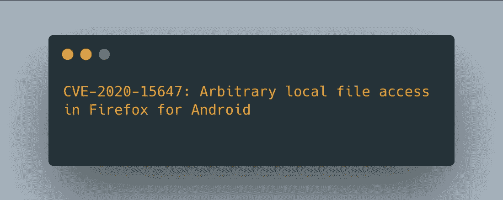
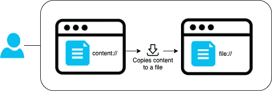
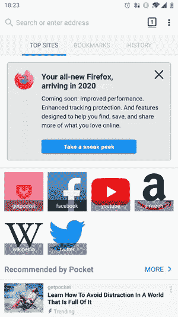
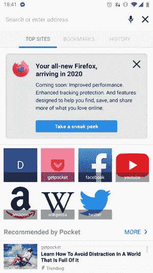
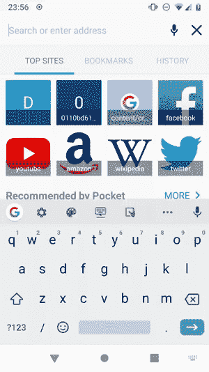
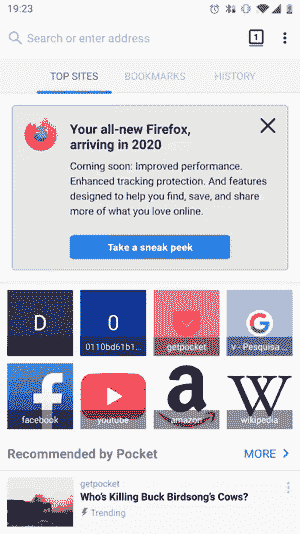
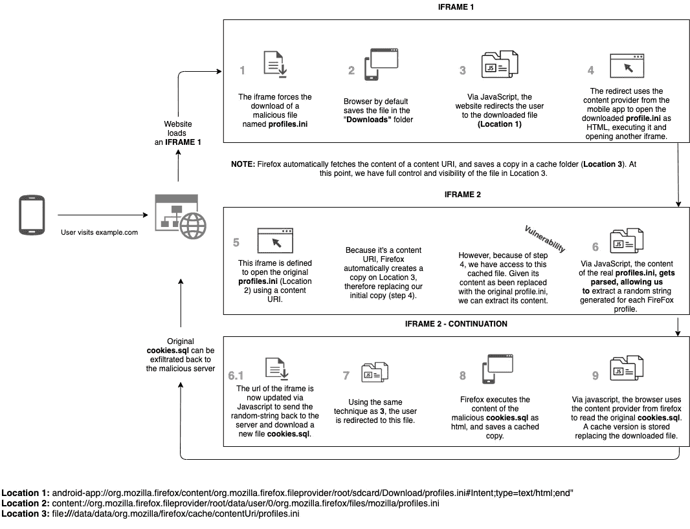

# Firefox:一个网站如何窃取你所有的 cookies

> 原文：<https://infosecwriteups.com/firefox-and-how-a-website-could-steal-all-of-your-cookies-581fe4648e8d?source=collection_archive---------0----------------------->



这是一篇关于 CVE-2020–15647 的文章，解释了网页如何能够从你的 Android 设备中窃取文件，包括但不限于来自任何访问过的网站的 cookies。

# 介绍

2020 年年中，我开始检查安卓浏览器的多种类型的漏洞；在审查 Android 版 Firefox 的 v68.9.0 时，我注意到它在浏览`content://` URIs 时显示出奇怪的行为。

对于上下文，Android 中的内容 URIs 识别[内容提供商](https://developer.android.com/guide/topics/providers/content-providers)中的数据；它们可以表示多种形式的信息，如文件或数据库信息。

大多数浏览器都支持解析和处理`file://`和`content://` URI 模式。如果您尝试在浏览器中打开本地 HTML 文件，它很可能会使用您在打开文件时使用的文件浏览器创建的`content://` URI。

# 测试内容:// URI

当我测试火狐浏览器对`content` URIs 的使用时，我注意到地址栏在渲染 URI 时发生了变化，把我重定向到了一个`file://` URI。看起来 Firefox 正在将内容保存到一个文件中，然后将我重定向到那个创建的文件——这个文件被保存在内部临时文件夹`/data/data/org.mozilla/firefox/cache/contentUri/`中。



Firefox 文件下载/重定向例程

我还注意到创建的文件与提供者返回的显示名称(`_display_name`)同名，如果它已经存在，Firefox 不会更改名称(因此会覆盖文件)。

# 许可

内容提供商的问题是，一般来说，应用程序需要特定的 URI 权限才能从其他应用程序和提供商获取内容。这可以防止应用程序访问来自其他提供商的文件，除非它们被明确授予权限(当轻按“打开方式”或“共享方式”并选择一个应用程序来访问文件时就是这种情况)。然而，当从它们自己的内容提供商访问 URIs 时，应用程序不需要走这条路线。

Firefox 有一个权限为`org.mozilla.firefox.fileprovider`的[文件内容提供者](https://developer.android.com/training/secure-file-sharing/setup-sharing)，其配置如下:

```
<paths xmlns:android="[http://schemas.android.com/apk/res/android](http://schemas.android.com/apk/res/android)">
    <root-path name="root" path="."/>
</paths>
```

这是一个问题，因为使用了根路径配置；我可以在 Firefox 中打开几乎任何文件，只要它有权限。



显示私有 Firefox 文件的内容

现在我们知道我们可以打开任何文件，让我们尝试向外界公开文件内容。​

# 利用文件的 SOP://

火狐处理跨域请求的方式很好的记录了。为了利用这个漏洞，您只需要知道一个文件可以访问它自己的内容(即通过`new XMLHttpRequest().open("GET", window.location, true)`)，因为来源是相同的。

现在，如果一个文件可以请求它自己的内容，并且这些内容可以被替换，我就可以用另一个同名的文件来伪造一个文件的内容，对吗？

我从简单的测试开始—我需要通过从外部目录打开一个文件来检索私有文件的内容。在这种情况下我选择了`/data/user/0/org.mozilla.firefox/files/mozilla/profiles.ini`；该文件包含有关 cookie 数据库在设备中存储位置的信息。

为了检索这个文件，我需要创建一个同名的文件，保存在`/sdcard/Download/profiles.ini`中。像第一段一样，我将使用`XMLHttpRequest`来检索`window.location`。

`/sdcard/Download/profiles.ini`

为了加载这个脚本，我们还将在同一个文件中创建一个 iframe，它加载一个`content://` URI，指向我们实际尝试读取的文件；通过使用`content://` URI 打开，我们将利用 Firefox 将文件复制到另一个位置并通过`file://`访问它。​

`/sdcard/Download/profiles.ini`



显示/data/user/0/org . Mozilla . Firefox/files/Mozilla/profiles . ini 的内容

综上所述，打开我们创建的文件:

1.  Firefox 打开`content://org.mozilla.firefox.fileprovider/root/sdcard/Download/profiles.ini`，这是文件`/sdcard/Download/profiles.ini`的内容 URI 表示
2.  Firefox 获取其提供商提供的内容并保存在`/data/data/org.mozilla.firefox/cache/contentUri/profiles.ini`中
3.  Firefox 将用户重定向到步骤 2 中的文件，并以`file://` URI 作为前缀
4.  HTML 页面一旦呈现，iframe 就会请求其`src`字段中的`content://` URI，该字段与当前打开的文件同名(尽管在不同的位置)，`content://org.mozilla.firefox.fileprovider/root/data/user/0/org.mozilla.firefox/files/mozilla/profiles.ini`
5.  Firefox 用步骤 4 中的文件内容替换步骤 3 中打开的文件内容
6.  在短暂的延迟之后，页面会提示它自己的内容(现在已经在第 4 步中更改为其他文件的内容

我们现在有一个跨域的问题，因为一个`file://` URI 可以访问另一个`file://` URI 的内容，如果文件共享相同的名称。再者，因为我们用的是火狐的提供商；该提供商的`root-path`配置意味着我们可以利用这一点来访问设备上的任何文件。​

# 升级到远程

下一个问题是检查是否有可能使用`android-app`意图 URIs 将这个漏洞转换成远程可执行的概念证明。

深度链接功能通常使用意图 URIs；你可以在这里和[这里](https://simonmarquis.github.io/Android-App-Linking/)了解更多。

我将设置一个 Python 服务器来分配下一个漏洞。我们首先需要一个与我们要偷的文件同名的文件。在这种情况下，我们的远程网页应该能够触发下载我们创建的`profiles.ini`文件。

文件下载后，我们需要打开它；我们将使用深度链接内容 URI 继续利用 Firefox 将下载的文件移动到其内部目录:

这应该和以前一样；它将请求 Firefox(`android-app`URI 的`org.mozilla.firefox`部分)用动作`android.intent.action.VIEW`打开内容 URI `content://org.mozilla.firefox.fileprovider/root/sdcard/Download/profiles.ini`，将其内容下载到`/data/data/org.mozilla.firefox/cache/contentUri/profiles.ini`并用`file://` URI 打开。



远程访问 profiles.ini 的内容

它起作用了——敏感文件的内容已经打印出来。你可以点击查看完整代码[。](https://gist.github.com/kanytu/7fe0640c87b0f3e57bda51e784a7255d)

# 结论和最终想法

如上所述，仅通过让受害者访问网页，就有可能从设备中窃取文件。在真实的攻击场景中，恶意文件会将读取的内容发送到攻击者控制的服务器，而不是以警报模式输出内容。

当我提交漏洞时，我展示的概念证明强调了窃取 Firefox 的 cookie 数据库的能力，这是一个 sqlite 数据库，包含来自被访问域的所有 cookie。

以下是概念验证的示例:



远程访问 cookies.sql 的内容

[这张图](https://i.imgur.com/UDBW0Jk.png)展示了漏洞利用的工作原理:



将用户的 cookies 发送到恶意服务器的完整 PoC 示意图

在撰写本报告时，Firefox Fennec (v68.9.0)已接近“生命尽头”，将被不容易受到攻击的菲尼克斯所取代。即便如此，Firefox 认为这是一个关键问题，并在很短的时间内修补了漏洞，将版本推至(v68.10.1)。这只是表明这些家伙是多么认真地对待他们平台中的安全问题。他们也非常专业，很容易沟通。

这篇文章是我 2020 年在 Android 浏览器上发现的一系列文章的一部分。敬请关注其他浏览器(如 Brave 和三星浏览器)的后续报道！

# 时间表

2020 年 6 月 20 日—向 Mozilla 报告了该问题

2020 年 6 月 22 日—内部调查开始

2020 年 6 月 25 日—确认并解决问题(在同一天👏🏼)

2020 年 7 月 6 日—在 Play Store 上发布的修复版本(v68.10.1)

2020-07-07-奖金分配(5000 美元)

**推特** : [@kanytu](https://twitter.com/kanytu)

**LinkedIn**:[www.linkedin.com/in/kanytu](http://www.linkedin.com/in/kanytu)

**哈克罗内:**https://hackerone.com/kanytu

*特别感谢*[*@ hey dean*](https://twitter.com/_heydean)*审阅本文，并感谢*[*@ fabiopirespt*](https://twitter.com/fabiopirespt)*提供完整的 PoC 图表帮助。*