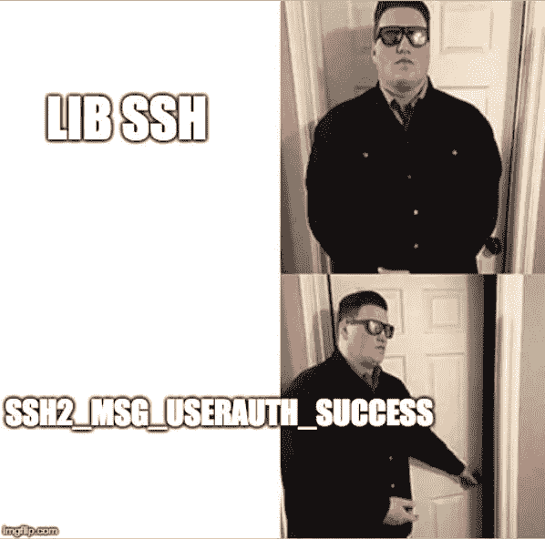
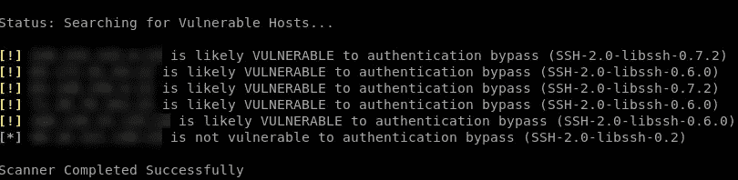
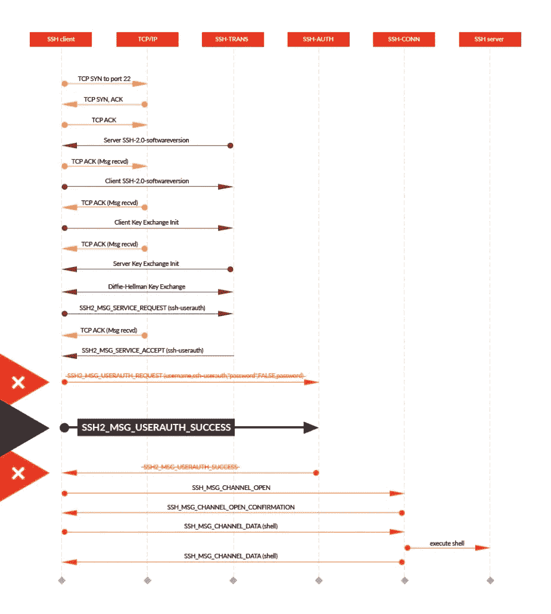
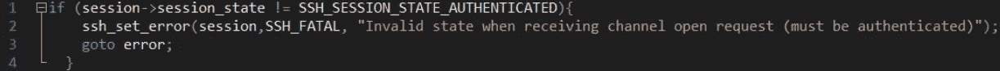
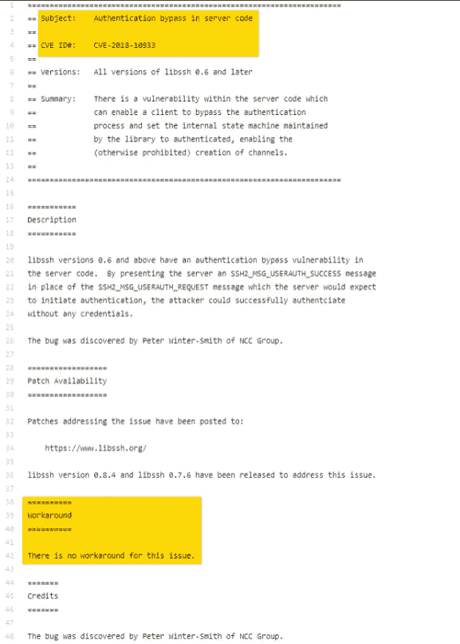
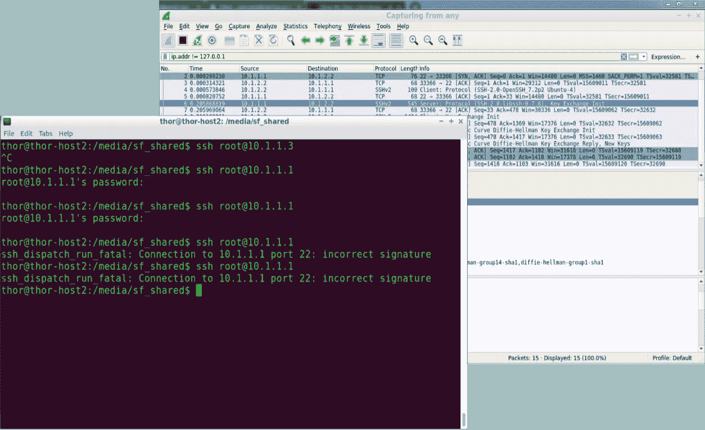

# 绕过 LibSSH 验证的防火墙防御(CVE-2018–10993)

> 原文：<https://infosecwriteups.com/firewall-defense-from-libssh-authentication-bypass-aka-cve-2018-10993-1a6d3d1bef87?source=collection_archive---------0----------------------->

照片来自 [Pixabay](https://pixabay.com/photos/matrix-communication-software-pc-2953869/)

在这个故事中，我将与您分享我在特拉维夫大学信息安全研讨会期间开发的针对 LibSSH 认证旁路漏洞的研究和防御解决方案。

该解决方案使防火墙不仅能够阻止这种攻击，还能够检查 SSH 通信的内容。

防火墙的完整代码可在这个故事的结尾。

## 什么是 LibSSH 认证旁路漏洞？

该漏洞在 0.7.6 和 0.8.4 版本之前的 [libssh](https://www.libssh.org/) 库中发现，该库为 [SSH](https://en.wikipedia.org/wiki/Secure_Shell) v2 协议提供了一个简单的 API。

SSH 是一种安全的远程登录协议，通常以加密的方式登录到类似 Unix 的操作系统。

攻击者将创建通道，**而不执行认证，这会导致未经授权的访问。**

攻击者如何欺骗 libssh 库授予访问权限？简单地通过发送消息，根据协议，该消息在之后**发送，服务器回复认证成功。**

这种恶意消息会欺骗服务器的状态机，使其相信攻击者有一个有效的通道。

## 下面就来深究一下细节吧！

在正常的身份验证过程中，客户端向服务器发送包含其用户名和密码的消息(SSH2_MSG_USERAUTH_REQUEST)，然后服务器使用 userauth_pubkey 函数检查请求，检查用户名是否存在以及密码是否有效，并回复成功(SSH2_MSG_USERAUTH_SUCCESS)或失败(SSH2_MSG_USERAUTH_FAILURE)消息。

攻击者将首先扫描安装了未缓存版本的 libssh 的易受攻击的设备，并向它们发送恶意消息。

使用 Leap 安全扫描工具进行 LibSSH 漏洞扫描，照片取自 [leapsecurity](https://www.leapsecurity.io/) 。

在找到具有匹配版本的易受攻击设备后，攻击者(客户端)只需通过发送绕过所有检查的消息(SSH2_MSG_USERAUTH_SUCCESS)来跳过上述身份验证阶段。

LibSSH 认证旁路攻击，图片来自 [guardicore](https://www.guardicore.com/) 。

当 SSH2_MSG_USERAUTH_SUCCESS 到达时，触发`SSH_PACKET_CALLBACK`回调，服务器会话被标记为已验证。

第 7–9 行描述了服务器状态机身份验证状态更新

当客户端处理 SSH_MSG_CHANNEL_OPEN 消息时，状态验证将被绕过。

## 漏洞传播

libssh 在 2014 年至 2018 年 10 月 16 日期间一直存在漏洞，据 [leapsecurity](https://www.leapsecurity.io/blog/cve-2018-10933-libssh-authentication-bypass-tool/) 估计有数千台服务器存在漏洞，包括亚马逊等大公司的服务器。

借此机会，我想澄清一下，SSH 协议的其他库实现如 [LibSSH2](https://www.libssh2.org/) ，听起来很像，以及 [OpenSSH](https://www.openssh.com/) 当时并不容易受到这种攻击。

## 国防研究

[CVE-2018–10933 描述页面](https://www.libssh.org/security/advisories/CVE-2018-10933.txt)

首先，我已经查看了[CVE-2018–10933 描述页面](https://www.libssh.org/security/advisories/CVE-2018-10933.txt)，不幸地发现没有解决方法。

在研讨会期间，我开发了一个作为 Linux 内核模块的有状态防火墙，带有一个用于内容检查的应用层。

状态防火墙可以使用根据数据包标志更新的状态机来验证各种协议(如 TCP)的连接完整性。

通过监视客户端何时打开端口从服务器接收文件，并在通信结束时关闭端口，甚至可以保持 FTP 连接。

然而，从上面的 SSH 消息图中可以看出，SSH 协议要复杂得多，因为它在 TCP 连接之上涉及到密钥交换和加密。

也就是说，在[Diffie–Hellman 密钥交换](https://en.wikipedia.org/wiki/Diffie%E2%80%93Hellman_key_exchange)之后，所有 SSH 通信都变得不可读，并且加密的通信阻止我们直接存储和跟踪经过身份验证的用户名(这是一种不好的做法，但理论上是可行的解决方案)。

作为一厢情愿的想法，我没有直接阻止攻击，而是研究了对服务器发送的版本进行重命名，从而阻止它被扫描器扫描。

如下所示，这种方法是徒劳的，因为消息是在身份验证阶段之前签名的，而这种消息内容的更改会导致签名不匹配。

所以是时候从源头上解决这个问题了。

让我们回忆一下，当时其他 SSH 协议库不容易受到这种攻击，我们不想直接保存和管理授权的用户名。

因此，选择的解决方案是在防火墙应用层上放置一个“中间人”SSH 库；

所有的 SSH 通信都将传递到应用层，然后应用层模拟客户端，就像它是 SSH 服务器一样，并与它交换加密密钥，只有这样，才模拟真正的 SSH 服务器作为客户端。

由于所选的 SSH 库实现 [paramiko](http://www.paramiko.org/) 不容易绕过 LibSSH 验证，所以攻击被阻止。

然而，在正常的 SSH 通信中，所有内容都以可读的形式(因为它有加密密钥)传递给应用程序层，因此我们可以过滤内容并防止敏感数据泄漏。

这个[解决方案](https://github.com/AvivYaniv/FireWall/blob/master/hw5/proxy/sshmitm.py)以及这个[状态防火墙](https://github.com/AvivYaniv/FireWall)的代码可以在 [my GitHub](https://github.com/AvivYaniv/) 上获得。

## 谢谢

我要感谢 [guardiancode](https://www.guardicore.com/) 对这个漏洞的精彩解释和漂亮的 SSH 协议图表，感谢 [leapsecurity](https://www.leapsecurity.io/) 对 LibSSH 认证旁路和传播分析的总结。

***喜欢这篇文章吗？随意长按👏下面的按钮😀***