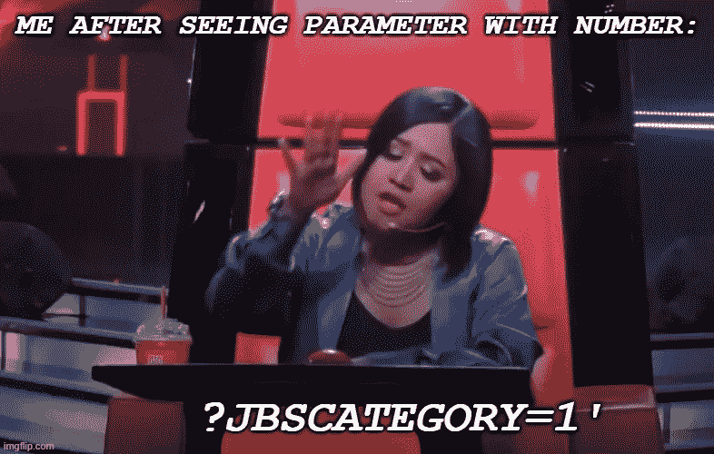
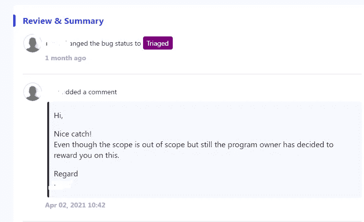
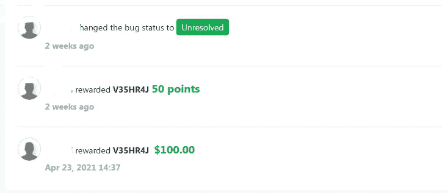

# 我的第一个 Bug 赏金:SQL 注入！

> 原文：<https://infosecwriteups.com/first-bug-bounty-ever-sql-injection-da4e64e30851?source=collection_archive---------2----------------------->

大家好，我是来自尼泊尔的 Veshraj Ghimire。这是我第一次写赏金。在这篇文章中，我将解释我在一个列在 [Bugv](http://bugv.io) 的网站上的第一个重要发现。

所以，让我解释一下我的小故事。

我们开始吧！

> 严重性:严重

标的很新鲜，因为前一天刚在平台上市。因为我没有权限公开这个程序。让我称之为 target.com。第二天，我计划在程序上测试。我开始我的侦察，枚举子域，用 httpx 探测它们，并通过以下命令立即检查标题、状态代码和内容长度:

> sub finder-d target.com-silent-o subs . txt | httpx-title-content-length-status-code-silent

当 subfinder 为我枚举子域时。我注意到一个有趣的子域，叫做 adminsite.target.com。然后，我打开网站查看网站上的内容。该网站基本上是搜索一些内容与一些额外的类别，其中类别被视为整数与参数:“jbscategory”。当我搜索某个类别时，网址看起来像这样:【https://subdomain.target.com/search.php?jbscategory=】T21

我经常:V

哇，页面内容变了！它没有给出 sql 错误，但页面的内容发生了变化。为了验证它是否易受攻击，我使用简单的基于整数的平衡来平衡它。和 Boom，显示具有类别 1 的先前内容。通过这一点，我确认它容易受到 sql 注入的攻击。我非常高兴和激动，因为这是我在 bug bounty 平台上的第一个发现。然后，我通过简单的 order by query 快速检查了列数，确认有 11 列。之后，我使用以下查询找出数据库名称:

> &jbscategory=1'union select 1，2，database()，3，4，5，6，7，8，9，10，11 — +-

是的，数据库名称显示出来了。

舞动的我:V

从那以后，我非常兴奋和紧张。我担心它可能是重复的，所以很快地报告了它，只显示了与有效负载一起显示的数据库名称。

兴奋和紧张

一个小时后，这份报告通过了审核，我终于拿到了！！，我很高兴。

我们被分类了

开心的我:V

几周后，它变成了未解决的，我的报告获得了 100 美元。就这样，终于，我拿到了我的第一笔赏金。

第一笔赏金:V

> 感谢所有直接和间接帮助我实现这一目标的人。主要是，我要感谢艾维安·切特里·戴帮助我进入这个令人敬畏的尼泊尔社区 [*Pentester Nepal*](https://www.facebook.com/groups/pentesternepal/) 。

以下是你从这篇文章中得到的信息:

1.  坚持尝试，永不放弃(等待时机)。
2.  永远沿着人迹罕至的路走。
3.  不断学习。

如果你想用尼泊尔语深入了解 SQL 注入，我还推荐尼塔姆·戴的这个视频 。

如果你愿意，你可以在[推特](https://twitter.com/GhimireVeshraj)上关注我。

所以，这就是这篇文章的全部内容，谢谢你坚持到最后。

畏缩警戒:V