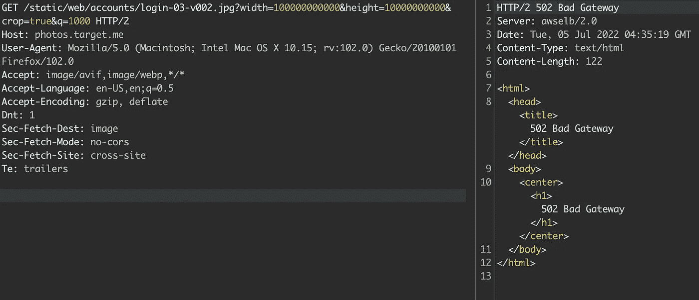
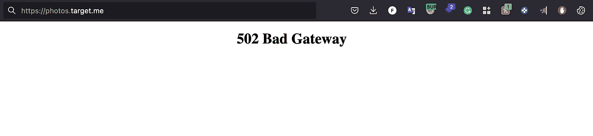
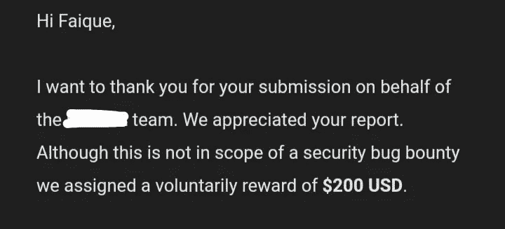

# DOS 的第一个 Bug 奖励:关闭服务

> 原文：<https://infosecwriteups.com/first-bug-bounty-from-dos-taking-the-service-down-30f9ad4e0246?source=collection_archive---------1----------------------->

# **简介**

> *朋友们好，我是 Faique，一名安全研究员&一名来自印度的道德黑客，这是我的第一次 bug 赏金之旅。我能理解新手猎人所面临的痛苦和挣扎，因为我已经经历过了。过去的几个月对我来说并不好，因为我花了将近一年的时间在 bug 奖金上，但没有得到任何具体的结果，所以这种情况给了我一种放弃的感觉，但是的，我留下来了，结果就在你面前。对于所有新手猎人，我有专业提示和资源在底部，但现在，享受我的 write-up✌️*

使用 google dorking 找到了目标，该目标类似于 google map，并且在范围上有多个域，如

*   *.target.com
*   *.target.net
*   *.target.me

首先，我收集了所有的子域，并做了一些基本的侦察。然后我开始寻找功能级的错误，没有发现任何错误。我很沮丧。(并于当天停止狩猎。

第二天我喝了杯咖啡，沉思了一会儿，又开始打猎，收集了所有域名的 wayback URL，在分析 wayback URL 时，我发现 *photos.target.me* 域名有奇怪的 URL，链接的参数中有宽度、高度和 q。

我迅速打开我的打嗝套件，截取了这个请求，并发送给中继器。这样我可以更好地工作。我将高度和宽度的参数值从 500 更改为非常高的值，如 10000000000000000，并将 q 值更改为 1000，然后发送请求，发送请求后，响应过了很长时间才出现。我的黑客大脑说重复这个过程多次，所以我发送请求给入侵者，并设置有效载荷类型为空有效载荷，其值为 1000

在一些请求之后，我开始得到 502 & 503 错误。在这一点上，我知道这是一个 DOS，但为了确认服务确实停止工作，我从其他网络打开 *photos.target.me* ，实际上网站返回错误。

我很紧张，因为该服务停止工作约 10-15 分钟，这可能会给我带来麻烦，因为该服务用于获取用户图像和网站* target . com * target . net 中使用的所有其他图像，但谢天谢地，该服务重新开始工作。

我停止了搜索，因为我不想惹任何麻烦，并报告了错误，大约 3 天后，我得到了他们的回应

## **亲小贴士:**

*   用呆子打猎，我用呆子[https://github . com/sushi Wushi/bug-bounty-dorks/blob/master/dorks . txt](https://github.com/sushiwushi/bug-bounty-dorks/blob/master/dorks.txt)
*   不要强迫自己去找虫子
*   手动和自动狩猎都可以
*   在推特上关注我，我会帮你实现它:[https://twitter.com/imfaiqu3](https://twitter.com/imfaiqu3)

## **资源:**

**Youtube 频道** : [RanaKhalil101](https://www.youtube.com/c/RanaKhalil101) ， [zwik](https://www.youtube.com/channel/UCDl4jpAVAezUdzsDBDDTGsQ) ， [InsiderPhD](https://www.youtube.com/c/InsiderPhD) ， [FarahHawa](https://www.youtube.com/c/FarahHawa) ， [orwaatyat](https://www.youtube.com/channel/UCUCmz3fKMZpYPDNfHZh3alg) 等。

**实验室:** [portswigger](https://portswigger.net/) ， [hackthebox](https://www.google.com/url?sa=t&rct=j&q=&esrc=s&source=web&cd=&cad=rja&uact=8&ved=2ahUKEwiRyIvp6_34AhVw1zgGHXEjB4sQFnoECBMQAQ&url=https%3A%2F%2Fwww.hackthebox.com%2F&usg=AOvVaw0PVHn4XV1bDTqGHH0aqRYz) ， [pentesterlab](https://pentesterlab.com/)

> *感谢阅读！随时在 Instagram 或 Twitter 上给我发 Dm！*

insta gram:[https://www.instagram.com/faique.exe](https://www.instagram.com/faique.exe/)

推特:https://twitter.com/imfaiqu3

GitHub:[https://github.com/faiqu3/](https://github.com/faiqu3/)

来自 Infosec 的报道:Infosec 上每天都有很多内容，很难跟上。 [***加入我们的每周简讯***](https://weekly.infosecwriteups.com/) *以 5 篇文章、4 个线程、3 个视频、2 个 Github Repos 和工具以及 1 个工作提醒的形式免费获取所有最新的 Infosec 趋势！*