# SQL 注入的第一步

> 原文：<https://infosecwriteups.com/first-steps-to-sql-injection-45fc0d9aae21?source=collection_archive---------0----------------------->

克林特·帕特森在 [Unsplash](https://unsplash.com?utm_source=medium&utm_medium=referral) 上拍摄的照片

在下面的文章中，我们将尝试从很少或没有 SQL 知识开始，执行一个基本的 SQL 注入。为此，我们将使用由 TryHackMe 托管的 DWVA box。

## 什么是 SQL 注入？

SQL 注入是在 web 应用程序中利用未经过滤的用户输入的行为。输入可能包含有效的 SQL 命令，因此将在解析到 SQL server 时执行，这可能会导致不必要的更改或数据泄露。

# 一些基本的 SQL 和 SQL 语法

正如你已经知道的，SQL 是用来操作数据库的。在我们开始利用它之前，让我们先创建一个基本 SQL 知识的基础。

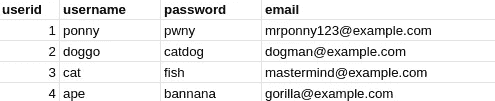

图一。我们 db 中的**用户**表。

假设我们有一个如图 1 所示的数据表。这张表存在于我们可以访问的某个数据库中。一些支持 SQL 的服务器可以在一个应用程序中包含多个数据库。假设我们的**用户**表位于一个名为*网站*的数据库对象中。作为目标的数据库对象通常由一些配置文件来处理，因此在讨论一些 SQL 语法时，我们将暂时跳过如何定位数据库对象。

## 使用 SQL 的 Hello World

图二。最基本的 SQL 命令。

假设我们有图 1 中显示的数据，并运行**SELECT * FROM users；**命令显示在图 2 中，会发生什么情况？让我们分解它。关键字可以用紫色来区分(这是 atom 中标准的高亮格式。sql 文件)。 **SELECT** 关键字告诉数据库我们想要检索一些数据。明星说嘿，为什么不把你能找到的东西都给我带来。最后， **FROM users** 指定将从哪个表中获取数据。因此，图 2 中的命令将返回图 1 中显示的内容(当然，粗体标题除外)。

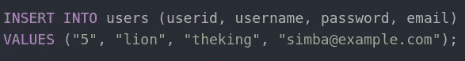

图 3。一些 SQL 命令插入一个新用户到我们的数据库。

现在我们知道了如何返回一些数据，但是如果我们想添加一个新用户呢？好吧，让我们运行图 3 中显示的命令。 **INSERT INTO users** 告诉服务器向 users 表中添加一些新数据。 **(userid，username，password，email)** 仅用于指定我们的目标列以及我们想要插入数据的顺序。

我们能不能像那样跳到新的一行？是的，我们可以。因为只要没有，SQL server 就会将其解释为一个命令；介于两者之间。既然我们有了；在我们命令的结尾，SQL server 将把图 3 中的所有内容解释为一个命令。最后，我们有**个值(“5”、“狮子”、“国王”、“T1”、[、**、**、](mailto:simba@example.com)、**”)**，这只是说我们希望输入这些值，服务器将相应地映射这些值，以符合我们之前的规范**(用户 id、用户名、密码、电子邮件)**。**

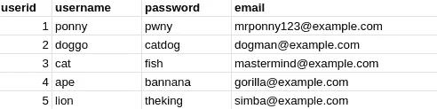

图 4。更新后的表格。

在图 4 中显示了最终的表格。SQL 语言中还有很多，但是为了简单起见，我将把它留给您去做更多的研究。

# 注射

对于本演示，让我们启动 [tryhackme](http://tryhackme.com) 并启动名为 [DVWA](https://tryhackme.com/room/dvwa) 的机器，它可以安装在本地机器上，但这样做要容易得多(而且它仍然是免费的)。很难找到盒子吗？[点击这里](https://tryhackme.com/room/dvwa)。

如果您是第一次使用 tryhackme，请按照他们的一些指南开始使用并连接到他们的服务。那你准备好了就回来。

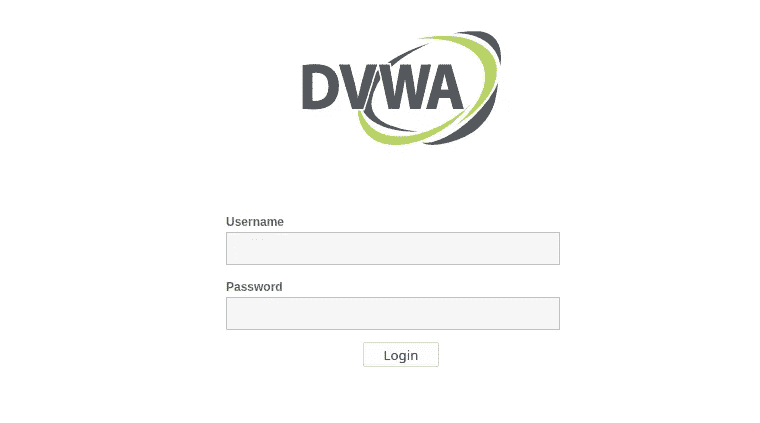

图 5。DVWA 登录页面。

我假设你现在已经启动了 DVWA 盒子，并且可以通过 tryhackme 上显示的 ip 访问该网站。您应该会看到如图 5 所示的内容。现在只需登录，用户名使用 *admin* ，密码使用*密码。你被录取了！这里有很多东西，但首先让我们把困难降低到可维护的东西。点击主菜单中的 **DVWA 安全**。然后将下拉难度从**不可能的**改为**低的**。*

在主菜单中点击 **SQL 注入**。很好，现在让我们把手弄脏。试着在文本框里输入一些东西。我发现，通过在单独的查询中分别写入 1 到 5，可以返回一些用户，见图 6。

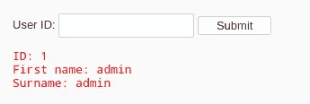

图 6。输入 1 并点击提交后的结果。

但是如果我们输入一个勾号，也就是‘符号，会发生什么呢？很好，我们得到了一个错误消息，参见图 7。

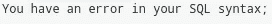

图 7。错误消息。

发生了什么事？据推测，后端服务器运行了一些 SQL 脚本，很可能类似于图 8。 **WHERE** 关键字用于过滤结果，因此所有返回的记录必须将其 id 设置为？-象征。

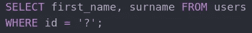

图 8。后端可能的 SQL 脚本。

但是，在将查询发送到 SQL-server 之前，后端更改了？-输入的符号。最终的查询将如图 9 所示。

图 9。最终查询。

如您所见，SQL server 无法理解这三个记号，因此抛出了一个错误。

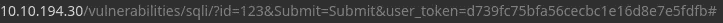

图 10。在文本字段中输入 123 后 DVWA 的 URL。

经过一点修补，我发现这个 url 包含了提交的查询。在图 10 中，您可以看到在 **id=** 之后和下面的 **&** 之前是传递给查询的输入，这里我只是在文本字段中写了 123，然后单击 submit。然而，从输入字段传递到 URL 的信息是 URL 编码的，这对我来说产生了一些小故障。因此，为了避免这种情况，让我们直接将查询写入 URL。

## 变得恶毒

一组两个破折号注释掉同一行中的其余 SQL，参见图 11。

图 11。一个命令和一个注释。

我们可以用它来逃避 SQL 查询并插入我们自己的 SQL 命令。让我们编辑 URL，使其与图 12 中的相同。

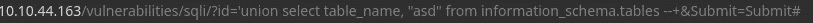

图 12。注入的 SQL 命令。

**联合**关键字用于将两个搜索结果连接在一起。 **table_name** 是**information _ schema . tables**表中的一列，包含数据库中所有表的名称。所以让我们假设服务器有一些如图 8 所示的 SQL 模板。然后，发送到 SQL server 的查询将类似于图 13。

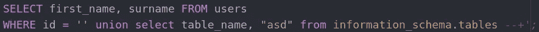

图 13。刚刚替换了？-图 8 中的符号代表图 12 中的命令。

自动突出显示是不言自明的。正如你所看到的。-我们注入到 URL 中的 SQL 命令的符号我们现在创建了一个新的有效 SQL 命令，我们可以编辑它。作为运行该命令的结果，我们得到了如图 14 所示的结果。

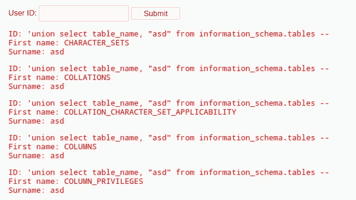

图 14。数据库中的所有表。

我发现的一个特殊的表是**用户**表。让我们进一步列举一下。正如在 information_schema.tables 中存在 table_name 一样，在**information _ schema . columns**中也存在一个 **column_name** ，但是也可以将其过滤到 users 表中。让我们运行与图 15 中相同的 URL。

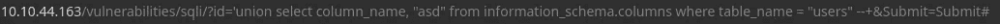

图 15。

仅供参考，图 16 将是基于图 15 发送到 SQL server 的查询。

图 16。将根据图 15 发送到 SQL 服务器的 SQL 查询。

图 15 和 16 的结果我们可以在图 17 中看到。这里我们可以看到**用户**表包含的所有列名。我会说**密码**栏目是这里最有趣的一个。

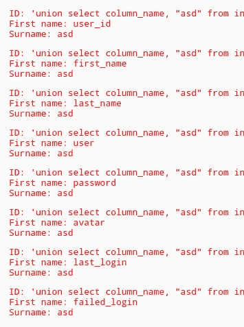

图 17。users 表中的所有列名。

所以让我们拿到所有的密码。运行图 18 中的 URL。

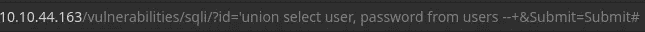

图 18。

现在，我们可以看到所有用户及其附带的密码散列，参见图 19。故事到此结束。我们现在已经达到了检索所有密码散列的目标。在这之后，需要用 hashcat 或开膛手约翰之类的工具来破解哈希。但是我不会在这篇文章中讨论这个问题。

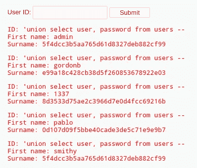

图 19。用户及其密码哈希。

# 如何披露 SQL 注入

这篇文章只涵盖了 SQL 注入的绝对基础，所以我真的不指望你读完这篇文章后会全力以赴。但是，你会不会碰巧发现自己的网站容易受到 SQL 注入的影响，我希望你能向网站所有者透露。不要一路闯入，在你因为一个 tick 收到一个错误信息后，联系网站背后的人，告诉他们你是如何产生这个错误的。你不必再做什么了。

还有一件事，在适当披露之前，请不要吹嘘你的发现。当你向网站所有者透露后，为什么不吹嘘一下呢？

# 最终想法

感谢您阅读全文。我希望你觉得有趣。SQL 和 SQL 注入是一个广泛的话题，我希望这篇文章只是冰山上的一片雪花。祝你在黑客研究中一切顺利。