# flipkart 的 CTF @ nullcon ' 18[特写]

> 原文：<https://infosecwriteups.com/flipkarts-ctf-nullcon-18-writeup-452b4e108fb?source=collection_archive---------0----------------------->

**Web 1:(旅行者)**

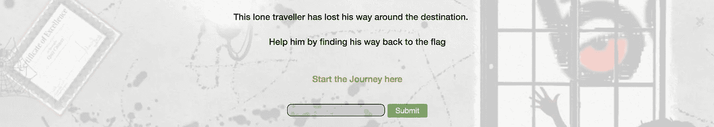

这是第一次网络挑战赛的任务。*【从这里开始旅程】*的链接登陆如下页面。

在检查点击下载按钮后触发的请求时，显然这是一个路径遍历挑战。

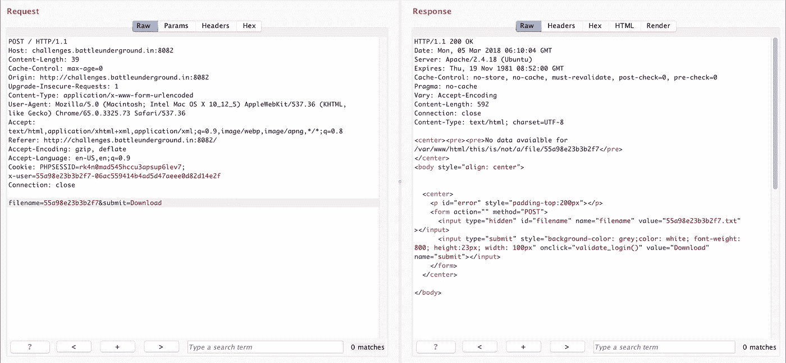

向下滚动到页面底部时，标记位置被添加了注释。

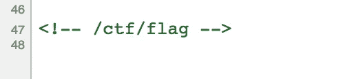

所以想法是使用路径遍历攻击到达 *ctf* 目录下的*标志文件*。但是扭曲正是我们需要操纵参数的地方。

最初试图操作 filename 参数，

但如果参数包含 **"/ctf"** 或"**.. "则返回 beep**。试着编码这些东西。但是失败了。稍后检查请求上的 **x 用户** cookie。更改 cookie 时返回完整性检查失败

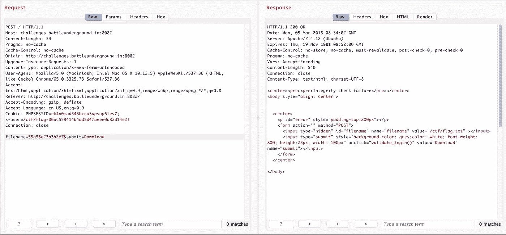

原来如此！以下是 xuser cookie 的结构:

x-用户: <filename>-</filename>

所以尝试用**遍历文件路径../../../../../../../../../ctf/flag** 。但是他们去掉了“..”后面的“/”

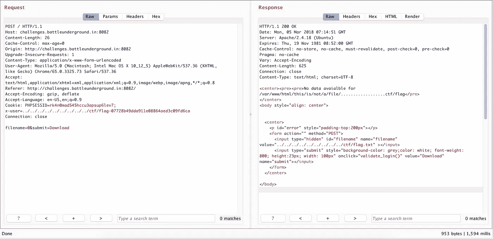

所以在同一个有效载荷上尝试了“/”的双重编码。

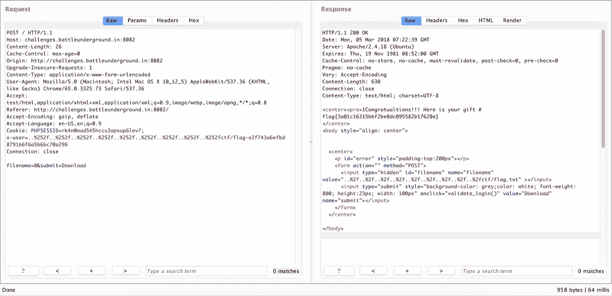

哦耶！我们拿到旗子了😎

**Web 3:(抢旗)**

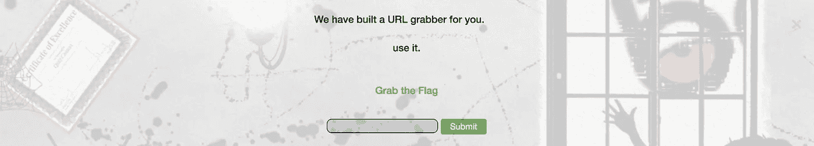

所以这有点像 SSRF 的弱点。该链接位于以下页面

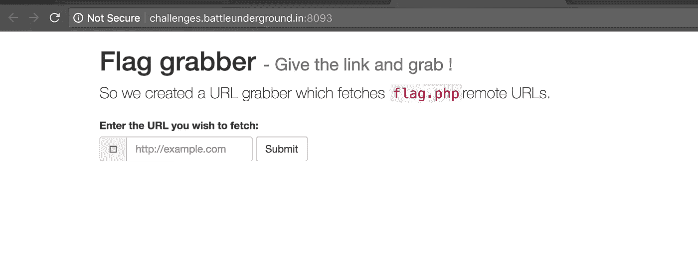

任务是在同一个 web 根目录下读取“flag.php”。但是当从浏览器直接访问时会被阻止(这就是任务)

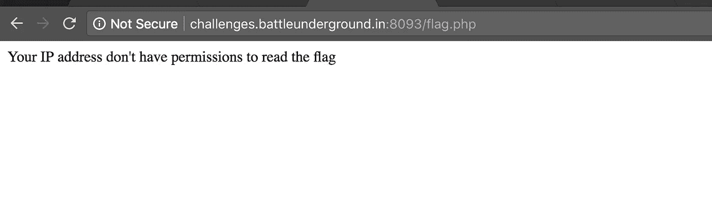

所以在获取 URL 上尝试了[http://127 . 0 . 0 . 1/flag . PHP](http://127.0.0.1/flag.php)，它返回了以下内容。

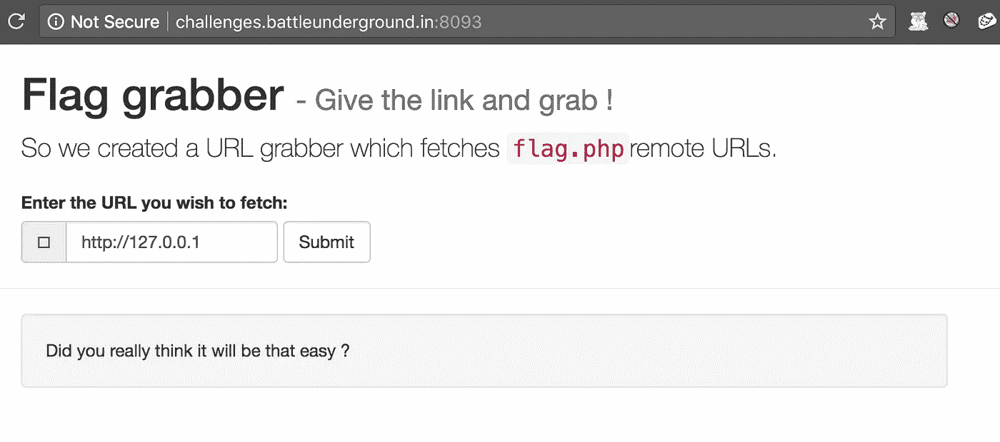

所以干脆用 0.0.0.0 代替 127.0.0.1 地狱耶！成功了😎我们拿到旗子了。

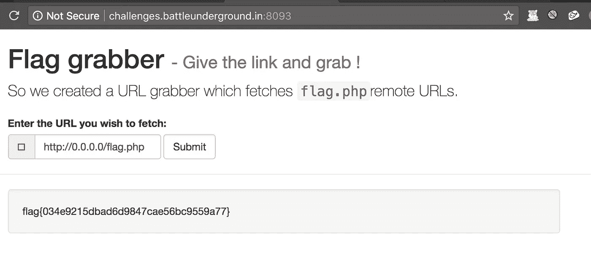

> 你真的认为会那么容易吗？

不，但它是😂 😂

感谢挑战 flipkart 安全团队！

-H4 ckx 0 r 5 团队