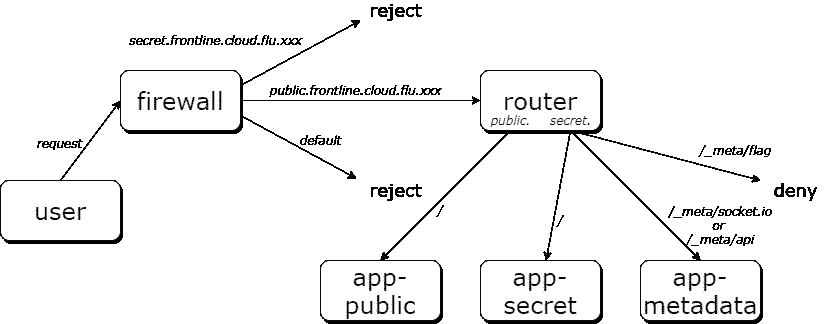
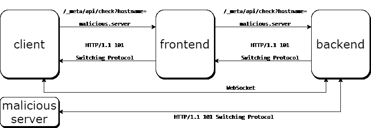

# 磁通云前线

> 原文：<https://infosecwriteups.com/fluxcloud-frontline-writeup-8e2dbf095d57?source=collection_archive---------3----------------------->

## Hack.lu 特写

挑战 FluxCloud Frontline (web，hard)是令人惊叹的 Hack 的一部分。卢。我和一个朋友花了两个晚上的时间才攻克了这个巨大的挑战，他们都是浮士德队的队员。

在下文中，我描述了简单的解决方案，并省略了我们进入的许多兔子洞。

# 挑战

> 借助我们全新的 FluxCloud Frontline 产品，我们可以提供超安全、超快速的边缘路由。当然，我们也有一个臭虫奖励计划！如果你能绕过我们的保护，你会得到一面美味的旗帜作为奖励。[https://public.frontline.cloud.flu.xxx:8443/](https://public.frontline.cloud.flu.xxx:8443/)

当我们打开挑战，我们提供了该项目的源代码。该项目由各种服务器层组成，如图 1 所示。



图 1:挑战的总体设置

首先，对域 *frontline.cloud.flu.xxx* 的请求进入防火墙。实现为 haproxy 的防火墙决定查看子域，请求是被转发到路由器还是被拒绝。拒绝的是除了子域*公共*以外的一切。 *frontline.cloud.flu.xxx.*

下一步，Nginx 路由器根据子域和路径将请求转发到公共、私有或元数据服务器。路径 */_meta/flag* ，显然是给我们的标志，被拒绝。

目标是通过或越过防火墙和路由器偷偷发送请求，以调用和接收标志。

# 防火墙旁路

挑战的第一阶段是绕过防火墙并将请求成功发送到秘密服务器。

下面我们可以看到 *haproxy.cfg 的重要部分:*

```
frontend ft_ssl_vip
  bind 0.0.0.0:443
  mode tcp

  **acl app_public req_ssl_sni -i public.frontline.cloud.flu.xxx
  acl app_secret req_ssl_sni -i secret.frontline.cloud.flu.xxx** use_backend bk_ssl_app_public if app_public
  use_backend bk_ssl_app_secret if app_secret default_backend bk_ssl_defaultbackend bk_ssl_app_public
  mode tcp
  server server1 router:443 checkbackend bk_ssl_app_secret
  mode tcp
  # Block access to the secret page!
  tcp-request content reject
  server server1 router:443 check
```

配置中的粗线决定服务器查看存储 TLS 连接主机名的服务器名称指示(SNI)。但是，Nginx 路由器会查看 HTTP 层的服务器名称。

这是我们可以用来将我们的流量路由到秘密服务器的缺陷。我们将 SNI 设置为 public，但将 HTTP 主机设置为 secret。

在 python 中，我们可以在 SSL 上下文中设置 SNI，在 HTTP 请求中设置 HTTP 主机(最终完全利用):

```
sslContext = ssl.create_default_context()
s = socket.socket(socket.AF_INET, socket.SOCK_STREAM)
sock = sslContext.wrap_socket(s,
       server_hostname="public.frontline.cloud.flu.xxx")# "GET / HTTP/1.1\r\n" +
# "Host: secret.frontline.cloud.flu.xxx\r\n"
```

# 路由器旁路

能够绕过防火墙，下一个挑战是路由器。路由器配置拒绝对标记端点的所有请求，并将流量路由到相应的服务器，查看路径位置:

```
location / {
   proxy_pass [http://app-secret](http://app-secret);
}
location /_meta/api/ {
   rewrite ^/_meta(.*)$ $1 break;
   proxy_pass [http://metadata](http://metadata);
}

location /_meta/flag {
   deny all;
}
location /_meta/socket.io/ {
  rewrite ^/_meta(.*)$ $1 break;
  proxy_http_version 1.1;
  proxy_set_header Upgrade $http_upgrade;
  proxy_set_header Connection "Upgrade";
  proxy_pass [http://metadata](http://metadata);
}
```

我们可以看到，元数据服务器使用 socket.io 通过 WebSockets 与 app-secret 服务器进行通信。此外，元数据服务器包含一个开放重定向端点`/_meta/api/check?hostname=xy` ,用于向主机名发送检查请求(在内部用于检查公共和秘密服务器)。

考虑到这一点，我们谷歌了 Nginx 和 socket.io 中的请求走私漏洞，最终找到了我们要找的东西。链接帖子中[场景 2 描述的情况需要 Nginx、socket.io、一个内部 API(我们的 flag API)和一个 open-redirect——这正是我们面临的情况。](https://github.com/0ang3el/websocket-smuggle)

上面提到的帖子描述了我们可以使用 open-redirect 将请求重定向到我们的恶意服务器。恶意服务器必须用 HTTP 101 响应，告诉目标服务器打开一个到我们客户端的 WebSocket 连接。然而，通过这个 WebSocket 连接，我们仍然可以发送 HTTP 请求，例如发送到内部 API 并绕过路由器。



图 2:请求走私的请求流程

# 最终解决方案

所以最终的解决方案看起来如下。我在一个数字海洋液滴上运行它来对开放重定向作出反应。

多田，这是旗子:

```
('31.22.122.203', 37290) connected
b'HTTP/1.1 101 Switching Protocols\r\nServer: nginx/1.19.3\r\nDate: Sat, 24 Oct 2020 18:44:08 GMT\r\nContent-Type: text/html; charset=utf-8\r\nContent-Length: 2\r\nConnection: upgrade\r\nX-Powered-By: Express\r\nETag: W/"2-eoX0dku9ba8cNUXvu/DyeabcC+s"\r\n\r\n'
send payload
b'HTTP/1.1 200 OK\r\nX-Powered-By: Express\r\nConnection: keep-alive\r\nContent-Type: text/html; charset=utf-8\r\nContent-Length: 58\r\nETag: W/"3a-jCTYnFrMoq94M55Ba2sPa6ZdkWU"\r\nDate: Sat, 24 Oct 2020 18:44:08 GMT\r\n\r\nflag{th1s_isnt_y0ur_f1rst_t1me_p3netr4ting_fir3walls_huh?}'
```

**flag { th1s _ nots _ your _ f1 rst _ t1me _ p 3 net R4 ting _ fir 3 walls _ huh？}**