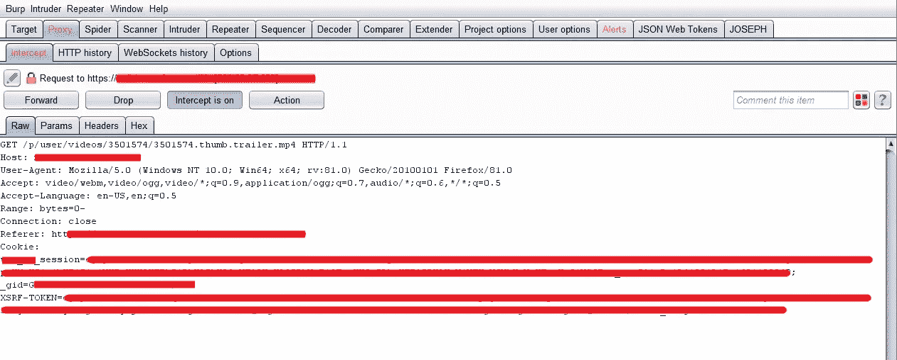
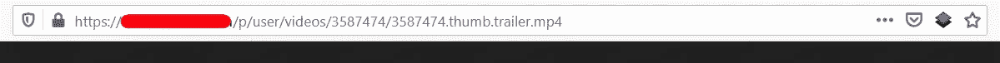
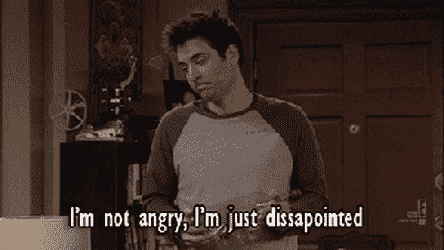
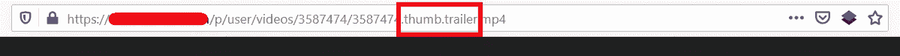

# 强行索要赏金$$

> 原文：<https://infosecwriteups.com/forcing-for-a-bounty-b637c468d7bd?source=collection_archive---------2----------------------->

**各位研究员好，**

我自己，**拉菲阿哈迈德**。我是来自孟加拉国的网络安全研究员。我目前在达卡大学攻读 BBA。但是我喜欢无聊的东西。让我们不要浪费时间进入我们的主题。

首先，不要和标题混淆。我说的强迫实际上是指强迫浏览。

# **什么是强制浏览？**

F **强制浏览**是一种攻击，攻击者的目的是枚举和访问应用程序未引用但仍可访问的资源。

# **我是怎么发现 bug 的？**

最近，我在 **HackerOne** 测试一个私人网站，该网站出售教育视频。因此，他们允许用户免费预览视频。但是预演只有 15 秒或者更少。好吧，谁在乎呢？

**实际上，这就是$$$的所在。**

像往常一样，我打开**拦截**使用**打嗝套件** &注意到如下端点:

但是端点在另一个子域上。通过查看子域名，可以理解该组织使用这个子域名来存储所有的视频和其他东西。因此，我很快访问了端点，看是否能找到什么。

**终点**

但我一无所获。得到了相同时长的相同预览。

然后我注意到端点是这样的

我想为什么不去掉它&看看会发生什么。我很惊讶我得到了完整的视频。现在我可以免费观看任何付费视频。

> 我很快向 HackerOne 报告了这个错误，并获得了一笔丰厚的 500 美元奖金。

**报道:**9 月 27 日。

9 月 28 日。

**解决:**10 月 18 日。

希望你们喜欢这个。如果您有任何问题，请随时在 [**【脸书】**](https://www.facebook.com/rafiahamed.rupak.3) 或 [**LinkedIn**](https://www.linkedin.com/in/rafi-ahamed) 联系我。

***#吃 _ 睡 _ 黑 _ 重复
#全部黑掉***