# 取证—记录

> 原文：<https://infosecwriteups.com/forensics-6b4aaf85f87f?source=collection_archive---------0----------------------->


## TryHackMe

## 这是一个被入侵系统的内存转储，做一些取证功夫来探索内部。

# 任务 1:波动取证

1.  下载 victim.zip
2.  这个转储文件的操作系统是什么？(操作系统名称)

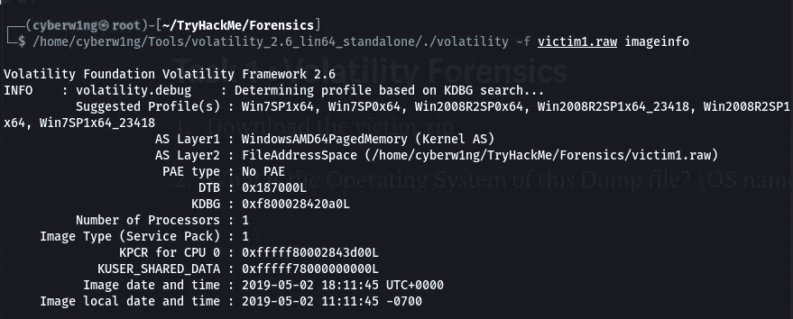

```
Ans: windows
```

3.SearchIndexer 的 PID 是什么？

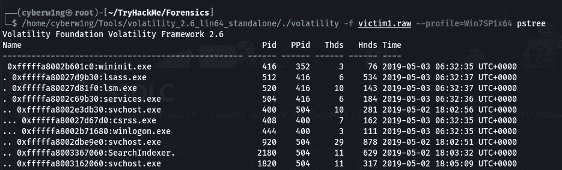

```
Ans: 2180
```

4.用户最后访问的目录是什么？

(最后一个文件夹名是什么？)使用日期和时间进行搜索

使用 **shellbags** 命令查找目录

```
./volatility -f victim1.raw --profile=Win7SP1x64 shellbags
```

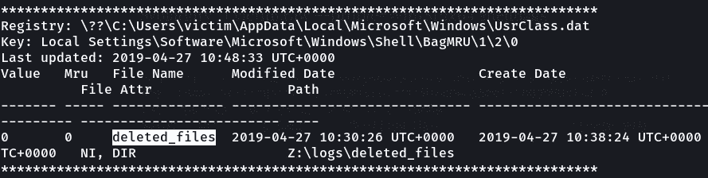

```
Ans: Deleted_files
```

# 任务 2

1.  有许多可疑的开放端口；是哪一个？(答案格式:协议:端口)

第一个的协议和端口

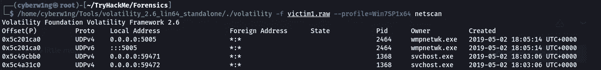

```
Ans: UDP:5005
```

2.Vads 标记和执行保护是恶意进程的有力指示器；你能找到它们是哪一个吗？(答案格式:Pid1Pid2Pid3)

我们找到的第一个 3 PID 就是答案

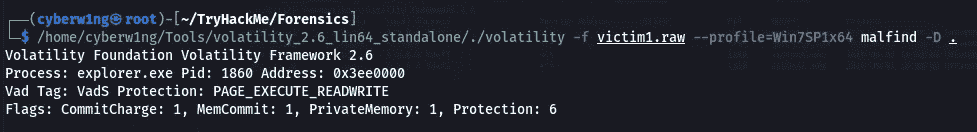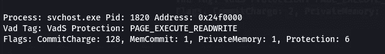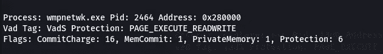

```
Ans: 1860;1820;2464
```

# 任务 3 —国际奥委会传奇

1.www.go****。ru '(写完整的网址，不带任何引号)

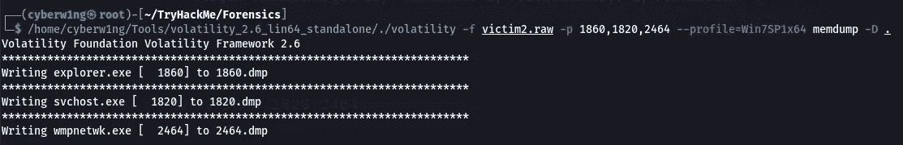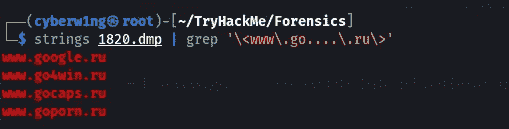

```
Ans: [www.goporn.ru](http://www.goporn.ru)
```

2.www.i****。com '(写完整的网址，不带任何引号)

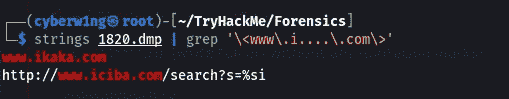

```
Ans: [www.ikaka.com](http://www.ikaka.com)
```

3.www.ic******。' com '


```
Ans: [www.icsalabs.com](http://www.icsalabs.com)
```

4.202.***.233.***(写完整 IP)

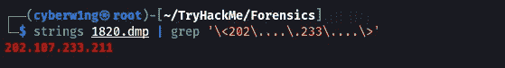

```
Ans: 202.107.233.211
```

5.***.200.**.164(写完整 IP)

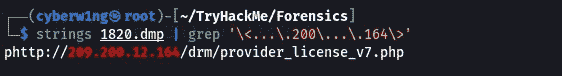

```
Ans: 209.200.12.164
```

6\. 209.190.***.***

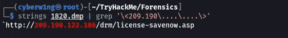

```
Ans: 209.190.122.186
```

7.PID 2464 唯一的环境变量是什么？

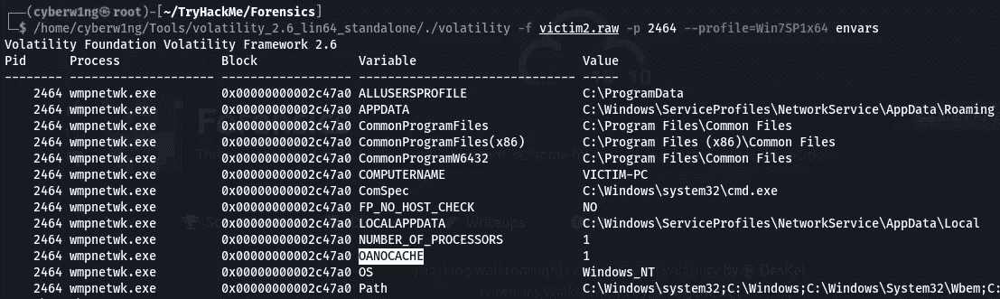

```
Ans: Answer is Highlighted in the above Picture Thankyou For Reading!!!Happy Hacking!!Author —  Karthikeyan N | Cyberw1ng
```

## 来自 Infosec 的报道:Infosec 每天都有很多内容，很难跟上。[加入我们的每周简讯](https://weekly.infosecwriteups.com/)以 5 篇文章、4 个线程、3 个视频、2 个 GitHub Repos 和工具以及 1 个工作提醒的形式免费获取所有最新的 Infosec 趋势！