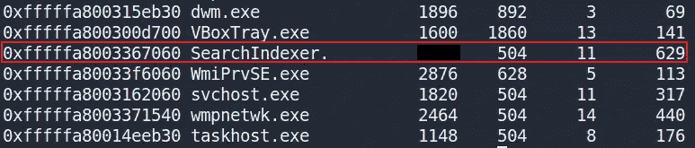
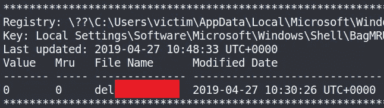
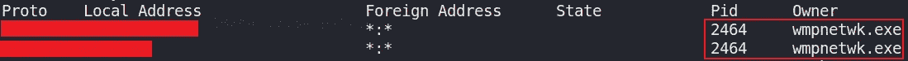
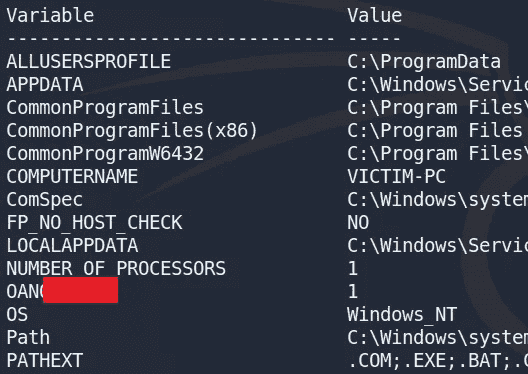

# 取证—易失性内存分析

> 原文：<https://infosecwriteups.com/forensics-memory-analysis-with-volatility-6f2b9e859765?source=collection_archive---------0----------------------->


挥发性标志

最近，我学习了更多关于内存取证和易失性内存分析工具的知识。为了获得更多的实践，我决定尝试由*怀特哈特*创建的名为“**取证***”*的免费 TryHackMe 房间。这篇文章介绍了我使用 Volatility 解决这个问题的方法，我还在文章结尾提供了一个 TryHackMe 的链接，供有兴趣尝试这个问题的人参考。

# 放弃

我喜欢在一篇文章之前添加一个简短的免责声明，以鼓励人们在阅读本文之前尝试一下这个房间，因为在这篇文章中显然会有**剧透** **。我相信，如果你先自己尝试，然后在遇到困难或需要提示时再来写这篇文章，你会更喜欢 CTF。因此，没有任何进一步的拖延，让我们开始吧！**

# 什么是波动性？

Volatility 是一个用于事件响应和恶意软件分析的开源内存取证框架。这是一个非常强大的工具，我们可以完成许多与内存转储文件的交互，例如:

*   列出所有正在运行的进程。
*   列出活动的和关闭的网络连接。
*   查看互联网历史(IE)。
*   识别系统上的文件，并从内存转储中检索它们。
*   阅读记事本文件的内容。
*   检索输入到 Windows 命令提示符(CMD)中的命令。
*   使用 YARA 规则扫描恶意软件的存在。
*   检索截图和剪贴板内容。
*   检索哈希密码。
*   检索 SSL 密钥和证书。

如果你有兴趣了解更多，我在下面提供了一个到 Volatility Framework 网站、Volatility Framework Github 和一个由 HackTricks 提供的 Volatility Framework cheatsheet 的链接:

 [## 易失性基金会-开源内存取证

### 波动率基金会是一个独立的 501(c) (3)非营利组织，维护和促进…

www.volatilityfoundation.org](https://www.volatilityfoundation.org/) [](https://github.com/volatilityfoundation/volatility) [## GitHub-volatility foundation/volatility:一个高级内存取证框架

### 一个高级内存取证框架。通过创建一个……

github.com](https://github.com/volatilityfoundation/volatility) [](https://book.hacktricks.xyz/forensics/basic-forensic-methodology/memory-dump-analysis/volatility-examples) [## 波动性-备忘单

### 内存中的 EPROCESS 结构)、OS 句柄(定位并列出句柄表，解引用找到的任何指针…

book.hacktricks.xyz](https://book.hacktricks.xyz/forensics/basic-forensic-methodology/memory-dump-analysis/volatility-examples) 

# 任务 1:波动取证

> 1.这个转储文件的操作系统是什么？(操作系统名称)

波动性需要概况来工作。当我们有了想要分析的内存映像文件时，我们首先需要使用下面的命令:

```
$ volatility -f victim.raw imageinfoVolatility Foundation Volatility Framework 2.6
INFO    : volatility.debug    : Determining profile based on KDBG search...
          Suggested Profile(s) : Win7SP1x64, Win7SP0x64, Win2008R2SP0x64, Win2008R2SP1x64_24000, Win2008R2SP1x64_23418, Win2008R2SP1x64, Win7SP1x64_24000, Win7SP1x64_23418
                     AS Layer1 : WindowsAMD64PagedMemory (Kernel AS)
                     AS Layer2 : FileAddressSpace (/home/kali/Downloads/Capture-The-Flag/Forensics/victim.raw)
                      PAE type : No PAE
                           DTB : 0x187000L
                          KDBG : 0xf800028420a0L
          Number of Processors : 1
     Image Type (Service Pack) : 1
                KPCR for CPU 0 : 0xfffff80002843d00L
             KUSER_SHARED_DATA : 0xfffff78000000000L
           Image date and time : 2019-05-02 18:11:45 UTC+0000
     Image local date and time : 2019-05-02 11:11:45 -0700
```

一旦这个命令被运行，Volatility 将识别内存镜像来自的系统，包括操作系统、版本和架构。Volatility 将建议推荐的配置文件，当在这个内存映像上运行任何其他命令时，我们也需要提供该配置文件。建议的配置文件是 **Win7SP1x64** ，因此我们可以说这个转储文件的操作系统是 Windows。

> 2.SearchIndexer 的 PID 是什么？

我们可以通过使用 volatility 提供的 **pslist** 插件来识别 SearchIndexer 进程的进程 ID (PID)。我们将使用之前确定的概要文件 **Win7SP1x64** ，并指定 **pslist** 插件，如下面的命令所示:

```
volatility -f victim.raw --profile=Win7SP1x64 pslist
```

通过查看输出，我们可以看到 SearchIndexer 进程及其 PID:



易失性“pslist”插件输出。

> 3.用户最后访问的目录是什么？(最后一个文件夹名是什么？)

对于这个问题，我们得到的提示是:

> 你为什么不在你家后院搜一袋子贝壳呢？

这个提示指的是 **Shellbags** 插件的波动性。这个插件解析并打印从注册表中获得的 [Shellbag (pdf)](http://www.dfrws.org/2009/proceedings/p69-zhu.pdf) 信息。使用下面的链接可以找到关于这个插件的更多信息:

 [## 内存、SetRegTime 和 TrueCrypt 卷中的 MoVP 3.2 外壳包

### 一个月的易变插件今天的帖子将涵盖一个目前正在开发的易变插件

volatility-labs.blogspot.com](https://volatility-labs.blogspot.com/2012/09/movp-32-shellbags-in-memory-setregtime.html) 

使用这个插件，我们可以识别系统中曾经存在的文件、文件夹、zip 文件和安装程序(即使被删除了)，以及它们的元数据(时间戳和绝对路径)。

```
volatility -f victim.raw --profile=Win7SP1x64 shellbags
```

我们可以查看输出，并根据**访问日期**字段，确定用户访问的最后一个目录。经过一番搜索，我找到了以下目录:



易变“壳包”插件输出。

# 任务 2:波动性取证(续。)

> 4.有许多可疑的开放端口；是哪一个？(答案格式:协议:端口)

我们可以使用 **netscan** 插件来识别网络连接:

```
volatility -f victim2.raw --profile=Win10x64_17134 netscan
```

这将返回大量的网络连接，但是仅根据此输出很难识别哪些是可疑的。为了缩小选择范围，我决定使用 **malfind** 插件来检测任何代码注入:

> 代码注入是攻击类型的通用术语，它包括注入代码，然后由应用程序解释/执行。这种类型的攻击利用了对不可信数据的不良处理。由于缺乏适当的输入/输出数据验证，这些类型的攻击通常是可能的。

```
volatility -f victim2 --profile=Win7SP1x64 malfind
```

来自 **malfind** 插件的输出可能包含误报。插件发现 3 个检测到代码注入的恶意 PID(即 1860、1820 和 2464):

```
Process: explorer.exe Pid: 1860 Address: 0x3ee0000
Vad Tag: VadS Protection: PAGE_EXECUTE_READWRITEProcess: explorer.exe Pid: 1860 Address: 0x3f90000
Vad Tag: VadS Protection: PAGE_EXECUTE_READWRITEProcess: svchost.exe Pid: 1820 Address: 0x24f0000
Vad Tag: VadS Protection: PAGE_EXECUTE_READWRITEProcess: svchost.exe Pid: 1820 Address: 0x4d90000
Vad Tag: VadS Protection: PAGE_EXECUTE_READWRITEProcess: wmpnetwk.exe Pid: 2464 Address: 0x280000
Vad Tag: VadS Protection: PAGE_EXECUTE_READWRITE
```

回顾网络连接的输出，我可以看到 wmpnetwk.exe 的一个网络连接(PID 2464)，将其标记为可疑，并回答以下问题:



易失性“网络扫描”插件输出。

> 5.Vads 标记和执行保护是恶意进程的有力指示器；你能找到它们是哪一个吗？(答案格式:Pid1Pid2Pid3)

在试图回答上面的问题 4 时，我们已经回答了这个问题。我们可以通过使用 **malfind** 插件找到三个恶意进程 id(PID ),如前所述。

# 任务 3:国际奥委会传奇

任务描述:

> 在上一个任务中，您发现了恶意进程，所以让我们深入研究它们，找出一些危害指标(IOC)。您只需要找到它们并填写空白(您可以在 VirusTotal 上搜索它们以了解更多详细信息)。

我们之前发现了 3 个恶意进程。我们可以使用 **memdump** 插件提取关于进程当前状态的所有信息:

```
volatility -f victim3.raw --profile=Win7SP1x64 memdump -p 2464 -D 2464/
```

> 6.www.go****。ru '(写完整的网址，不带任何引号)
> 
> 7.www.i****。com '(写完整的网址，不带任何引号)
> 
> 8.www.ic******。' com '

我们可以通过使用 **strings** 命令和 **grep** 命令过滤 URL 来回答下面三个问题:

```
# Question 6
strings 2464.dmp 1860.dmp 1820.dmp | grep "www" | grep "go" | grep "ru"# Question 7
strings 2464.dmp 1860.dmp 1820.dmp | grep "[www.i](http://www.i)" | grep "com"# Question 8
strings 2464.dmp 1860.dmp 1820.dmp | grep "www.ic"
```

> 9.202.***.233.***(写完整 IP)
> 
> 10.***.200.**.164(写完整 IP)
> 
> 11\. 209.190.***.***

与上面类似，我们可以通过使用 **strings** 命令和 **grep** 命令过滤 IP 地址来回答下面三个问题:

```
# Question 9
strings 2464.dmp 1860.dmp 1820.dmp | grep "202." | grep "233."# Question 10
strings 2464.dmp 1860.dmp 1820.dmp | grep ".200" | grep ".164"# Question 11
strings 2464.dmp 1860.dmp 1820.dmp | grep "209" | grep ".190"
```

> 12.PID 2464 唯一的环境变量是什么？

我们可以使用插件 **envars** 来获取 PID 2464 的环境变量:

```
volatility -f ../victim3.raw --profile=Win7SP1x64 envars -f 2464.dmp -p 2464
```

查看输出，我们可以看到一个独特的环境变量:



易失性“envars”插件输出。

# 结束语

我真的很喜欢在这个房间工作，并有机会了解更多关于易失性开源内存取证框架的知识。谢谢你一直读到最后，继续黑下去😄！

[](https://tryhackme.com/) [## 网络安全培训

### TryHackMe 是一个免费的学习网络安全的在线平台，使用动手练习和实验室，通过您的…

tryhackme.com](https://tryhackme.com/)