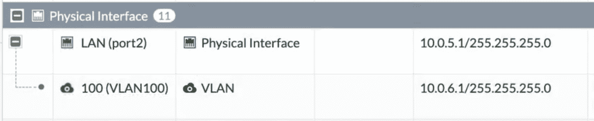
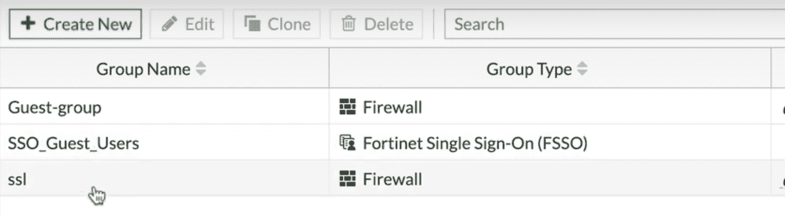
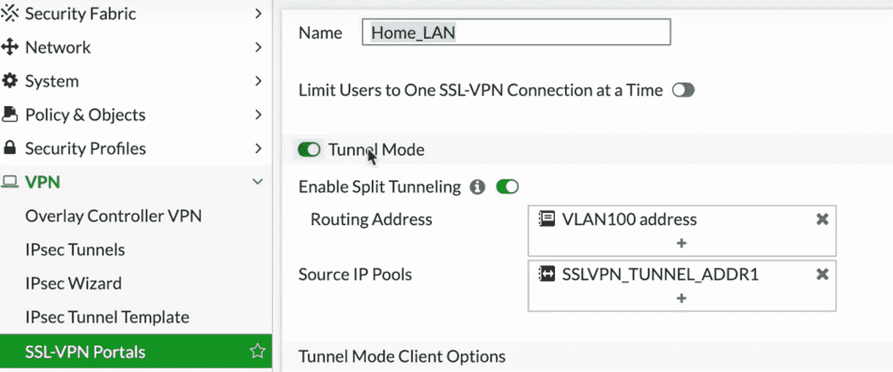
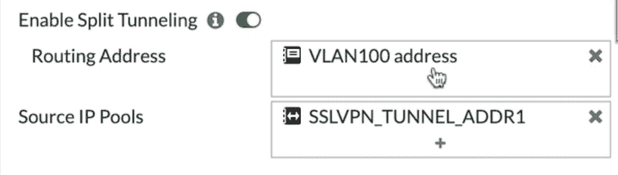
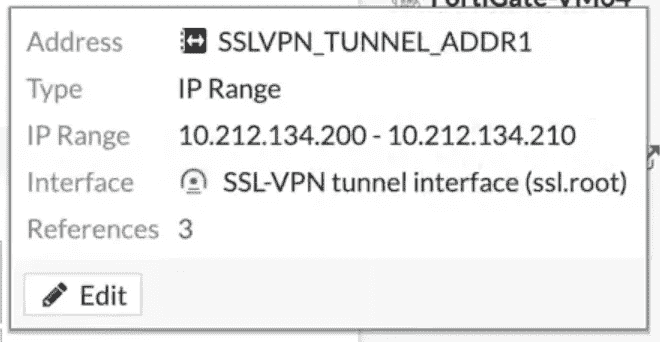
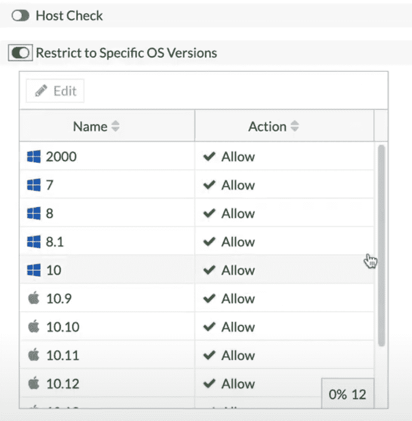
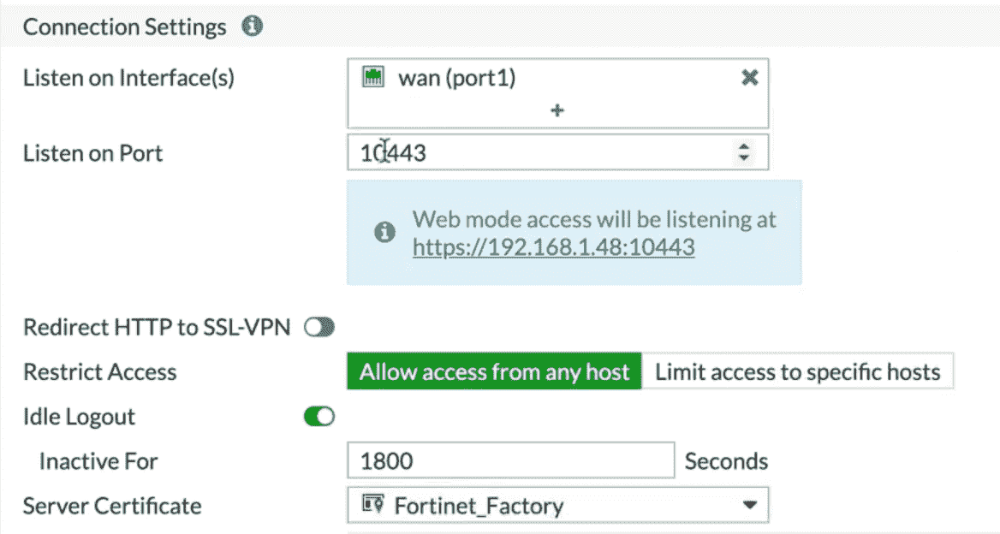
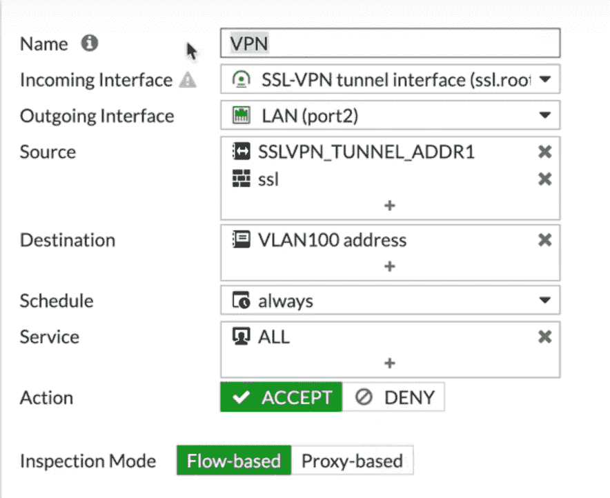

# Fortigate 防火墙分割隧道模式

> 原文：<https://infosecwriteups.com/fortigate-firewall-split-tunnel-mode-49897fd0bf20?source=collection_archive---------1----------------------->

# 如果你在 Fortigate 防火墙上使用 SSL VPN，那么你有三种模式可供选择。

第一个是**网络模式**，通过网络浏览器访问资源。但是使用有限的协议集。

在第二种模式下，**全隧道模式**，你可以访问所有的协议和应用程序，但是所有的流量都将通过该隧道。有时并不需要。(从您的 FortiGate 防火墙获取资源)

第三种模式是**分割隧道模式**，在这种模式下，您可以访问特定的资源，其余的流量将通过公共互联网传输。

# 让我们来看一个分割隧道模式。

我们的拓扑如下。我们有自己的局域网接口。我们还有一个 VLAN 界面，版本为 10.0 .6.0。子网。这就是我们的目的地。

确保你有 VLAN 和你局域网的**防火墙地址对象**。你以后会用到它。

**第二件事是创建你的用户组。**

这将是允许访问该资源的 SSL 切分通道用户组。所以第一步，一定要创建不同资源的防火墙地址对象。第二步，创建用户组。

现在转到 **VPN — SSL VPN** 门户，在那里您有几个选项，您有完全访问模式和 web 模式。

创建自己的 SSL VPN 门户。我把它命名为家兰。

**选择隧道模式和分割隧道模式。**

同样，切分通道模式允许您访问特定的资源。

在这里，您将实际选择您的防火墙地址对象。

第二件事是选择源 **IP 池**。这将确保用户将从特定范围获取 IP 地址，您可以创建自己的范围，可以编辑当前范围，请务必选择该范围，因为它还允许您在设置策略时具有更高的安全性。

您还可以选择不同的选项，如保存密码、自动连接等，您还可以进行**主机检查**，您可以限制对特定操作系统的访问。如果您不希望 Windows 7 用户访问您的网络，您可以阻止对特定操作系统的访问，我们不会这样做。

第二件事是 **SSL VPN 设置**自己。现在，你可能会听到你的广域网接口。默认为端口 443。但是，由于其他应用程序正在使用 443，因此请确保您正在更改端口，您可以选择限制对特定主机的访问或允许对任何主机的访问，我们将保持对任何主机的访问。

默认情况下，空闲日志时间是五分钟，您可以将其更改为您认为对您的用户来说足够长的任何时间

使用自己的证书。您的 FortiGate 带有预定义的自签名证书，请在您的 SSL VPN 门户上使用您自己的证书。

按照其他设置，您可以将用户映射到特定门户。所以我们就这么做吧。并申请。

# **防火墙策略**

**最后一件事是你的防火墙政策。**

传入接口是 SSL VPN。

输出接口是我们的局域网接口

源是我们刚刚创建的 SSL 组。

您还可以添加 IP 池作为源，这将使您的策略更加安全。目的地是我们刚刚创建的 VLAN 100 地址对象。调度始终是服务始终，您可以使用任何安全配置文件，你想

**通过我的“Fortigate 管理袖珍指南”了解更多信息**

[https://www . Amazon . com/Fortigate-Firewall-Admin-Pocket-Guide-ebook/DP/b 08 skp VF 8 w/ref = Sr _ 1 _ 1？dchild = 1&keywords = fortigate+admin+book&qid = 1617048735&Sr = 8-1](https://www.amazon.com/Fortigate-Firewall-Admin-Pocket-Guide-ebook/dp/B08SKPVF8W/ref=sr_1_1?dchild=1&keywords=fortigate+admin+book&qid=1617048735&sr=8-1)