# 黑客盒子——财富杂志

> 原文：<https://infosecwriteups.com/fortune-hackthebox-writeup-ded91435f91c?source=collection_archive---------0----------------------->

## 财富是一个很酷的盒子，在通往根的道路上的每一个阶段都包含着挑战。我将从下载一些证书文件开始，这些文件是我通过命令注入检索的。然后，我使用这些证书生成一个客户端证书，并从那里获取一个 SSH 密钥来登录到机器并安装一个 nfsshare。对于权限提升，我将使用一种易受攻击的加密方法来滥用密码重用功能。

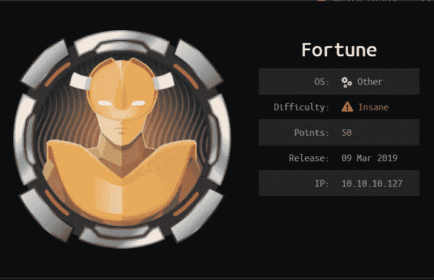

# 计数和侦察

让我们从 Nmap 扫描开始。

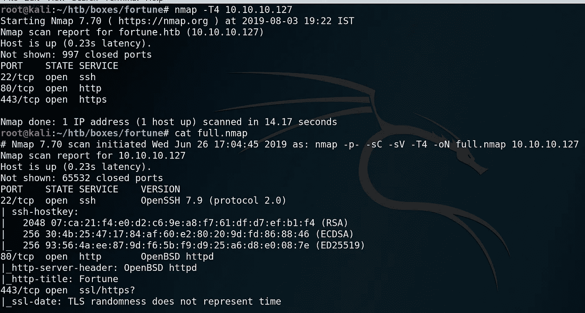

常用端口， **22- SSH，80 — HTTP，443 — HTTPS** 是开放的。
让我们先检查一下 HTTP 和 HTTPS。

# 80 — HTTP

我们可以选择数据库。

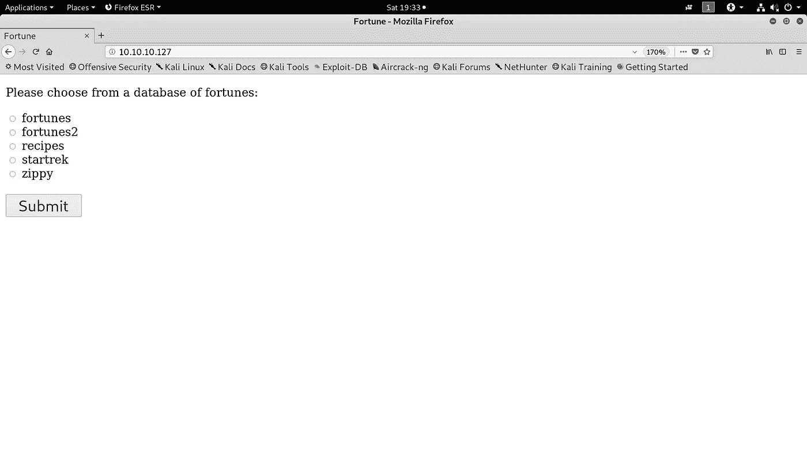

在选择第一个选项时，

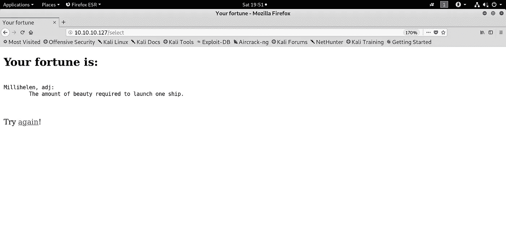

选择其他选项会返回一些随机文本。现在让我们检查 443 HTTPS 港，之后再回来看这个。

# 443 — HTTPS

看来我们现在无法进入 HTTPS 港。找到相关信息后，我们会再讨论这个问题。

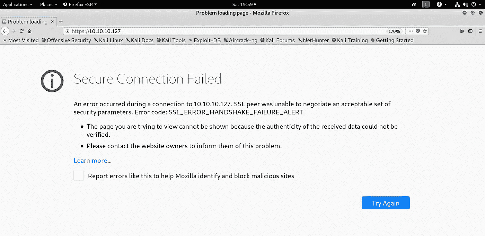

# 80 — HTTP

让我们捕获主页上显示的选择数据库的请求。

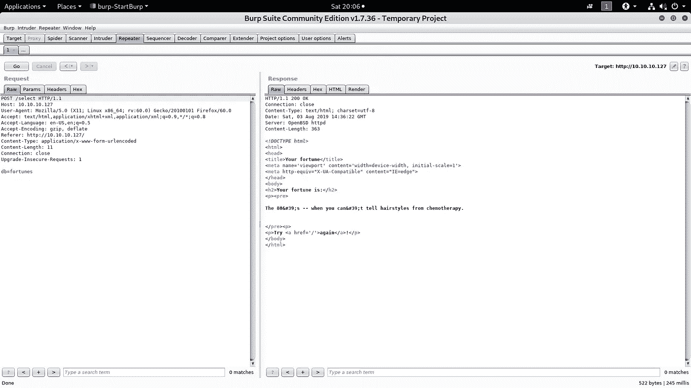

我们有一个参数`db`，它接收数据库名称并返回一些随机文本。
如果我们在末尾添加一个`;`并添加任何命令，瞧，我们就可以执行命令了。

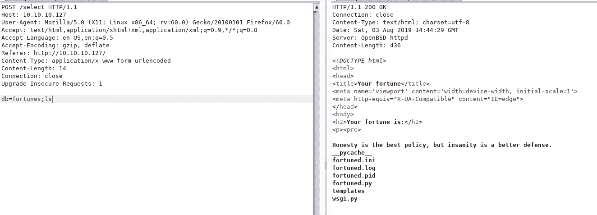

我试着 ping 自己，我做到了。

> ***db =时运；平-C3 10 . 10 . 14 . 8***

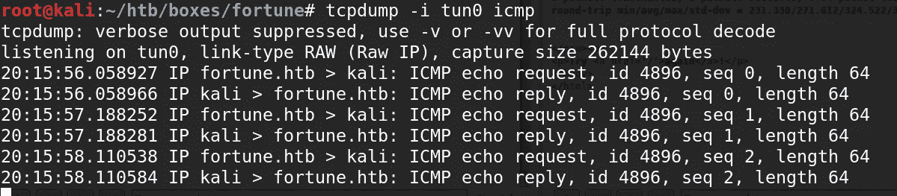

我试图得到一个反向外壳，但没有成功。我继续列举文件系统中有趣的文件。我们可以从 **/home/bob** 泄露一堆证书。我们需要将证书转换为 PKCS12，并且我们需要一个密钥来完成此操作。我们只有一个证书与一个密钥相关联(我们可以假设它，因为两者的名称(“中间”)是相同的)。

转换证书。使用 OpenSSL 的 pem(不使用密码):

> **OpenSSL pkcs12-export-out fortune . p12-in intermediate . cert . PEM-in key intermediate . key . PEM**

然后在浏览器中导入证书并访问 443 HTTPS 端口

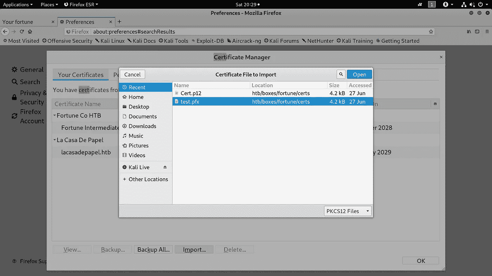

# 443 — HTTPS

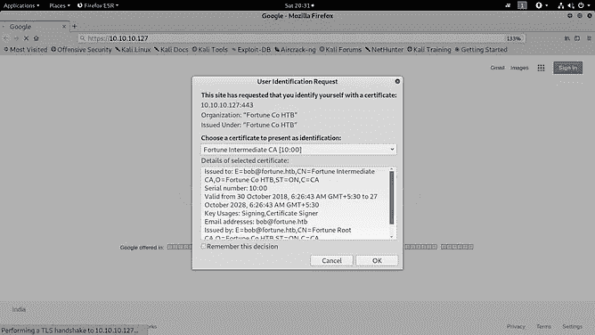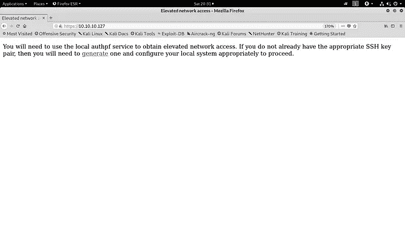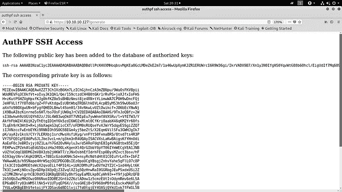

使用 SSH 密钥登录到该机器。我尝试在所有三个用户上使用 SSH 密钥，并成功地使用了`nfsuser`。也是 authpf SSH 访问。

> authpf 实用程序是一个用于认证网关的用户 shell。身份验证网关就像常规的网络网关(也称为路由器)，只是用户必须首先向它验证自己的身份，才能允许其流量通过。当用户的 shell 设置为`/usr/sbin/authpf`并使用 SSH 登录时，authpf 将对活动的 [pf(4)](https://man.openbsd.org/pf) 规则集进行必要的更改，以便用户的流量通过过滤器和/或使用 NAT/重定向进行转换。一旦用户注销或他们的会话断开，authpf 将删除为用户加载的任何规则，并终止用户打开的任何有状态连接。因此，只有当用户保持 SSH 会话打开时，用户才能通过网关传递流量

# SSH 作为 NFSUSER

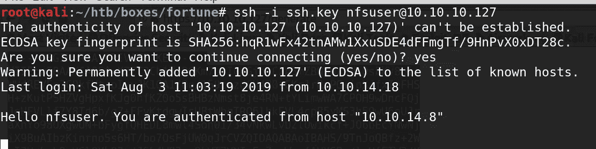

我们只得到这条消息，仅此而已。
我被困在这里很长一段时间，但是用户名`nfsuser` 可以表明可能有一个用户在使用 nfsshare。我很快尝试使用 showmount 检查挂载共享。

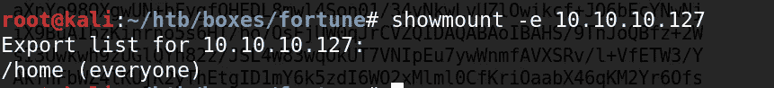

嗯，猜测是对的，我们确实有一些 mount share。是时候安装一些 nfsshares 了。

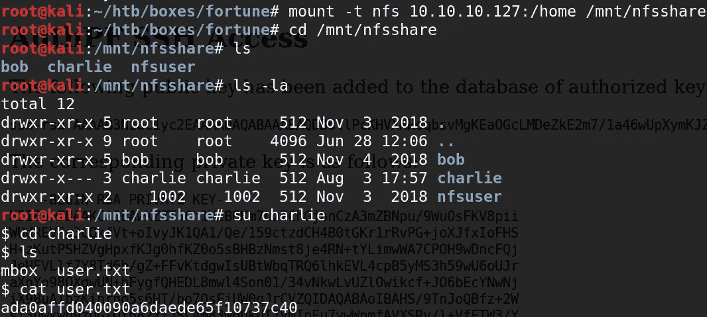

因为文件系统是本地挂载的，所以我们可以将我们的 UUID ( ***伪装成 uid*** )更改为特定的用户，就像我们是那个用户一样访问文件。这里，只需添加一个用户，该用户与我们想要访问其文件的用户具有相同的 **UID。**

## useradd-u<uid></uid>

## useradd -u 1001 查理

## 然后做一个`su charlie.`

让我们将我们的公钥添加到 authorized_keys 文件中。

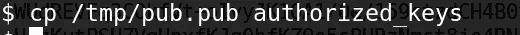

# 扮演查理

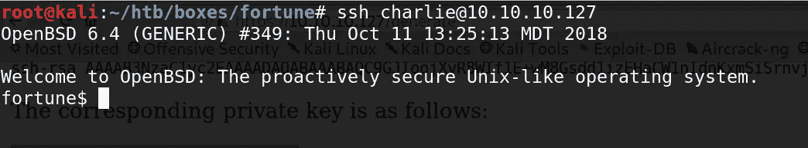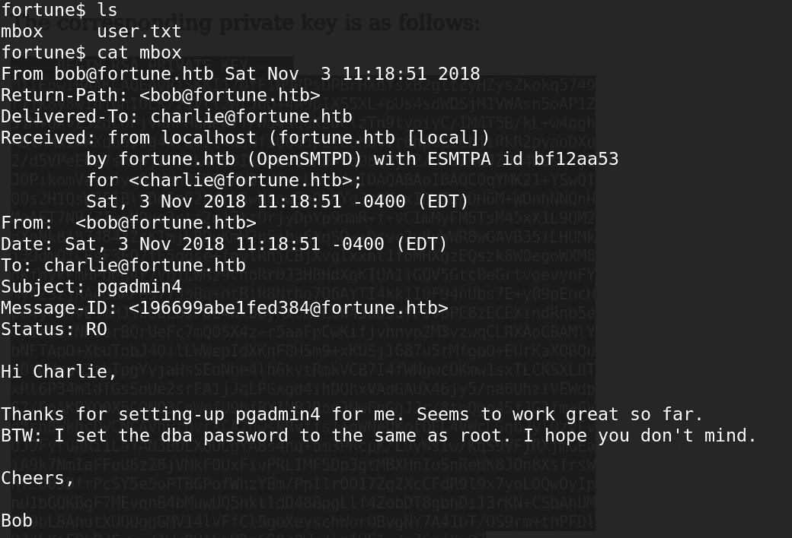

来自鲍勃的有趣的邮件

# 将 Esc 权限授予 Root

因此，有密码重用的地方。
四处寻找 pgadmin 的配置文件，最终找到了这个文件。

**(/var/app SRV/pgadmin 4/pgadmin4.db)**
由于 pgadmin 4 . db 是一个数据库文件，所以我用一些在线工具打开了它。虽然，我们可以通过一个简单的字符串命令得到我们想要的。

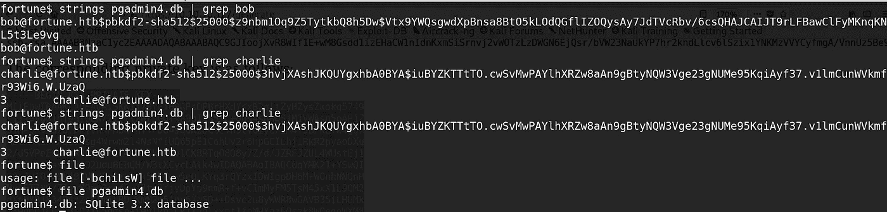

在网上搜索破解这些哈希值无果而终，我发现 PGADMIN 是开源的(是啊)，并在他们自己的回购中发现了这个有趣的加密文件。

```
***##########################################################################***
***#***
***# pgAdmin 4 - PostgreSQL Tools***
***#***
***# Copyright (C) 2013 - 2019, The pgAdmin Development Team***
***# This software is released under the PostgreSQL Licence***
***#***
***#########################################################################***

**"""This File Provides Cryptography."""**

**from** ***__future__*** **import** division

**import** ***base64***
**import** ***hashlib***
**import** ***os***

**import** ***six***

**from** ***cryptography.hazmat.backends*** **import** default_backend
**from** ***cryptography.hazmat.primitives.ciphers*** **import** Cipher
**from** ***cryptography.hazmat.primitives.ciphers.algorithms*** **import** AES
**from** ***cryptography.hazmat.primitives.ciphers.modes*** **import** CFB8

padding_string **=** b'}'
iv_size **=** AES**.**block_size **//** 8

**def** **decrypt**(ciphertext, key):
    **"""
    Decrypt the AES encrypted string.

    Parameters:
        ciphertext -- Encrypted string with AES method.
        key        -- key to decrypt the encrypted string.
    """**

    ciphertext **=** base64**.**b64decode(ciphertext)
    iv **=** ciphertext[:iv_size]

    cipher **=** Cipher(AES(pad(key)), CFB8(iv), default_backend())
    decryptor **=** cipher**.**decryptor()
    **return** decryptor**.**update(ciphertext[iv_size:]) **+** decryptor**.**finalize()

**def** **pad**(key):
    **"""Add padding to the key."""**

    **if** **isinstance**(key, six**.**text_type):
        key **=** key**.**encode()

    ***# Key must be maximum 32 bytes long, so take first 32 bytes***
    key **=** key[:32]

    ***# If key size is 16, 24 or 32 bytes then padding is not required***
    **if** **len**(key) **in** (16, 24, 32):
        **return** key

    ***# Add padding to make key 32 bytes long***
    **return** key**.**ljust(32, padding_string)
```

我们可以使用“decrypt”方法来解密 dba 的密码，该密码是使用 Bob 的 AES 加密密钥加密的。我花了很长时间才发现。

> 将此行添加到文件
> ***print(decrypt(" utu 0 jkamczdmqfloraupjfxl 0 ZP 8 zwzise 5mf 0 gy/l 8 silrmu 3 caqrtjavjlvffegesgz "，" $ pbk df 2-sha 512 $ 25000 $ z 9 nbm 1 OQ 9 z 5 tytkbq 8 H5 dw $ vtx 9 ywqsgwdxpbnsa 8 bto 5 klodqgflizoqysay 7 jdtvcrbv/6 cs***


搞定，扎根！下次见。

# 额外的

这是易受命令注入攻击的源代码。
`**@app.route('/select', methods=['POST'])
def fortuned():**`

`**cmd = '/usr/games/fortune '
dbs = ['fortunes', 'fortunes2', 'recipes', 'startrek', 'zippy']
selection = request.form['db']
shell_cmd = cmd + selection
result = os.popen*(shell_cmd).read()
return render_template('display.html', output=result*)**`

*关注* [*Infosec 报道*](https://medium.com/bugbountywriteup) *获取更多此类精彩报道。*

[](https://medium.com/bugbountywriteup) [## 信息安全报道

### 收集了世界上最好的黑客的文章，主题从 bug 奖金和 CTF 到 vulnhub…

medium.com](https://medium.com/bugbountywriteup)