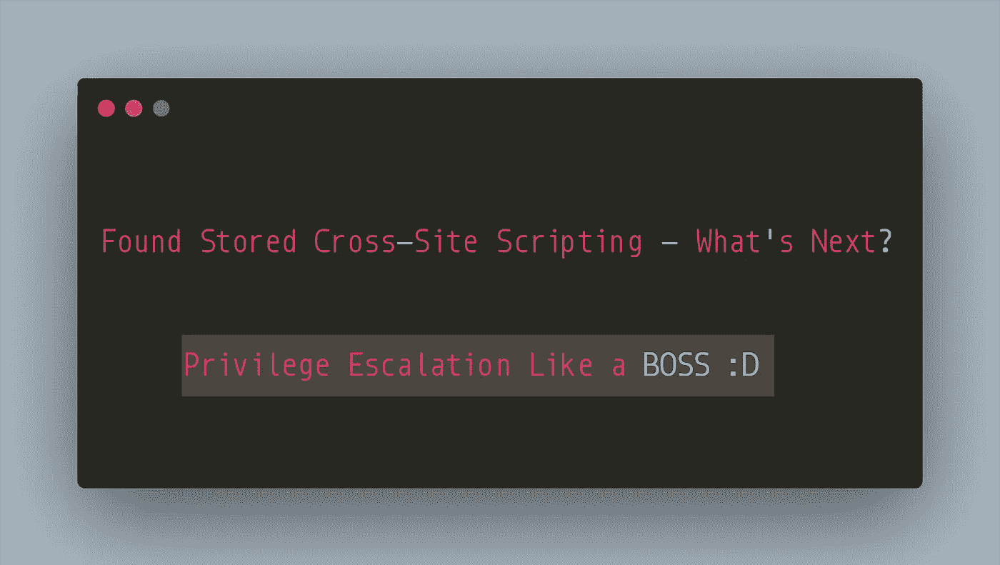

# 找到存储的跨站点脚本—下一步是什么？—像老板:D 一样特权升级

> 原文：<https://infosecwriteups.com/found-stored-cross-site-scripting-whats-next-privilege-escalation-like-a-boss-d-8fb9e606ce60?source=collection_archive---------1----------------------->

跨站点脚本是有史以来最突出的攻击之一。它仍然在野外被开发。跨站点脚本并不总是弹出一个带有一些随机的疯狂字符串或域或 cookies 的警告框。跨站点脚本漏洞可能会与其他易受攻击的问题联系在一起，造成严重影响。人们在他们的报告中写道，这是一个明显的影响**攻击者可以窃取受害用户的会话 cookies】，但这里的问题是有多少人实际上利用了它？通常对于存储的 XSS，优先级是“中到高”，但是如果您真的可以窃取会话 cookies，您可以接管“受害者会话”并做不使严重性为“严重”的事情。**

写这篇文章的目的是解释**跨站脚本的重要性，将它与其他攻击联系起来，并利用低挂果实获得更高的利润。**

你好，黑客和赏金猎人们，在这篇文章中，我将谈论**我是如何用一个简单的存储的跨站点脚本和一些低挂的果实链接来执行权限升级到管理员帐户的。**

# **简单地说，这个故事讲的是-**

*   XSS 和存储的 XSS 快速概览
*   利用跨站点脚本
*   寻找低垂的果实
*   链接漏洞
*   获取管理员的会话 Cookies
*   劫持管理会话和攻击者对管理员的权限提升
*   开始管理的乐趣:D

跨站点脚本(XSS)在野外被利用，甚至在现在。XSS 有多种场景和类型，但为了坚持这篇文章，让我们快速了解一下**存储的 XSS 是什么。**

当应用程序按原样接受用户提供的输入时，允许用户输入**恶意 javascript 代码**，一旦执行，可能会导致严重的问题，如窃取会话 cookies、将用户重定向到攻击者控制的网站等等。在**存储 XSS 的情况下，**JavaScript 代码保留在应用中，并且每当**与代码的交互发生时，执行代码的动作。**

**比如:**假设某社区网站上有一个用户简介。攻击者可以在公开的描述中插入恶意代码。现在，每当普通用户访问攻击者的个人资料时，描述中的代码就会被执行。

最近，我在开发一个与上面功能相同的私人程序，该程序容易受到用户资料描述字段中存储的**跨站脚本的攻击。让我们将应用程序称为“www . target . com”**

应用程序的通常流程是:

1.  管理员用户可以添加多个具有受限角色的用户。
2.  管理员邀请用户加入组织。
3.  被邀请的用户创建一个个人资料，所有用户的信息都可以在“人的目录”下看到。

我从执行存储的 XSS 开始，并通过 Bugcrowd 进行了报告。第二天，当我再次测试该应用程序时，我突然想到，我想实时利用 XSS 来获得更多的乐趣。

现在，我想进一步增加影响，所以我开始寻找一些其他的方法来链接漏洞。XSS 已经是非自我 XSS(自我 XSS 是一个用户必须自己输入代码才能获得执行)。我检查了 cookies 中是否存在**“安全和 httpOnly 标志”。**

设置了这些标志的 cookie 不会从典型的 XSS 执行中检索到，通常，会话 cookie 会将这些标志设置为真。因此，XSS 的影响实际上并不是**通过窃取会话 cookies 来接管会话。**

酷毙了。所以现在我们有一个存储的 XSS 和不安全的饼干。所以我使用了一个简单的 Cookie 抓取器有效负载，它将 Cookie 重定向到一个远程服务器。

到目前为止，我们已经→ **一个完美的会话劫持方法。**

现在，我用管理员帐户登录，并导航到“人民的目录”。我一访问，就在我的远程服务器上获得了“Admin User”的会话 cookies。

此外，我使用会话 Cookies 来访问“Admin”的会话。我转到“用户”，将我的攻击者用户的角色更改为**“管理员”。**

现在，低特权用户拥有作为**管理员的完全访问权限。为了好玩(仅限我的测试账户)，我继续从攻击者的账户中删除了原来的管理员。**

**报告时的初始严重性—高(p2)**

**更新了利用后的严重性—严重(p1) +奖励(用于报告)**

# **外卖**

*   在开始寻找 bug 之前，一定要绘制应用程序的功能图，这有助于系统化。
*   不要一发现错误就兴奋地急于提交，想想有哪些可能的升级。
*   始终检查**不安全的 cookie**并尝试实际显示会话劫持的实时利用。
*   链，链，链&尽可能的链漏洞。
*   写好报告。你可以跟着我写关于 [**的好报道**](https://medium.com/bugbountywriteup/effective-vulnerability-report-writing-quick-triages-to-bonus-always-a-win-41b37188c63f)