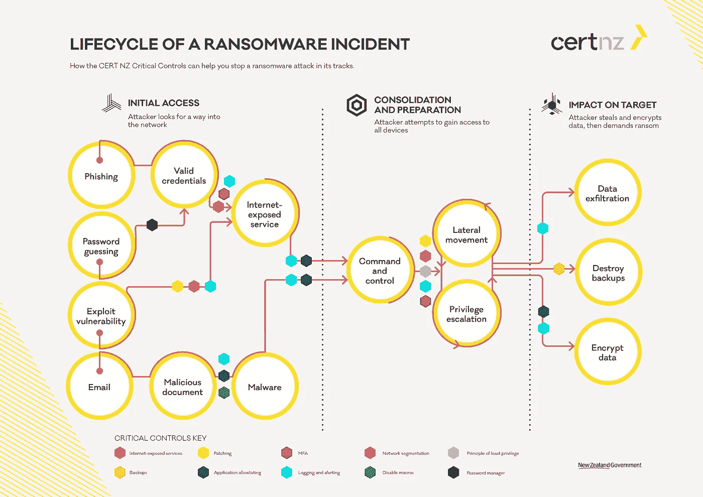

# 应对勒索软件攻击需要采取的四个步骤

> 原文：<https://infosecwriteups.com/four-steps-to-prepare-for-a-ransomware-attack-ab74d98abdaa?source=collection_archive---------2----------------------->

勒索软件攻击的数量每年都在增长。2022 年上半年，事件数量超过 2017 年、2018 年和 2019 年的总和。网络攻击受害者的比例也在增加。2018 年，超过 55%的公司受到影响，2022 年，这一数字已经超过 70%。因此，企业需要提高警惕，针对恶意软件实施强有力的保护。让我们来看看复杂的操作，这些操作将保护您的企业免受网络威胁，并帮助您为勒索软件攻击做好准备。

# 勒索软件的现状

勒索软件经济正在发展，发起恶意软件变得越来越容易。即使是从黑客那里购买程序的非专业人士也可以发起攻击。每年都有新的勒索软件家族出现，这加剧了这种情况。因此，网络安全专业人员需要寻找创新的方法来应对它们。

据 Statista 称，防止勒索软件攻击是 IT 安全部门的[首要任务](https://www.statista.com/statistics/709789/most-pressing-global-cyber-security-issues/)。每 11 秒钟，就有一次入侵安全系统的尝试。损失估计平均为 140 万美元。全球关键基础设施网络安全市场正在扩大，以应对日益增长的挑战。到 2030 年，将达到 242 亿美元。

传统的保护手段无效，网络安全专家正在寻找复杂的保护方法。组织需要采取四个有效步骤来准备应对勒索软件攻击。[产品发现技术](https://andersenlab.com/blueprint/effective-product-discovery-techniques)和网络安全专家可以在集成到企业系统的软件开发项目开始前讨论这些技术。

# 第一步:不要等待勒索软件的攻击，预防它们

IT 专业人员建议从应对攻击的被动方法转向预测方法。这意味着构建第一道防线，自动检测和阻止威胁。为此，专家应该实施端点保护、人工智能监控、下一代防病毒(NGAV)和其他识别恶意行为的机制。

人工智能加强了对端点的多重保护。一种智能算法可以在勒索软件进入系统之前检测到异常的网络活动。人工智能保护工具还对 IT 资产进行盘点，记录所有设备和具有不同访问级别的所有用户。

智能算法发现基础设施中的漏洞。因此，网络安全专家可以在薄弱环节加强保护。AI 在这方面是独一无二的:随着恶意软件的发展，智能算法独立学习新的战术来检测这种威胁。该技术通过浏览关于网络威胁的文章、新闻和研究来选择数据，并逐步改进。

# 步骤 2:使用网络攻击的多阶段可视化

勒索软件攻击通常同时针对多个用户、平台和设备。公司使用不同的工具来保护他们的资产:例如，用于终端保护的 EDR，用于云的 BitGlass，用于数据保护的 AVG Internet Security，等等。这种方法导致网络安全专业人员在没有看到设备、应用程序或员工的全貌和联系的情况下，对孤立事件做出响应。

IT 专业人员会收到大量不相关的事件通知，他们需要时间将这些事件联系起来，并确定它们是同一攻击的一部分。详细的搜索需要分析工作和时间。对小的攻击点作出反应只会减慢它的速度，但不会完全阻止它。在建立因果关系之前，事件不会停止。

因此，网络安全专业人员必须快速检测和响应一连串的恶意交易。在这种情况下，黑客将没有时间来调整攻击的战术，无法实现最终目标。

为了直观显示所有设备上的攻击进度，IT 安全团队会确定其原因，并实时识别每个受影响的端点。在受到攻击时收集和处理事件数据。员工立即采取保护措施，黑客无法乘虚而入。

# 步骤 3:自动检测勒索软件攻击

威胁警告的数量正在急剧增加。IT Security Wire 计算出每个 SOC 代理[必须检查](https://itsecuritywire.com/cybersecurity/cyber-security-professionals-are-not-able-to-keep-up-with-breach-alerts/)超过十个安全漏洞报告。而且，每条都是 10 分钟左右，有一半是假的。这种情况下你该怎么办？雇佣更多的网络安全专业人员？或者禁用某些警报功能？

更实用的解决方案是自动执行检测威胁和处理系统警报的过程，让专家有更多时间来提高组织的安全性。AI、ML 等技术可以在不增加人员的情况下加强 IT 安全团队。随着勒索软件攻击的不断增加，它们将有助于实现安全可扩展性。

AI 快速检测异常系统行为，阻止威胁，“过滤”错误警报，并仅向分析师提供严重事件以供审查。通过使用智能助手，公司可以更快地做出响应，并抑制 SOC 代理因工作负载而流失。

# 步骤 4:将前面的方法合并为一个，并使用 XDR

为了确保更有效的保护，您可以将上述方法结合到一个扩展检测和响应平台(XDR)中。

XDR 涵盖终端、应用、用户、数据中心和云安全。这样的平台利用人工智能和人工智能的力量来追踪一连串的攻击。它有助于确定它起源于何处，如何发展，以及它影响了哪些资产/用户。该系统提供了应对事故的方法，以最小的损失消除事故。

XDR 方法很好，因为:

*   它自动分析威胁警报，并为 COS 代理提供经过处理的分析，包括上下文和已建立的关系；
*   提供组织的 IT 基础架构的统一视图；
*   过滤虚假的威胁通知；
*   允许 IT 专业人员完全阻止攻击，而不是“冻结”其单独的元素；
*   自动响应网络事件；
*   帮助企业为勒索软件攻击做好准备。

非标准勒索软件需要非标准的处理方式。XDR 只是提供了一种多层方法，以便网络安全专家可以实时分析所有数据。这种斗争的方法可以防止以前看不到的可执行文件和双重勒索。

# 结论

上面提到的技术方法只是工具。为了使它们正常工作，您需要一个称职的专家来配置它们并对事件做出响应。同样，这些方法在人为因素面前是无能为力的。在 54%的案例中，勒索病毒感染[通过网络钓鱼电子邮件发生](https://www.statista.com/statistics/700965/leading-cause-of-ransomware-infection/)。因此，继续培训你的员工，不断警告他们可疑的电子邮件，并为在公司网络中工作提供一个 VPN。

你应该保持数字卫生。它包括更新操作系统、软件版本以及白名单和黑名单。传统和创新措施将共同加强您组织的企业保护，并帮助您做好应对勒索软件攻击的准备。没有完美的保护方法。但是你可以使用让你更接近它的解决方案。

## 来自 Infosec 的报道:Infosec 每天都有很多内容，很难跟上。[加入我们的每周简讯](https://weekly.infosecwriteups.com/)以 5 篇文章、4 个线程、3 个视频、2 个 GitHub Repos 和工具以及 1 个工作提醒的形式免费获取所有最新的 Infosec 趋势！