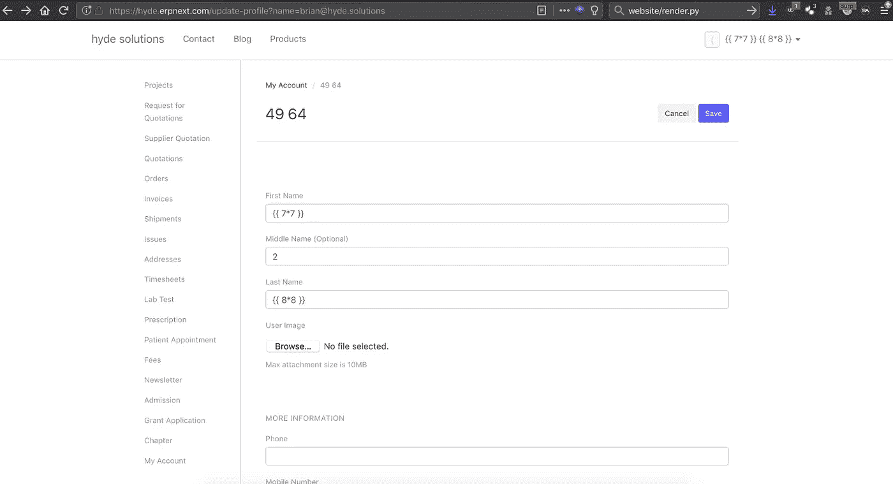
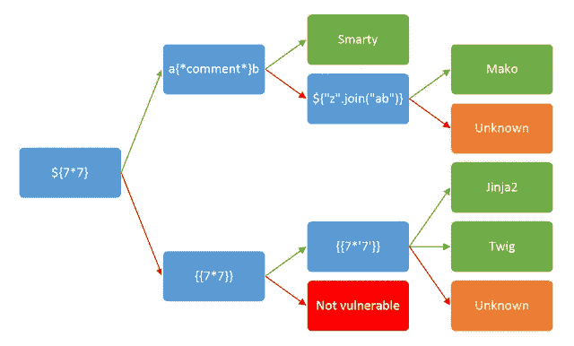
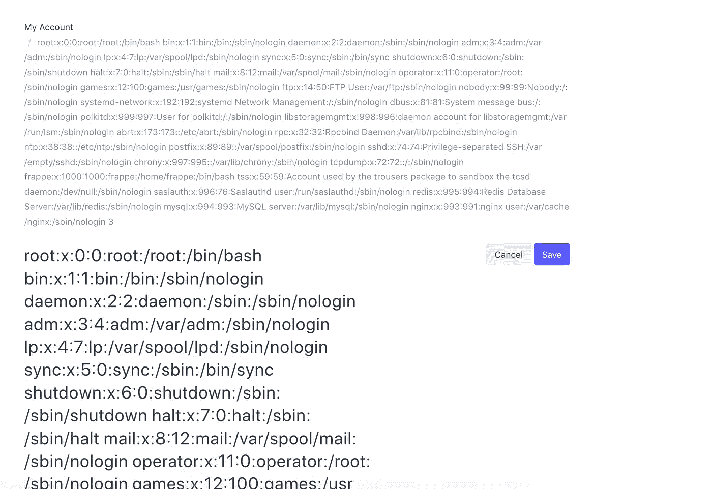
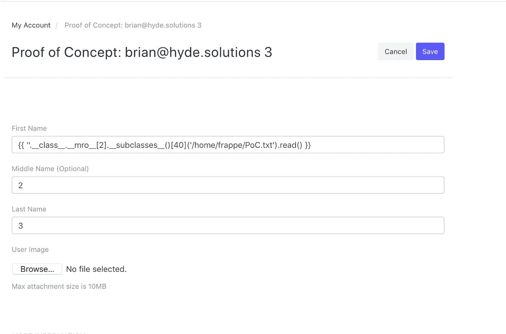
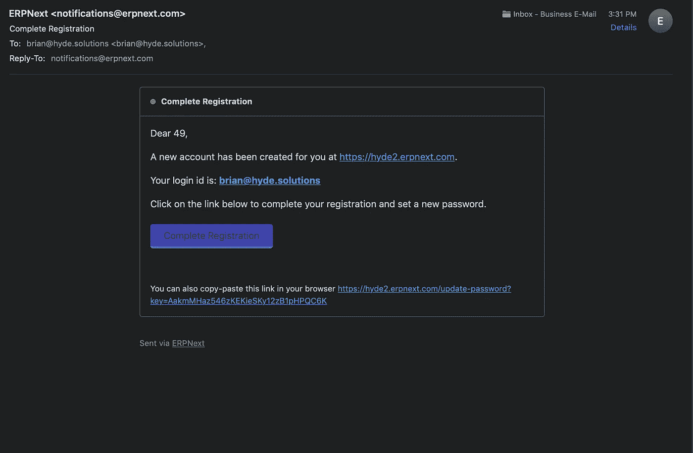
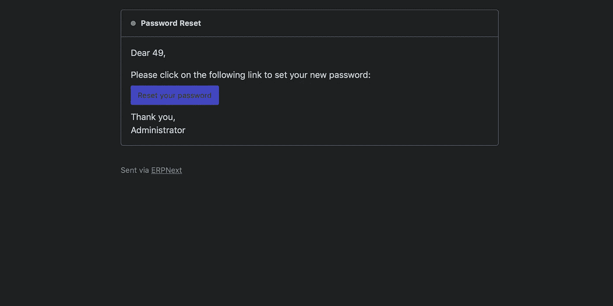

# Frappé Technologies ERPNext 服务器端模板注入

> 原文：<https://infosecwriteups.com/frapp%C3%A9-technologies-erpnext-server-side-template-injection-74e1c95ec872?source=collection_archive---------0----------------------->

几个月前，我特别专注于研究电子病历 web 应用程序中出现的漏洞。在我的研究过程中，我发现了 ERPNext，这是一款由 Frappé Technologies Pvt. Ltd .开发的企业资源规划软件，它提供医疗保健模块和漏洞披露程序，因此我决定研究一下 ERPNext，并审核他们产品的免费试用版。没过多久，我就在 web 应用程序用户配置文件页面中发现了一个服务器端模板注入漏洞。



服务器端模板注入概念验证

正如你在上面的照片中看到的，名`{{7*7}}`和姓`{{8*8}}`字段在上面被渲染为`49`和`64`。这非常清楚地表明存在模板注入漏洞。我使用了下面的图片，它是在 https://portswigger.net/blog/server-side-template-injection 的 Portswigger 博客上找到的，作者是 James Kettle，我用它来标识被用作 Jinja2 的模板引擎。



模板引擎识别流程图

然后，我将名字字段设置为:

```
{{ ''.__class__.__mro__[2].__subclasses__()[40]('/etc/passwd').read() }}
```

刷新页面后，我看到了下面的页面，这表明我在运行 web 应用程序的服务器上具有读取功能。



成功读取任意文件

接下来，我将我的名字设置为:

```
{{ ''.__class__.__mro__[2].__subclasses__()[40]('/home/frappe/PoC.txt', 'w').write(' Proof of Concept: [brian@hyde.solutions](mailto:brian@hyde.solutions)') }}
```

刷新页面，然后将我的名字设置为:

```
{{ ''.__class__.__mro__[2].__subclasses__()[40]('/home/frappe/PoC.txt').read() }}
```

又刷新了一次，出现了以下消息，表明我也能够在文件系统上成功地写入文件。



读+写概念证明成功

我也能够读取他们的 SSH RSA 私钥，但是我不会张贴那张图片，因为我不认为 Frappé的人会喜欢那样。总之，这是一个非常严重的安全缺陷。我向 Frappé报告了这个漏洞，他们很快推出了一个补丁，似乎部分解决了这个问题。从本质上讲，他们试图修补这个问题只是将任何包含字符串`.__`的名字列入黑名单，而不是呈现模板。然而，其他任何东西，比如`{{ 7*7 }}`，仍然会被渲染为`49`。在阅读了 Frappé的一些文档并在 Github 上查看了 ERPNext 的一些源代码后，我发现通过提交以下模板语法作为我的名字或姓氏，我甚至可以泄漏更敏感的信息:

```
{{ frappe.local.conf }}
```

刷新页面后，将显示以下信息:


成功的 Frappe 本地配置泄漏

然后我第二次报告了这个问题，看起来他们推出的补丁比之前的好得多。ERPNext 的开发人员非常感谢我的审计和报告，并因此奖励了我 1250 美元。我想指出的是，Frappé的漏洞披露计划并没有正式提供奖励。但是，他们会给予认可，并为您发现并负责任地向他们披露的任何漏洞分配一个 CVE。

除了上面列出的 SSTI，我还在下面的电子邮件回复中发现了多个 XSS 漏洞、一个 SQL 注入漏洞和另一个 SSTI:



SSTI 概念验证



SSTI 概念验证

总之，如果你想为一个开源软件基金会做贡献，或者找一个好的目标来获得一些实践，并且 CVE 被分配到你的发现中，请查看由 Frappé Technologies Pvt. Ltd .提供的 ERPNext

 [## 报告安全漏洞

### 您有责任遵守所有适用的法律，并且只能使用或以其他方式访问您自己的测试…

erpnext.com](https://erpnext.com/report)  [## Frappe 安全通报

### 此安全公告包含有关影响 Frappe 的漏洞的详细信息。

弗拉佩. io](https://frappe.io/security)