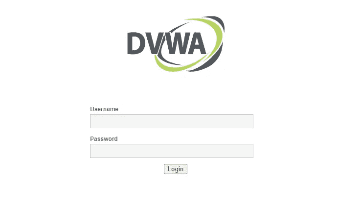
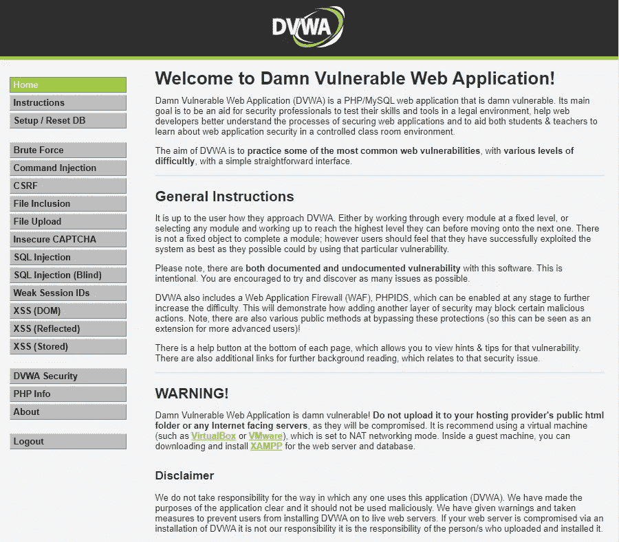
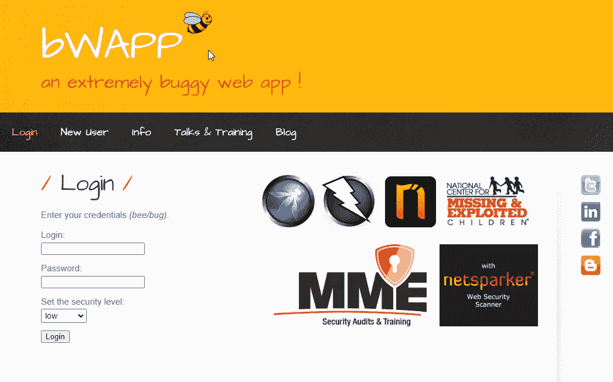
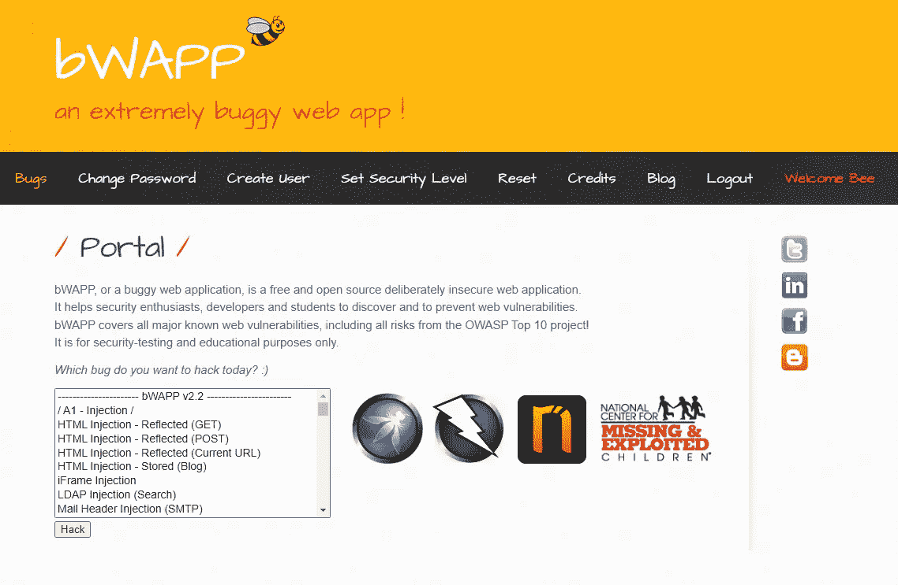

# DVWA 和 bWAPP 的免费云(基于浏览器)实验室

> 原文：<https://infosecwriteups.com/free-cloud-browser-based-labs-of-dvwa-and-bwapp-bc1dd42a8de?source=collection_archive---------4----------------------->

Pentester Academy 实验室完全基于浏览器，是私有的，包括对基于终端/GUI 的 Kali、Ubuntu 或其他操作系统的访问，并预安装了必要的工具和脚本。你不需要任何其他软件来开始。

**图片来源:DVWA**

# DVWA

该死的易受攻击的 Web 应用程序(DVWA)是一个 PHP/MySQL web 应用程序，非常容易受到攻击。它的主要目标是帮助安全专业人员在法律环境中测试他们的技能和工具，帮助 web 开发人员更好地理解保护 web 应用程序的过程，并帮助学生和教师在受控的课堂环境中学习 web 应用程序安全性。

DVWA 的目的是用一个简单直接的界面来练习一些最常见的 web 漏洞，具有不同的难度级别。它在 [GPLv3](https://www.gnu.org/licenses/gpl-3.0.html) 下获得许可。

您可以在本地下载 DVWA 并将其安装在虚拟机上。Pentester 学院提供了一个在线版本，为您节省时间和痛苦。

一组示例漏洞包括:

*   跨站点脚本(DOM/反射/存储)
*   命令注入
*   CSRF
*   蛮力
*   弱会话 id
*   SQL 注入(盲)
*   文件包含/上传
*   不安全的验证码

以下用户名和密码可用于浏览应用程序:

*   用户:管理员密码:密码

签到链接:【https://attackdefense.pentesteracademy.com/】T4
实验室链接:[https://attack defense . pentesteacademy . com/challenge details？cid=34](https://attackdefense.pentesteracademy.com/challengedetails?cid=34)

**图片来源:bWAPP**

# bWAPP

[bWAPP](http://www.itsecgames.com/) ，或者说是一个漏洞百出的 web 应用，是一个免费开源的故意不安全的 web 应用。
它帮助安全爱好者、开发人员和学生发现并防止网络漏洞。
bWAPP 准备成功开展渗透测试和道德黑客项目。

bWAPP 是一个使用 MySQL 数据库的 PHP 应用程序。它可以托管在带有 Apache/IIS 和 MySQL 的 Linux/Windows 上。它也可以安装在 WAMP 或 XAMPP。
另一种可能是下载 bee-box，一个预装 bWAPP 的定制 Linux VM。

是什么让 bWAPP 如此独特？嗯，它有超过 [**100 个网络漏洞**](http://www.itsecgames.com/downloads/vulnerabilities.txt) ！它涵盖了所有已知的主要网络漏洞，包括 OWASP 十大项目的所有风险。

您可以在本地下载 bWAPP 并将其安装在虚拟机上。Pentester 学院提供了一个在线版本，为您节省时间和痛苦。

一组示例漏洞包括:

*   任意文件访问
*   SQL 注入
*   代码注入
*   跨站点脚本
*   跨站点请求伪造
*   心脏出血
*   弹震症

还有很多。

以下用户名和密码可用于浏览应用程序:

*   用户:蜜蜂密码:bug

签到链接:[https://attackdefense.pentesteracademy.com/](https://attackdefense.pentesteracademy.com/)
实验室链接:[https://attack defense . pentesteacademy . com/challenge details？cid=33](https://attackdefense.pentesteracademy.com/challengedetails?cid=33)

感谢你们阅读这篇文章！！

如果你喜欢这篇文章，别忘了给我鼓掌👏

**资源:**pentesteracademy.com/attackdefense.pentesteracademy.com

**支持我:**如果你喜欢支持我，请我喝杯 [**咖啡**](https://www.buymeacoffee.com/satyakayala) ☕

**关注我:** [萨提亚·普拉卡什](https://medium.com/u/8f987881b66a?source=post_page-----bc1dd42a8de--------------------------------) | [领英](https://www.linkedin.com/in/0xkayala/) | [推特](https://twitter.com/0xKayala)