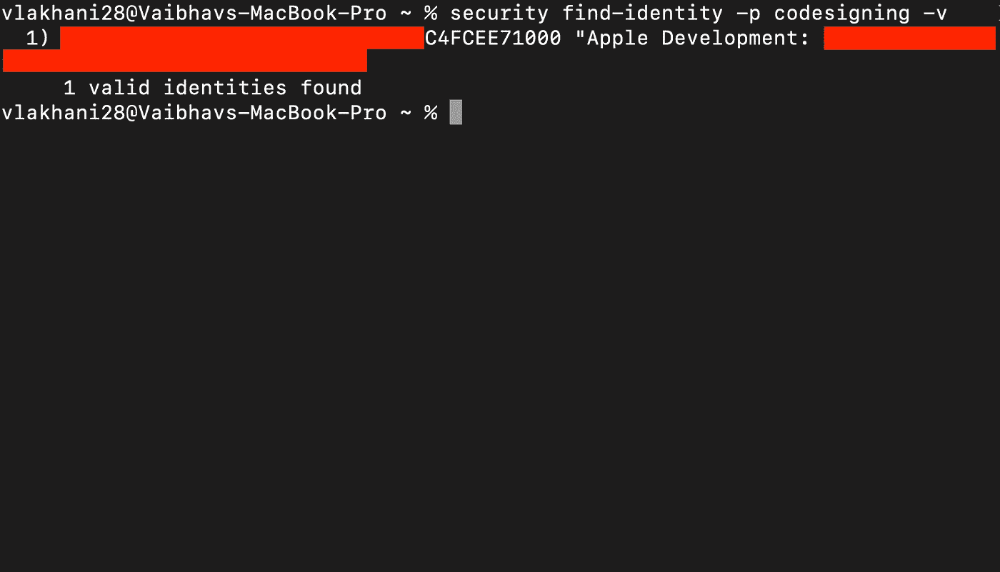
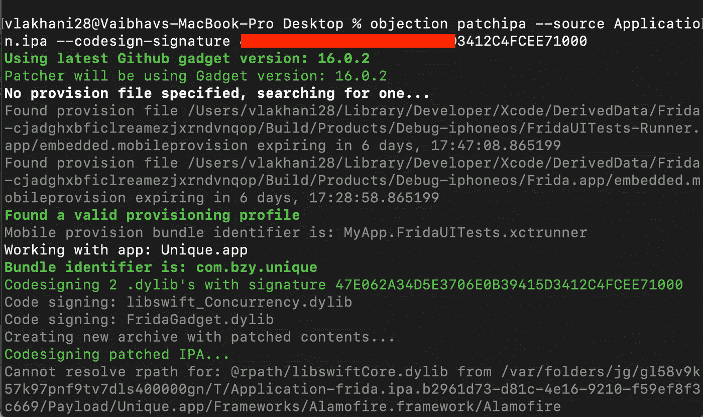
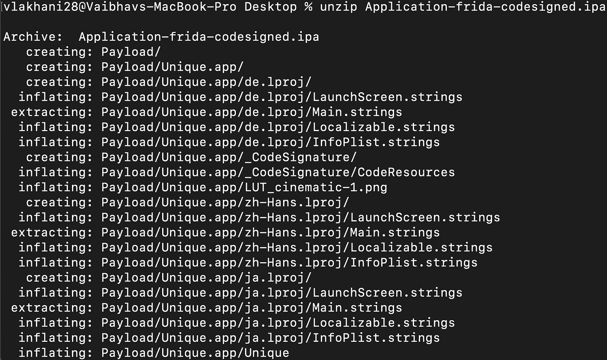
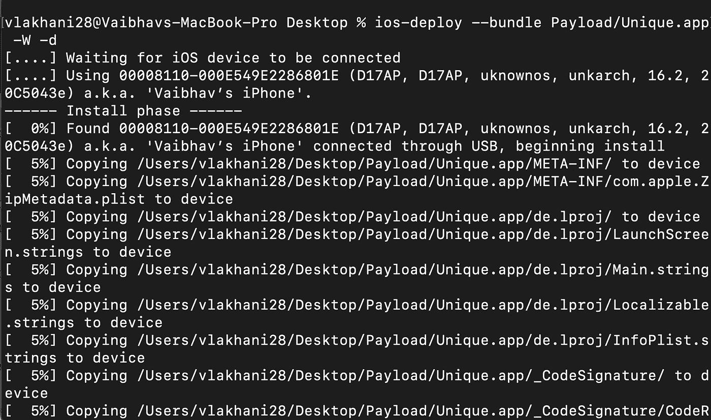
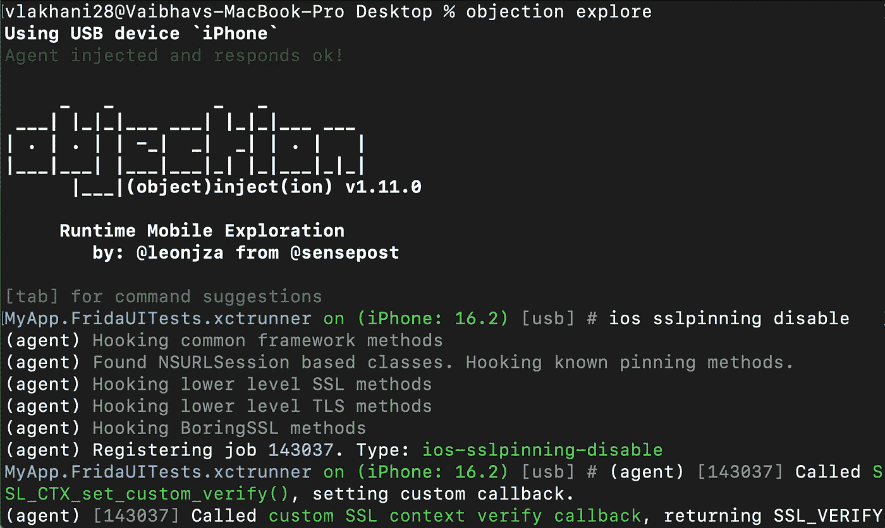

# 弗里达&反对不越狱！🔥🔥

> 原文：<https://infosecwriteups.com/frida-objection-without-jailbreak-27a66501bf38?source=collection_archive---------0----------------------->

所以如果越狱检测没有被绕过你就是那个停止安全测试的人吗？？别担心，我们会掩护你的！一种在不越狱设备的情况下实现和运行 Frida 服务器的方法。最精彩的部分？在最新的 iOS 16.2 版本上测试；)就这样吧！

好吧！先决条件，所有你需要的是

1.  Mac 或者 Mac 的虚拟机镜像(这里有一个简单的指南[https://www.wikihow.com/Install-macOS-on-a-Windows-PC](https://www.wikihow.com/Install-macOS-on-a-Windows-PC)
2.  预置描述文件(苹果开发者账户):你可以在 https://developer.apple.com/[非常容易地创建一个](https://developer.apple.com/)
3.  XCode。

第一步:你需要一个未加密版本的 IPA 文件，要么由客户端提供，要么由 Bug Bounty 程序提供，或者你可以使用诸如[离合器](https://github.com/KJCracks/Clutch)或 [bfinject](https://github.com/BishopFox/bfinject) 之类的工具解密。另一种方法是从第三方网站下载应用程序，如 [Iphonecake](https://www.iphonecake.com/) 。

对于这个例子，我将从 iphonecake.com 下载一个随机的应用程序

步骤 2:使用命令查找有效的安全标识，以便对 IPA 文件进行代码签名。可以参考这篇[文章](https://ioscodesigning.com/generating-code-signing-files/)生成代码签名。

> 安全查找-身份-p 代码签名-v

步骤 3:使用 objection 在 IPA 中修补和注入 Frida 服务器

> 异议 patchipa 源应用程序。IPA-共同签名-签名

注意:如果缺少一些依赖项，请添加它们。如果构建失败，将显示添加它们的方法。

这一步将在名为 Application-frida-signed.ipa 的当前文件夹中构建一个新的签名代码

步骤 4:使用命令解压缩新创建的 IPA

> 解压缩 Application-frida-signed.ipa

将创建一个名为 Payload 的新文件夹。

第五步:将打好补丁的 IPA 安装到 IOS 设备上。确保您的 IOS 设备已连接到 Mac，并点击“信任”按钮！您可以使用以下命令来完成此操作。

> IOs-deploy-bundle Payload/some appname . app-W-d

如果没有找到 ios-deploy，您可以使用以下命令安装它:

> sudo NPM install-g IOs-deploy-unsafe-perm = true-allow-root

这将在您的 IOS 设备上安装该应用程序，并以暂停模式启动该应用程序。

要在恢复模式下启用和运行应用程序，最后一步是运行异议。

步骤 6:保持终端命令运行，并使用以下命令在新终端上运行 objection

> 异议探究

这将允许您绕过 SSL 锁定，在非越狱的 iOS 设备上运行 Frida。现在，您所要做的就是连接您的 Burp 套件，捕获请求并破解它！！！

我们希望你喜欢这篇文章，这将有助于你的 iOS 测试之旅！敬请关注 iOS Pentesting 上的更多此类博客！

狩猎愉快！

**作者:**

瓦伊巴夫·拉哈尼:【https://www.linkedin.com/in/vaibhav-lakhani】T4

[迪尔·帕尔马](https://www.linkedin.com/in/dhir-parmar-925b171a4):[https://www.linkedin.com/in/dhir-parmar-925b171a4](https://www.linkedin.com/in/dhir-parmar-925b171a4)

[302 发现:](https://linkedin.com/company/302Found)https://linkedin.com/company/302Found

## 来自 Infosec 的报道:Infosec 每天都有很多内容，很难跟上。[加入我们的每周简讯](https://weekly.infosecwriteups.com/)以 5 篇文章、4 个线程、3 个视频、2 个 GitHub Repos 和工具以及 1 个工作提醒的形式免费获取所有最新的 Infosec 趋势！