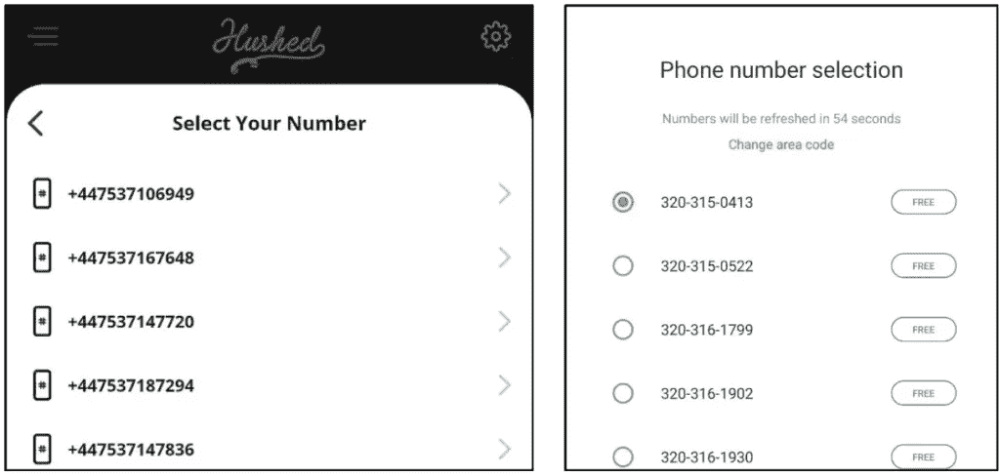
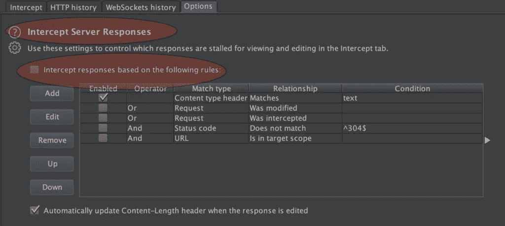
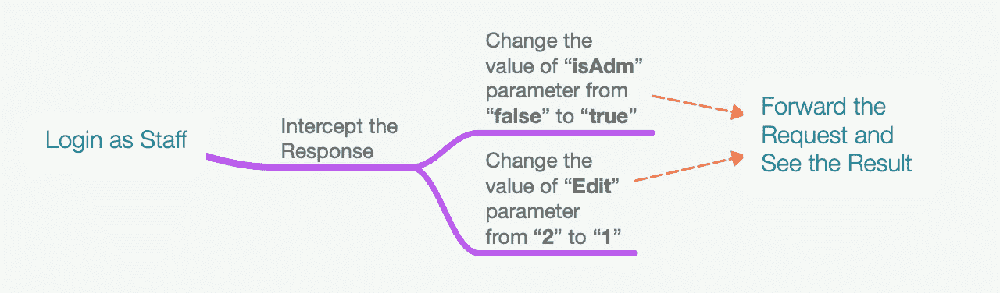
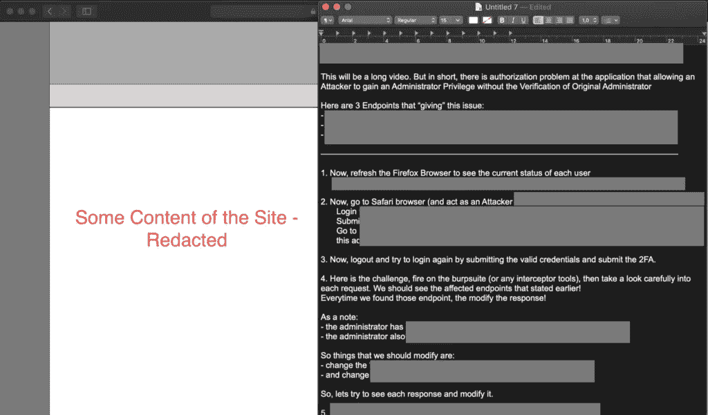

# 从 3.99 美元到 1，650 美元(第一部分)—通过更改 HTTP 响应进行简单的垂直权限提升

> 原文：<https://infosecwriteups.com/from-3-99-to-1-650-usd-part-i-simple-vertical-privilege-escalation-by-changing-http-response-2fd8ebb7f67b?source=collection_archive---------0----------------------->

## 一个关于我如何通过使用高级电话号码在一个目标(只允许特定国家代码注册)上得到几个简单错误(1 个 P2，1 个 P3 和 2 个 P4s)的故事。

بسم الله الرحمن الرحيم

```
Mirroring from: [http://www.firstsight.me/2020/06/from-399-to-1650-usd-part-i-simple-vertical-privilege-escalation-by-changing-http-response/](http://www.firstsight.me/2020/06/from-399-to-1650-usd-part-i-simple-vertical-privilege-escalation-by-changing-http-response/)
```

像往常一样，我将尝试用两种不同的方法发布这篇文章，它们是:

*   对于那些只需要这一发现的要点的人(通常，如果读者已经理解了每一个流程，这可以节省大量的时间)，请查看 TL；DR 部分，以及
*   对于那些需要了解这一发现的执行流程或过程的人。总之，它可以告诉读者一些心态，并希望能帮助人们丰富自己的见解。

请欣赏这个故事。

# I. TL 速度三角形定位法(dead reckoning)

以下是关于这个问题的简单 7 点:

*   Target 只允许人们用某些国家代码电话号码注册他们的帐户。
*   使用可以生成虚拟电话号码的应用程序来接收电话或短信。由于我需要两个不同的账户和不同的电话号码，所以我使用了 [2ndline(有几个条件的免费获取号码)](https://www.2ndline.co/)和 [Hushed(应该付费获取号码)。](https://hushed.com/)
*   在同一个实体上创建两个账户，分别作为“**管理员**和“**职员**”。
*   登录到应用程序，尝试搜索常见的参数，如" **isAdm** "、" **isAdmin** "、" **isAdministrator** "或类似的参数(" Adm "可以是" Root ")。
*   使用**职员**账号登录时，将 **isAdm** 参数的值由**假**改为**真**。并将“**编辑**”参数的值从某个数字更改为“ **1** ”(这将提供编辑可用设置/配置的能力)。
*   成功将"**人员的**账号升级为"**管理员的**权限。
*   几个星期后(由于一些问题，与项目负责人进行了激烈的讨论后)，Alhamdulillah 最终被标记为 P2，并获得了 1000 美元的奖励。


图 1 该 Bug 被标记为 P2

# 二。旅程

我不记得我是什么时候收到这个邀请的，但是我相信这个项目已经在我的“私人主页”上呆了大约一年了。(请不要问节目名称，我不回答)。

有一天，我决定查看我仪表板中的每个私人程序，看看“漏洞奖励”的数量。**请注意**，没有证据/明确的原因说明这一点，但有时，我更愿意接受低数量的“漏洞奖励”，尽管实际上有几种情况会导致这种情况发生，例如:

*   目标很难实现，
*   目前还没有用户对这个程序感兴趣(奖金范围，伦理上的异议，等等)。),
*   这个项目邀请的不是很多研究人员，而是被邀请的研究人员有很多项目要处理，或者
*   研究人员仍然专注于特定的程序(是的，有时我们从基础开始学习目标并不容易)->除非你想专注于特定功能上的特定类型的漏洞。所以换目标不是太难。

原因可能各不相同，但如前所述，有时我对低数量的奖励报告感到更舒服，尽管不是每个人都同意这一点。花了一点时间，终于来了这个节目(100 报道以下)。

## 2.1.注册我们的帐户

当测试目标时，最好有一些帐户，这样我们可以对目标本身有一个更广泛的看法(不是强制性的，但是有也不错)。通过登录，我们也有机会看到其中的许多功能，这些功能可能会对其他用户或应用程序所有者造成风险。简而言之，这种情况会使测试人员有更多的“游戏场”来发现潜在的风险。

回到主题。第一次看到有一个功能可以让我们免费注册账号的时候，非常开心。但当我发现需要一个带有特定国家代码的电话号码并需要我们验证它时，这种快乐立即被延迟了。

我从未想过，在我开始测试之前，挑战就已经开始了。所以，下面是我注册账户时做的一些事情:

*   我尝试了几个旁路，以确定我是否可以用自己的电话号码注册，但它没有给出好的结果(阅读:失败)。
*   我还尝试使用一些免费的公共短信接收器，是的(你可能会猜到)，电话号码已经在使用中。
*   最后，我试着用那些公共电话号码重设密码，但被目标屏蔽了。我想，许多人试图通过重置密码来使用它。

## 2.1.1.虚拟电话号码服务的使用

几乎绝望，因为我也没有住在那里的同事可以寻求帮助，但 Alhamdulillah，最后我想起了一个喜欢使用海外 WhatsApp 号码的同事，尽管他住在印度尼西亚。

从那里，我试图找到可能帮助我做到这一点的应用程序(可以为我们提供一个具有特定国家代码的唯一电话号码)，我很高兴，我找到了可以用来注册我的第一个帐户的[第二个在线应用程序](https://www.2ndline.co/)(有几个条件的免费)，以及用于注册我的第二个帐户的[静默应用程序](https://hushed.com/)(高级应用程序)。



图 2 左侧(静音—高级)—右侧(第二行—免费)

**备注:**

*   我不打算推广该应用程序。我只说我从谷歌搜索得到的和我用的。
*   让我们跳过注册过程，使这部分更简单(因为我想解释的一点是，我们如何从海外获得虚拟电话号码)。

因此，通过使用这两个应用程序，我成功地在同一个实体上注册了两个帐户。其中一人注册为“管理员”，另一人注册为“职员”。

一个使用 2ndLine 应用程序的帐户(免费获得几个条件下的虚拟电话号码)和另一个使用静默应用程序的帐户(这使我应该为一周的访问支付 3.99 美元)。通过这种有限的访问，我应该优化测试。

## 2.2.测试！

## 2.2.1.我有两个不同类型的账户，我该怎么办？

基本上，当我们可以访问应用程序时(阅读:登录)，可以做的事情很少。但我个人喜欢先测试逻辑的东西。在这种情况下，权限提升(横向或纵向)。

那么，现在我有两个不同类型的帐户，我应该如何处理权限提升问题？

*   将用户 id 从一个帐户更改为另一个帐户(在 POST / GET / any HTTP 方法上)；
*   当应用程序提供 POST 方法并且改变用户 ID 不起作用时，那么尝试将请求从 GET 改为 POST。反之亦然；
*   尝试直接从“低级”帐户访问受保护的 URL(例如，管理员拥有[https://target/protect-URL](https://target/protect-url)，然后尝试在“低级”帐户中访问此受保护的 URL)；
*   尝试查看和分析会话是如何创建的(创建的会话是否可预测)；
*   还有很多可以尝试的东西。我建议读者去看看 [Pentester Land](https://pentester.land/list-of-bug-bounty-writeups.html) portal。他们收集了大量惊人的资源。

那么，我终于找到了吗？是的，但是在这种情况下，权限提升是通过更改 HTTP 响应中的几个参数来实现的。

## 2.2.2.分析 HTTP 响应

*通过 HTTP 响应中的参数变化来执行权限提升，我们应该看到哪些东西？*基本方法是在登录后查看应用程序的响应。如果您得到一些带有公共参数的响应，比如:“isAdm”、“isAdmin”、“isAdministrator”或类似的东西(“Adm”可以是“Root”)，那么尝试将值从一种状态更改为另一种状态。

**请注意**，burpsuite(我相信其他类似的工具)有一个拦截服务器响应的功能。这将使我们能够在将值直接发送给客户端之前对其进行更改。



图 3 burp suite 上的拦截服务器响应特性

因此，在这个目标上，我在 HTTP 响应中发现了“isAdm”参数(在 1 个请求的 3 个不同端点上),这引起了我的注意。从这里，我直接尝试了解当我使用两种不同类型的帐户(即“管理员”和“职员”)登录时，该参数发生的变化。

结果是:我发现当我们用管理员帐户登录时，“isAdm”参数的值是否会被设置为“**真**，而当我们用“职员”帐户登录时，是否会被设置为“**假**”。

因此，当使用“staff”帐户登录时，我立即将“isAdm”参数的值从“false”更改为“true”(在这 3 个不同的端点上)，希望这个帐户拥有管理员权限。

有用吗？**好难过，没有**

从这次执行开始，我的“职员”帐户状态已经完全从“职员”变成了“管理员”。但是，此帐户不能修改通常可以由管理员帐户修改的任何内容。这就像我们拥有最高特权帐户，而它没有任何特权。报告这个听起来很糟糕— *有一个不能做管理工作的管理员标签会有什么影响？*

## 2.2.3.赋予更改权限的参数

因为那些帐户不能改变任何东西，那么应用程序中一定有什么东西给予访问权限来进行改变。从这里，我再次回到分析 HTTP 响应并找到了“Edit”参数。

就像前面的活动一样，我试图比较“管理员”和“职员”帐户上的“编辑”参数的值。最终我看到了不同之处。在管理员帐户中，“编辑”参数的值将被设置为“ **1** ”。但是在 staff 帐户中，该值将被设置为“ **2** ”。因此，我假设这个参数“阻止”我的员工帐户更改设置/配置，即使它已经有一个“管理员”标签。

从这个假设出发，我立即重新执行这个过程。如果在前面的活动中，我只更改了“isAdm”参数的值，那么在本例中，我尝试修改“isAdm”和“Edit”参数。

这是我执行的流程:

*   使用员工帐户登录。在 HTTP 响应中，我们发现“isAdm”参数的值为“ **false** ”，而“Edit”参数的值为“ **2** ”。
*   将“isAdm”参数的两个值都更改为“ **true** ，并将“编辑”参数的值都更改为“ **1** ”。
*   转发请求**最后，我们的“staff”帐户拥有管理员权限**。
*   **为确保此更改真正生效**，请尝试使用该帐户登录另一个浏览器，并尝试更改一些只能由管理员更改的设置/配置。如果成功，那么权限提升已经成功执行。



图 4 执行流程

在确保一切正常后，我试着从头开始记录活动。

**请注意**，记录你的截取者在你的录音上做的事情是非常重要的。有时，如果您真的可以重现您所陈述的行为问题，那么这个日志确实需要作为证据。

大约过了 17 天，他们终于把这个问题标为 P2。这个问题在大约一个月后得到了解决。


图 5 该 Bug 被标记为 P2

# 三。吸取的教训

在这一节中，我想简单回顾一下，让读者更容易理解这段简单旅程中的一些教训:

*   有时候，我们需要更多的努力去寻找错误。在许多情况下，我看到人们也试图购买目标提供的优质服务(我不这样做)，以看到一些在正常账户上看不到的东西。就我而言，我试着花了大约 3.99 美元来创建另一个账户(因为我需要另一个电话号码)。

在某些情况下，Alhamdulillah，它给出了一个好结果(他们发现了一个 bug，就像我也发现了一样)，但在其他情况下，它也没有给出任何好结果。

是的，正如我在上一篇文章(关于“[从侦察到优化 RCE 结果](http://www.firstsight.me/2020/02/from-recon-to-optimizing-rce-results-simple-story-with-one-of-the-biggest-ict-company-in-the-world/)”)中所说的，*我们购买优质服务(直接或间接)的努力并不能保证会有好的结果。* ***但是，这就是测试/狩猎的重点吧？*** *这不是“设计易受攻击”的比赛，这是我们没有测试过就不能确定的事情。*

如果你问我的建议，我更喜欢尝试先在目标上找到 bug 来获得赏金。当我从目标那里得到一笔赏金时，我会用一点赏金来购买高级服务(直接或间接)，只要价格对我来说合理。3.99 美元在当时是合理的。

但如果你能不花钱就得到超值服务(比如节目主给你的)，那就不错了。

*   当第一次更改不起作用时(就像我刚刚更改“isAdm”参数的值一样)，然后尝试寻找其他可能使我们能够使它起作用的参数。
*   始终确保我们所做的改变是否真的有效。简单的方法就是尝试使用我们修改过的帐户登录另一个浏览器，并尝试更改一些只能由管理员更改的设置/配置。如果成功，那么权限提升已经成功执行。
*   始终使用详细的 PoC 视频记录您的活动(可以从这些视频中截取屏幕截图)。这将有助于 triager /程序所有者重现该问题。在其他情况下，当您试图在您测试的版本中重现时，它也有助于证明是否存在 bug。Bugcrowd 的一位分析师为此给出了一个很好的建议:

*“…做一个视频 poc，或者截图证明漏洞存在。当你把事实摆在桌面上时，程序所有者和分析师都不能否认这一点。”* —蒂米— [摘自他的一条公开推文](https://twitter.com/sh_timmy/status/1246854247435689985)。

因此，不要忘记始终保留拦截器活动(日志)作为成功利用的证据(至少在做出决定之前—阅读:奖励)。并确保拦截者的时间与您在 PoC 视频中显示的时间相同。总之，当你遇到问题时，Bugcrowd 团队“会帮助你把事实摆在桌面上”。

*   如果读者想知道我的概念验证视频怎么样，我的概念验证视频就像是这份报告的摘要。我一步一步地记下了笔记，希望这样可以更容易地重现这个问题。



图 6 我的概念验证视频截图

是的，把它弄成那样很累。但是请相信我，这样可以节省我们以后解释错误细节的时间。

好了，最后我的简单文章到此结束。下次见，英沙拉。

# 四。信用

每一个 bug 猎人和/或研究人员都发表了他们的努力工作(在 tweets 或文章或任何东西中),所以我们得到了很多参考来对目标进行测试。