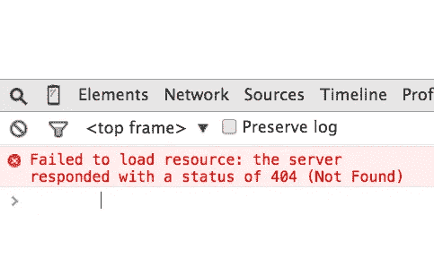
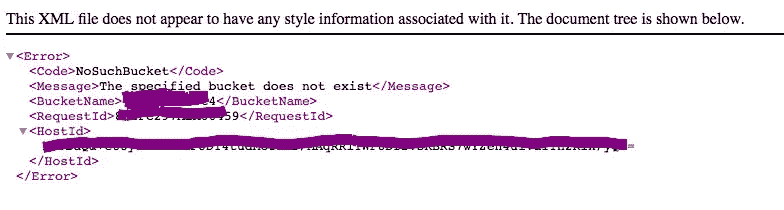
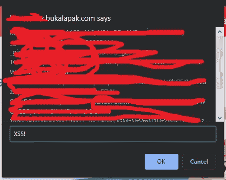

# 如何检查元素导致在 Bukalapak 的网站上存储 XSS

> 原文：<https://infosecwriteups.com/from-broken-link-to-sub-folder-takeover-on-bukalapak-3aa985e622c4?source=collection_archive---------0----------------------->

*Tl；dr:我在 Bukalapak 网站上发现了一个独特的高严重性错误配置，通过只检查他们页面上的 HTML 元素，导致存储 XSS。*

Assalamualaikum Wr。Wb。(亲爱的读者，愿你平安)

Bukalapak 是印度尼西亚最大的在线市场和“独角兽”创业公司之一。有一天，当我休息的时候，我在他们的网站上买东西，我注意到他们举办了一个 Bug 赏金计划，我想如果我能把我的名字刻在他们可爱的“ [**名人墙**](https://bukalapak.github.io/bukabounty/) ”上会很酷。

我特别感兴趣的是在他们的一个新功能上寻找漏洞，这个新功能托管在一个特定的子域上， *REDACTED* .bukalapak.com。仅仅因为这是一个新功能，所以我认为他们更有可能错过了一些可能导致漏洞的东西。

长话短说，过了一段时间，除了一些轻微的或者严重性很低的错误，比如没有敏感动作的点击劫持，限速问题等等，我找不到任何有趣的东西。

但是，当我检查其中一个页面上的元素以检查我的 XSS 有效负载是否启动时(遗憾的是，没有)，我在浏览器控制台上发现了一些吸引我眼球的东西。该页面试图获取另一个子域上的图像，但失败并返回浏览器控制台上打印的 404 响应。URL 看起来像这样:

[*https://*](https://REDACTED.bukalapak.com/img/some-random-text.jpg) *编校*[*. bukalapak . com/img/some-random-text . jpg*](https://REDACTED.bukalapak.com/img/some-random-text.jpg)

断开的链接

我很好奇，打开了一个新标签页上的链接，令人惊讶的是，我从亚马逊 S3 得到了那个漂亮的“NoSuchBucket”错误页面以及 Bucket 名称。

漂亮…

在这一点上，我知道接管是最有可能的，但我很好奇，因为以前，我使用的所有与子域接管扫描器相关的工具都无法检测到这一点。所以我去掉了 URL，找到了指向无人认领的亚马逊 S3 桶的主地址。我发现网址是这样的:

[*https://*](https://REDACTED.bukalapak.com/img/)*编校*[*. bukalapak . com/img/*](https://REDACTED.bukalapak.com/img/)

原来,*编辑的* .bukalapak.com 已经运行良好，它拥有 bukalapak 网站的另一个功能，并且运行得很漂亮。这就是为什么我决定把它写成“*子文件夹接管*”而不是“*子域接管*”，因为我接管了一个*子文件夹*而不是一个*子域*，尽管它有相同的方法。

喝了一口咖啡后，我开始了接管过程，我做了一个亚马逊 S3 桶，名字印在错误页面上。在选择地区时， [**Patrik Hudak**](https://0xpatrik.com/) 在他的博客上实际上已经写了如何猜测地区(*他写了很多关于子域收购的* [*惊人文章*](https://0xpatrik.com/) *，如果你有时间的话应该读一读*)，但是考虑到 bukalapak 是一个来自印度尼西亚的产品，我决定只选择最近的可能地区(亚太地区)，事实证明我是对的。接管完成，子文件夹现在指向我控制的亚马逊 S3 桶。

那么，通过接管这个子文件夹，我能实现什么呢？

我首先想到的是存储 XSS，我发现他们的 cookie 被设置为通配符子域，所以基本上他们在任何地方都使用相同的 cookie，XSS 窃取会话 cookie 是可能的。第二个，因为这个子文件夹位于他们的一个子域中，所以在任何 X-Frame 选项设置为相同原点子域的页面上，clickjacking 都是可能的，大多数时候都包含敏感动作。我也可以托管钓鱼内容，如果结合 XSS 和点击劫持，这可能是一个非常强大的攻击载体。

每个人都喜欢的弹出窗口。

但我没有进一步剥削，因为我担心这违反了他们的规定，所以我决定马上报告，让他们决定严重性。令人惊讶的是，他们的网络事件响应者在不到半小时内回复了我的报告！非常冷静的反应时间，他们的安全团队的荣誉。他们让我上传一个特定的文件来确认我的发现，所以我马上就上传了。

Wassalamualaikum Wr。Wb。

**时间线:**

*   2019 年 8 月 13 日:报告已发送。
*   **2019 年 8 月 13 日(不到半小时后)**:网络事件响应者回复我的邮件，要求我上传一个特定的文件来确认我的发现。
*   **2019 年 8 月 14 日**:报告已验证，归类为严重级别较高的错误配置。他们要求我把我的数据贴在他们的名人墙上，并支付赏金。
*   **2019 年 8 月 26 日**:他们把我的名字刻在了他们的名人墙上。
*   **2019 年 9 月 24 日**:用感谢信支付$$$。
*   **2019 年 12 月 23 日**:披露安全团队批准的请求，已发布书面报告。

*关注* [*Infosec 报道*](https://medium.com/bugbountywriteup) *获取更多此类精彩报道。*

 [## 信息安全报道

### 收集了世界上最好的黑客的文章，主题从 bug 奖金和 CTF 到 vulnhub…

medium.com](https://medium.com/bugbountywriteup)