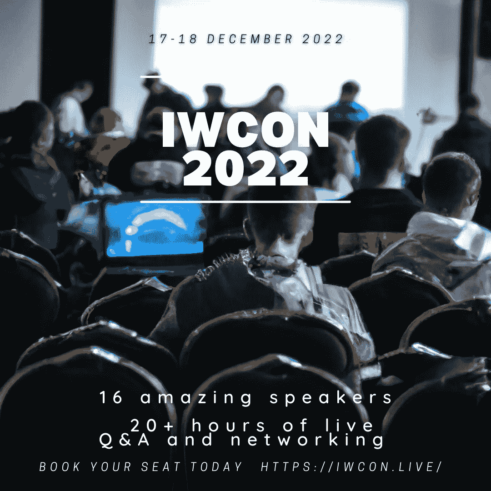

# 从 CloudSec 到 Web3 安全，从 Bug 奖金到 DFIR，还有更多:IWCON2022 上的 15 场精彩演讲

> 原文：<https://infosecwriteups.com/from-cloudsec-to-web3-security-bug-bounties-to-dfir-and-more-15-power-packed-talks-at-iwcon2022-ae0691dc6c9d?source=collection_archive---------0----------------------->

## 来吧，探索您将在 IWCON2022 上见证的所有网络安全知识。

嘿黑客伙伴，

你可能已经听说过[**iwcon 2022**](https://iwcon.live/)**——**我们的第二届信息安全大会暨交流活动，但你知道是什么让它如此特别吗？

大多数信息安全会议只讨论 3-4 宽的伞。但是在 [**IWCON2022**](https://iwcon.live/) 我们有专家讲座[涵盖安全的九大方面](https://iwcon.live/)！

从**云安全**到 **Web3 安全**、**漏洞奖金**到 **DFIR** 、**网络安全工具**到独一无二的体验，足不出户就能学到世界上最好的东西。

所以，如果你想在 2022 年结束前学会一项新技能，这里就是你要去的地方！

加入我们的会议，让我们轰轰烈烈地结束这一年💥

[让我们来看看](https://iwcon.live/)我们的杰出演讲者将要涉及的一些话题:

# 1.云安全

1.  **云环境中的威胁追踪**作者 Gabrielle Hempel 又名 [**gabsmashh**](https://twitter.com/gabsmashh) (领导者、猎人、云 SME、安全工程师@ Netwitness。)
2.  **黑客云:为了乐趣和利益**作者**[**Dhiyaneshwaran B**](https://twitter.com/DhiyaneshDK)**(project discovery . io 的 AppSec 研究员)****

# ****2.虫子赏金****

1.  ******我访问管理面板的方法**Ahsan Khan 又名 [**hunter0x7**](https://twitter.com/hunter0x7) (管理 Pwner)****
2.  ******阅读 RFC 进行黑客攻击**作者 Inti De Ceukelaire 又名[**securinti**](https://twitter.com/securinti)(Intigriti 的黑客负责人，Bug 赏金猎人，以研究逻辑漏洞著称。)****
3.  ******我在 bug 赏金的旅程&独特发现**作者 Majd Aldeen Atiyat 又名[**th 3g 3 nt 3 lman**](https://twitter.com/Th3G3nt3lman)(Bug 赏金猎人兼专职安全顾问。)****
4.  ******以 OAuth 和 Javascript 为特色的账号劫持**作者[**Youssef Sammouda**](https://twitter.com/samm0uda)(安全研究员、bug 赏金猎人)****

# ****3.API 安全性****

1.  ******通过外部攻击面管理实现 API 安全**由[**Phillip Wylie**](https://twitter.com/PhillipWylie)(cycogno 的常驻黑客)****

# ****4.网络安全工具和自动化****

1.  ******方法与疯狂:开发灵活的自动化工作流**作者 [**默罕默德·迪亚**](https://twitter.com/mhmdiaa) (Trickest 的工作流主管)****
2.  ******缩放安全研究员一劳永逸消除 OSS 漏洞**作者[**Jonathan Leitschuh**](https://twitter.com/JLLeitschuh)(安全研究员@ Dan Kaminsky Fellowship，)****

# ****5.DFIR(数字取证和事件响应)****

1.  ******IIS 模块的好、坏、丑**作者 [**布莱克·麦克德莫特**](https://twitter.com/bmcder02) (DFIR 在微软镖。)****

# ****6.Web3 安全性****

1.  ******进入智能合同安全**作者 Shashank 又名[**cyber boy India**](https://twitter.com/cyberboyIndia)(CredShields 首席执行官兼联合创始人。)****

# ****7.独特的经历****

1.  ******我如何使用侦查技术来识别一个多产的骗子**作者卢克·史蒂芬斯又名 [**哈克卢克**](https://twitter.com/hakluke) (黑客、赏金猎人、工具创造者、Haksec 创始人。)****

# ******8。测试******

1.  ******4h 以下最常见的黑公司方法**弗洛里安·汉斯曼(Florian Hansemann)又名 [**赛博战舰**](https://twitter.com/CyberWarship)(hanse secure 创始人。)****

# ****9.开源安全****

1.  ******大规模影响安全性**作者 [**约翰·奥普登纳克**](https://twitter.com/j_opdenakker) (信息安全专家和博客作者)****

# ****有什么问题吗？我们是来解决这些问题的。****

****我们很乐意回答任何问题、疑虑或阻碍您参加 IWCON 2022 的障碍。****

****请回复此邮件(或在下面留下评论)，我们会尽快回复您。****

****期待在 IWCON 2022 上与您见面。****

****[***今天就预定座位*** 。](https://razorpay.com/payment-button/pl_K8cxPtmUyBH2PC/view)****

****最佳，
编辑团队
Infosec 报道。****