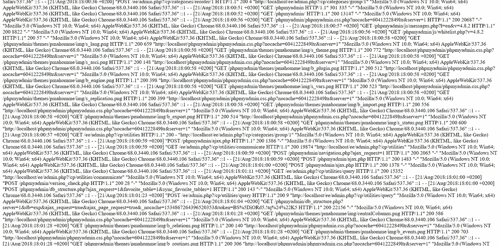
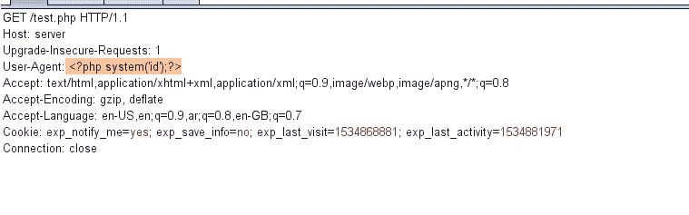
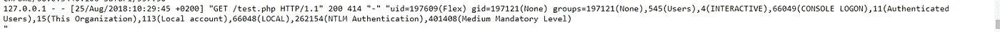

# 从 LFI 到 RCE！！

> 原文：<https://infosecwriteups.com/from-lfi-to-rce-96f352ec38c8?source=collection_archive---------0----------------------->

嘿伙计们，在这个主题中，我将谈论一个剥削改变 LFI 到 RCE 有很高的影响。
**什么是 LFI？**本地文件包含是一些 web 应用程序中的一个漏洞，因为网站从服务器读取文件，但开发者不过滤来自他信任的用户的输入:D.
**什么是 RCE？**远程代码执行这是一个漏洞，它允许攻击者在服务器上执行命令。

例如，当你在网站上搜索时，你发现了一个本地文件包含(LFI)这是好的，但这个问题只是让你访问服务器上的文件只是文件，你会从中获得很酷的赏金，但如果它是一个远程代码执行(RCE) 这将是令人敬畏的赏金，所以现在每个服务器都有一个日志文件这个文件保存任何请求到网站的路径和用户代理，有时引用值我们将使用这个文件 **access.log** 你只是会做一些蛮力知道这个文件的路径或任何日志文件现在当你知道这个文件的路径时，你应该用 LFI 错误打开它，就像这样

访问。日志文件

如果您注意到您可以看到保存在此文件中的用户代理，这可以向网站发送请求，并将用户代理更改为 PHP 代码，该代码允许我们执行命令，我们可以使用 **system()** 来执行命令，请参见下图

注入 PHP 代码

我们将发送请求，并使用 LFI bug 和 BOOOOM 再次打开 access 文件！！代码将被执行，输出将在文件的末尾，就像这样

输出

希望这个话题对某人有所帮助，谢谢阅读。