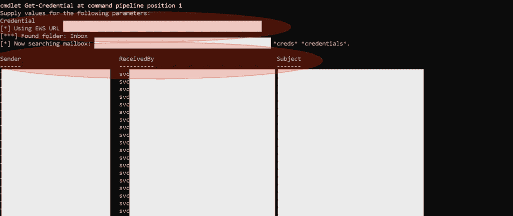
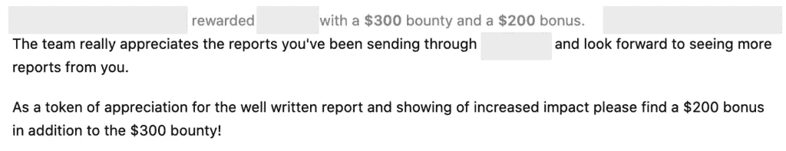
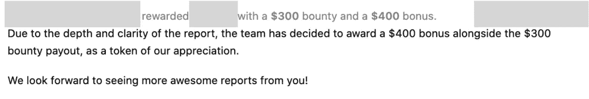
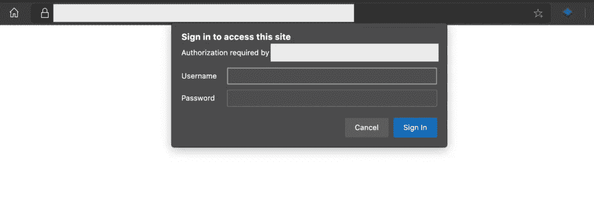
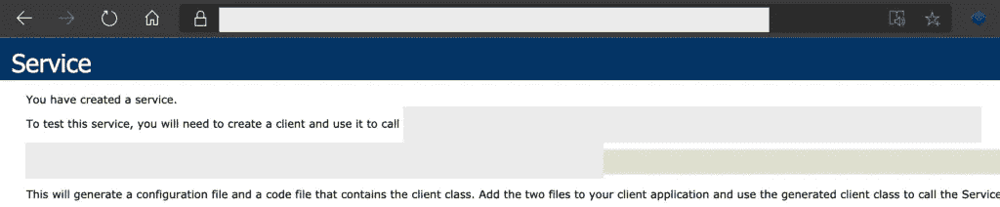
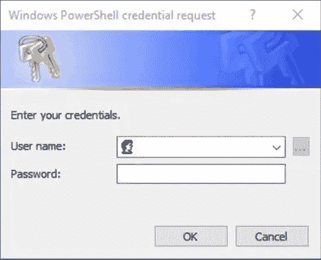
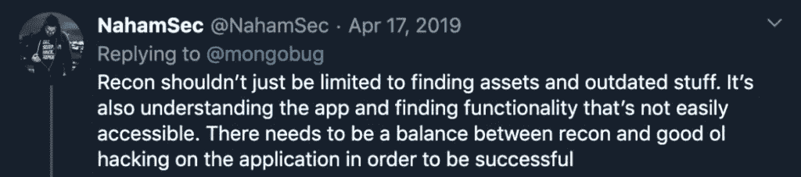
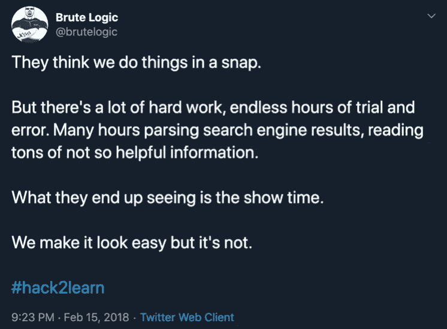
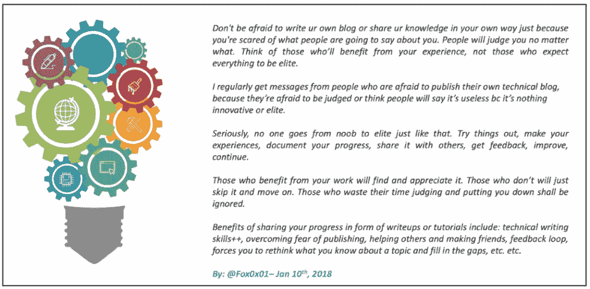

# 从侦察到利用 EWS 错误配置绕过 OWA 的 MFA 实施

> 原文：<https://infosecwriteups.com/from-recon-to-bypassing-mfa-implementation-in-owa-by-using-ews-misconfiguration-b6a3518b0a63?source=collection_archive---------1----------------------->

## 一个关于我如何最终可以使用一个未注册到 MFA 的广告帐户的故事，通过使用 EWS 错误配置来访问电子邮件收件箱并(有能力)转储全球地址列表。

بسم الله الرحمن الرحيم

```
Mirroring from: [http://www.firstsight.me/2020/06/from-recon-to-bypassing-mfa-implementation-in-owa-by-using-ews-misconfiguration/](http://www.firstsight.me/2020/06/from-recon-to-bypassing-mfa-implementation-in-owa-by-using-ews-misconfiguration/)
```

***注:*** *我要再次感谢*[***th 3g 3 nt 3 lman***](https://twitter.com/th3g3nt3lman)**为他讲述了* [***Github Recon 和敏感数据曝光***](https://www.youtube.com/watch?v=l0YsEk_59fQ) ***。*** *我用它作为寻找广告凭据的一种方式。**

**同时也感谢来自黑山信息安全* *的博布洛克对他们在* [**上发表的研究绕过了 OWA 和 Office365 门户**](https://www.blackhillsinfosec.com/bypassing-two-factor-authentication-on-owa-portals/) ***(通过使用 EWS 错误配置)*** *。我用它来访问这个受保护的帐户，并增加它的影响。**

*像往常一样，我将尝试用两种不同的方法发布这篇文章，它们是:*

*   *对于那些只需要这一发现的要点的人(如果读者已经理解了每一个流程，它可以节省大量的时间)，请查看 TL；DR 部分，以及*
*   *对于那些需要了解这一发现的执行流程或过程的人。总之，它可以告诉读者一些心态，并希望能帮助人们丰富自己的见解。*

*请欣赏这个故事。*

# *I. TL 速度三角形定位法(dead reckoning)*

*以下是关于这个问题的简单观点:*

*   *寻找允许通过**两种方法**登录的目标，即作为雇员(使用域帐户)，以及作为其帐户是专门为站点本身创建的用户。*
*   *要使用员工帐户(域帐户)登录，站点**会将我们引向另一个帐户。TLD** (例如:从。com 到网)——**ADFS 终点**。*
*   *如果我们可以用域名登录，我们就可以访问这个网站，对吗？*
*   *开始侦察 GitHub。net 域(不是。com)。比如:***password " . target . net "****

**参见*[***th 3g 3 nt 3 lman***](https://twitter.com/th3g3nt3lman)**会谈于* ***Bugcrowd 大学:****[***Github Recon 及敏感数据曝光***](https://www.youtube.com/watch?v=l0YsEk_59fQ) *或我的一篇报道:* [***从 Recon 到优化 RCE 结果***](http://www.firstsight.me/2020/02/from-recon-to-optimizing-rce-results-simple-story-with-one-of-the-biggest-ict-company-in-the-world/)***

*   **找到了一个包含多个文件的存储库，这些文件包含 3000 多行代码。在一行中，我**发现了一个用户名(服务帐户— svc_nameofsvc)和密码，看起来像一个域帐户**。试图登录与该帐户在 ADFS，但结果显示，该帐户未注册与使用的 MFA。简而言之，该帐户必须向所申请的 MFA 注册才能登录。当然，我们也需要用作 MFA 的“东西”。**
*   ****试图增加其影响**。如果我们报告一个问题，我们发现了一个有效的密码，但无法登录，因为它被阻止，这不是很酷。**
*   **尝试**找到 EWS 端点** →两者的子域枚举。com 和。net →查找电子邮件子域(常见实现)→将 EWS 放在找到的子域后面→显示登录提示→使用找到的凭据登录→ **能够登录** —在此端点没有实现 MFA(没有显示收件箱，记住，这是 EWS)。**
*   **执行 **MailSniper** 工具至 **EWS 端点**。成功阅读收件箱。**

**参见 [**黑山信息安全研究**](https://www.blackhillsinfosec.com/) : [**绕过 OWA 和 Office365 门户上的双因素认证**](https://www.blackhillsinfosec.com/bypassing-two-factor-authentication-on-owa-portals/) 。PoC 视频关于他们的研究: [**O365 MFA 旁路信息**](https://www.youtube.com/watch?v=Bb_T3ILfllU) 。**

****

**图 1-成功阅读收件箱**

*   **做一个报告(7 页左右)，把这个问题报告给程序负责人。**
*   **试图再次增加它的影响。告诉他们，如果我们有能力**利用这个问题转储“全球通讯录”**是有可能的。从那里，我们**也能够做密码喷涂**(与发现的密码相同)**到** **其他服务账户**即被创建。**

***参见* [***滥用 Exchange 邮箱权限与 mail sniper***](https://www.blackhillsinfosec.com/abusing-exchange-mailbox-permissions-mailsniper/)*—转储全局通讯录。*一*二见* [***攻击交换与 mail sniper***](https://www.blackhillsinfosec.com/attacking-exchange-with-mailsniper/)*——进行口令喷洒。***

*   **当天分赏**。并在第二天**固定**。****

****

**图 2——大约 2 天就修复了这个 Bug**

# **二。旅程**

## **2.1.幕后第一部分**

**有一天，我想测试范围内资产中包含的一个子域。从可用的许多资产来看，似乎只有该资产允许用户以两种方式登录，即作为员工(使用域帐户)，以及作为其帐户是专门为此应用程序创建的用户。**

**当时我尝试用一些被认为是弱密码的常用密码登录，效果并不好。在几次失败的尝试之后，我决定用一个员工帐户来测试登录方法。**

**当我们选择使用员工帐户登录时，该应用程序将引导我们使用另一个帐户登录 ADFS 端点。TLD(例如，来自。com 到。网)。从这里，我们可以得出结论，如果我们有一个员工帐户(域帐户)，那么我们可以登录到这些应用程序。**

****那么，我们该怎么办呢？****

**嗯，我正试着回归基本。在这种情况下，我开始在 GitHub 上侦察，寻找可能对我有用的东西。(这次会谈可能是一个非常好的参考: [Github Recon 和敏感数据曝光](https://www.youtube.com/watch?v=l0YsEk_59fQ))。总之，我找到了一个有趣的知识库，让我找到了有趣的发现(本文不讨论)。发送报告后，他们在两天内进行分诊和奖励。**

****

**图 3 —该计划的第一个发现**

**另一个关于 recon 部分的参考:我的一篇文章:[从 Recon 到优化 RCE 结果](http://www.firstsight.me/2020/02/from-recon-to-optimizing-rce-results-simple-story-with-one-of-the-biggest-ict-company-in-the-world/)。**

## **2.2.幕后第二部**

**那天之后，我发现了另外两个简单的问题(也获得了奖励),然后我就再也不知道该怎么做了。**

**所以，我再次回到 GitHub 去呼吸新鲜空气。我再次做的事情是把**密码“. target . net”**关键词放到 GitHub 上。在之前的资源库从 GitHub 移除后，我发现另一个有趣的资源库**在第一页**排名第 5。**

**老实说，那些结果上没有密码信息。但是根据我的经验，**凭证并不总是放在参数后面**。从这种心态出发，然后我开始探索这个知识库。**

## **2.3.探测**

**当我打开那个存储库时，我真的被它的行数(3000 多行代码)惊呆了。嗯，当我发现这个的时候是我所在时区的午夜，我当时的状态不太好，无法阅读这么多行——记住，我做这个 GitHub Recon **是为了呼吸新鲜空气**。**

**但是，当我看到第 6-27 行时，情况发生了变化——关于一个 AD 帐户和连接字符串(尽管**在这一行中还没有**凭证)。**

**从这里开始，我希望开发人员犯一个常见的错误，将硬编码凭证放在这个回购中。(是的，**希望成真**)！**

**在第 394 行，我发现 2 个我认为是凭据的文本(我怀疑是否有开发人员制作如此困难的参数)。**

```
**string Table = "file.xlsx";
XYZEndpoint endpoint = new XYZEndpoint("**username_here**", "**very_complex_password_here**");
string response = endpoint.GetCollectionData(Table);**
```

**基于这种情况，后来我立即把它用在 ADFS 端点(使用的那个。net 域)。尝试登录后，我什么也做不了。账户**没有在*审查* MFA** 上注册。**

**(我删除了用来避免误解这篇报道的 MFA。我担心人们是否认为这是 MFA 供应商的漏洞——注意:它不是。**

**我停下来了吗？还没有。我试图找到另一个端点(如 VPN 服务)，但我再次无法使用它登录。我已经尝试了大约 3 个 VPN 端点，没有一个能够让我登录。**

**那么，我停下来了吗？再说一遍，还没有。我必须设法增加它的影响。如果我们报告一个问题，我们发现了一个有效的密码，但无法登录，因为它被阻止，这不是很酷。**

***在这种情况下，时间越来越紧！为什么？因为我确定，* ***会有一个报警被触发*** *因为(至少)有超过* ***4 次的尝试是从我来自的国家*** *进行的。***

## **2.4.一种不用注册审查 MFA 就能阅读收件箱的方法**

## **2.4.1.Exchange Web 服务(EWS)端点！**

**对这种情况几乎绝望，然后是 Alhamdulillah，我想起了 BlackHills InfoSec 发布的一项关于绕过 OWA 门户网站双因素认证的研究。**

**根据研究，他们(BlackHills InfoSec)表示，尽管该帐户被 2FA 封锁(在这种情况下，该帐户未被封锁，但尚未在所用的 MFA 上注册)，但我们有可能阅读该帐户上的每封电子邮件。这可以通过在 EWS 端点使用常见的错误配置来实现。**

**我将引用一个关于这一点的很好的解释(让专家来解释给你听，包括那些做了精彩演讲的人——尼克·兰德斯的[展望和交换坏人——以及那些发布这项研究的人——黑山信息安全](https://www.youtube.com/watch?v=cVhc9VOK5MY)的[博·布洛克)。](https://www.blackhillsinfosec.com/?team=beau-bullock)**

> **Beau 说:在 DerbyCon 的时候，我参加了一个由 Nick Landers 做的名为“展望 T12 坏人的交流”的演讲。这是一个很棒的演讲，我强烈推荐大家去看看。在他的演讲中，Nick 收到了听众关于双因素身份认证(2FA)是否会阻止他在演讲中提到的攻击的问题。尼克回复了一句我觉得很有意思的话。他说 **“我看到一些组织将 2FA 封锁在 OWA。因此，当您访问 Outlook Web Access 时，您必须提供一个令牌，然后才能完成登录。这不会阻止很多攻击，因为双因素身份验证不适用于 EWS 或自动发现页面上的 NTLM 身份验证。”****

**那么，EWS 是什么？引用自 Beau 的研究:“ *EWS 是基于 web 的 API，在 Exchange 服务器上启用，微软建议客户在开发需要与 Exchange 交互的客户端应用程序时使用。API 允许应用程序能够与用户邮箱中的电子邮件、联系人、日历等进行交互*。**

**简而言之，在一般的实现中(感谢程序所有者的解释)，即使 ADFS 受到了 MFA 的保护，但有时系统所有者会忽略强制其他端点使用 MFA(在本例中为 EWS 端点)。**

## **2.4.2.寻找 EWS 端点-子域枚举！**

**起初，我不知道这个目标上是否有 EWS 端点配置错误。所以，我正在尝试做子域枚举。**

**老实说，我知道公司通常的做法是将这个 EWS 端点放在**mail**/**email**/**webmail**子域上。但是，做这种列举并不是浪费时间。至少只需要几分钟。而且结果，InshaAllah，希望以后对我有用(谁知道呢，也许有一天他们会把*.target.com 做成范围内目标的一部分)。**

****注意:**在这种情况下，我使用 Screetsec 创建的 [Sudomy 子域枚举工具](https://github.com/Screetsec/Sudomy)。**

**几分钟后，我得到了结果。然后不出所料，他们有“ **mail** ”子域。当我第一次访问 mail.target.com 时，这个子域又把我指引到了 ADFS 端点(在。net TLD)。然后在第二次尝试中，我试图将 EWS 放在 mail.target.com 后面，它显示了一个登录提示。**

****

**图 4 —登录提示**

**当我在这个提示符下输入找到的凭证时，我终于成功了！我可以在不提供任何 MFA 的情况下登录，也不需要向所使用的 MFA 注册该帐户。**

****

**图 5 —未注册 MFA 就成功登录**

**根据这个结果，我决定继续我的第一个目标，那就是阅读收件箱，而不必注册 MFA。**

## **2.4.3.准备环境**

**所以，我们需要做的第一件事就是从这些账户上下载 https://github.com/dafthack/MailSniper 的邮件狙击工具。基本上，这个工具是为了让人们更容易使用某些词在电子邮件中搜索数据。但是，这个工具也可以帮助我们在 EWS 环境中阅读电子邮件。**

## **2.4.4.“旁路”**

**下载完工具后，运行 powershell 并执行以下命令:**

```
****C:\Users\YoKo\Tools>** powershell.exe -exec bypass
Windows PowerShell
Copyright (C) Microsoft Corporation. All rights reserved. 

Try the new cross-platform PowerShell [https://aka.ms/pscore6](https://aka.ms/pscore6) 

**PS C:\Users\YoKo\Tools>** cd .\MailSniper-master\
**PS C:\Users\YoKo\Tools\MailSniper-master>** Import-Module .\MailSniper.ps1
**PS C:\Users\YoKo\Tools\MailSniper-master>** Invoke-SelfSearch -Mailbox **username**@**domain.tld** -ExchHostname **mail.domain.tld** -Remote**
```

**简而言之，应该执行两个命令，它们是:**

*   ***导入-模块。\MailSniper.ps1* ，以及**
*   ***Invoke-self search-邮箱* ***用户名****@****domain . TLD****-exch hostname****mail . domain . TLD****-Remote***

**请注意，我们输入命令后，**会弹出一个凭证框** **，要求**用户名** @ **domain.tld** 的凭证**。我们需要做的只是再次输入凭证。**

****

**图 6 — Windows PowerShell 凭据请求**

**如果一切都正确，那么工具会给我们一个信息，如果“他们”找到了一个收件箱文件夹。**

```
**[*] Trying Exchange version Exchange2010

cmdlet Get-Credential at command pipeline position 1
Supply values for the following parameters:
Credential
[*] Using EWS URL [***https://mail.domain.tld/EWS/Exchange.asmx***](https://mail.domain.tld/EWS/Exchange.asmx)
[***] Found folder: Inbox
[*] Now searching mailbox: **username**@**domain.tld** for the terms *password* *creds* *credentials*.**
```

## **2.4.5.结果呢**

**几分钟后(取决于邮件中找到多少提供的关键词)，我们会得到一个结果。在这种情况下，与密码、凭证或这个帐户上的凭证相关的东西是社交媒体信息。**

****

**图 7 —使用 MailSniper 通过 EWS 访问目标的收件箱**

**为了确保结果是正确的，我还试着用同样的账号和密码登录这些社交媒体。**结果是，正确！**但不幸运的是，社交媒体行为保护要求我输入正确的电话号码(这很正常，我试图从不同的国家登录)。**

****

**图 8 —查看受害者收件箱中我自己的邮件的另一个测试**

## **2.4.6.再次尝试增加它的影响**

**也许我们中的一些人会问，我们不能用这个帐号登录 VPN，我们也有有限的访问权来利用这个帐号来利用系统(因为我们不能用它来进入目标内部网络)。那么，我们还能做些什么呢？**

**嗯，我也有一个类似的问题，至少，直到我看到了黑山信息安全公司的博·布洛克发布的另一项研究。简而言之，针对我们的情况，我们还可以做两件事。**

## **2.4.6.1.全局地址列表转储和密码喷洒到整个帐户**

**在我们进一步讨论之前，让我问你一个问题，系统所有者在维护多个服务帐户时最常犯的错误是什么？(记住，在这种情况下，我找到了一个服务帐户)。**

**如果你认为有一种**的可能性**，如果系统所有者**为另一个服务账户(或他们管理的另一个账户)**使用相同的密码，那么我可以说答案是正确的。**

**因此，如果我们能够转储全球地址列表，那么在沙拉我们有机会找到其他具有相同模式的服务帐户。而且我们还有机会对所有找到密码的服务账户执行密码喷射攻击(不需要测试其他凭证，因为我相信企业中有限速保护。我们只需要测试我们找到的一个密码)。**

**为了做到这一点，我们可以看到这两项研究:**

*   **第一项研究:[利用 MailSniper](https://www.blackhillsinfosec.com/abusing-exchange-mailbox-permissions-mailsniper/) 滥用 Exchange 邮箱权限。转储全局地址列表的方法可以在本研究的“ **Invoke-OpenInboxFinder** ”部分找到。**
*   **第二次研究:[用 MailSniper](https://www.blackhillsinfosec.com/attacking-exchange-with-mailsniper/) 攻击交易所。Beau Bullock 陈述的一个好消息是:“*在测试中，我注意到 EWS 密码喷涂方法明显更快。无论是 Invoke-PasswordSprayOWA 还是使用 15 线程的 Burp Intruder，都用了大约 1 小时 45 分钟的时间* ***完成了对 10000 个用户的喷。向 EWS 喷同样的用户列表只用了 9 分 28 秒*。**“很好，不是吗？**

**从这里，我们正好有机会增加它的影响！嗯，我说一个机会，因为我真的不确定这种技术是否可行。但是通过研究中提出的方法，我确信这是可行的！**

**注:我**没有执行这个**。没有任何许可，我们不能做这件事。(是的，在真正的攻击中，攻击者不会询问任何权限，但请注意，在 bug hunting 中的**，我们并没有打算违反**。**

## **2.4.7.另一种可能的情况**

**在另一种情况下，外部攻击者有可能将此问题与社会工程活动结合起来。例如，他们表现得像找到的帐户的有效帐户所有者，并试图通过电子邮件欺骗(target.tld 域)与受害者通信。**

**然后，攻击者与内部团队“建立关系”,以确保这些攻击者能够完全访问帐户(使用设备/电话号码/等向 MFA 注册)。由攻击者控制)。不确定这种情况有多有效，但是考虑一下风险可能会很好。**

## **2.5.奖励**

**举报已经一天审奖励，第二天固定。**

****

**图 9——这个错误在大约 2 天内就被修复了**

# **三。经验教训**

**在这一部分，我想再补充一些我在一篇文章中提到过的[的经验教训:](http://www.firstsight.me/2020/02/from-recon-to-optimizing-rce-results-simple-story-with-one-of-the-biggest-ict-company-in-the-world/)**

*   **在我看来(如果我错了，请纠正我)，侦察并不总是意味着资产发现活动。在这一次，这也意味着我们试图学习 API 如何工作，target 的开发文化，等等。**

**请记住，在回复 [@Mongobug](https://twitter.com/mongobug) 的一条推文时， [@NahamSec](https://twitter.com/NahamSec) 也用非常简单的话解释了 recon 的一个定义: *Recon 不应该仅限于寻找资产和过时的东西。它还能理解应用程序，找到不易使用的功能。为了取得成功，需要在应用程序的侦察和良好的 ol 黑客之间取得平衡。***

****

*   **不要放弃阅读从 GitHub Recon 活动中在 GitHub 存储库中找到的每一行代码。老实说，我还没有完全阅读代码。我只是取点，读参数，试着理解流程，看看有没有什么好的可以用的。**
*   **根据我的经验，凭证并不总是放在参数后面。从这种心态出发，尝试探索你找到的知识库。**
*   **请享受你的捕虫活动。也许不是每个人都同意这一点，但是，不要总是想着赏金(特别是如果你刚刚开始在这一个，从来没有一个经验)。尽量考“合法/官方”目标。总之，它可以提高你的知识，方法，以及在提供奖励的目标中寻找漏洞的任何东西。**

**我试图从不提供赏金的目标(但开启了负责任的揭露计划)那里学到很多技术(我从未面对过)。在这一点上，我能说的一件事是，那些被使用的技术并不总是我们每天面对的技术。换句话说，我们需要一个官方的“操场”(法律目标)来学习它，让我们熟悉它。**

*   **试着回到基础**
*   **如果你认为有人能轻而易举地做到，那么试着[看看这些来自](https://twitter.com/brutelogic/status/964143091635630080) [@BruteLogic](https://twitter.com/brutelogic) 的激励性话语:“他们认为我们做事很快。但是有很多艰苦的工作，无止境的反复试验。花很多时间分析搜索引擎结果，阅读大量没有帮助的信息。他们最终看到的是表演时间。我们让它看起来很容易，但事实并非如此。”**

****

*   **最后一条是我最喜欢的名言(说真的，这很美) :**

****

**这些话真的激励我分享东西，即使我分享的东西并不总是好东西。但是在安拉的允许下，我得到了很多反馈，这些反馈激励我改正我的错误或改进事情。**

**好了，最后我的简单文章到此结束。下次见，英沙拉。**

# **四。信用**

*   **[Th3g3nt3lman](https://twitter.com/th3g3nt3lman) 在 Bugcrowd 大学演讲: [Github Recon 和敏感数据曝光](https://www.youtube.com/watch?v=l0YsEk_59fQ)。**
*   **[绕过 OWA 的双重认证& Office365 门户](https://www.blackhillsinfosec.com/bypassing-two-factor-authentication-on-owa-portals/) —黑山信息安全。**
*   **[O365 MFA 旁路信息](https://www.youtube.com/watch?v=Bb_T3ILfllU) (PoC 视频)—黑山信息安全。**
*   **尼克·兰德斯的《坏人的展望与交换》——关于德比康 6.0**
*   **[利用 MailSniper 滥用 Exchange 邮箱权限](https://www.blackhillsinfosec.com/abusing-exchange-mailbox-permissions-mailsniper/) —黑山信息安全。**
*   **[用 MailSniper 攻击交易所](https://www.blackhillsinfosec.com/attacking-exchange-with-mailsniper/) —黑山信息安全。**
*   **邮件狙击手——https://github.com/dafthack/MailSniper。**
*   **[Sudomy 子域枚举工具](https://github.com/Screetsec/Sudomy) by Screetsec。**
*   **[从侦察到优化 RCE 结果](http://www.firstsight.me/2020/02/from-recon-to-optimizing-rce-results-simple-story-with-one-of-the-biggest-ict-company-in-the-world/)。**