# 从通过 Censys 和 DNSdumpster 进行侦察，到使用弱密码“密码”登录获取 P1

> 原文：<https://infosecwriteups.com/from-recon-via-censys-and-dnsdumpster-to-getting-p1-by-login-using-weak-password-password-504e617956ce?source=collection_archive---------0----------------------->

## 一个简单的故事，当安拉允许我通过结合几个问题得到 P1，其中一个是关于“薄弱的凭证”。

بسم الله الرحمن الرحيم

```
Mirroring from: [http://www.firstsight.me/2022/03/from-recon-via-censys-and-dnsdumpster-to-getting-p1-by-login-using-weak-password-password/](http://www.firstsight.me/2022/03/from-recon-via-censys-and-dnsdumpster-to-getting-p1-by-login-using-weak-password-password/)
```

像往常一样，我将尝试用两种不同的方法发布这篇文章，它们是:

*   对于那些只需要这一发现的要点的人(如果读者已经理解了每一个流程，它可以节省大量的时间)，请查看 TL；DR 部分，以及
*   对于那些需要了解这一发现的执行流程或过程的人。总之，它可以告诉读者一些心态，并希望能帮助人们丰富自己的见解。

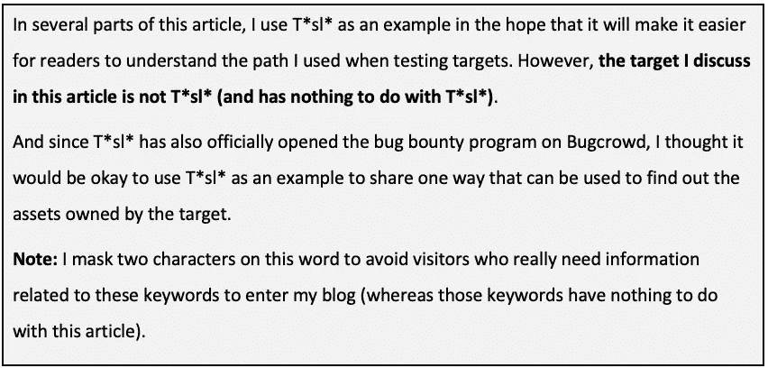

请欣赏这个故事。

# I. TL 速度三角形定位法(dead reckoning)

以下是关于这个问题的简单观点:

*   大多数目标(*.target.tld)受 Cloudflare 保护(显示“拒绝访问”页面)。
*   通过 Censys.io(自治系统号)找到源服务器 Cloudflare 后面的 IP)。查看他们博客上的一篇 Secjuice 文章:[寻找隐藏在 CloudFlare 或 Tor 背后的真正原始 IP](https://www.secjuice.com/finding-real-ips-of-origin-servers-behind-cloudflare-or-tor/)
*   将目标 IP 段(/24)放入 DNSdumpster。
*   访问从 DNSDumpster 获得的所有 IP 的端口 80 和 443(仅用于快速查看)(可以使用“[打开多个 URL](https://chrome.google.com/webstore/detail/open-multiple-urls/oifijhaokejakekmnjmphonojcfkpbbh)”扩展来完成)——jazaakallahu khairan 阿雅 Akhii [harrmahar](https://twitter.com/harrmahar) 。
*   用 GitLab 得到了一个 sub.target.tld。
*   GitLab 中有一个[错误配置——“Explore”](https://gitlab.com/gitlab-org/gitlab/-/issues/18165)功能可供访问者访问，并允许访问者查看参与某个组的用户列表。
*   试图使用弱密码登录到获取的帐户。
*   发现 1 个帐户(原来是 admin)使用了密码:“password”。
*   第一天审判，第二天奖励。

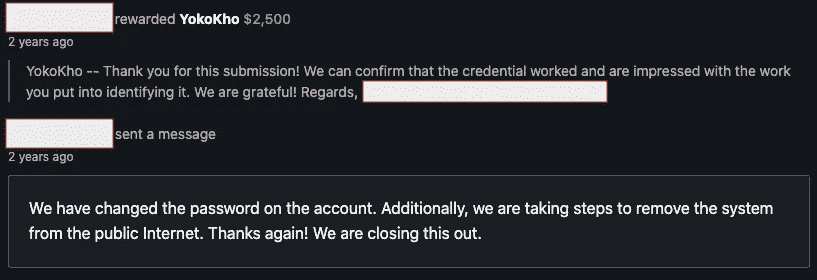

# 二。旅程

有一次，我收到了一个程序的邀请，该程序有几个目标相当广泛的域(*.target.tld)。起初，我很高兴看到这一点，因为没有多少“奖励”报告具有如此广泛的范围。然而，在我列举了每个范围内目标的子域后，我发现这些可公开访问的资产大多数都受到 Cloudflare 的保护，并且许多 HTTP/HTTPS 端口在被访问时会发出流行的“访问被拒绝”消息。

暂停了一会儿来活跃这个节目，最后阿拉允许我记住 Secjuice 在他们博客上发布的一篇文章:[寻找隐藏在 CloudFlare 或 Tor 背后的真正起源 IP](https://www.secjuice.com/finding-real-ips-of-origin-servers-behind-cloudflare-or-tor/)。

为什么了解这项技术如此重要？因为很有可能当一家公司实施 WAF 时，他们无意中遗漏了他们的环境设置，从而实际上隐藏了原始服务器 IP。

应当注意，通过了解源服务器 IP，攻击者有可能更自由地测试目标，因为他们已经“通过”了通常由 WAF 提供的保护，例如速率限制、注入等。

*“隐藏的服务和 CloudFlare 或任何类似服务的有效性依赖于隐藏源服务器的 IP。简单的小错误就能暴露 IP。这允许攻击直接使用 CloudFlare 的网站(绕过 WAF、速率限制、DDoS 保护等等)。”— Secjuice。*

## 2.1.安全测试人员/安全研究人员的搜索引擎

可以用来查找源服务器 IP 的工具之一是 Censys。如果这是您第一次阅读/听到它，censys 是一个帮助信息安全从业者发现、监控和分析可从互联网访问的设备的平台(引自 about.censys.io)。

长话短说，像 censys 这样的工具将提供对目标的更深入的了解，这些目标通常无法使用像 Google 这样的搜索引擎来实现。所以 Censys 被认为是安全测试人员/安全研究人员经常使用的搜索引擎之一是非常正常的。

也许有一个问题，仅仅是 censys 吗？当然不是。Securitytrails 在其一篇文章中提到,[至少有 8 个其他平台被经常使用，因为它们有相同的目的](https://securitytrails.com/blog/hacker-search-engines)，可以用来了解目标的更多“情况”。

注:*我只是个一般用户(不是研究人员，也不是好的测试人员)。*

## 2.2.找出目标源服务器的 IP-基本方法

长话短说，我立即将目标域名输入 censys([https://search.censys.io/](https://search.censys.io/))并注意到“自治系统”部分。

作为一种信息，自治系统号(ASN)是已分配给某个组织的一个或多个 IP 地址块的连接组的数字标识符(引自 [support.censys.io](https://support.censys.io/hc/en-us/articles/4405800150804-How-to-Seed-the-Censys-ASM-Platform) )。有了这个功能，测试人员就可以获得专门分配给某个组织的 IP 地址的信息。

比方说，我们的目标是 T*sl* — T*sl*。com(当然本文的案例不是说 T*sl*。我用 T*sl*这个名字只是为了让读者更容易理解)。我们需要做的就是输入 T*sl*。然后看一下“自治系统”部分，它显示了使用 T*sl*名称的具体输出(记住，这只是一个基本方法，以加快搜索速度，因为在现实中，他们很可能使用另一个 IP 地址块)。

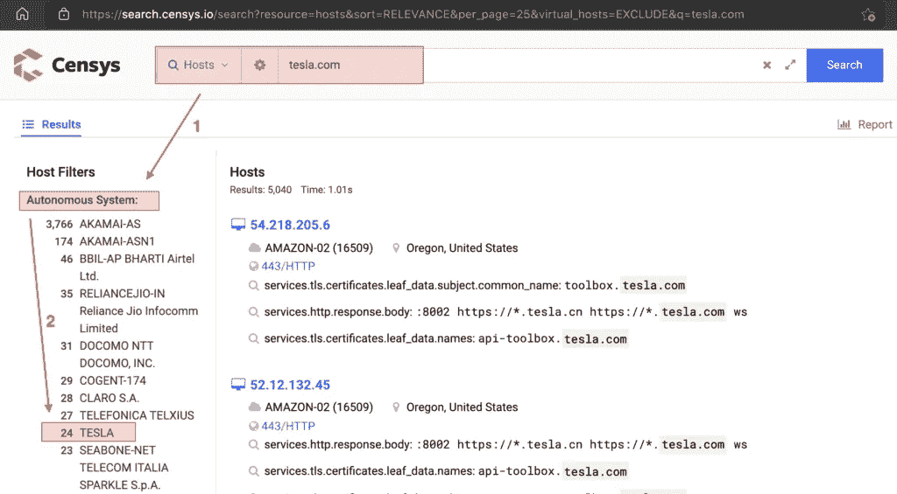

接下来您需要做的是单击目标组织的名称(在本例中为 T*sl*)，Censys 将自动显示该组织使用的 IP 地址块。


请记住，尽管第二次搜索只显示了 24 个结果，但我们基本上“仍然可以”通过查看 censys 上标识的每个主机的子网为/24 的主机来扩展搜索。

例如，在前两个结果中，我们得到 IPs 8。**.124.215 和 8。**.24.153.从更广泛的角度来看，我们的目标基本上是 8。**.124.0/24 和 8。**.24.0/24.并且在实际操作中，我们把这两个片段拿到一个类似 DNSDumpster 的工具上去识别它们的有效性(也就是说，是否真的属于目标)。

*我再次屏蔽了这个 IP 上的两个数字，以避免真正需要这些关键词相关信息的访问者进入我的博客(而这些关键词与本文无关)。*

## 2.3.验证获得的 IP 块

在我通过 censys 从目标获得一些 IP“片段”后，我会尝试收集它们并将其带到 DNSDumpster。除了确定该分段是否属于目标组织之外，这还可以帮助我们识别相关分段中“可能的”其他活动主机。

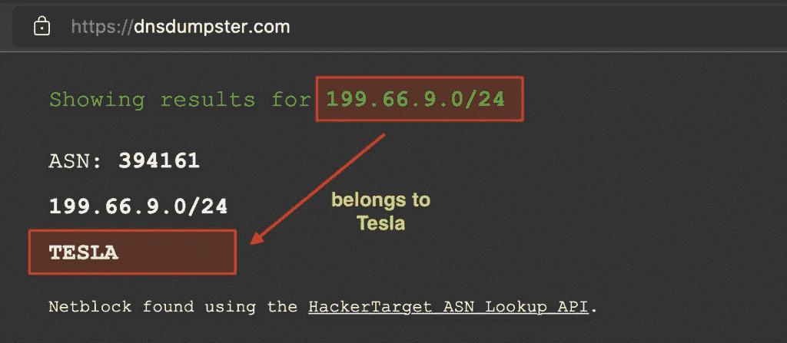

那时我发现了几个 IP 段，所以我试着一个接一个地输入，直到最后阿拉允许我找到一个包含相当多 IP 的段。(再次提醒，我只是以 T*sl*为例来演示 flow，但本文中我说的目标并不是 T*sl*)。

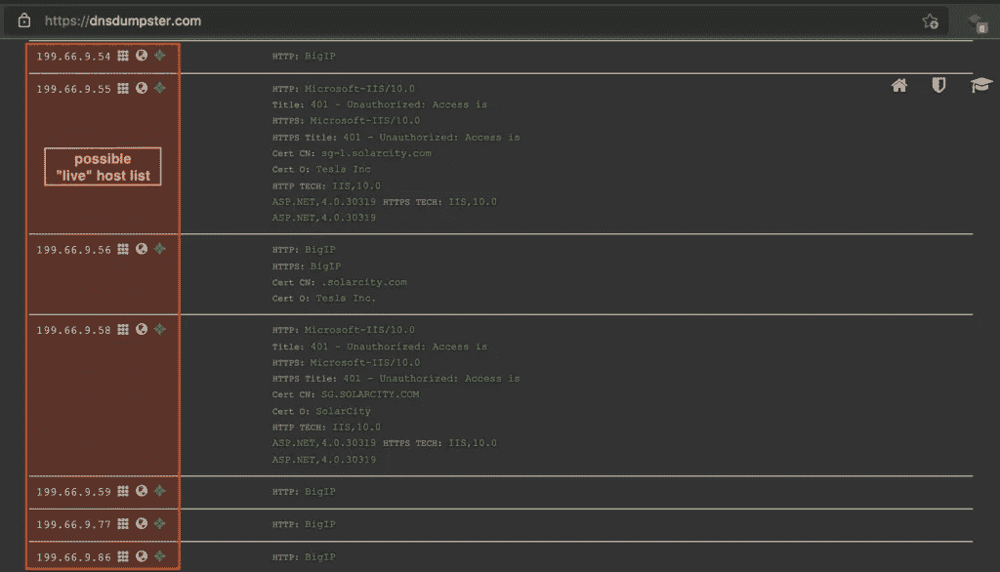

## 2.4.寻找可能的开放 HTTP/HTTPS 服务

当我得到一个相当大的公司形式的目标时，就像我在这个项目中处理的那样，加上这个目标在公共区域(互联网)，然后我在测试中使用不同的方法，尝试查看在目标上打开 HTTP/HTTPS 端口的可能性。

> 如果我处理的是内部网领域(直接/ VPN ),那就不一样了，我会暂时避开 HTTP/HTTPS，尝试做一个快速测试，把自己的注意力集中在 3 件事情上(对于那些接受一些令人不快的技术认证和类似认证的人，或者玩一些 HTB 实验室和类似认证的人，他们会熟悉这个常见的概念)，它们是:
> 
> 针对已使用的帐户和密码进行测试，
> ；针对尚未实施的补丁(过时/过期版本)进行测试，
> ；针对已实施的配置错误进行测试。

具体查看与 HTTP/HTTPS 相关的服务的步骤可以通过几种方式完成，即:

*   通过访问默认和公共端口，如 80 和 443，或者
*   通过广泛检查其他端口，如 8080、8443 等。可以用来处理这个问题的一些工具有: [aquatone](https://github.com/michenriksen/aquatone) (xlarge 选项)或[http probe](https://github.com/tomnomnom/httprobe)。

在那种情况下，我试图首先从我从 DNSDumpster 获得的目标“列表”中检查可能的活动端口 80/443。为了使这个活动更容易，我们可以使用 Google Chrome 中的一个扩展，名为“[打开多个 URL](https://chrome.google.com/webstore/detail/open-multiple-urls/oifijhaokejakekmnjmphonojcfkpbbh)”。

长话短说，我们可以只输入 DNSDumpster“找到”的所有 IP，在每一个前面加上 http/https。这或多或少是它看起来的样子:

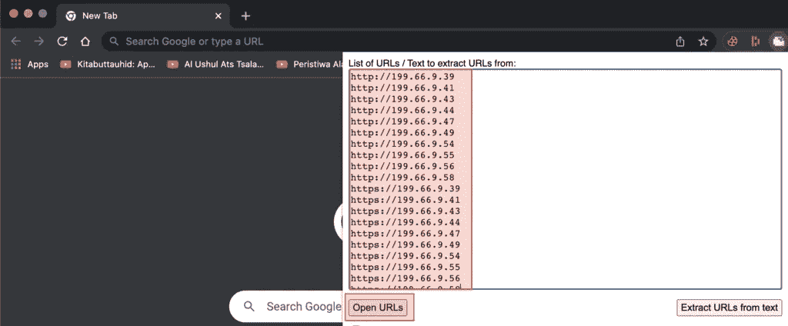

通过点击“打开网址”，该扩展将自动帮助访问所有已输入的网址。

## 2.5.在其中一个 IP 上找到 GitLab

在查了相当多的 IP 之后，终于发现了一个有趣的景象，即一个使用 GitLab 社区版出现的 IP。当我检查证书时，它竟然指向一个子域，当不通过原始服务器 IP 直接访问时，该子域将显示消息“访问被拒绝”。

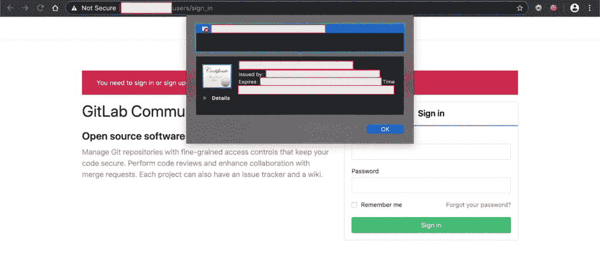

> “但这里有一点很独特:如果我使用完整路径访问子域(如截图所示添加/user/sign_in，因此它变成 subtarget . target . TLD/user/sign _ in)，他们使用的 Cloudflare 不会阻止这种访问。但是，如果我只访问 subtarget.target.tld，我将再次面对“访问被拒绝”的消息。但不管这个独一无二的东西发生了什么，至少我能发现这个 IP 里面有什么。”

在知道这个 IP 上有 GitLab 之后，然后阿拉允许我记住 3 个成为用户实现 GitLab 常见错误的基本事情，分别是:

*   有一个免费注册功能(没有电子邮件白名单)。当然，这可能会导致攻击者自己注册，并能够查看未设置为私人模式的项目。有哪些后遗症？当然，攻击者可以看到其中的敏感内容(是的，如果事实证明存在像数据库连接字符串这样没有得到很好保护的凭据)。
*   有一个“组”菜单，公众可以访问(无需登录)。当然，通过看到这一点，攻击者将知道用户在 GitLab 中实现的用户名列表。
*   第三个是“项目”菜单，公众也可以访问(无需登录)。当然，这可能会导致攻击者看到用户的源代码，包括可能未受保护的凭据。

那么除了这三件事之外的另一件事就是测试人员检查 GitLab 本身可能存在的漏洞(维护人员可能没有打补丁)的重要性。对于这一点，我们可以参考这方面最全面的来源之一，即 Hackerone 中 GitLab 程序的[hack activity 菜单。](https://hackerone.com/gitlab/hacktivity?type=team)

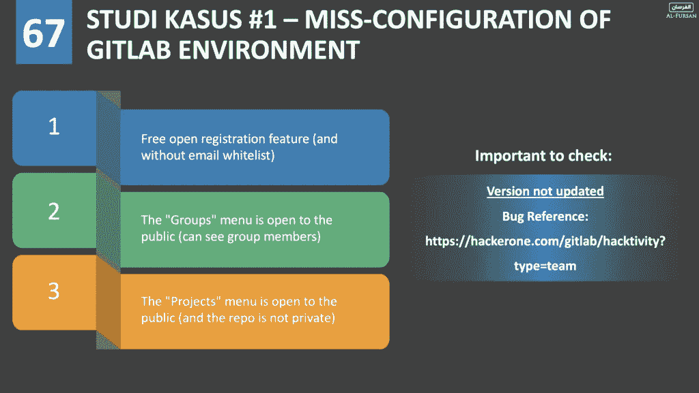

## 2.6.GitLab 目标上的配置错误—访问/浏览/组

从之前提到的与 GitLab 中的错误配置相关的 3 件事情中，经安拉允许，我在目标上的[“群组”菜单中发现了一个问题，该菜单可公开访问(无需登录)](https://gitlab.com/gitlab-org/gitlab/-/issues/18165)。

至于访问此菜单，我们只需访问通常位于页脚的“explore”菜单(或者它也可以直接转到/explore 端点)，然后选择标题菜单中的“groups”菜单..

注意:我没有可以访问的 explore target 菜单的屏幕截图，但它看起来是这样的:

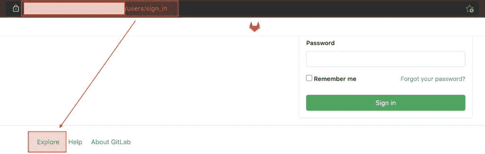

经过一些分析后，发现有一个组没有受到“保护”，因此访问者可以看到该组中的成员列表。

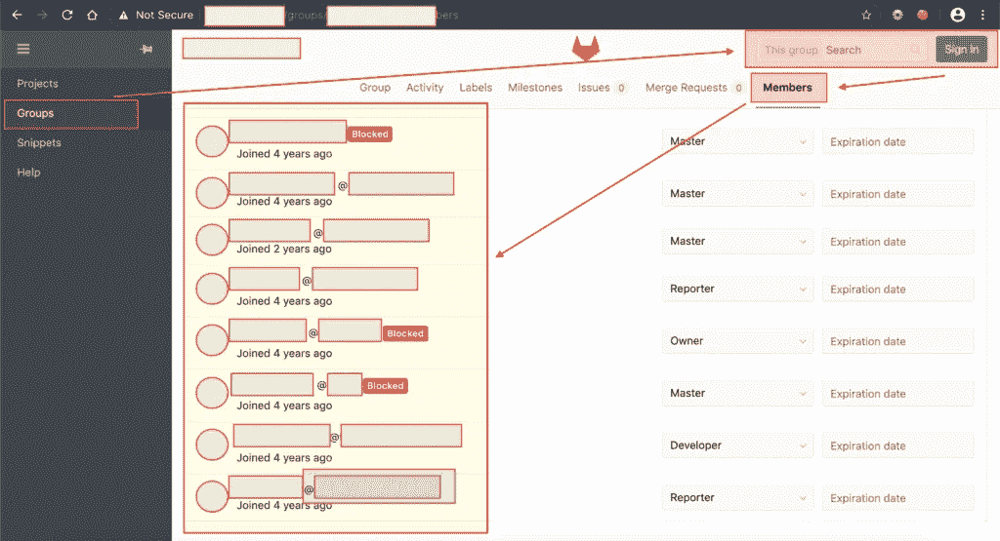

## 2.7.根据找到的用户名测试使用的密码

从已经通过的条件来看，我似乎已经设法获得了目标用户名列表的“一小部分”。间接来说，拥有目标上的用户名意味着我们离登录目标系统(在本例中是 GitLab)更近了一步。

我做的下一件事是尝试使用 password、Password、passw0rd、Passw0rd、p@ssw0rd 等各种可能的弱密码登录。

> 除了按照上面的方式猜测密码，我们还可以通过 Github、Trello 或其他协作平台，尝试找到 recon 经常使用的密码模式。
> 
> 对于通过 Github 的 recon，我在我的另一篇文章的“收集凭证(不管是否仍然有效),然后尝试找到模式”部分中或多或少解释了这个流程。

然后发生了什么？在最下面的用户名中，真主允许我用密码登录:“密码”。是的，你没看错，这个账号用“password”作为密码值。长话短说，我还设法在里面看到了这么多私人项目。

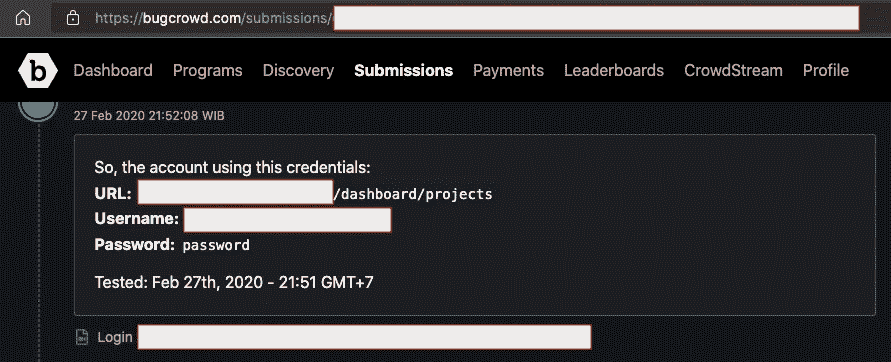

我一开始不相信，所以把这个账号用的密码搞错了。但经过反复实验，发现密码是“密码”才是正确的。

我立即报告了这一情况，不久之后，项目负责人为此发现颁发了价值 P1 的奖金。


# 三。吸取的教训

所以，我们在这里，几乎在文章的结尾。在这一节中，我想简单回顾一下，让读者更容易理解这段简单旅程中的一些教训:

*   安全问题不仅仅在于一件事。实际上，我们可以将来自其他资产的数据用于属于目标的主要资产。
*   试着回到基础。
*   总是试图找到目标的源服务器 IP。因为在实施安全边界时可能存在配置错误的情况(如本例所示)。
*   在我看来(如果我错了，请纠正我)，侦察并不总是意味着资产发现活动。在这一点上，这也意味着我们试图了解应用程序是如何工作的，target 的开发文化，等等。

请记住，在回复@Mongobug 的一条推文时，@NahamSec 还[用非常简单的话](https://twitter.com/NahamSec/status/1118525950117892096?s=20) : *解释了 recon 的一个定义:“Recon 不应该仅限于寻找资产和过时的东西。它还能理解应用程序，找到不易使用的功能。为了取得成功，需要在应用程序上的侦察和良好的 ol 黑客之间取得平衡"*。

最后，有些人认为获得用户名不是很有用。直到有一句话出来了，在我看来是相当独特的:“*如果不能用密码登录，就不会有(获得用户名)的效果。*“如果你从简单化的角度来看，那么当然这句话似乎是对的。但是在进行测试时，我们当然要从更广阔的角度来看待它。

获得用户名意味着您离登录目标系统又近了一步。一旦你得到它，你需要做的一件事就是尝试将你的搜索扩展到 Github、Trello 等协作平台，以找到所使用的密码模式。如果用户使用默认密码或者公司自己提供的默认密码模式不是有可能吗？

请记住，即使是[谷歌也从未使用密码登录他们的重要应用](https://medium.com/bugbountywriteup/bypassing-googles-fix-to-access-their-internal-admin-panels-12acd3d821e3)(尽管访问这些应用需要独特的方式)。

> 更不用说当我们谈到真正的攻击也可以涉及社会工程活动。是的，没错，VDP 赏金/bug 赏金计划确实把社会工程作为超范围攻击的一部分。然而，当我们谈论现实中的测试(在 bug bounty 程序/ VDP 之外，或者类似的东西)时，我们不能忘记获取用户名将是攻击者实施社会工程攻击的成分之一。

这里我想强调的另一件事是，如果你所关注的 bug bounty/VDP 项目不接受“如何获得用户名”,请不要丢弃这个用户名信息。我个人不会错过保存我找到的任何有效用户名信息的机会。因为他们使用弱值更改密码的可能性将会存在(要么是因为他们忘记了旧密码，然后用弱值替换了旧密码，要么是因为他们认为没有人会知道用户名是否注册了该服务，或者是因为其他原因)。

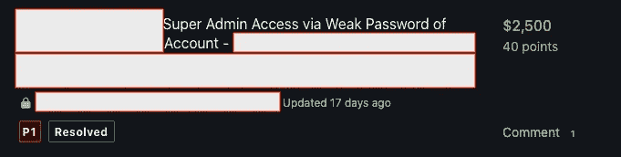

毕竟，像这样的测试流程并不仅仅局限于 bug bounty program/VDP 之类的，不是吗？在另一个正式的安全测试工作中，这当然是有用的，尤其是如果你的客户允许你发起一个社会工程攻击。

# 四。参考/学分

*   [寻找隐藏在 CloudFlare 或 Tor](https://www.secjuice.com/finding-real-ips-of-origin-servers-behind-cloudflare-or-tor/) 背后的真正起源 IP——sec juice
*   [安全研究人员使用的 9 大互联网搜索引擎](https://securitytrails.com/blog/hacker-search-engines)——由 Securitytrails 提供
*   [如何播种 Censys ASM 平台](https://support.censys.io/hc/en-us/articles/4405800150804-How-to-Seed-the-Censys-ASM-Platform)—Censys
*   黑客目标公司的 DNSDumpster
*   michenriksen 制作的 Aquatone
*   汤姆诺姆的 http 探测
*   [通过 tp 打开多个网址](https://chrome.google.com/webstore/detail/open-multiple-urls/oifijhaokejakekmnjmphonojcfkpbbh)
*   [禁用 Gitlab](https://gitlab.com/gitlab-org/gitlab/-/issues/18165) 中的“浏览”和“帮助”
*   [绕过谷歌的认证进入他们的内部管理面板](/bypassing-googles-fix-to-access-their-internal-admin-panels-12acd3d821e3)
*   [从侦察到优化 RCE 结果](http://www.firstsight.me/2020/02/from-recon-to-optimizing-rce-results-simple-story-with-one-of-the-biggest-ict-company-in-the-world/)。
*   阿克希[孙铁麟·阿沙里](https://twitter.com/mastomii)和阿克希[维德扬托·阿迪·普拉博沃](https://www.linkedin.com/in/ardyprabowo)