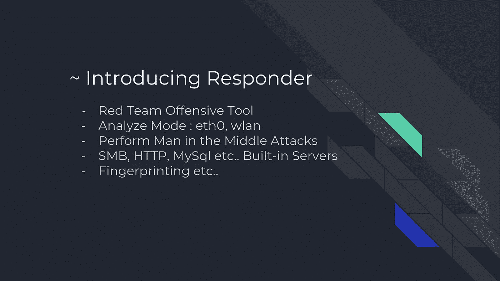
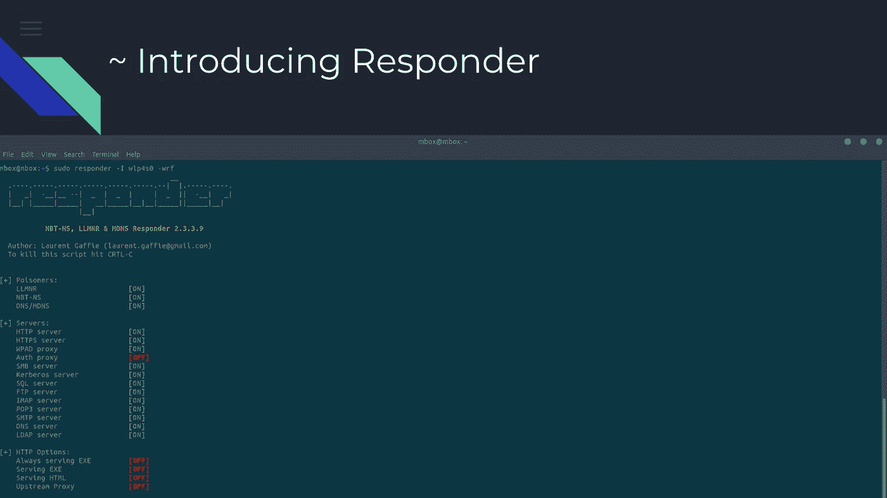
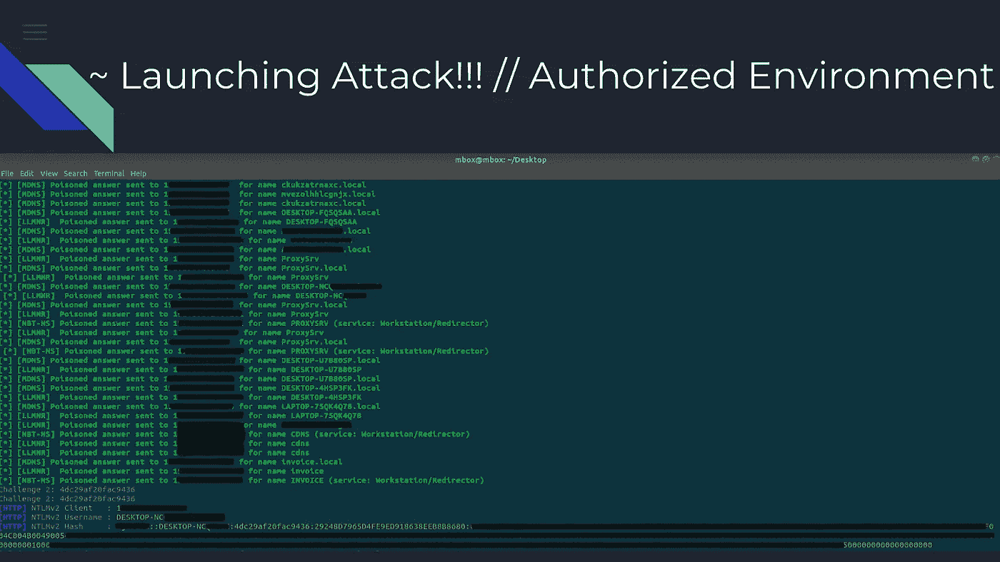
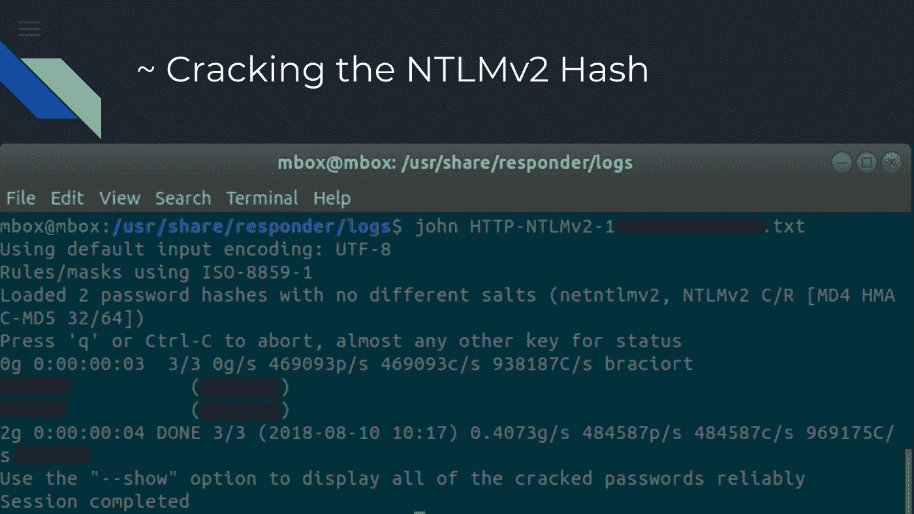
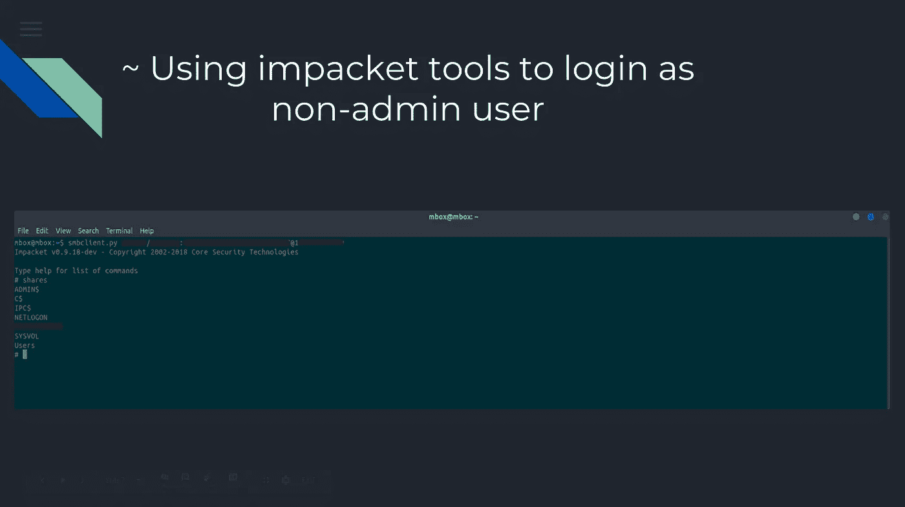
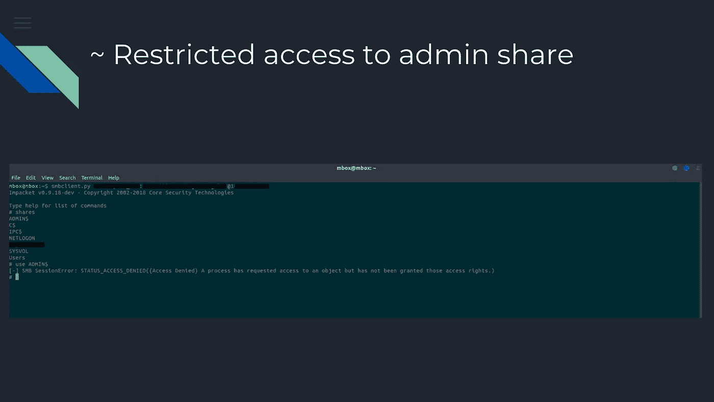
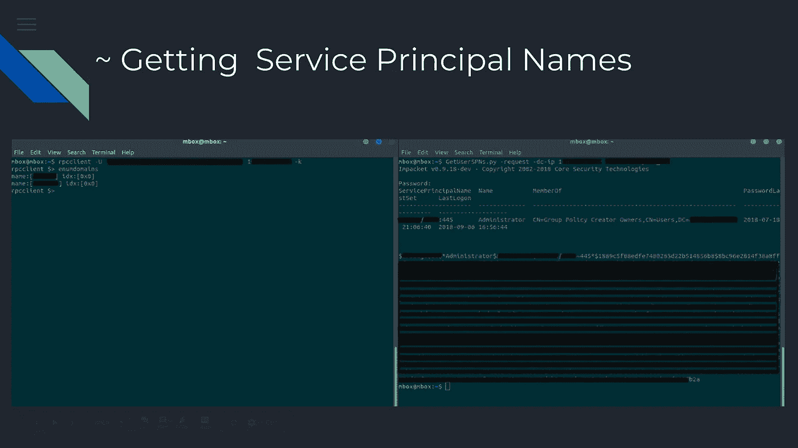
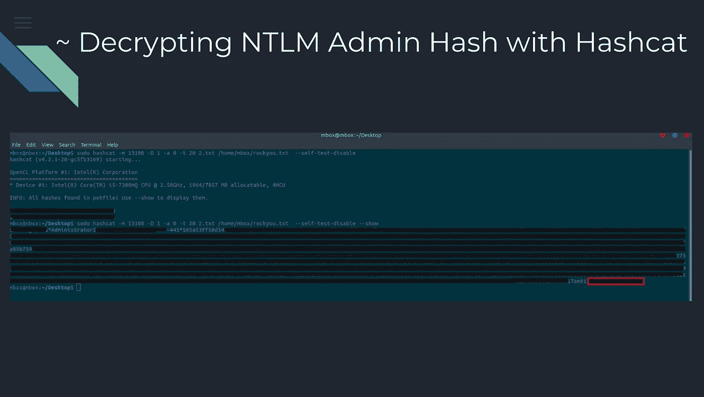
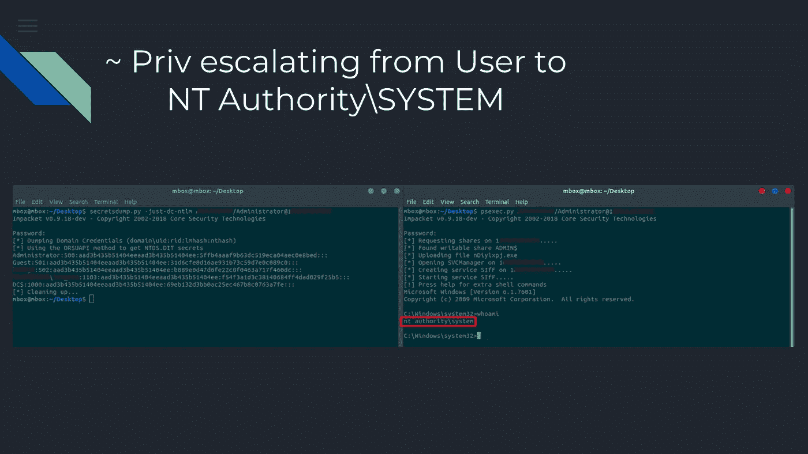

# 从响应者到 NT 授权\系统

> 原文：<https://infosecwriteups.com/from-responder-to-nt-authority-system-39abd3593319?source=collection_archive---------1----------------------->

> 你好，我叫梅里迪安·米夫塔里。我今年 21 岁(安全研究员)，来自科索沃。在这篇文章中，我将谈论或描述一种在网络中使用响应者& SMB 攻击工具的攻击方法
> 
> 我将描述的这种攻击实际上被称为中间人攻击(MITM)，这种攻击面对的是为什么将无线设备的密码告诉他人是危险的想法。
> 
> 这个网络笔测试是在一家私人电信公司的授权环境下进行的，为了保密，我不允许提及客户的名字！

> 在这里，我将简要介绍这个工具的特性，以及我们将会用到的特性。
> 
> Responder 是红队使用的一种攻击性安全工具，正如我们提到的，它更多的是一种中间人攻击，它与拦截网络中 2 个或更多系统之间的通信有关。
> 
> **工具的一些特性**

> 在启动过程中，这是该工具的外观，我已经在 wlan0 界面中执行了，下面我们可以看到该工具的内置服务器
> 
> -中小企业
> 
> - HTTP
> 
> - MySQL
> 
> - Kerberos 等。

> 因此，在执行该工具后，我们看到它在该网络内的每台计算机上发送请求，最后我们看到目标用他的用户名和 NTLMv2 哈希来响应我们

> 在我们捕获 NTLMv2 哈希并在 John the Ripper 的帮助下解密后，John the Ripper 是一个非常著名的密码破解程序，解密过程取决于系统所拥有的密码的复杂性。
> 破解过程结束后，我们可以在图片中看到解密后的密码！

> 在破解过程之后，我们将使用 Impacket 包。Impacket 是专门用于网络协议的 Python 类的集合，其中之一是 smbclient.py
> 
> 我们将使用从开膛手约翰那里得到的用户名和密码登录系统的磁盘共享，如图所示。

> 我们尝试访问系统的管理员共享，但是出现错误:访问被拒绝。这意味着我们限制了对它们的访问。！

> 此外，我们将 2 个其他脚本，这是我们前面提到的 Impacket 包的一部分。
> RPC client . py&getuserspns . py
> 
> Rpcclient.py:这个脚本默认安装在 Kali Linux 中，我们将使用系统的用户名和密码来枚举域。
> 
> GetUserSPNs.py:这个脚本将尝试查找和获取与普通用户帐户相关联的服务主体名称。
> 
> (SPN)是中服务实例的唯一标识符，由 Kerberos 身份验证用来将**服务**实例与**服务**登录帐户相关联，并且它们持有一个 TGT(票证授予票证),这是一个具有有限有效期的小型加密标识文件。

> 得到有效的 TGT 后，我们使用 Hashcat 进行解密，Hashcat 也是一个非常著名的密码破解工具。

> 最后，当我们得到管理员的密码后，我们就可以登录了，我们的权限从简单用户升级到 NT 权限\系统

> 图片中描述了防范这种攻击的方法。

//希望你在阅读这篇文章的过程中过得愉快，并学到新的东西
//非常感谢。

工具:

 [## 蜘蛛实验室/响应者

### Responder 是 LLMNR，NBT-NS 和 MDNS 投毒者，内置 HTTP/SMB/MSSQL/FTP/LDAP 流氓认证服务器…

github.com](https://github.com/SpiderLabs/Responder)  [## SecureAuthCorp/impacket

### Impacket 是用于处理网络协议的 Python 类的集合。- SecureAuthCorp/impacket

github.com](https://github.com/SecureAuthCorp/impacket)  [## 哈希卡特

### hashcat 有 7 个可用的存储库。在 GitHub 上关注他们的代码。

github.com](https://github.com/hashcat)