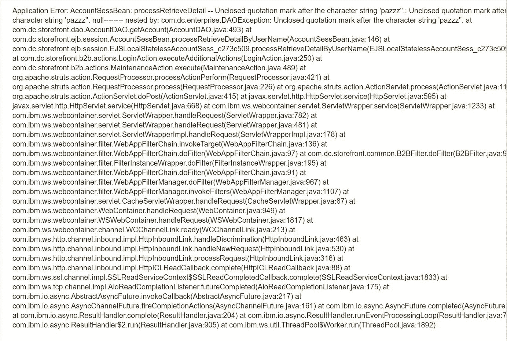

# 从 SQL 注入到名人堂

> 原文：<https://infosecwriteups.com/from-sql-injection-to-hall-of-fame-96a08c869acd?source=collection_archive---------3----------------------->

照片由[路易斯·戈麦斯](https://www.pexels.com/@luis-gomes-166706?utm_content=attributionCopyText&utm_medium=referral&utm_source=pexels)从[派克斯](https://www.pexels.com/photo/blur-close-up-code-computer-546819/?utm_content=attributionCopyText&utm_medium=referral&utm_source=pexels)拍摄

在评估目标 web 应用程序的漏洞时，Google Dorking 似乎是 bug bounty hunter 的武器库中一种经常被低估的技术。Google dork 查询，有时简称为 dork，是一个搜索字符串，它使用高级[搜索运算符](https://whatis.techtarget.com/definition/search-operator)来查找网站上不容易找到的信息。

Google Dorking 又称 [Google hacking](https://searchsecurity.techtarget.com/definition/Google-hacking) ，可以通过简单的搜索查询返回难以定位的信息。该描述包括不打算供公众查看但没有得到充分保护的信息。参考此处[https://whatis.techtarget.com/definition/Google-dork-query](https://whatis.techtarget.com/definition/Google-dork-query)

我最近遇到了一个有趣的谷歌呆子`inurl:storefrontb2bweb`,它使我们能够扫描容易受到 SQL 注入攻击的电子商务网站。这最初是由一个名叫 ratboy 的臭虫猎人发现的。在 Google 中输入这个查询将会返回 4 页的结果。不幸的是，大多数网站所有者没有漏洞披露，通过其他渠道联系他们的努力被证明是徒劳的。

我在谷歌上搜索“公司名称漏洞披露”，发现一个网站有漏洞披露渠道。易受攻击的参数是 username 参数，该参数在注入单引号或双引号时会引发 SQL 错误。

用于验证漏洞的 SQL 错误消息

通过下面的命令，利用这个 SQL 注入 bug 对于 [SQLMAP](http://sqlmap.org/) 来说是微不足道的。

`python sqlmap.py -u"http://localhost/storefrontB2BWEB/login.do?setup_principal=true&action=prepare_forgot&login=true&usr_name=foo"
-p usr_name --dbms=mssql --level=5 --risk=3
--tamper=between,space2comment -o --random-agent --parse-errors
--os-shell --technique=ES`

## 固定

正确的用户输入转义。

向受影响的公司报告这一漏洞使我在他们的名人堂中赢得了一席之地。我希望所有受影响的公司采取必要的措施来解决这个问题，更重要的是，考虑建立适当的渠道，负责任地报告这些问题，以便及时解决。