# 从 SSRF 到 AWS 凭据披露

> 原文：<https://infosecwriteups.com/from-ssrf-to-aws-credentials-disclosure-64c51e1bf5dc?source=collection_archive---------0----------------------->

你好，信息安全社区

在这篇文章中，我将描述一种攻击网站安全的攻击方法，更确切地说，是用吉拉软件配置的，识别出 SSRF 漏洞

吉拉软件是由 Atlassian 开发的专有问题跟踪产品，允许 bug 跟踪和敏捷项目管理。
所以从一个易受攻击的吉拉软件中我们会得到 AWS 实例凭证

下面是我们将采取的 5 个攻击阶段:从侦察到 AWS 实例的命令和控制

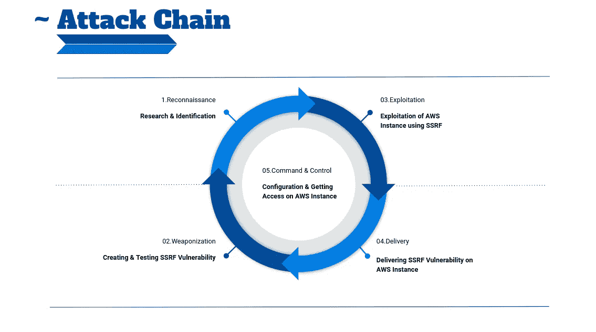

1.  侦察

*   这里我们使用 nmap 网络扫描仪，因此我们需要获取更多关于我们正在测试的产品的具体信息。
*   很明显，它托管在 Amazon Web Services 上，有两个开放的端口:80 HTTP & 443 HTTPS

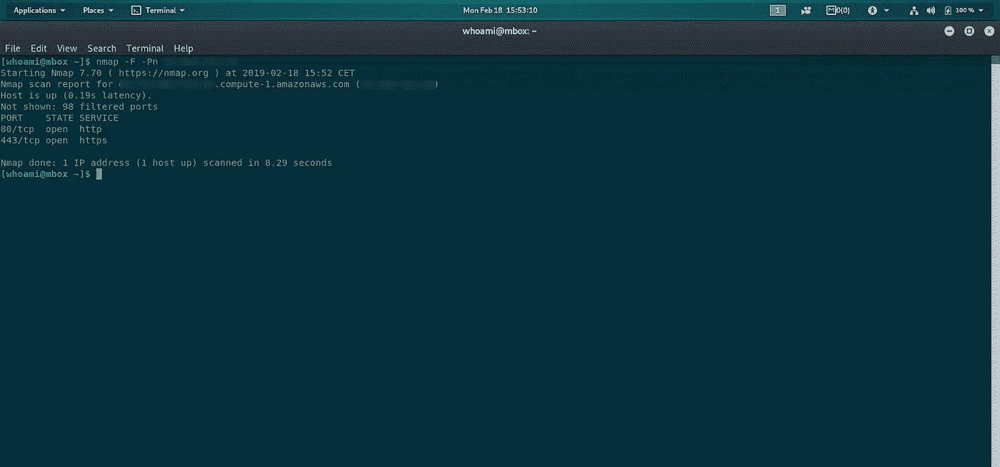

1

2.我们在浏览器中打开 IP，吉拉软件出现了！

*   如在任何基本测试中，应该看到什么版本包含软件产品等。
    吉拉的版本是 7.1.2

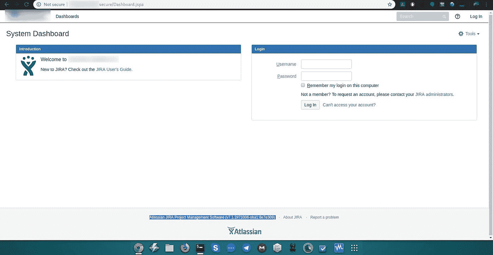

3.吉拉软件漏洞研究

*   在这里，我们对该版本进行了一些研究，我们发现所有早于 7.3.6 的版本都会受到 SSRF 漏洞的影响。

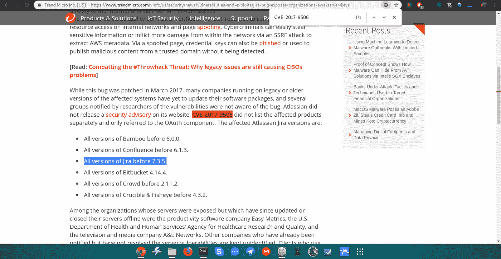

4.在 consumerUri =参数中发现了 SSRF 漏洞

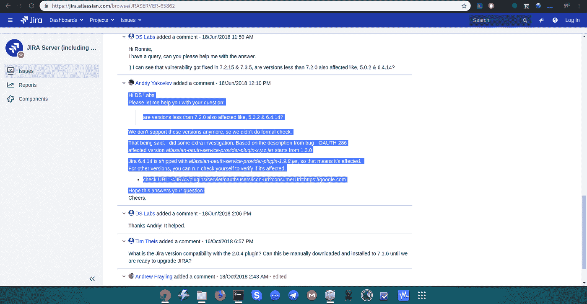

5.武器化——测试脆弱性

*   我们在 google.com 网站上用一个开放重定向测试了这个参数，它在那里工作

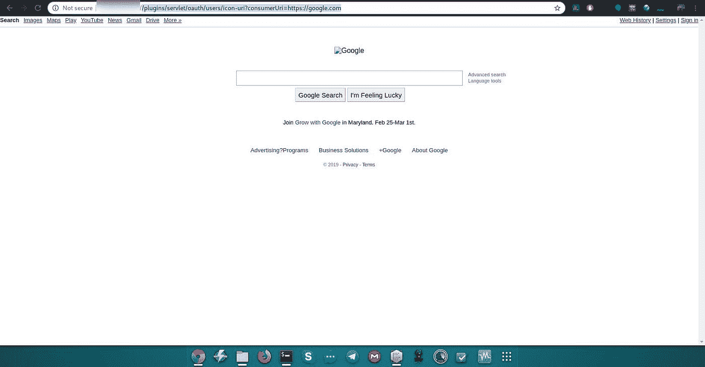

*   对其他弱点的测试使我们能够创建一个开放的重定向，从而创建一个指向该参数的 XSS 有效载荷！

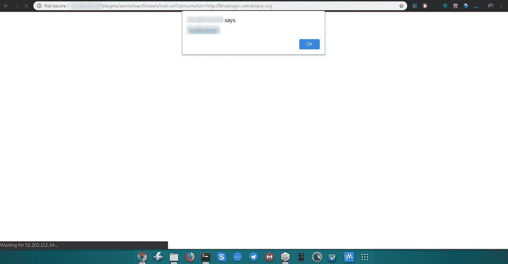

6.交付—在 AWS 实例上交付 SSRF 攻击！

*   我们必须将漏洞发送到 AWS 实例，确切地说是与亚马逊服务相关的 IP 169.254.169.254。

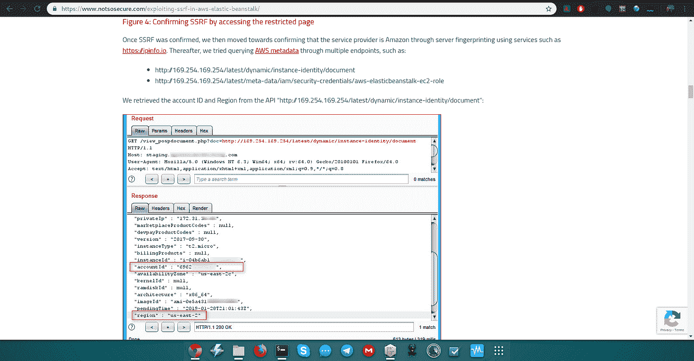

7.Exploitation-利用 AWS 实例，参数 consumerUri=

*   因此，它工作成功，正如我们在这里看到的，有关于实例的信息，如私有 IP、版本、InstanceId 等。

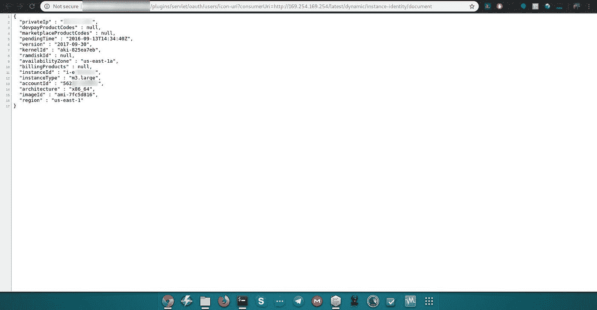

*   获取 AWS 实例的凭证
    ——我们将尝试获取 AWS 实例的凭证，但是可以看到访问密钥 id 和秘密访问密钥，这是访问它的基础。

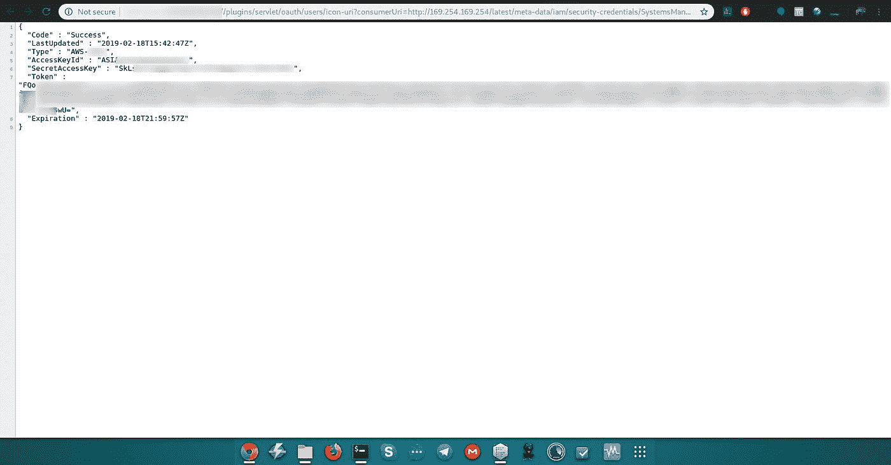

8.命令和控制 AWS 实例的配置

*   apt 更新 awscli
*   在这里，我们将在终端中配置 AWS CLI。
*   导出我们之前看到的凭据。

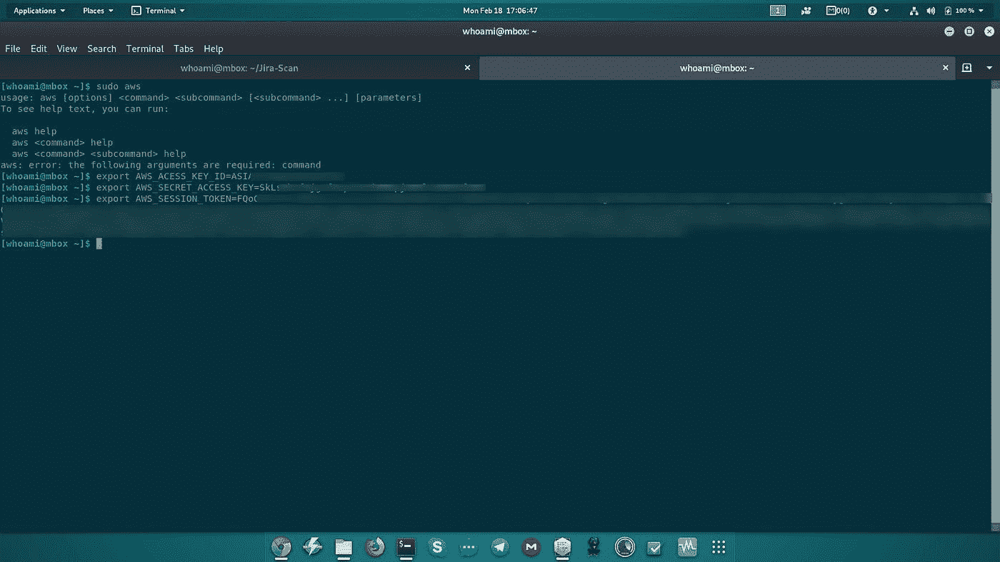

9.命令和控制—获得对 AWS 的完全访问权限！

*   最后，在配置之后，这使我们能够访问 AWS 实例，严格控制网站。
*   我们可以进一步上传任何 shell，但所有这些测试都是在客户自己的监督下完成的，这足以证明这一点，并进一步升级这一弱点。

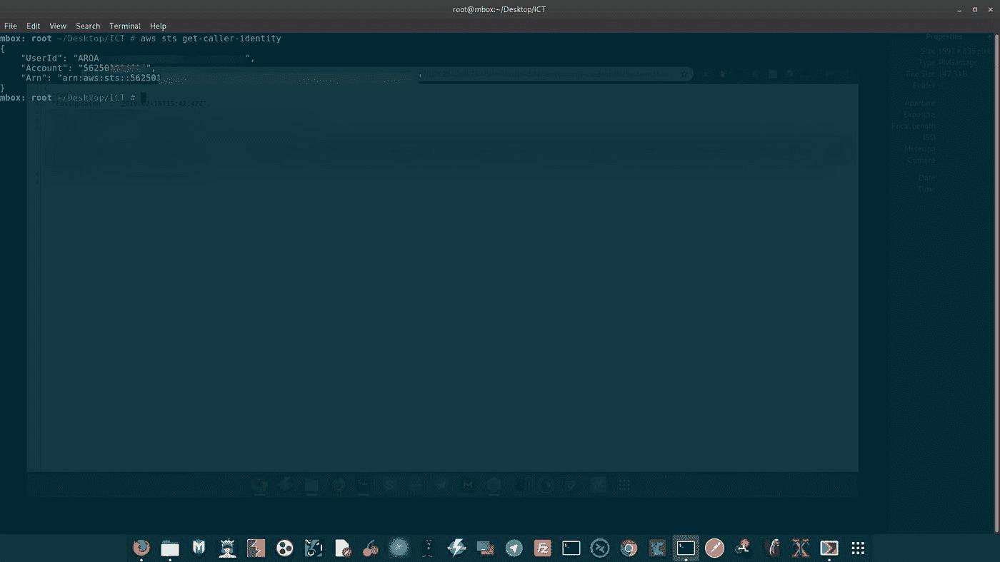

11.预防方法—一些不受此漏洞影响的方法

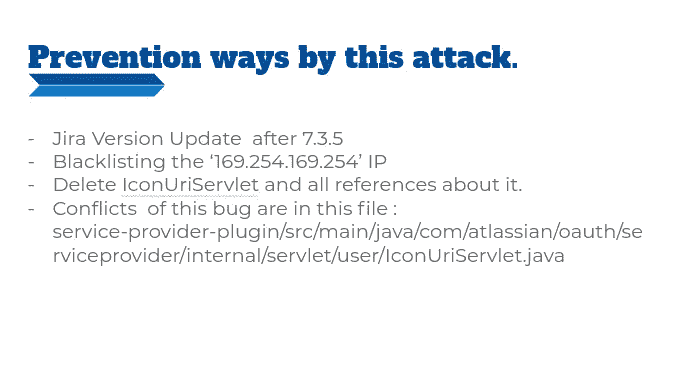

//希望，你在阅读这篇文章的时候过得很愉快，并且学到了新的东西。
//非常感谢。