# [完全披露] Hideez Key 2 失败:一个好主意如何变成 SPF(安全产品失败)

> 原文：<https://infosecwriteups.com/full-disclosure-hideez-key-2-fail-how-a-good-idea-turns-into-a-spf-security-product-failure-c90a4533fda9?source=collection_archive---------0----------------------->

**TL；DR:** 这是对安全令牌&密码管理器的一个很好的概念的深入探讨，由于缺乏适当的研发和威胁建模，它变成了一个可怕的产品。

**序言:**在我用 [#PocketGlitcher](https://limitedresults.com/2021/03/the-pocketglitcher/) (即下面的视频)首次成功绕过基于 NRF52 的 Slok 智能锁的 APPROTECT 读出保护后，我开始四处寻找更有趣和令人担忧的(从安全角度来看)基于 NRF52 的产品。

# 又来了 [#Hideez](https://hideez.com/) [键 2](https://hideez.com/products/hideez-key-2) ！

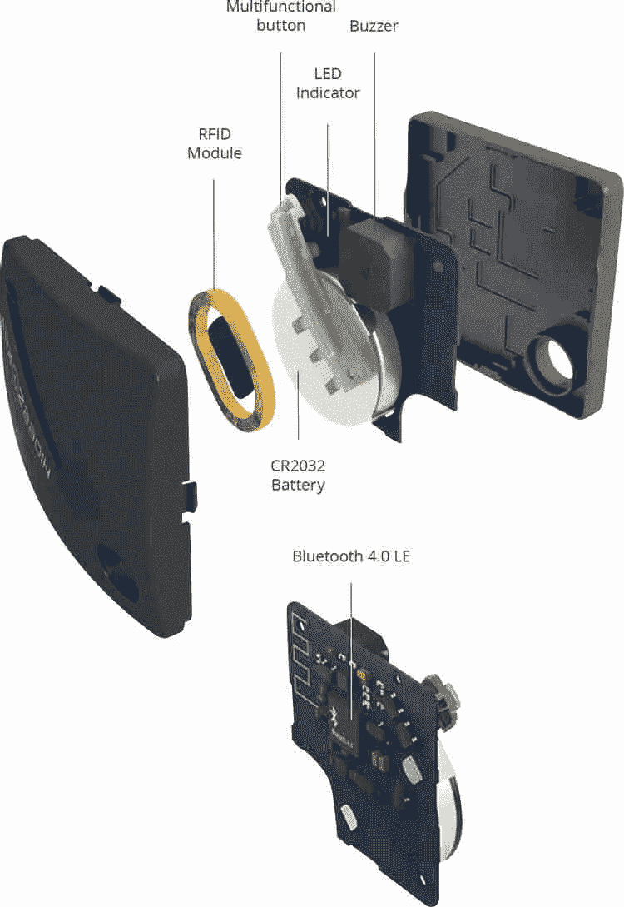

为了让您快速了解这款硬件，请查看他们的视频介绍:

既然你已经了解了这个产品的要点。你会同意我的观点，这个概念非常有趣，现在让我们看看它在实际产品中的实现是否符合预期。

我将把我的调查分成几段，以尽可能保持线性。

# 被动侦察；

首先(即使没有尝试打开令牌),我们可以立即注意到我们最好的硬件黑客朋友:FCC ID。在这种情况下: [2AQ5UHIDEEZKEY2](https://fccid.io/2AQ5UHIDEEZKEY2)

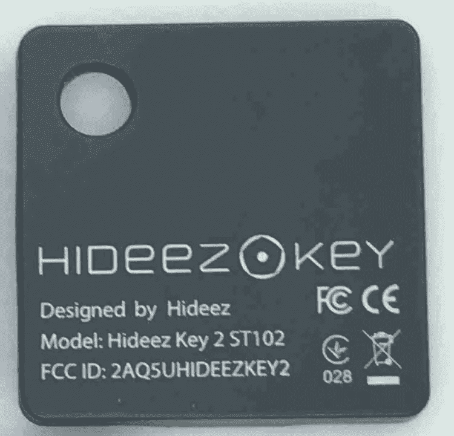

这就引出了第一组关于 PCB 外观、所用 MCU 以及 DUT(被测器件)所用频率的信息。

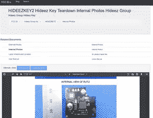

FCC 数据库中的内部照片 PDF 在 DUT 的 PCB 被埋在一层坚硬的环氧树脂下面的情况下特别有用。这将有助于我们提前计划从哪里开始刮环氧树脂，以及如何接近外壳的开口和如何到达 MCU。幸运的是，这些防篡改措施都没有到位。

总的来说，目前收集的大部分信息都符合 Hideez 的说明书。

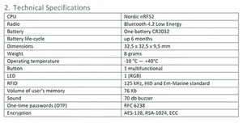

当我在网络空间寻找更多关于 DUT 的信息时，我很快发现了一件有趣的事情:Github 上有一个回购协议，其中包含了很多有趣的内容！🍬🍭🧁🍰

其中…原理图，BoM(材料清单),甚至 PCB 该死的 CAD 文件！

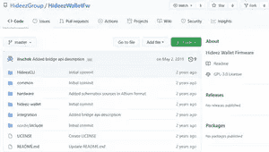

在实践中，我可以获得我需要的一切，轻松找出 NRF52 的 SWD 引脚的位置，甚至不用在连续模式下摆弄显微镜、GIMP 和万用表。(感谢 Hideez ❤)

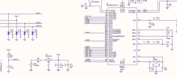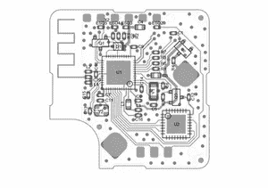

仔细查看 CAD 文件上的 Altium，我很容易就找出了 SWD 的引脚排列:

请注意，此时我也在寻找一个更好的位置来探测来自 NRF52 的 DEC1 和 RESET 引脚，以便稍后使用它们通过我的 [#PocketGlitcher](https://www.whid.ninja/blog/hashtags/PocketGlitcher) 进行故障注入攻击:

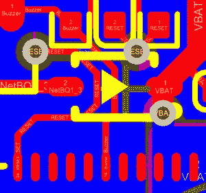

即使到最后，我甚至不需要它们。🙃

***结论，在动手之前一定要做足功课:在做一个硬件黑客研究的时候，FCC 数据库、Google、中文搜索引擎是你最好的朋友！***

**设置设备:**在开始主动侦察阶段之前，为了复制真实场景，我决定在笔记本电脑和 iPhone 上安装 Hideez 应用程序。随后，我用一堆假证件填了进去。这将有助于我以后能够获得最终被加密的固件(即已知明文攻击)。

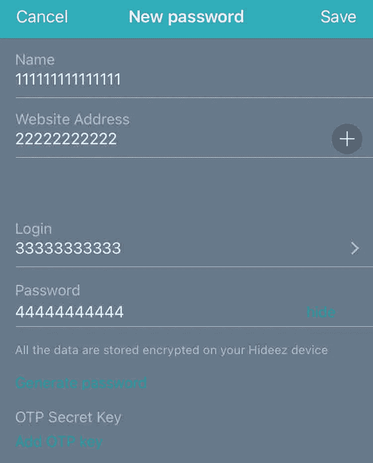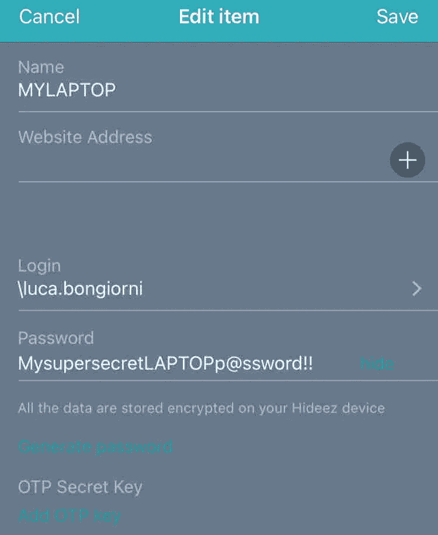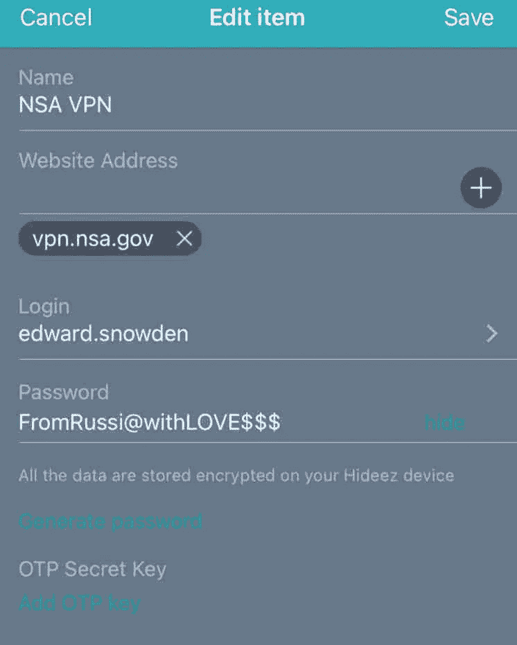

# 主动侦察:

现在我们有了一个可以使用的 Hideez Key 2，里面有一些密码，什么时候可以开始打开它，检查我们在侦察阶段发现的东西是否与现实相符。

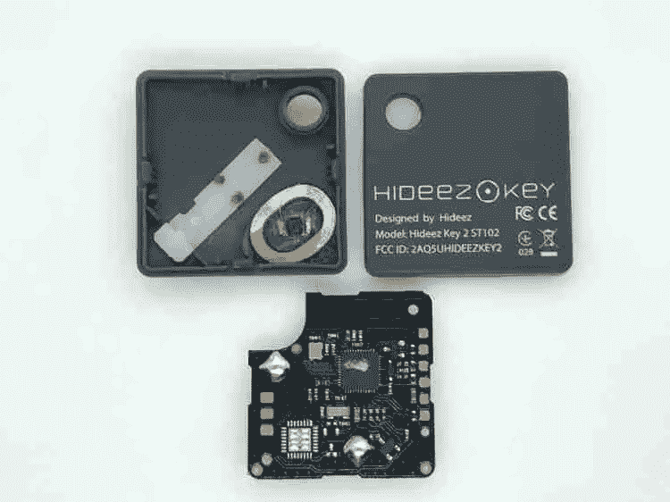

正如所料，用我的显微镜仔细观察，PCB 看起来与原理图和 CAD 设计相匹配。酷！

只是为了 100%确定我不会在尝试固件转储时烧坏电路板，我用万用表仔细检查了 SWD 接口的引脚仍然是正确的。的确如此！

# 通过 SWD 接口转储固件:

为了证明真正的威胁者在几分钟内转储固件(即 [#evilmaid](https://www.whid.ninja/blog/hashtags/evilmaid) 攻击)而不在 PCB 本身留下痕迹是多么容易，我决定使用我的带有纳米探针的 PCB 工作站。

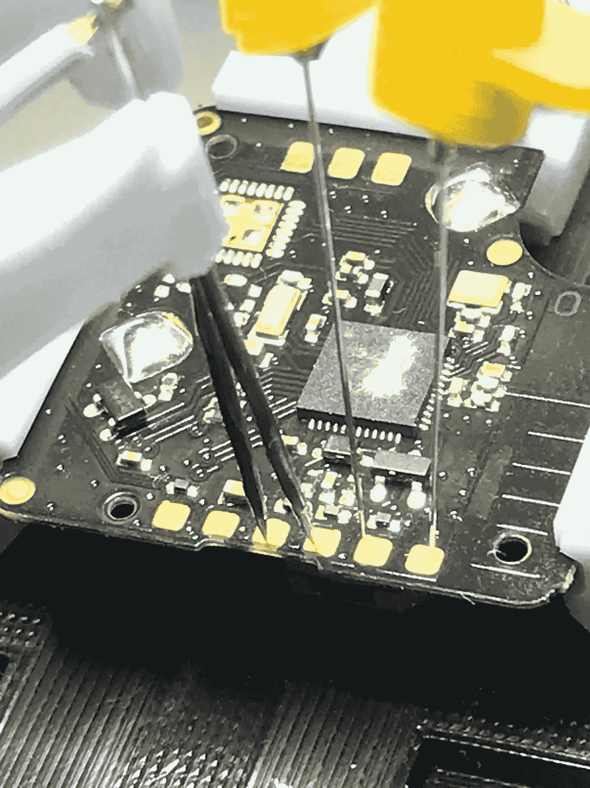

在一切都正确设置并连接到我的 J-link 调试器后，它花了 60 秒来转储固件(这让我非常惊讶，因为它是一个用作 2FA 和密码管理器的安全令牌)！😱😱😱

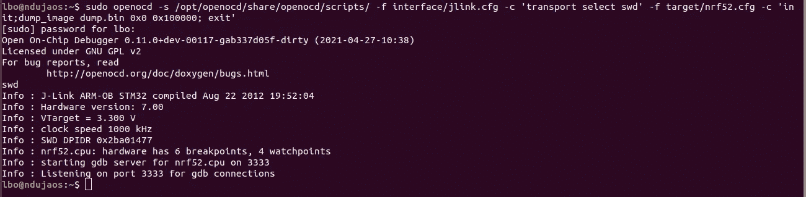

# 固件分析:

在经历了最初的震惊之后，我认为转储中的数据仍然会以某种方式加密。因此，我已经做好了心理准备来玩# [CyberChef](https://gchq.github.io/CyberChef/) 的功能，以便破解 sh * t if 这个安全令牌。

嗯…我错了。

***现有的和被用户“删除”的凭证都在那里！明文的。***

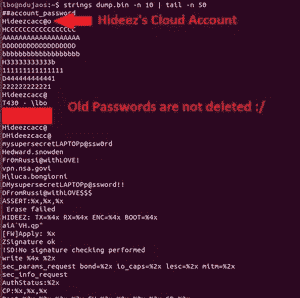

**一切！允许登录 Hideez 网站的云密码，笔记本电脑的凭证，网站登录用户和密码都是明文！**

在这一点上，我会让老好人 Arny 表达我的感受。

# RFID 功能:

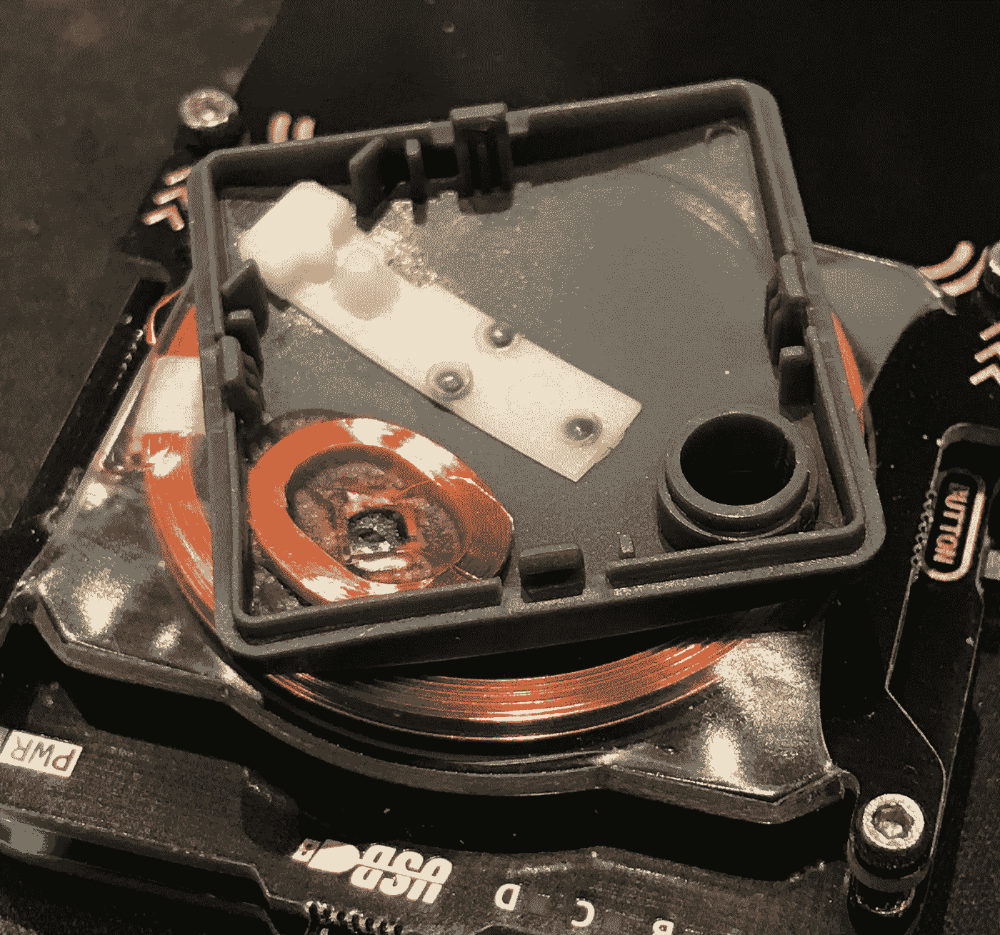

还有一个线索(从硬件安全角度)是关于 RFID 标签的。从箱子的开口可以明显看出，Hideez 宣传的 RFID 功能与 NRF52 无关，而只是一个独立的可重写标签。(咩……)

这有点遗憾，因为从 Nordic 的 NRF52-DK 原型/评估板可以看出，NRF52 应该支持 NFC 协议。

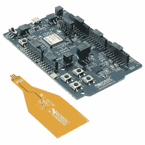

总之，长话短说，我想用我的 Proxmark 检查一下那是什么标签:它看起来是一个经典的 T55xx 可重写标签。

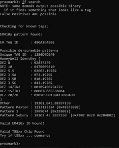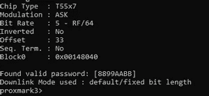

可悲的是，这种标签，就像所有 125KHz 易受攻击的标签，如 EM4xxx 或 HID Proxcard 等，很容易用武器化的远程阅读器从远处克隆(见下面的几个例子)。

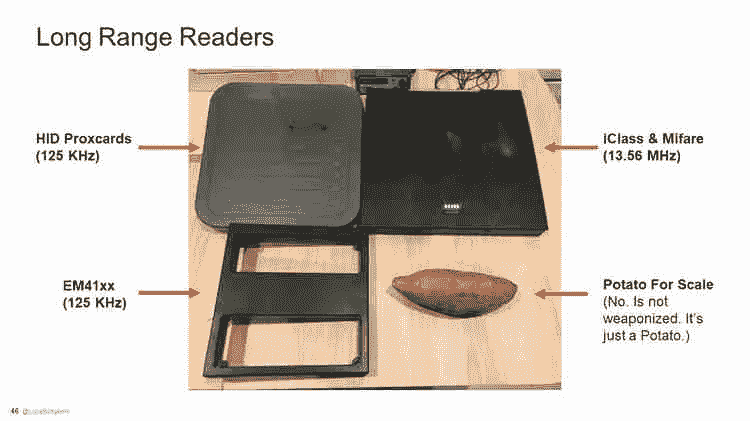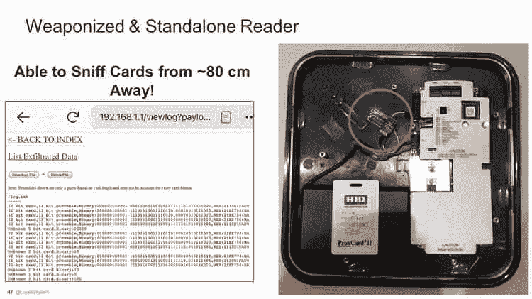

# 安全备注:

缺乏适当的安全 R&D 和威胁建模显然是该产品失败的根本原因。特别是，我会花更多的时间去寻找:

*   一个适当的 MCU，带有一个安全区域，使任何人都难以提取固件(即抗毛刺)。我会启用读出保护！
*   更好的外壳设计，以便仍然允许更换电池，但避免完全接触 PCB。当然，主动防篡改检测机制将使加密内容无效。
*   安全飞地顶部的最终加密级别，目的是通过对被盗令牌的无限制访问时间来减缓最终威胁参与者的速度。

考虑到我还没有时间深入研究移动应用程序、API 端点和 BLE 通信协议，我不能确切地说有哪些地方可以改进。不过，我绝对不会忘记在那里做一个适当的威胁建模。😉

# 未来工作:

最后，调查还没有结束，我还想了解一下 DUT 的一些方面(如果时间允许的话):

*   **APK 静态逆向工程**

搜寻常见的硬编码密钥、后门、隐藏的 API 端点等。

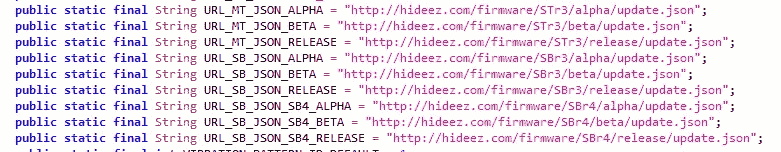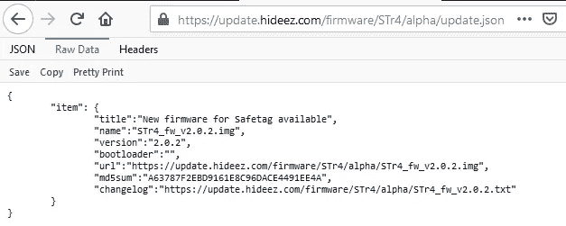

*   **API 端点测试**

通过证书锁定旁路和 MiTM 流量分析

*   **BLE 协议分析**

通过被动和 MiTM 攻击

**所以，敬请关注**[**@ whid _ ninja**](https://twitter.com/whid_ninja)**！**

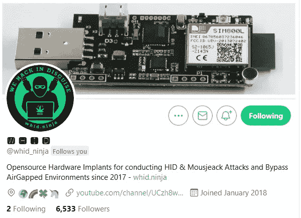