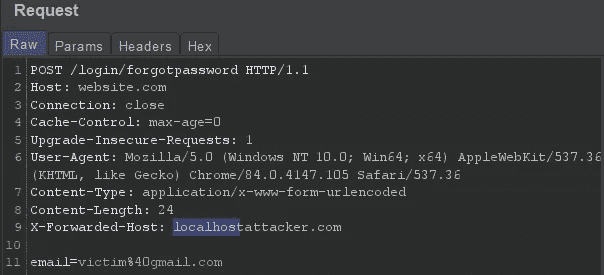
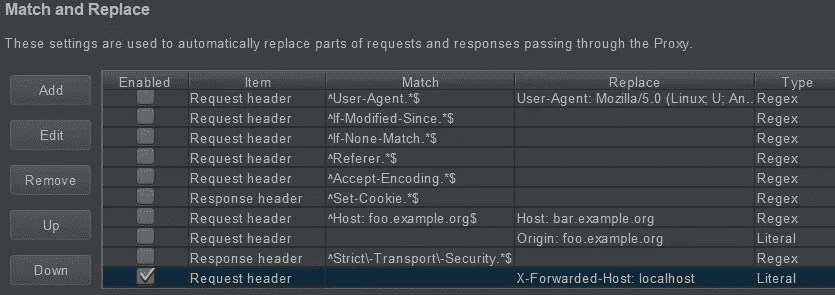
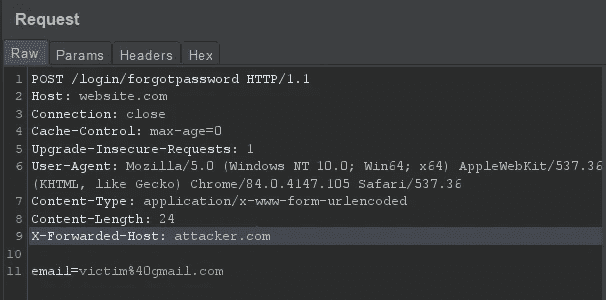

# 有趣的标题和忘记密码，有一个转折:

> 原文：<https://infosecwriteups.com/fun-with-header-and-forget-password-with-a-twist-af095b426fb2?source=collection_archive---------1----------------------->



头球是很好玩的东西。最常见的是 X-Forwarded-For(通常用于 waf bypass)和 X-Forwarded-Host(就个人而言，这是实现 dns/http pingbacks 的一个有趣的方法，有时是 ssrf)。

本文将介绍这样一种情况，我能够使用其中一个标题来欺骗网站发送一个包含我选择的域名的忘记密码链接。

X-Forwarded-Host 和 forgot password 链接，有一点不好玩:

剧透警告，扭曲，加上这个错误的性质，导致了较低的支出，比如果没有所说的扭曲低得多。

**初始阶段:**

这个很容易测试，但是很容易漏掉测试。说实话，不通过 twitter 和#BugBountyTip 找到这个

```
---For waf bypass, and similar---X-Forwarded-HostX-Forwarded-PortX-Forwarded-SchemeOrigin: nullOrigin: [siteDomain].attacker.comX-Frame-Options: AllowX-Forwarded-For: 127.0.0.1X-Client-IP: 127.0.0.1Client-IP: 127.0.0.1
```

实际上运用它的智慧，我可能会错过它。至少第一次是这样。也许几天、几周、几个月后，我会无聊地通读我的笔记，有一个清晰的时刻，我会尝试一下:)



注意 X-Forwarded-Host 的匹配和替换规则

我在这个叫 website.com 的网站上创建了这个网站，它已经注册了，却忘记了密码。

像往常一样，我第一次注册是为了进一步了解这个网站如何运行，它为注册用户提供了哪些额外的访问权限，以及它是否可以用于 idor-s，甚至通过 false2true 获得管理功能(根据[我的另一篇文章](https://medium.com/bugbountywriteup/false2true-match-and-replace-bug-hunting-a-cautionary-tale-fbe7020f02ad))

在点击的过程中，什么也没有发现，有一个“最后”的东西需要测试。我倾向于把它留到最后，因为我要退出。

因此，我注销，并前往忘记密码页面。

**忘记密码测试:**

当时(我后来了解到更多)，其背后的想法是看看整个忘记密码链接看起来是什么样的:是否有某种东西表明有一种方法可以猜测将链接与用户相关联的重置链接参数。但是，还有另外一件事需要注意:链接本身的基域。

**PoC 前步骤:**

输入我的电子邮件地址后，我点击了提交按钮，然后等待。

过了一会儿*作为解说员的海绵宝宝的声音:)*

我检查了我的电子邮件，几乎立即注意到重置密码链接有一个非常不寻常的基本域，很难错过:

而不是预期

[https://website.com/resetpassword?email=email@website.com&id = 1234&hash = random stuff](https://website.com/resetpassword?email=email@website.com&id=1234&hash=randomstuff)

我有:

[https://localhost/resetpassword?email=email@website.com&id = 1234&hash = random stuff](https://localhost/resetpassword?email=email@website.com&id=1234&hash=randomstuff)

我想你已经看到了潜力。

但是，这并不像看起来那么明显。

**概念验证:**

我去找 X 转发主机的明显内容:



但是我得到了不好的请求

WTH？

这就是经验/记忆/笔记派上用场的地方。我从前面的列表中想起了这一部分:

来源:[siteDomain]. attack . com

这让我有了这样的想法:

如果 attacker.com 在黑名单上，而本地主机在白名单上，那么= > localhost.attacker.com 就是答案(现在你也明白为什么赏金会更低了)

这一次的结果是 200 OK，并且电子邮件是以 localhostattacker.com 作为基本域发送的:


请注意，它接受了 localhostattacker.com，甚至没有要求点。

现在，使用 burp collaborator 甚至您自己的 vps，您可以记录密码重置所需的随机字符串，只要用户/受害者单击该链接。这样你就可以接管用户/受害者的账户。也就是说，只要用户不介意点击名称中包含 localhost 字符串的链接，更不用说不记得曾经请求重置密码:)

有趣的是，无论他们使用什么解析器，它实际上都接受任何基域，只要它包含 localhost，这意味着 junklocalhostjunk.com 也被接受。

这表明记笔记以及拥有免费或专业版的打嗝是多么的重要。或者任何其他允许向请求添加标题的方式，在这些标题中包含各种类型的值。

此外，不要忘记监控这些响应的内容，同时记住它是否是一些熟悉的东西，一些您在整个 bug 搜索过程中看到的，当时看起来不太重要，但现在可能被证明是至关重要的东西。