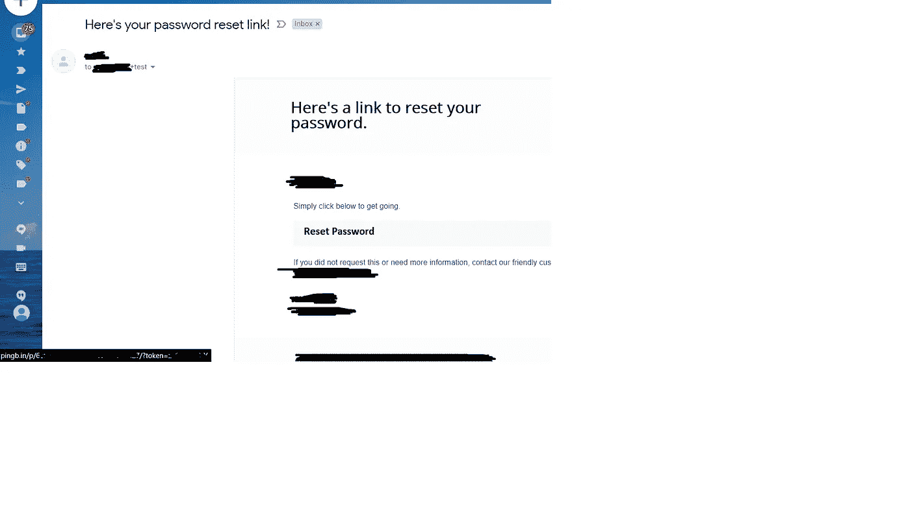

# 有趣的标题和忘记密码

> 原文：<https://infosecwriteups.com/fun-with-header-and-forget-password-without-that-nasty-twist-cbf45e5cc8db?source=collection_archive---------1----------------------->

## ——没有那个讨厌的扭曲

与我的另一篇[文章](https://medium.com/bugbountywriteup/fun-with-header-and-forget-password-with-a-twist-af095b426fb2) :)
相比，这篇文章没有那种可怕的警告，在 bug 搜索期间，摆弄头部是很重要的。但是，很容易将自己限制为只发送带有盲 XSS/盲 sqli/盲 rce/等的 GET 请求。内部引用，用户代理，Cookies，自定义标题等。但是，这是一个容易错过的事情。如果我没有在 burp 套件中使用匹配和替换规则，我就不会发现这个错误。

**初始阶段:**

为了根据 portswigger 文章[链接]确定是否有延迟的 pingbacks，我在有效负载中将 Referer 头设置为 pingb.in。并且，在浏览了目标网站之后，我使用各种功能检查了任何 pingbacks。什么都没有，连域名系统都没有。我想，如果不超过几个小时，可能会有几个小时的延迟，所以我让它去。剧透:在这种情况下，从来没有得到任何延迟的 pingbacks，但这篇文章不是关于这一点:)

**发现:**

有问题的目标网站也有注册功能，用它忘记密码。在前面的步骤中，我还触发了忘记密码，以便稍后查看。令我惊讶的是，当我检查我的电子邮件时，密码恢复链接使用了我的 pingb.in 链接。

在进一步检查打嗝历史后，我注意到发送忘记密码的电子邮件的原始请求有 Referer:[https://targetwebsite.com](https://targetwebsite.com/)，这解释了一切。

**概念验证:**

现在，我知道如何构建我的 PoC。

1 —输入测试帐户 B 的电子邮件

2-拦截 POST 请求

3 —将有效负载中的引用标头更改为 pingb.in

4-从测试帐户 B 的电子邮件中单击中毒链接

5 —检查 pingb.in 日志，它将发出 GET 请求，其中包含更改帐户 B 的密码所需的帐户 B 的令牌。

除了 pingb.in，burpcollaborator 也可以用于您有权访问的 vps。

它只是向您展示了 Referer header 除了一些地方使用它来保护 CSRF 或生成返回到上一页的链接之外，还有一个额外的作用，这是一个很难以一种有用的方式利用的问题(至少从个人经验来看)。