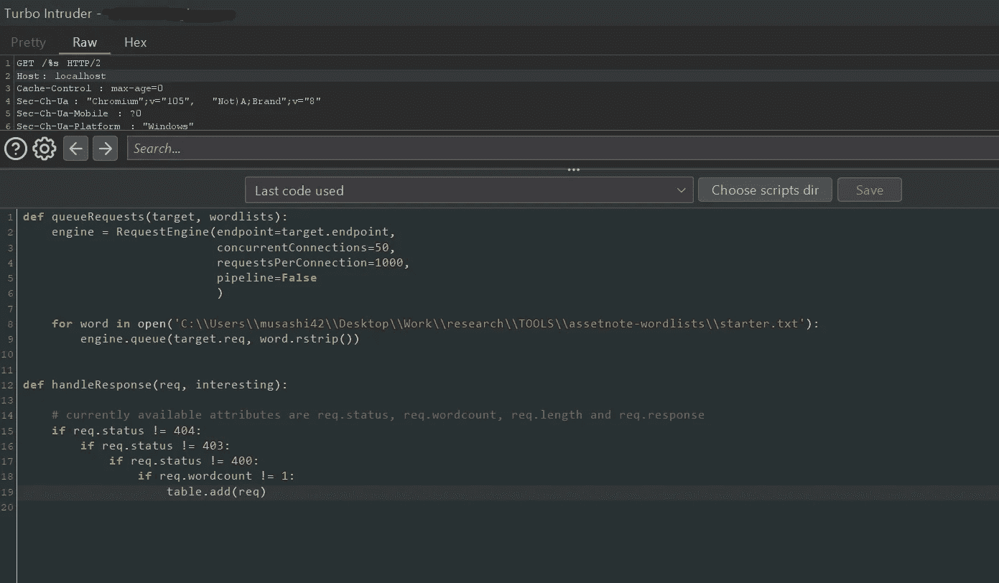
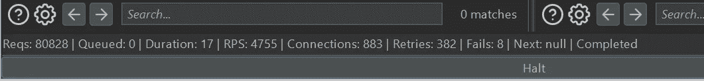

# 涡轮入侵者的乐趣，

> 原文：<https://infosecwriteups.com/fun-with-turbointruder-7be04ddcd73?source=collection_archive---------2----------------------->

## 或者，如何在做一些 py 编码的同时用 gui 获得 ffuf

作为一名 bug 猎人或任何与 IT 密切相关的角色意味着必须不断学习(有些人可能会认为活着就是要一直学习，我同意，但这不是关于生活，这是一个快速阅读而不是一本书(:)。而且，学习意味着在各个领域的提高。提高技能还有另一个原因——必要性。

**FFUF 瑕疵**

我先说我爱 ffuf。我有大量定制的 ffuf 脚本(即 bash 脚本利用特定的标志和单词表进行快速扫描)，我不认为这种情况会有尽头。但是，由于某些原因，有些网站对它或者任何与命令行相关的东西(例如 curl，wget，…还有其他的？(: ).

通常的原因是缺少合适的用户代理头。但是，从我最近的经验来看，有些时候不管用户代理、Cookie、自定义头、curl 中的-k 标志，对于那些有证书问题的网站来说，事情就是不想像预期的那样工作。但是，如果当你使用打嗝时，这些东西如预期的那样工作，那么为什么不使用打嗝入侵者而不是 ffuf 呢？除非你用的是社区版。或者这真的阻止了你快速前进？

**打嗝涡轮入侵者**

它是免费的，但最重要的是(或者说是次要的，取决于你的预算)，定制它比“打嗝入侵者”有趣得多(至少我这个编码者喜欢它的这一方面(:)。

它的好处是，它有模板，非常适用于各种场合的模板。有一个关于竞争条件的模板，然后是常见的目录暴力、登录暴力、子域发现、http/2 聚焦等等(我希望随着时间的推移会有新的内容出现)。

**turbo intrusor—定制**

这是来自真实世界攻击/测试的例子，来自你可以自由假设并且正确的许多 if 条件，我不得不暂停->配置->攻击->重复许多许多次来微调脚本。使用和会更漂亮，但这看起来也不坏(:

打嗝涡轮入侵者屏幕

除了定制响应过滤之外，您还可以定制速度，但是要注意失败(数字越大，成功的机会就越小，当涉及到并发连接和请求连接时，您可能应该重新配置/编辑代码):

失败:8，这一点都不差，但如果它进入 100 和 1000，那就不好了

**但是为什么要用 TurboIntruder 呢？**

嗯，首先，当使用 ffuf 进行模糊处理时，有时网站和服务器会表现出…意想不到的行为。虽然有时添加用户代理可以解决奇怪的行为，但与 curl 或类似的浏览器相比，有时更难弄清楚为什么一些网站在通过浏览器访问时会以某种方式做出响应。相信我，我不止一次遇到过这种情况，我会花很多时间试图找出为什么会有不同的反应。我会去掉所有的头，我会确保 curl request 和 burp request 具有完全相同的头顺序，当然 burp 有“复制为 curl 命令”选项，我也会使用它，但是，在某些情况下，我仍然会在两个不同的程序之间得到不同的响应。

虽然一开始看起来没什么大不了的，但是让我告诉你，如果一个方法在一个有趣的端点上以 200 OK 结束，否则会给出 401、403 或 404，而另一个方法继续得到 404 或除 200 之外的任何值，会怎么样？这就是挫败感的来源。而且，直到今天我还在学习，一些对我来说已经成为一种规范的寻找 bug 的方法是错误的。

使用 burp turbointruder 的另一个原因是，它使模糊标题之类的东西变得不那么混乱，并且您可以立即检查响应，因为它们被记录在表中，这对于区分误报和漏报非常有用。

我希望您能尝试一下，如果没有其他原因的话，那就亲自体验一下 python 在寻找 bug 方面的强大功能。我也只给出了一个例子，但我希望它能激励您更深入地研究 turbointruder，并在它的帮助下找出一些很酷的 bug。祝大家猎虫快乐！(:

## 来自 Infosec 的报道:Infosec 每天都有很多内容，很难跟上。[加入我们的每周简讯](https://weekly.infosecwriteups.com/)以 5 篇文章、4 条线索、3 个视频、2 个 GitHub Repos 和工具以及 1 个工作提醒的形式免费获取所有最新的 Infosec 趋势！