# FunBox-2 演练(Vulnhub)

> 原文：<https://infosecwriteups.com/funbox-2-walkthrough-vulnhub-b1933209acf3?source=collection_archive---------2----------------------->

## 描述

这是 [**@0815R2d2**](https://twitter.com/@0815R2d2) 做的一个 **2** boot2root CTF。这是在 Vulnhub 上发现的一系列有兔子洞的机器。如果你有密码破解的知识，这是一个简单的问题。下载请访问:

**

> *剧透警报！！！获得的知识:-*

1.  *FTP 枚举*
2.  *Zip2john*
3.  *开膛手约翰*
4.  *数据库历史使用*
5.  *权限提升*

> *网络扫描*

*启动你的终端，开始搜寻受害者。这次我使用了 Nmap，但是你也可以使用你自己的工具。(在 NatNetwork 中执行)*

*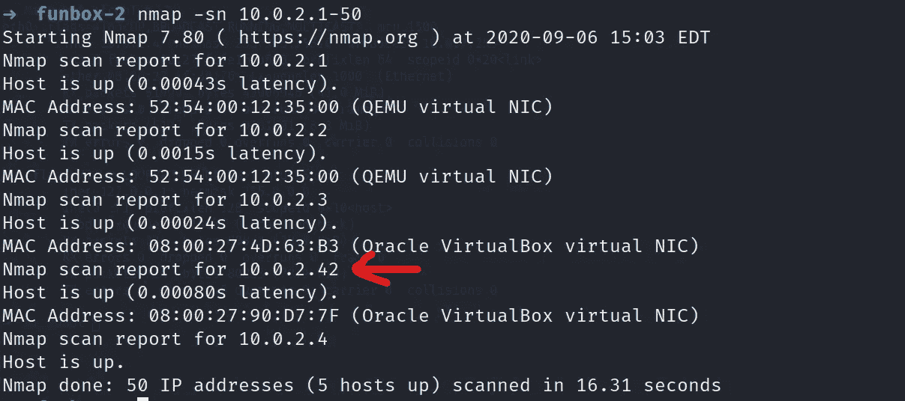*

*所以我们的目标是 10.0.2.42*

> *端口扫描*

*让我们使用 Nmap 找出端口上运行的不同服务，这将为我们提供危害受害者的途径。*

*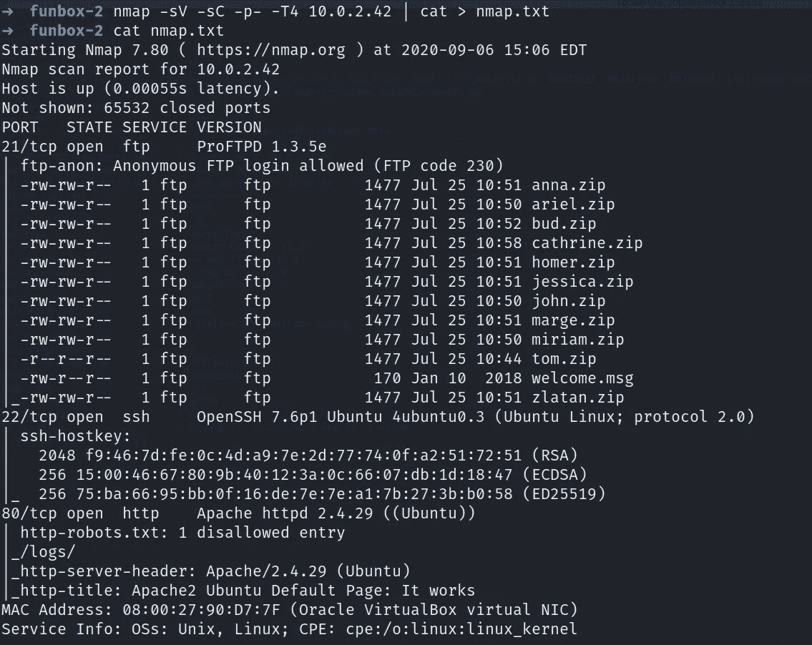*

*如果有人在 Nmap 交换机方面有问题，请访问[***https://nmap.org/***](https://nmap.org/)*

> *网络侦察*

*在 80 端口访问受害者的主页，显示的是 Ubuntu 的默认页面，没有任何有用的东西。所以，我尝试用 gobuster 来列举隐藏的目录。*

*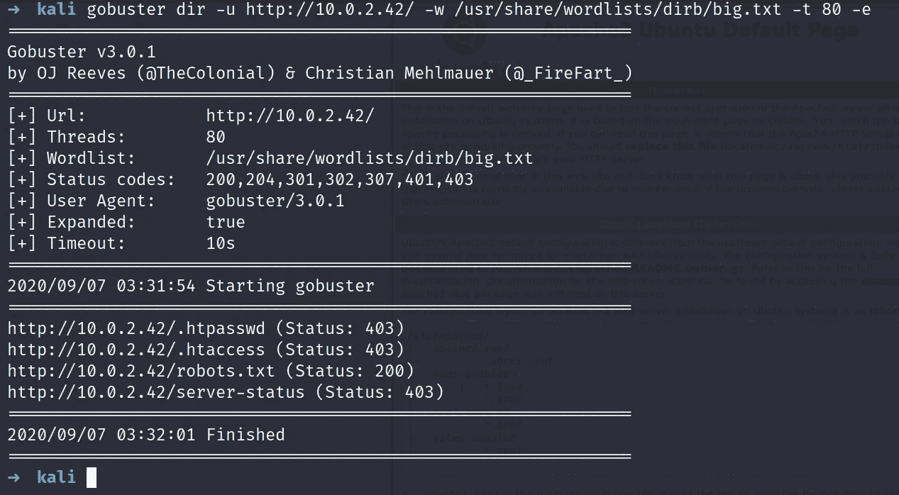*

*好的，我们得到了 robots.txt，它包含了一个不允许的 URI，所以这里也没有。*

> *FTP 侦察*

*让我们在浏览器上访问托管 FTP 服务的端口 21。*

*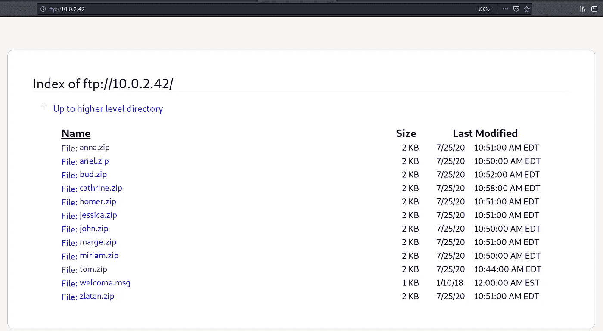*

*所以我们有很多文件。我必须说这个盒子考验你的耐心。我已经下载了所有的 zip 文件，但是 30-40 分钟后，很明显只有 tom.zip 文件可以用了😩…*

*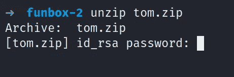*

*…但是当你解压时，它会要求你输入密码☝️*

> ***裂解阶段***

*该用 zip2john 了。*

*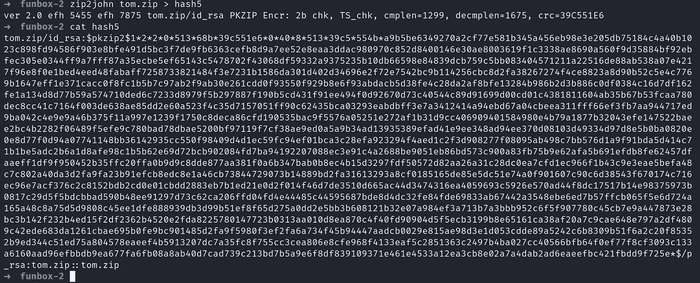*

*如你所见，这是一个 PKZIP 格式的散列，我们可以通过开膛手约翰破解它。只在一个单独的文件中复制散列来破解它。*

*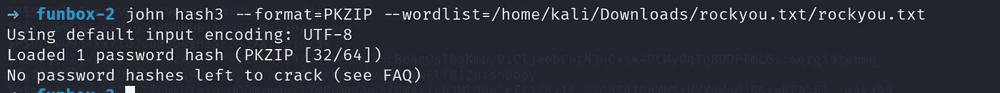*

*我已经破解过一次了，所以默认情况下它保存在 pot 文件中。👇*

*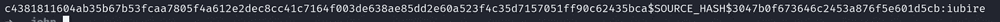*

*现在使用密码解压文件，您将获得一个 id_rsa 文件。使用它进行 SSH 登录。*

*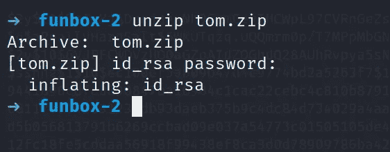*

> *SSH 侦察*

*因为我们有了用户 tom 和他的私钥，所以让我们进行 ssh 登录。*

*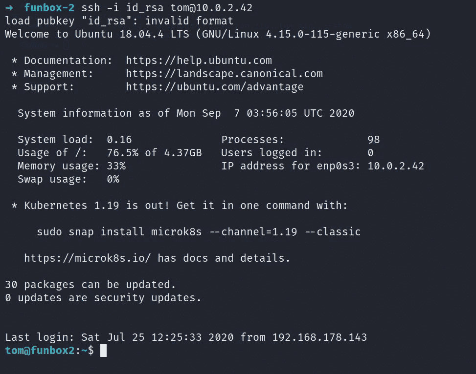*

*但是登录后，你会注意到我们在 rbash👇。让我们绕过它。*

*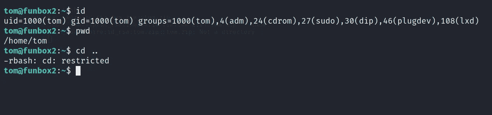*

*我已经使用 VIM 绕过了受限的 bash shell。在终端上键入 vim，并遵循以下命令👇*

*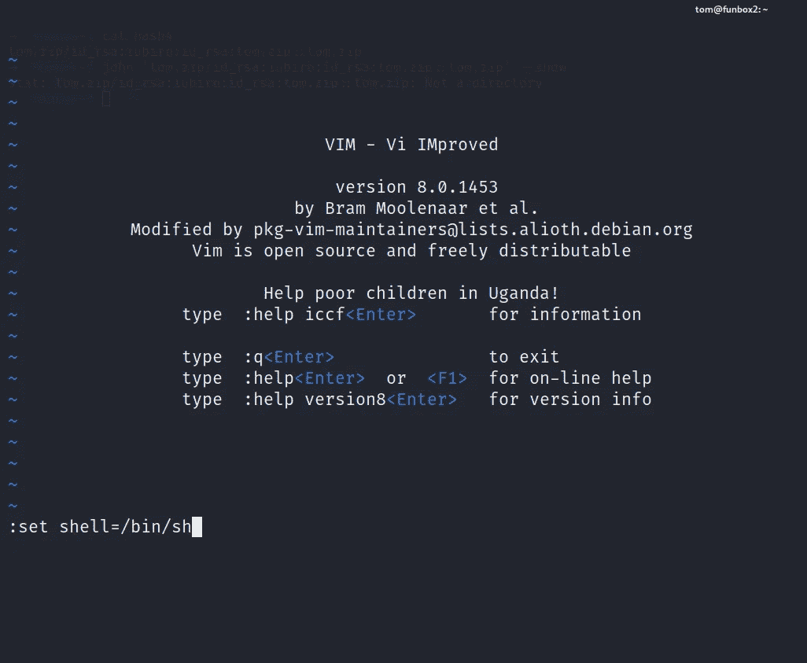*

*又是这个*

*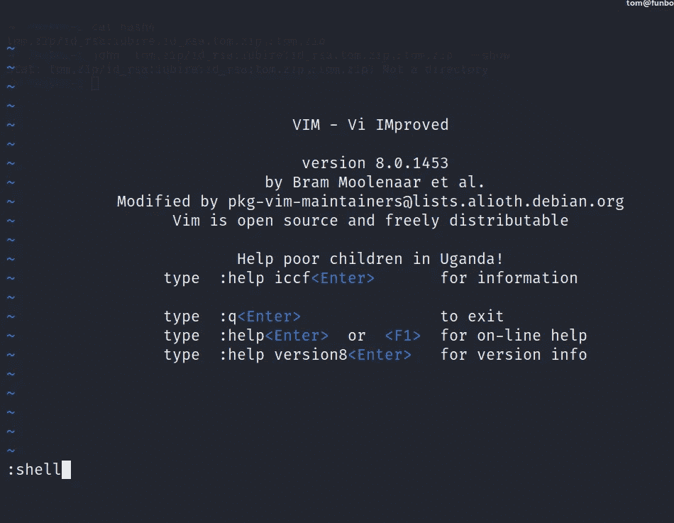*

*现在输入交互式 shell 的 python 脚本。*

*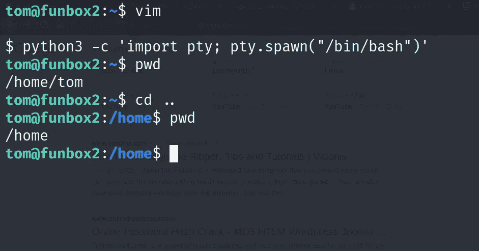*

*所以，我们已经成功绕过了 rbash。现在做一个 **ls** ，你会注意到一个**。mysql_history** 文件。如果你使用过 SQL，你会注意到密码被压入一个数据库，我不会解释。*

*现在输入以下命令，查看是否有任何文件设置了 SUID 位。*

**

*因为我们有一个进程，所以我们可以使用它和密码来提升我们的权限。访[**【https://gtfobins.github.io/#】**](https://gtfobins.github.io/#)为剧本。*

*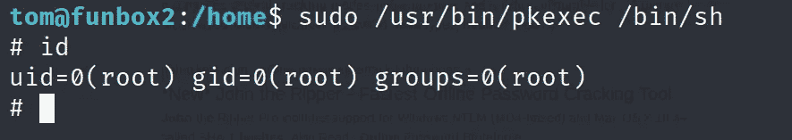*

*让我们看看根旗。*

*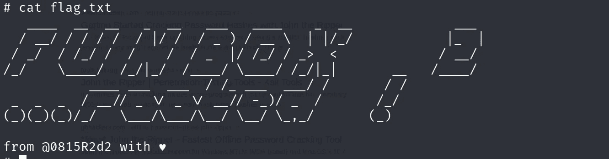*

*如需更多演练，请继续关注…*

# *在你走之前*

*访问我的其他演练:-*

* [## 摄影师:1 Vulnhub 漫游

### 来自 Vulnhub 的描述

medium.com](https://medium.com/@Shubham_Singh_/photographer-1-vulnhub-walkthrough-e7c1f3a5dde7)  [## 黑玫瑰:1 次穿越(Vulnhub)

### 我这边的描述

medium.com](https://medium.com/@Shubham_Singh_/blackrose-1-walkthrough-vulnhub-b0517597e15c)  [## 如此简单-1 Vulnhub 演练

### 来自 Vulnhub 的描述

medium.com](https://medium.com/@Shubham_Singh_/so-simple-1-vulnhub-walkthrough-184cd19cd788)  [## FunBox-1 漫游(Vulnhub)

### 欢迎学习者，进入 FunBox 的演练:1，一个由@0815R2d2 制作的 boot2root CTF，在 VulnHub 上找到。这是我的…

www.linkedin.com](https://www.linkedin.com/pulse/funbox-1-walkthrough-vulnhub-shubham-singh/?trackingId=4DyVQFfn9InHM0sGRoak1Q%3D%3D) 

感谢您花时间阅读我的演练。如果你觉得有帮助，请点击👏按钮👏(最高 40 倍)并分享给有类似兴趣的人帮助！+随时欢迎反馈！*