# FUNBOX-3:轻松穿越(Vulnhub)

> 原文：<https://infosecwriteups.com/funbox-3-easy-walkthrough-vulnhub-fd13a1648445?source=collection_archive---------1----------------------->

## 描述

这是由 [**@0815R2d2**](https://twitter.com/@0815R2d2) 制作的第三个 boot2root CTF。这是在 Vulnhub 上发现的一系列有兔子洞的机器。这是一个简单的，如果你有关于 SQL 注入和上传反向外壳的知识。下载访问:【https://www.vulnhub.com/entry/funbox-easy,526/】

> *获得的知识:-*

1.  *SQL 注入*
2.  *上传反向外壳*
3.  *特权提升技术*

> *端口扫描*

*在确定了预期的受害者之后，让我们运行一个 Nmap 扫描来查找开放的端口和正在运行的服务。*

*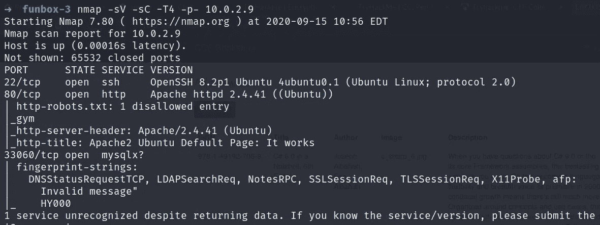*

> *网络侦察*

*在 80 端口访问受害者的主页，显示的是 Ubuntu 的默认页面，没有任何有用的东西。所以，我尝试用 gobuster 来列举隐藏的目录。*

*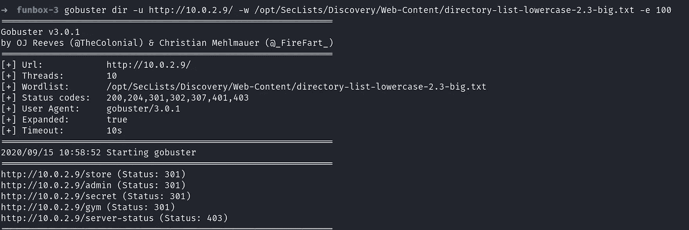*

*在枚举了所有的 URL 之后，我们将得到两个登录页面，一个在/store 上，另一个在/admin 上。首先，访问/store，在花了大量时间后，我知道它容易受到 SQL 注入的攻击。*

*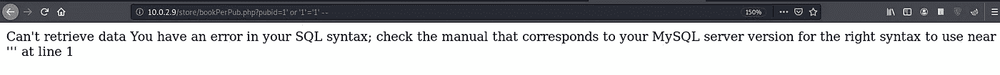*

*现在打开 SQLmap，因为我们在存储中，所以它可能是数据库名称。让我们试一试。*

*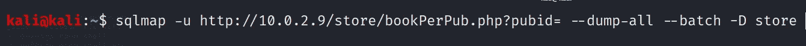*

*我们得到了这个😎*

*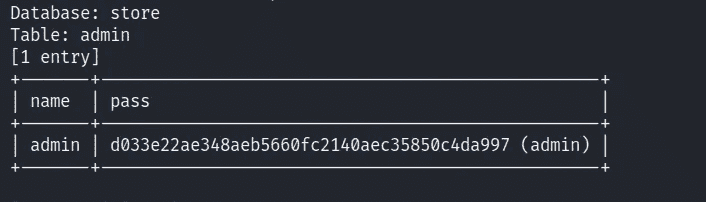*

*登录 admin 帐户，我们会看到一个添加书籍的列表和一个标签**添加新书**。让我们试着上传 PHP 反向文件。*

*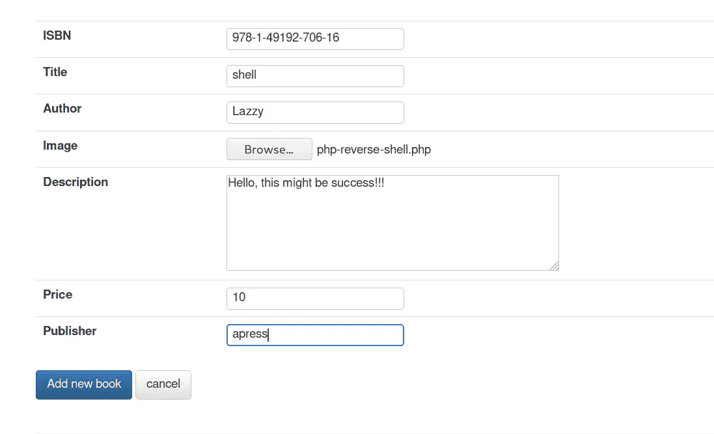*

*从 [***这里访问 PHP 反向文件！！！***](http://pentestmonkey.net/tools/web-shells/php-reverse-shell)*解压文件，用你的 kali IP 修改 IP，文件上传成功。**

**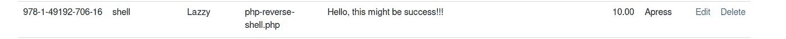**

**现在打开一个选项卡，输入 URL**http://[IP _ address]/store/**就会得到反向 shell。**

**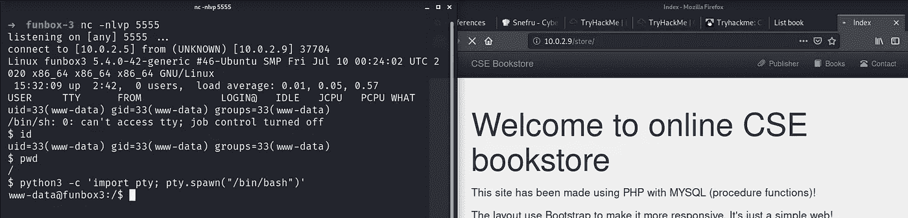**

**导航到主目录，我们可以看到用户 tony，其中包含一个 password.txt 文件。这个文件包含 SSH 登录凭证，让我们来获取它。**

**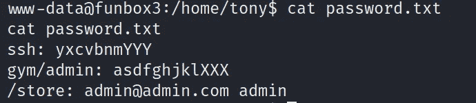**

**通过 SSH 登录到 tony。**

**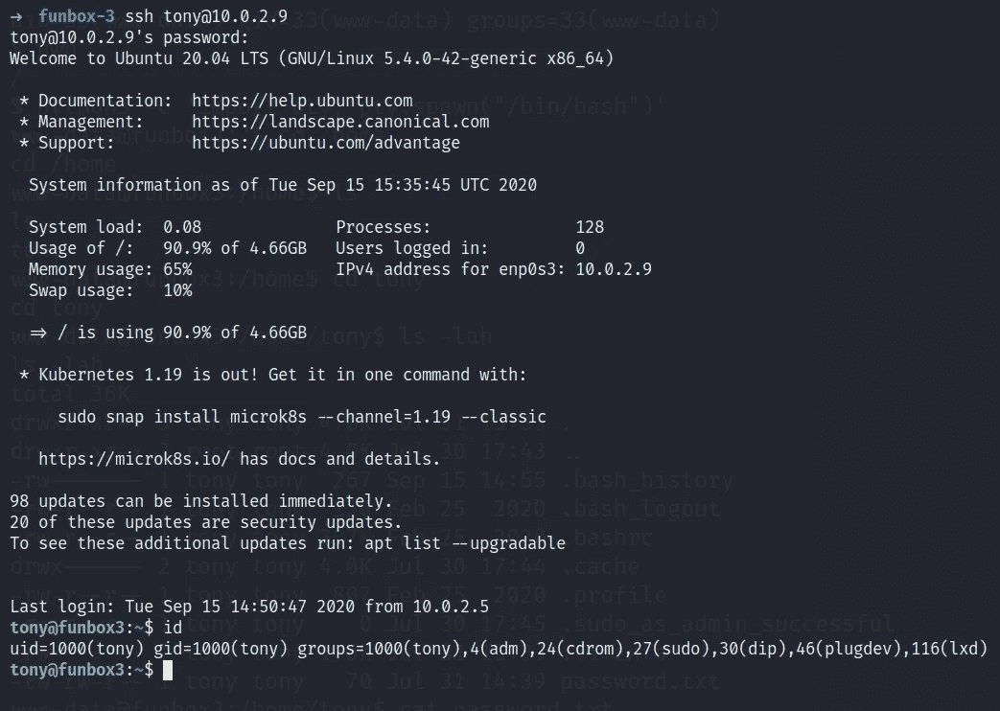**

**因为我们让 tony 检查他拥有的 sudo 权限的密码。**

**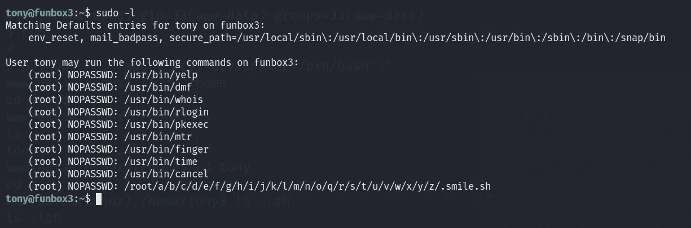**

**大量的服务🤑但是只有 **pkexec** 、 **time** 和 **mtr** 会帮助我们升级特权。**

> **通过 pkexec 进行权限提升(通过 time**sudo/usr/bin/time/bin/sh**)**

**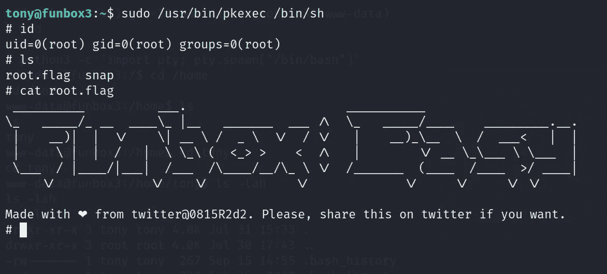**

> **通过 mtr 提升特权**

**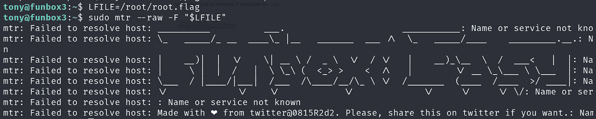**

**等等，还有一种提升权限的方法，就是通过 *lxd。*为此访问文章*[***【https://www.hackingarticles.in/lxd-privilege-escalation/】***](https://www.hackingarticles.in/lxd-privilege-escalation/)或我的一个穿越[***https://medium . com/@ Shubham _ Singh _/cheran-1-walk through-vulnhub-2922832 eda4b***](https://medium.com/@Shubham_Singh_/cheran-1-walkthrough-vulnhub-2922832eda4b)***

**如需更多演练，请继续关注…**

# **在你走之前**

**访问我的其他新 Vulnhub 机器演练的:-**

** [## FunBox-2 演练(Vulnhub)

### 描述

medium.com](https://medium.com/@Shubham_Singh_/funbox-2-walkthrough-vulnhub-b1933209acf3)  [## 医疗保健:1 次演练(Vulnhub)

### 作者描述

medium.com](https://medium.com/@Shubham_Singh_/healthcare-1-walkthrough-vulnhub-24d9d050dd9c)  [## 切兰:1 次穿越(Vulnhub)

### 描述

medium.com](https://medium.com/@Shubham_Singh_/cheran-1-walkthrough-vulnhub-2922832eda4b) 

鼓掌👏如果你喜欢你所读的。欢迎反馈。**